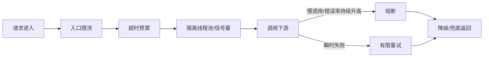

# 熔断、降级、隔离、超时、重试怎么组合？

> 这些手段不是平行概念，它们在调用链里各管一段，不把顺序讲清楚，很容易答成一锅粥。

高可用题最容易出现一种回答：

> “我们会做超时、重试、熔断、降级、限流、隔离。”

每个词都对，但面试官通常会继续问：

- 先触发哪个
- 谁保护入口
- 谁保护调用方线程池
- 谁负责快速失败
- 谁负责给用户兜底

所以真正要答的是一条链，而不是一个名词列表。

## 先分工：每个动作到底在保护什么

| 动作 | 它主要保护什么                 |
| ---- | ------------------------------ |
| 超时 | 别让线程、连接一直傻等         |
| 重试 | 处理瞬时失败，提高成功率       |
| 隔离 | 把慢下游的影响圈在局部         |
| 熔断 | 下游持续异常时及时断路止血     |
| 降级 | 非核心功能先退，让核心链路活着 |

如果要一句话概括：

- 超时负责“及时松手”
- 重试负责“有限度地再试一次”
- 隔离负责“别把整条链路一起拖死”
- 熔断负责“别再继续打坏掉的下游”
- 降级负责“就算依赖不行，也给用户一个能接受的结果”

## 放回一次真实调用链，就容易理解了

假设一个下单请求要依次调用：

```text
网关 -> 订单服务 -> 库存服务 -> 营销服务 -> 支付路由
```

更合理的保护顺序通常是这样：



这张图里最关键的是：

- 重试不是默认无限开
- 熔断不是一上来就触发
- 降级不是“系统挂了才想到给默认值”

如果把这条链路翻译成工程判断，可以按下面这张表来讲：

| 阶段     | 要回答的问题                     | 常见错误                     |
| -------- | -------------------------------- | ---------------------------- |
| 入口     | 当前流量能不能放进来             | 只在网关限流，不看服务内资源 |
| 调用前   | 这次调用最多能等多久             | 每层都拍脑袋配置 3 秒超时    |
| 调用中   | 慢下游会不会占满调用方资源       | 所有依赖共用一个线程池       |
| 失败后   | 这个错误是否值得重试             | 参数错、库存不足也重试       |
| 持续异常 | 下游是否应该暂时停止调用         | 下游已经慢了还继续打满流量   |
| 返回结果 | 用户看到什么、业务状态是否一致   | 随便返回默认值造成语义错误   |
| 恢复阶段 | 下游恢复后能不能逐步放回生产流量 | 半开探测成功后立刻全量放开   |

所以“组合”不是把组件全接上，而是让每一层都回答一个具体问题。

## 第一层：超时一定要先定，不然别谈重试

没有超时，线程就会一直等。

结果通常是：

- 连接池被占满
- 线程池排队变长
- 上游也开始堆积

所以超时是最基础的保护动作。

而且在多层调用里，最好用“总时间预算”思路：

- 入口请求总共允许 800ms
- 订单服务本地处理占 100ms
- 留给下游调用的时间只剩 700ms

这样下游超时要小于上游剩余预算，不然上游已经返回失败了，下游还在白干。

实际配置时，超时最好不要只写一个 `timeout=3s`。一次远程调用可能经历这些阶段：

| 阶段         | 主要风险                         |
| ------------ | -------------------------------- |
| 获取连接     | 连接池耗尽，请求排队等待         |
| 建立连接     | 网络不通、目标端口不可达         |
| TLS / 握手   | 公网、代理、证书链导致冷连接变慢 |
| 写请求       | 请求体过大或网络拥塞             |
| 读响应       | 下游处理慢、返回慢               |
| 整体调用期限 | 局部阶段没超时，但总耗时已经越界 |

更稳的做法是给入口请求设置一个总 deadline，然后往下游传剩余时间。比如入口只允许
`800ms`，本地处理和排队已经花了 `200ms`，那下游调用就不能再配置 `1s`。
否则上游已经失败返回，下游还在继续执行，既浪费资源，也会让排障变得更乱。

## 第二层：隔离不是可选项，它是在保护调用方

隔离经常被漏答，但它很关键。

因为慢下游最可怕的地方，不只是它自己慢，而是它会占满调用方资源。

最常见的隔离方式有两种：

| 隔离方式   | 适合场景               | 特点                           |
| ---------- | ---------------------- | ------------------------------ |
| 线程池隔离 | 调用成本高、依赖差异大 | 隔离更彻底，但线程切换成本更高 |
| 信号量隔离 | 轻量调用、追求低开销   | 成本低，但隔离边界没那么强     |

如果推荐服务慢，把下单线程池拖死，这就不是推荐服务自己的问题了，而是隔离没做好。

隔离不只是在“服务 A 调服务 B”之间加一层保护，还要按资源维度拆：

- 按下游隔离：库存、支付、营销、推荐不要共用同一个调用池。
- 按业务隔离：核心下单链路和后台报表链路不要互相抢资源。
- 按租户隔离：大客户、普通客户、开放平台调用方可以有不同配额。
- 按资源隔离：HTTP 连接池、数据库连接池、线程池、缓存连接要分别看。

线程池隔离更适合高成本、易阻塞、影响面大的下游。它的好处是边界清楚，
坏处是线程切换、队列等待和池大小估算都会影响尾延迟。

信号量隔离更轻量，适合本身很快的调用。但如果下游一直阻塞，请求仍然占着业务线程，
所以必须配合超时一起用。

## 第三层：重试只能处理“短暂失败”

重试不是默认开启的福利。

它只适合处理这类情况：

- 瞬时网络抖动
- 短暂超时
- 临时性 `502/503/504`
- 明确可重试的限流响应

不适合的情况包括：

- 参数错误
- 权限错误
- 余额不足
- 库存不足
- 任何没法保证幂等的写操作

所以重试前一般要先问两件事：

1. 这个错误是不是短暂性的
2. 这个操作是不是幂等

## 第四层：熔断是在“持续异常”时停止继续施压

如果一个下游已经持续变慢或报错，此时继续重试，很多时候只会把它打得更惨。

熔断的意义就在这：

- 先快速失败
- 给下游恢复窗口
- 只放少量探测请求试恢复

所以熔断不是为了“提高成功率”，而是为了“限制故障扩散”。

它和重试的关系可以这样理解：

- 重试偏向“这次可能只是偶发失败，再试一下”
- 熔断偏向“看起来它已经持续不正常了，别再打了”

## 熔断器状态机要讲清楚

面试里只说“错误率高就熔断”还不够，最好把状态机讲出来。

| 状态      | 行为                       | 什么时候切换                   |
| --------- | -------------------------- | ------------------------------ |
| Closed    | 正常放行请求，持续统计指标 | 错误率、慢调用比例超过阈值     |
| Open      | 直接快速失败，不再调用下游 | 冷却时间结束后进入 Half-Open   |
| Half-Open | 放少量探测请求验证是否恢复 | 探测成功回 Closed，失败回 Open |

触发条件通常不是只看“有没有报错”，还会看这些信号：

- 异常比例：最近窗口内失败占比持续升高。
- 异常数：低流量接口也能用绝对次数兜住。
- 慢调用比例：下游没报错，但大量请求超过慢调用阈值。
- 最小请求数：窗口内请求太少时，不要被一两个偶发异常误伤。

这里有两个边界要说清：

1. P99 / P999 更适合用来观察和校准阈值，不等于熔断器一定直接拿 P99 判断。
2. Half-Open 只是在探测“是否恢复”，不代表可以马上把全量流量打回去。

如果服务刚重启，缓存没热、连接池没建满、JIT 还没稳定，探测请求成功也只能说明它有恢复迹象。
更稳妥的方式是 Half-Open 探测成功后，再配合 warm up、限流或分批放量恢复。

## 第五层：降级是最后留给用户的结果

降级的核心不是技术动作，而是业务取舍。

比如：

- 推荐服务挂了，返回空列表
- 评价服务挂了，隐藏评论区
- 库存服务抖动时，商品详情页先展示缓存库存

但注意：

**降级保的是核心链路，不是所有功能都必须保。**

电商系统里：

- 推荐、广告、活动挂件可以先降
- 下单、支付、库存一般要最后才动

这也是为什么降级前要先做业务分级。

## Fallback 要比正常路径更简单

Fallback 是限流、熔断、异常后的兜底结果，不是第二套完整业务流程。

常见可接受的兜底有：

- 返回空列表、空对象、默认配置。
- 返回最近一次成功的本地缓存或 Redis 缓存。
- 隐藏非核心页面片段。
- 切到静态页面或简化页面。
- 写请求先受理，再转异步补偿，但必须能追踪状态。

但 Fallback 最怕这几类设计：

| 坑                   | 后果                             |
| -------------------- | -------------------------------- |
| 兜底里继续远程调用   | 下游故障会沿着兜底链路继续传播   |
| 返回 `null`          | 上游没判空时直接引发新异常       |
| 兜底逻辑里做复杂计算 | 兜底本身变慢，继续占用线程       |
| 所有兜底共用一个缓存 | 缓存故障时所有保护同时失效       |
| 写接口随便返回成功   | 用户看到成功，但系统状态并不一致 |

所以 Fallback 的原则是：**快、简单、可解释、业务语义正确。**

比如推荐接口熔断后返回空列表可以接受；支付创建接口熔断后返回“支付成功”就不行。
资金、库存、订单这类写链路，兜底通常应该是明确失败、排队受理或稍后查询，而不是伪造成功。

## 两种典型场景，组合方式其实不一样

### 读多写少的查询接口

比如商品详情、用户资料、推荐列表。

更常见的组合是：

- 短超时
- 少量重试
- 本地或缓存兜底
- 熔断后直接返回默认值

因为这类接口更容易接受旧数据或空数据。

### 资金、订单、库存类写接口

这类接口更谨慎：

- 超时要有
- 重试要克制
- 必须强调幂等
- 熔断后通常是明确失败，而不是瞎兜底成功

比如支付创建请求，如果下游支付路由已经明显异常，宁可返回失败或稍后重试，也不能随便给一个“支付成功”的假兜底。

## 规则要能动态调整，但不能只靠人工开关

超时、熔断、降级、限流这些规则最好能动态调整。原因很简单：

- 大促前可能需要提前关闭非核心功能。
- 某个下游临时抖动时，需要快速降低调用压力。
- 故障恢复后，需要逐步放量，而不是等重新发版。

但动态开关也有边界。配置中心推送可能存在短暂不一致，部分实例可能先收到规则，
部分实例稍后才生效。所以关键链路不能只依赖一个开关，还要配合本地默认规则、
超时保护、熔断器和缓存兜底。

比较稳的落地方式是：

1. 规则变更先灰度到少量实例。
2. 观察错误率、P99、线程池、连接池和下游 QPS。
3. 确认没有误伤后再扩大范围。
4. 保留一键回滚和变更审计。

这也是为什么稳定性治理不能只靠“线上出事时手动点一下开关”。开关要有，
但平时就要设计默认保护和演练流程。

## 一个面试里很好用的答法

如果被问“这些机制怎么配合”，可以直接这样说：

1. 入口先限流，避免流量直接把系统打穿。
2. 调用方给每层依赖设超时预算，别让线程长期挂死。
3. 用线程池或信号量隔离不同依赖，避免慢下游拖死主链路。
4. 对瞬时错误做有限重试，但只重试可重试、且幂等的调用。
5. 当错误率或慢调用持续升高时，熔断快速失败，别继续给坏掉的下游加压。
6. 熔断或失败后走降级兜底，优先保核心功能。

这一套比单纯背术语更像真实工程设计。

## 容易踩的坑

### 所有层都重试

网关重试、服务重试、客户端再重试，很容易把一次请求放大成几十次下游调用。

### 把降级理解成“随便返回默认值”

降级结果如果和业务语义冲突，反而会引出更大的数据问题。

### 熔断和限流职责不分

限流是在流量过大时保护系统，熔断是在依赖持续异常时停止继续施压，两者不是一回事。

### 没有隔离，只做超时

超时能让线程最终释放，但在释放前，调用方资源还是会被持续占住。

### 熔断恢复后立刻全量放开

Half-Open 探测成功只说明下游开始恢复，不代表它已经能承接峰值流量。
如果马上全量恢复，请求可能再次把刚恢复的服务打挂。

### Fallback 里继续查库或调远程服务

兜底路径应该更短、更轻。如果兜底里还要查库、调 RPC、做复杂计算，
它就可能变成新的故障放大器。

## 上线后看哪些指标

这类保护机制必须靠指标验证，不能只看“配置已经加了”。

| 维度 | 重点指标                                   |
| ---- | ------------------------------------------ |
| 流量 | 原始 QPS、重试 QPS、被限流 QPS             |
| 延迟 | P95、P99、P999、超时率、慢调用比例         |
| 熔断 | 熔断状态、Open 次数、Half-Open 探测成功率  |
| 隔离 | 线程池活跃数、队列长度、拒绝数、信号量占用 |
| 下游 | 下游错误率、5xx、连接池等待、活跃连接数    |
| 降级 | 降级命中量、兜底成功率、兜底耗时           |
| 业务 | 下单成功率、支付成功率、库存扣减成功率     |

如果技术指标变好了，但业务成功率掉得很厉害，说明规则可能误伤了核心链路。
稳定性治理最终看的不是“有没有限流熔断”，而是故障时核心业务有没有被保住。

## 小结

- 这些高可用动作不是并列堆词，而是在调用链里各自负责一段保护。
- 超时负责及时松手，隔离负责圈住影响面，重试只处理短暂失败，熔断负责持续异常时止血。
- 熔断要讲清 Closed、Open、Half-Open 状态机，恢复后还要逐步放量。
- Fallback 必须快、简单、语义正确，不能把兜底路径写成新的远程调用链。
- 读接口更适合“短超时 + 少量重试 + 缓存兜底”，写接口则要更强调幂等、保守重试和明确失败。

## 参考

综合自仓库内高可用系统设计、限流熔断、超时重试等参考资料，并结合公开的
SRE、HTTP 语义、流量治理框架文档，对熔断状态机、超时预算、隔离策略和
Fallback 边界做了交叉验证与改写。
