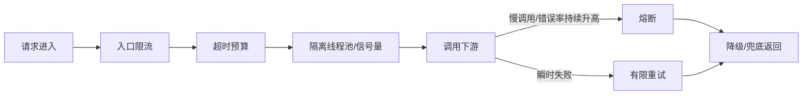

# 熔断、降级、隔离、超时、重试怎么组合？

> 这些手段不是平行概念，它们在调用链里各管一段，不把顺序讲清楚，很容易答成一锅粥。

高可用题最容易出现一种回答：

> “我们会做超时、重试、熔断、降级、限流、隔离。”

每个词都对，但面试官通常会继续问：

- 先触发哪个
- 谁保护入口
- 谁保护调用方线程池
- 谁负责快速失败
- 谁负责给用户兜底

所以真正要答的是一条链，而不是一个名词列表。

## 先分工：每个动作到底在保护什么

| 动作 | 它主要保护什么                 |
| ---- | ------------------------------ |
| 超时 | 别让线程、连接一直傻等         |
| 重试 | 处理瞬时失败，提高成功率       |
| 隔离 | 把慢下游的影响圈在局部         |
| 熔断 | 下游持续异常时及时断路止血     |
| 降级 | 非核心功能先退，让核心链路活着 |

如果要一句话概括：

- 超时负责“及时松手”
- 重试负责“有限度地再试一次”
- 隔离负责“别把整条链路一起拖死”
- 熔断负责“别再继续打坏掉的下游”
- 降级负责“就算依赖不行，也给用户一个能接受的结果”

## 放回一次真实调用链，就容易理解了

假设一个下单请求要依次调用：

```text
网关 -> 订单服务 -> 库存服务 -> 营销服务 -> 支付路由
```

更合理的保护顺序通常是这样：



这张图里最关键的是：

- 重试不是默认无限开
- 熔断不是一上来就触发
- 降级不是“系统挂了才想到给默认值”

## 第一层：超时一定要先定，不然别谈重试

没有超时，线程就会一直等。

结果通常是：

- 连接池被占满
- 线程池排队变长
- 上游也开始堆积

所以超时是最基础的保护动作。

而且在多层调用里，最好用“总时间预算”思路：

- 入口请求总共允许 800ms
- 订单服务本地处理占 100ms
- 留给下游调用的时间只剩 700ms

这样下游超时要小于上游剩余预算，不然上游已经返回失败了，下游还在白干。

## 第二层：隔离不是可选项，它是在保护调用方

隔离经常被漏答，但它很关键。

因为慢下游最可怕的地方，不只是它自己慢，而是它会占满调用方资源。

最常见的隔离方式有两种：

| 隔离方式   | 适合场景               | 特点                           |
| ---------- | ---------------------- | ------------------------------ |
| 线程池隔离 | 调用成本高、依赖差异大 | 隔离更彻底，但线程切换成本更高 |
| 信号量隔离 | 轻量调用、追求低开销   | 成本低，但隔离边界没那么强     |

如果推荐服务慢，把下单线程池拖死，这就不是推荐服务自己的问题了，而是隔离没做好。

## 第三层：重试只能处理“短暂失败”

重试不是默认开启的福利。

它只适合处理这类情况：

- 瞬时网络抖动
- 短暂超时
- 临时性 `502/503/504`
- 明确可重试的限流响应

不适合的情况包括：

- 参数错误
- 权限错误
- 余额不足
- 库存不足
- 任何没法保证幂等的写操作

所以重试前一般要先问两件事：

1. 这个错误是不是短暂性的
2. 这个操作是不是幂等

## 第四层：熔断是在“持续异常”时停止继续施压

如果一个下游已经持续变慢或报错，此时继续重试，很多时候只会把它打得更惨。

熔断的意义就在这：

- 先快速失败
- 给下游恢复窗口
- 只放少量探测请求试恢复

所以熔断不是为了“提高成功率”，而是为了“限制故障扩散”。

它和重试的关系可以这样理解：

- 重试偏向“这次可能只是偶发失败，再试一下”
- 熔断偏向“看起来它已经持续不正常了，别再打了”

## 第五层：降级是最后留给用户的结果

降级的核心不是技术动作，而是业务取舍。

比如：

- 推荐服务挂了，返回空列表
- 评价服务挂了，隐藏评论区
- 库存服务抖动时，商品详情页先展示缓存库存

但注意：

**降级保的是核心链路，不是所有功能都必须保。**

电商系统里：

- 推荐、广告、活动挂件可以先降
- 下单、支付、库存一般要最后才动

这也是为什么降级前要先做业务分级。

## 两种典型场景，组合方式其实不一样

### 读多写少的查询接口

比如商品详情、用户资料、推荐列表。

更常见的组合是：

- 短超时
- 少量重试
- 本地或缓存兜底
- 熔断后直接返回默认值

因为这类接口更容易接受旧数据或空数据。

### 资金、订单、库存类写接口

这类接口更谨慎：

- 超时要有
- 重试要克制
- 必须强调幂等
- 熔断后通常是明确失败，而不是瞎兜底成功

比如支付创建请求，如果下游支付路由已经明显异常，宁可返回失败或稍后重试，也不能随便给一个“支付成功”的假兜底。

## 一个面试里很好用的答法

如果被问“这些机制怎么配合”，可以直接这样说：

1. 入口先限流，避免流量直接把系统打穿。
2. 调用方给每层依赖设超时预算，别让线程长期挂死。
3. 用线程池或信号量隔离不同依赖，避免慢下游拖死主链路。
4. 对瞬时错误做有限重试，但只重试可重试、且幂等的调用。
5. 当错误率或慢调用持续升高时，熔断快速失败，别继续给坏掉的下游加压。
6. 熔断或失败后走降级兜底，优先保核心功能。

这一套比单纯背术语更像真实工程设计。

## 容易踩的坑

### 所有层都重试

网关重试、服务重试、客户端再重试，很容易把一次请求放大成几十次下游调用。

### 把降级理解成“随便返回默认值”

降级结果如果和业务语义冲突，反而会引出更大的数据问题。

### 熔断和限流职责不分

限流是在流量过大时保护系统，熔断是在依赖持续异常时停止继续施压，两者不是一回事。

### 没有隔离，只做超时

超时能让线程最终释放，但在释放前，调用方资源还是会被持续占住。

## 小结

- 这些高可用动作不是并列堆词，而是在调用链里各自负责一段保护。
- 超时负责及时松手，隔离负责圈住影响面，重试只处理短暂失败。
- 熔断是在持续异常时快速止血，降级是在止血之后给用户一个可接受结果。
- 读接口更适合“短超时 + 少量重试 + 缓存兜底”，写接口则要更强调幂等和保守重试。
- 回答组合题时，按“限流 -> 超时 -> 隔离 -> 重试 -> 熔断 -> 降级”的链路去讲，最清楚。

## 参考

综合自社区高可用资料，
并结合本站已有 Redis / 分布式文章重写了稳定性治理链路。
