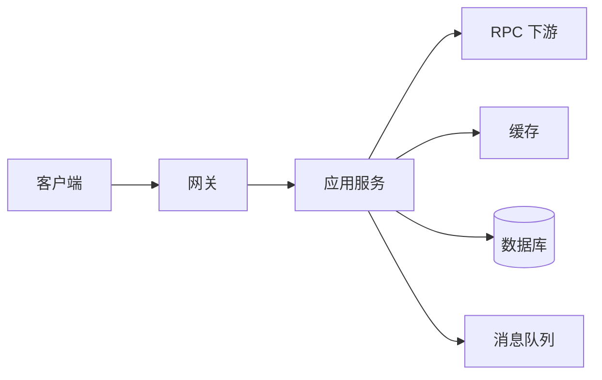

# 一次慢请求从网关到数据库怎么定位？

> 慢请求最怕“先猜原因再找证据”。正确顺序是：先锁定是哪一层慢，再决定打开哪一类证据。

用户说“下单接口变慢了”，这句本身几乎没法动手。你至少还需要：

- 哪个接口、哪个环境
- 是偶发还是持续
- 慢的是 P50、P99，还是个别请求
- 有没有对应的 `traceId` / 时间窗 / 实例

没有这些上下文，排查会变成聊天。

## 先立一条主线：分层拆延迟

一次典型请求大致经过：



慢，一定慢在某几段上。目标不是一次找到根因，而是先回答：

**总耗时里，哪一段占了大头？**

| 层级   | 你在看什么             | 常见慢因                          |
| ------ | ---------------------- | --------------------------------- |
| 网关   | 接入、鉴权、路由、限流 | 证书、WAF、限流排队、上游选错实例 |
| 应用   | 业务代码、线程池、锁   | 同步串行、本地锁、GC、序列化      |
| RPC    | 下游服务 RT            | 下游本身慢、超时重试放大          |
| 缓存   | 命中率与耗时           | 大 key、网络、穿透打到 DB         |
| 数据库 | SQL、锁、连接          | 慢 SQL、锁等待、连接池耗尽        |
| MQ     | 发送确认耗时           | Broker 抖动、acks 过严、积压      |

和 [系统性能瓶颈怎么定位](/high-performance/high-performance-bottleneck-analysis.html) 是同一条证据链思想：这里更偏**单次/一批慢请求**，那边更偏系统整体容量。

## 第一步：先看入口，不要一上来翻代码

优先看网关或入口服务的指标：

1. 该接口 QPS 有没有突增
2. 错误率有没有一起涨
3. P99 / P999 是抬升还是只有个别毛刺
4. 慢的是全部实例，还是某一两台

这能快速分流：

| 现象                    | 优先怀疑                   |
| ----------------------- | -------------------------- |
| 单实例 P99 高，其他正常 | 机器、GC、线程、本地配置   |
| 全实例一起慢            | 下游、DB、缓存、公共依赖   |
| QPS 暴涨伴随变慢        | 容量、限流、线程池、连接池 |
| 错误率和 RT 一起升      | 超时、重试风暴、下游故障   |

如果入口都看不清接口维度，说明埋点还没达标，先补 [RED/USE 指标](./high-availability-metrics-red-use.html)。

## 第二步：用链路追踪把时间切段

有分布式追踪时，打开对应 `traceId`，看 span 占比：

```text
总耗时 1800ms
├─ 网关处理        30ms
├─ 订单服务本地    120ms
├─ 调库存 RPC      900ms
├─ 写订单 DB       600ms
└─ 发 MQ           50ms
```

上面这个例子里，你不该先优化订单服务里的某个 for 循环，而该先问：

- 库存 RPC 为什么 900ms
- 写库 600ms 是锁等待、慢 SQL，还是连接获取慢

没有全链路时，至少用日志里的分段耗时，或 Arthas `trace` 看本地热点方法。详见 [Arthas 线上诊断](./high-availability-arthas-diagnostics.html)。

## 第三步：按占比最重的层下钻

### 1. 下游 RPC 慢

核对：

- 下游自身 P99
- 超时时间与重试次数
- 是否线程池排队
- 是否被重试放大（见 [重试风暴](./high-availability-retry-storm.html)）

常见假象：你这边“接口慢”，其实是下游已经半挂，你的超时+重试把它拖成了更慢。

### 2. 数据库慢

按这条链查：

1. 是不是拿连接慢（池耗尽）
2. 是不是 SQL 执行慢（`EXPLAIN`、慢日志）
3. 是不是锁等待（`innodb_lock_waits`、死锁日志）
4. 是不是返回结果集过大、序列化重

索引与深分页排查见 [慢 SQL 排查链路](/high-performance/high-performance-sql-optimization-chain.html)。

### 3. 缓存慢或失效

- 命中率是否掉崖
- 是否大 key / hot key
- 是否大量回源把 DB 打满

缓存问题常表现为“应用 CPU 不高，但 DB 先炸”。

### 4. 应用本地慢

本地代码导致的慢，通常有这些味道：

- 线程状态大量 `BLOCKED` / `WAITING`
- GC 停顿升高
- 某方法 CPU 采样占比异常高
- 同步远程调用串成了瀑布

这时用线程排查和火焰图比继续翻业务日志更有效，见 [线程与 CPU 排查](./high-availability-thread-cpu-troubleshooting.html)。

## 一串容易误判的“假慢”

| 表面现象          | 更可能的真相                         |
| ----------------- | ------------------------------------ |
| 接口偶发 3 秒超时 | 下游超时阈值刚好 3 秒，被重试叠乘    |
| 发布后变慢        | 冷启动、JIT 未预热、连接池未预热     |
| 只有某时段慢      | 报表任务、全量同步、缓存集中失效     |
| “DB CPU 不高但慢” | 锁等待、IO、网络、连接获取排队       |
| 本地 postman 很快 | 没走到真实鉴权、真实数据量、真实下游 |

不要用本地一次成功请求否定线上 P99 问题。P99 看的是尾部，不是幸福路径。

## 一份可执行的排查清单

按顺序做，做完一项勾一项：

1. **锁定对象**：接口、环境、时间窗、影响面（单用户/单实例/全集群）
2. **看入口 RED**：Rate / Error / Duration，确认是变慢还是失败
3. **拿一个慢请求样本**：`traceId` 或完整请求日志
4. **切段**：网关 / 本地 / RPC / Cache / DB / MQ 谁占时最多
5. **下钻占时层**：只深挖 Top1，不并行撒网
6. **验证假设**：改参数、限流、扩容、SQL、回滚配置后看同一指标是否回落
7. **补防护**：超时、舱壁、降级、缓存、索引、告警，避免下次同样裸奔
8. **写复盘**：时间线、根因、为什么发现慢、怎么防再发

## 和面试怎么讲

更稳的答法不是背工具名，而是讲顺序：

> 先看入口指标确认是系统性变慢还是单点问题，再拿 trace 把耗时切到具体依赖，最后只对占比最高的那一层下钻。数据库就走慢 SQL 和锁，RPC 就看超时重试，本地就看线程和 GC。

这比一上来说“我用 Arthas”更像有体系。

## 小结

1. 慢请求定位的第一问是“慢在哪一层”，不是“会不会是索引”。
2. 入口 RED + 样本 `traceId` + 分段耗时，是最小证据链。
3. 只深挖占比最高的一层，避免同时怀疑代码、DB、网络却什么都查不完。
4. 超时重试、连接池、锁等待、冷启动，都是常见“假业务慢”。
5. 查完要回到防护和复盘，否则只会成为下一次值班的重复题。

## 参考

综合自仓库内高性能瓶颈定位、慢 SQL 排查、超时重试与 JVM 诊断相关笔记，并结合分布式追踪与线上排障的常见工程实践整理；强调分层切段与证据链，而不是工具清单罗列。
