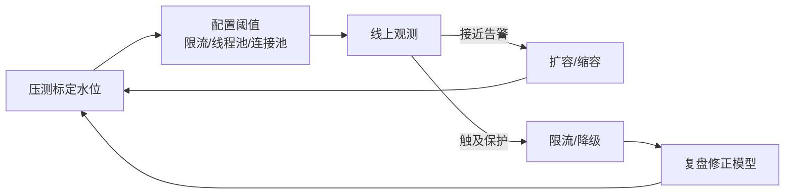

# 容量治理怎么和限流、扩容、压测联动？

> 容量治理不是“买更多机器”，而是知道系统在哪个水位开始变形，并提前有动作。

很多团队的容量工作停在两份文档：

- 大促前估一个“目标 QPS”
- 出事后补一套“扩容申请”

真正可运转的容量治理，要把**压测标定、限流保护、扩容动作、线上观测**收成闭环。否则限流阈值拍脑袋、扩容靠感觉、压测只报一个峰值，上线依旧心里没底。

## 容量治理到底管什么

一句话：在可接受的延迟和成功率下，系统能稳定承载多少有效业务量，以及超过后如何退化而不是崩溃。

它至少覆盖四类对象：

| 对象       | 例子                       | 为什么要单独看   |
| ---------- | -------------------------- | ---------------- |
| 入口       | 网关 QPS、连接数           | 最先被流量打到   |
| 应用       | CPU、线程池、GC、堆        | 决定业务处理能力 |
| 依赖       | DB、Redis、MQ、第三方      | 往往比本服务先崩 |
| 数据与存储 | 磁盘、连接、慢查、冷热占比 | 慢性容量问题     |

只盯入口 QPS 会漏掉“下游放大”和“存储变慢”。定位思路见 [瓶颈分析](/high-performance/high-performance-bottleneck-analysis.html)。

## 先定三个水位，再谈动作

| 水位          | 含义                   | 典型动作                     |
| ------------- | ---------------------- | ---------------------------- |
| 目标水位      | 日常 + 活动预期内      | 常态运行，保留冗余           |
| 告警水位      | 接近风险，长尾开始变差 | 扩容准备、降级预热、值班升级 |
| 限流/保护水位 | 再涨就会伤整体         | 限流、拒绝、过载保护         |

可以把它理解成：

```text
空闲 ---- 目标水位 ---- 告警水位 ---- 保护水位 ---- 失稳
              │             │            │
           压测验收      准备扩容/降级   牺牲部分请求保整体
```

压测的任务，就是把这些水位从“感觉”变成数字。详见 [压测与容量评估](/high-availability/high-availability-performance-testing.html)。

## 闭环长什么样



闭环里每一环都要有负责人：

1. **压测**：给出目标 QPS、饱和点、拐点资源
2. **配置**：把限流、池化参数写成可发布配置
3. **观测**：入口、依赖、资源三类指标齐看
4. **动作**：扩容、降级、限流谁先谁后
5. **复盘**：模型和阈值是否需要改

没有复盘的容量治理，会在每次大促重复踩坑。

## 限流、扩容、降级怎么分工

三者不是互斥，是不同时间尺度的工具：

| 手段 | 时间尺度           | 作用             | 代价               |
| ---- | ------------------ | ---------------- | ------------------ |
| 限流 | 立即               | 保护已有容量     | 部分请求失败或排队 |
| 降级 | 秒到分钟           | 减少非核心工作量 | 功能受损           |
| 扩容 | 分钟到小时甚至更久 | 增加容量         | 成本、弹性滞后     |

只扩容不限流：下游或启动中的新节点被打穿，扩容变成自我伤害。  
只限流不扩容：活动期间长期损单，商业上不可接受。  
只降级不治理根因：核心链路迟早也会被拖慢。

一个实用顺序：

1. 日常靠冗余容量和自动扩缩
2. 接近告警水位时提前扩容/预热
3. 突发超过保护水位时限流 + 降级保命
4. 事后用压测和复盘修正下一次阈值

限流算法与分层保护见 [限流](/high-availability/high-availability-rate-limiting.html)。

## 容量要按链路算，不要只算单服务

假设下单入口目标 2000 QPS，链路可能是：

```text
下单 1 次
 → 读库存/优惠 2 次 Redis
 → 写订单 1 次 DB
 → 发 2 条 MQ
 → 调用风控 1 次
```

如果客户端/网关在失败时重试 2 次，下游瞬间可能被放大到接近 3 倍。容量账本至少要写清：

| 项目     | 要算什么                       |
| -------- | ------------------------------ |
| 入口目标 | 业务 QPS / 并发                |
| 扇出比   | 一次请求打多少下游             |
| 重试放大 | 超时与重试策略                 |
| 连接预算 | DB、Redis、HTTP 连接池         |
| 单机能力 | 单实例在目标 RT 下的可持续 QPS |
| 冗余系数 | 通常预留 30%~100%，看故障域    |

常见漏算：

- 定时任务和大促流量叠加
- 缓存失效导致的 DB 回源洪峰
- 消息堆积追平时的消费尖刺
- 冷热迁移、全量刷缓存等后台作业

后台作业也是容量的一部分，不是“空闲时随便跑”。

## 压测如何服务容量治理

压测不是为了报一个“最大 QPS”，而是要回答：

1. 目标水位下 P99、成功率是否达标
2. 哪个资源先到拐点：CPU、线程池、DB、Redis，还是锁
3. 限流是否在预期点生效
4. 扩容后是否真的线性提升
5. 失败重试会不会把错误放大

建议把压测结果沉淀成容量卡：

| 字段       | 示例                                  |
| ---------- | ------------------------------------- |
| 服务       | order-api                             |
| 目标水位   | 2000 QPS，P99 < 150ms，成功率 > 99.9% |
| 单机能力   | 400 QPS                               |
| 建议实例数 | 8（含 50% 冗余）                      |
| 拐点       | DB CPU 先到 70%                       |
| 限流阈值   | 网关 2500，单机 500                   |
| 降级开关   | 关推荐、关同步画像                    |
| 依赖预算   | 订单库 1200 QPS、Redis 6000 QPS       |

没有这张卡，限流和扩容参数就会重新变成拍脑袋。

## 线上观测：看什么才算“有容量意识”

至少三层指标：

```text
业务层：下单成功率、支付成功率、核心 RT
入口层：网关 QPS、4xx/5xx、限流计数、排队时长
资源层：CPU、内存、GC、线程池活跃数、连接池等待
依赖层：DB 慢查、Redis 热点、MQ 堆积、第三方错误率
```

告警不要只设 CPU。更有用的组合是：

- P99 上升 + 线程池排队
- 限流计数突增
- 依赖错误率上升快于入口 QPS
- 扩容后单机 QPS 不下降（说明瓶颈不在本服务）

最后一种情况特别关键：扩了应用但 DB 是瓶颈，容量治理要转到依赖，而不是继续加应用节点。

## 弹性扩容的边界

自动扩缩很好用，但有边界：

| 场景                   | 自动扩缩够不够 | 原因                     |
| ---------------------- | -------------- | ------------------------ |
| 可水平扩展的无状态服务 | 通常够         | 加实例能吃流量           |
| 有状态分区/单分片热点  | 不够           | 要先打散热点             |
| DB 主库写瓶颈          | 不够           | 应用扩容可能更糟         |
| 第三方配额型           | 不够           | 对方不会跟你一起扩       |
| 启动慢、缓存需预热     | 部分够         | 要提前扩，不能等打满再扩 |

所以容量治理里要区分：

- **能弹性解决的**
- **必须架构改造的**（分库、异步化、冷热分离、热点隔离）

[冷热分离](/high-performance/high-performance-cold-hot-data.html) 往往就是慢性容量问题的架构解法：热库体积下来后，同样硬件能支撑更高在线 QPS。

## 活动前的一套最小操作清单

1. 用近期峰值和活动预期修正目标水位
2. 压测核心链路，刷新容量卡
3. 核对限流、线程池、连接池、超时是否一致
4. 预热缓存、CDN、连接池，必要时提前扩容
5. 明确降级开关和指挥顺序
6. 演练“触达保护水位”时的限流与回切
7. 活动中按分钟看限流计数和依赖拐点
8. 活动后复盘：哪项阈值偏了、哪段链路放大了

少了演练的预案，多半只是文档。

## 容易踩的坑

1. 只报入口最大 QPS，不报成功率和 P99。
2. 限流阈值高于依赖真实能力，保护形同虚设。
3. 扩容脚本能加应用，不能加连接预算和下游配额。
4. 重试、定时任务、刷数作业没进容量账本。
5. 压测环境与线上下游容量差太多，标定失真。
6. 把容量治理当成大促专项，日常水位漂移无人管。

## 小结

1. 容量治理的核心是标定水位，并让限流、扩容、降级在不同水位自动或半自动生效。
2. 限流保命、扩容增容、降级减负，三者要组合，不能互相替代。
3. 容量按链路和依赖预算算，重点防重试与扇出放大。
4. 压测产物应是可执行的容量卡，而不是一页峰值截图。
5. 观测要覆盖入口、资源、依赖；扩容无效时及时把矛盾转到真正瓶颈。

## 参考

综合自仓库内压测、限流、瓶颈分析与高可用保护相关笔记，结合容量水位、链路预算和扩缩容联动的工程实践整理。
