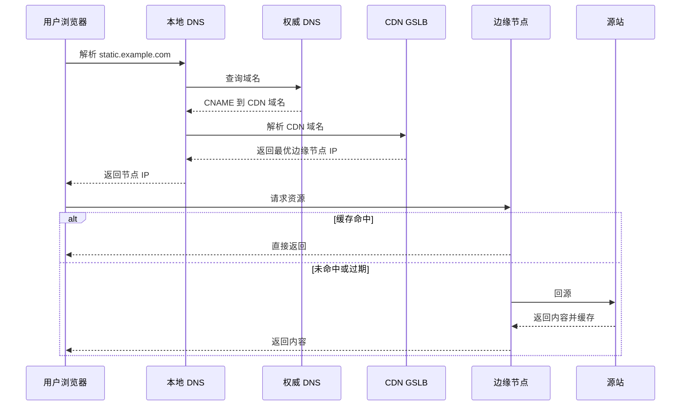

# CDN 和静态加速解决什么问题？

> CDN 解决的是“内容离用户更近、源站更少挨打”，不是数据库变快。

面试里一提到性能优化，很容易从 SQL、Redis 一路跳到 CDN。但 CDN 和业务缓存不是一类东西：它主要加速**可分发的内容**，尤其是静态资源；它不会让一条慢 SQL 突然变快，也不会替你修好库存一致性。

把边界说清，后面的配置讨论才有意义。

## CDN 到底在加速什么

把“内容分发网络”拆开看：

- **内容**：图片、JS、CSS、安装包、视频片段、可缓存的页面片段
- **分发网络**：把这些内容复制到靠近用户的边缘节点，实现就近访问

用户在上海打开页面时，JS/CSS/图片尽量从上海边缘节点拿，而不是每次都跑回你在华北的源站。源站带宽、连接数、TLS 握手压力都会下降。

| 适合 CDN                                    | 不太适合直接当 CDN 缓存       |
| ------------------------------------------- | ----------------------------- |
| 静态资源：JS / CSS / 图片 / 字体            | 强个性化实时接口              |
| 可公开的活动页、商品详情 HTML（小心登录态） | 写多读少且无法缓存的 API      |
| 安装包、客户端热更新包                      | 每次响应都带用户私有数据      |
| 点播视频、下载分发                          | 强依赖实时库存/余额的页面片段 |

全站加速 / 动态加速产品可以优化动态请求的链路质量，但那是另一回事：它优化的是传输路径，不是业务计算本身。

## 为什么不直接把整站部署到全国

“就近访问”听起来像多机房部署，但两者目标不同：

| 方案             | 主要目标                   | 成本特征                         |
| ---------------- | -------------------------- | -------------------------------- |
| CDN 分发静态内容 | 降低静态访问延迟和源站带宽 | 只存副本内容，成本可控           |
| 多地部署完整服务 | 高可用、容灾、多活         | 应用、DB、中间件全套复制，成本高 |

静态资源体积大、变更相对可控、读多写少，天然适合边缘缓存。动态请求要查库、算库存、走权限，必须回源处理。把完整业务在全国复制一份，不是 CDN 的替代品，而是更高量级的容灾架构。

## 一次请求怎么走到边缘节点

核心调度通常靠 DNS + GSLB（全局负载均衡）：



GSLB 会综合用户 IP 归属、节点负载、链路质量等因素选点。所以“接了 CDN 一定更快”并不绝对：如果缓存总 miss、频繁回源，反而比直连源站多一跳。

## 预热、回源、刷新分别干什么

| 动作 | 含义                     | 典型时机               |
| ---- | ------------------------ | ---------------------- |
| 回源 | 边缘没有或过期时去源站拉 | 日常 miss、TTL 到期    |
| 预热 | 主动把热点资源推到边缘   | 大促前、版本发布前     |
| 刷新 | 主动让边缘旧对象失效     | 紧急修图、配置文件更正 |

两个核心指标：

- **命中率**：越高越好，用户直接打边缘
- **回源率**：越低越好，源站更少挨打

回源被打爆时，CDN 不但帮不上忙，还可能把故障放大到所有边缘节点。源站侧仍要有限流、连接保护和容量预案，见 [限流](/high-availability/high-availability-rate-limiting.html) 与 [容量治理](/high-performance/high-performance-capacity-governance.html)。

## Cache-Key 和缓存规则决定命中率

同样一个文件，CDN 是否视为“同一个对象”，取决于 Cache-Key。常见组成包括：

- URL 路径
- 查询参数（有的参数该忽略，有的不能忽略）
- 协议 / Host
- 部分 Header（如压缩、语言，用错会把缓存打散）

配置上最容易踩的坑：

1. **把带 Cookie 的动态请求误缓存**，把 A 用户页面返回给 B 用户。
2. **URL 带随机参数或时间戳**，导致永远 miss。
3. **HTML 长缓存、静态资源短缓存**，和发布体系反着来。
4. **全站刷新**，边缘集体回源，源站被洪峰打穿。

更稳的静态资源策略通常是：

| 资源类型                       | 建议             | 原因                   |
| ------------------------------ | ---------------- | ---------------------- |
| 带 content hash 的 JS/CSS/图片 | 长缓存，甚至一年 | 内容变则文件名变       |
| HTML / 入口文件                | 短缓存或不缓存   | 需要快速切到新版本引用 |
| 版本化安装包                   | 长缓存 + 预热    | 下载量大，适合边缘扛   |
| 带登录态的 API                 | 默认不缓存       | 个性化与安全风险       |

发布时保留旧 hash 文件一段时间，避免旧 HTML 还引用旧资源时直接 404。

## 防盗链和带宽保护

静态资源一旦被别的站点或脚本盗刷，账单会很难看。常见手段：

| 机制           | 原理                   | 强度 | 局限                         |
| -------------- | ---------------------- | ---- | ---------------------------- |
| Referer 防盗链 | 看来源站点是否在白名单 | 低   | Referer 可伪造或置空         |
| 时间戳防盗链   | URL 带签名和过期时间   | 中   | 要保护密钥，客户端会拿到 URL |
| IP 黑白名单    | 限制访问来源 IP        | 中   | 代理可绕过，运维成本高       |
| Token 鉴权     | 业务签发、CDN 校验     | 高   | 实现和联调更重               |

工程上常见组合是 **Referer + 时间戳**；付费内容、私有文件再上 Token。防盗链解决的是“谁有权拿文件”，不是“源站 SQL 慢不慢”。

## HTTPS、回源协议和源站保护

生产上 CDN 几乎默认 HTTPS。注意几件事：

- 证书托管与自动续期，避免过期全站红字
- 用户到 CDN、CDN 到源站的协议是否一致（半程加密 vs 全程加密）
- 回源 Host、SNI、鉴权头有没有配对
- 源站要限制“只接受 CDN 回源 IP / 特定鉴权”，避免别人绕过 CDN 直打源站

边缘再强，源站仍是最后一道。突发流量下应同时准备：

1. 回源限速 / 回源并发上限
2. 源站限流与降级
3. 热点资源预热
4. 发布窗口避免全量刷新

这些和 [负载均衡](/high-performance/high-performance-load-balancing.html) 是前后手：CDN 在最外层做内容分发，后面才是 DNS/LB/网关/服务实例。

## 动态加速能做什么，不能做什么

动态加速常见能力：

- 智能选路，绕开拥堵公网路径
- 边缘到源站连接复用
- TCP / HTTP2 / QUIC 等协议优化

它能降低网络 RTT 波动，但：

- 不会减少 DB 锁等待
- 不会消除 N+1 查询
- 不会自动修好下游超时重试风暴

所以面试可以这样划分：

| 问题类型            | 更该看谁                  |
| ------------------- | ------------------------- |
| 图片/JS 全国访问慢  | CDN 命中率、节点质量      |
| API 慢在 SQL / 下游 | 业务性能与依赖治理        |
| 跨运营商链路不稳    | 动态加速 / 专线 / 多 VIP  |
| 源站被静态流量打满  | 静态资源上 CDN + 回源保护 |

## 和多级缓存、负载均衡的关系

从外到内可以粗看成：

```text
用户
 → CDN 边缘（静态/可缓存内容）
 → 负载均衡 / 网关
 → 应用（本地 L1 缓存）
 → Redis（L2）
 → DB
```

- CDN：离用户最近的内容缓存
- [多级缓存](/high-performance/high-performance-multi-level-cache.html)：应用内和 Redis 的业务数据缓存
- [负载均衡](/high-performance/high-performance-load-balancing.html)：把动态请求分到多实例

三者叠在一起时，出问题先分清是**边缘 miss、网关过载，还是应用/DB 慢**，不要一股脑“加 CDN”。

## 容易踩的坑

1. 把个性化页面长缓存，造成串号或看到别人的数据。
2. 发布后全目录刷新，边缘同时回源打爆源站。
3. 静态 URL 不带 hash，又不敢长缓存，命中率上不去。
4. 源站没做防直连，攻击者绕过 CDN 打源。
5. 只看全国平均命中率，不看单区域回源错误率和源站 5xx。
6. 指望 CDN 优化慢接口，忽略真正的业务瓶颈。

## 小结

1. CDN 的主战场是静态与可缓存内容，核心收益是就近访问和源站减负。
2. Cache-Key、TTL、是否带个性化头，直接决定命中率和安全性。
3. 预热、精确刷新、保留旧版本资源，是发布体系的一部分，不是运维临时动作。
4. 回源保护必须有：限速、限流、防直连，否则边缘 miss 会反噬源站。
5. CDN 不能替代慢 SQL、锁竞争和依赖治理；动态加速也只优化链路，不优化业务计算。

## 参考

综合自仓库内高性能、负载均衡与容量相关笔记，结合 CDN 调度、缓存生命周期和源站保护的常见工程实践整理。
