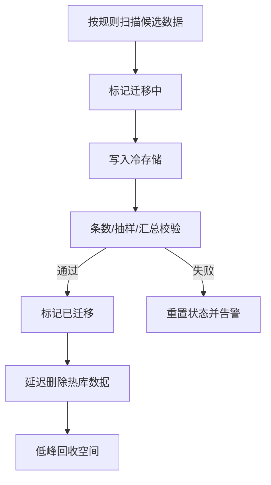

# 冷热数据分离和归档怎么做？

> 表无限长大后，最先坏的是索引、备份和范围查询，不是磁盘标称容量。

订单表从 500 万涨到 2 亿时，团队最先感知到的通常不是“盘满了”，而是：

- 按时间范围查最近订单越来越慢
- 加索引、改字段的 DDL 窗口越来越长
- 全量备份和恢复动辄数小时
- Buffer Pool 被历史页污染，热数据命中率下降

冷热分离要解决的是**性能、成本、可维护性**三件事，不是单纯“把旧数据搬走”。

## 怎么定义冷和热

没有放之四海都正确的阈值，要看查询模式和合规保留期。

常见维度：

| 维度     | 例子                           | 适合场景         |
| -------- | ------------------------------ | ---------------- |
| 时间     | 近 90 天热，更早冷             | 订单、账单、日志 |
| 状态     | 已完结/已关闭更容易冷          | 工单、履约单     |
| 访问频率 | 长期接近 0 访问                | 内容、商品详情   |
| 合规     | 必须留 5 年，但 1 年后几乎不查 | 金融、审计       |

更稳的做法是**时间为主、状态/访问为辅**。例如：

```text
热：近 90 天 或 未完结订单
温：90 天 ~ 1 年
冷：1 年 ~ 3 年，仍可在线查
归档：3 年以上，仅合规/审计提取
```

规则最好进配置中心，不要写死在代码常量里。业务一改“客服要查 180 天”，你不应该发一版应用才调得动。

## 冷热分离、归档、分区表不是一回事

| 方案     | 数据是否仍在线可查 | 是否跨存储/实例 | 主要收益                 |
| -------- | ------------------ | --------------- | ------------------------ |
| 分区表   | 是                 | 通常否          | 管理大表、便于按分区维护 |
| 冷热分离 | 冷数据通常仍可查   | 可以            | 热库变小、成本下降       |
| 归档     | 往往离开在线主路径 | 是              | 合规留存、极低成本       |

分区表能帮你按月管理大表，但分区仍在同一实例时，**省不下跨介质成本**，也解决不了实例级备份变慢。归档则更激进，很多查询路径直接不再覆盖。面试里把这三个词分清，能避免方案讨论跑偏。

## 架构选项怎么选

| 方案            | 说明                        | 优点                 | 代价               |
| --------------- | --------------------------- | -------------------- | ------------------ |
| 同库冷热表      | `orders` + `orders_history` | 改造小、事务边界简单 | 仍争同一实例资源   |
| 热库 + 历史库   | 物理实例分离                | 热库真正减负         | 双端运维、跨库查询 |
| OLAP / 检索引擎 | ClickHouse、ES 等           | 分析/检索更合适      | 链路与一致性成本   |
| 对象存储归档    | OSS/S3 + 元数据索引         | 最便宜               | 明细查询弱，恢复慢 |

中小规模常见路径：

1. 先同库历史表或按月分表，验证查询路由
2. 数据量再上一个数量级，拆独立历史库
3. 分析型查询走数仓/OLAP，别让在线库扛报表

不要一上来同时上“分库分表 + 冷热分离 + 新存储引擎”。一座大山够你消化半年。

## 迁移链路必须可校验、可回滚

推荐把迁移拆成明确阶段，而不是“脚本跑完就算成功”：



关键原则：

1. **先复制，后删除**。确认冷库可读再清热库。
2. **迁移幂等**。重复跑不会把冷库写炸或把热库误删。
3. **小批量、主键范围扫**。大范围 `WHERE time < ? LIMIT N` 容易污染 Buffer Pool。
4. **低峰执行**。迁移本身也是容量消费者，见 [容量治理](/high-performance/high-performance-capacity-governance.html)。

### 迁移中数据又被更新怎么办

跨库时，冷库 `INSERT` 和热库 `DELETE` 很难放进同一个本地事务。常见兜底：

| 策略     | 做法                     | 适用         |
| -------- | ------------------------ | ------------ |
| 状态机   | `0未迁/1迁移中/2已迁`    | 通用，可追溯 |
| 版本号   | 删除前比对版本是否变化   | 更新频繁的表 |
| 只迁终态 | 仅已完结单据可迁         | 订单类最省心 |
| 延迟双查 | 删除前热冷都可查一段时间 | 回滚窗口更长 |

“只迁终态”非常实用：未支付、履约中的单据继续留热库，既减少迁移冲突，也符合业务访问规律。

## 查询路由要显式设计

冷热分离失败，十有八九败在查询：

- C 端列表默认只查热
- 订单号/主键要能定位到冷库
- 管理后台、客服工具才开放冷查
- 跨热冷的大跨度分页要限制范围

```text
请求带时间范围？
  ├─ 全在热区间 → 只查热库
  ├─ 全在冷区间 → 只查冷库
  └─ 跨越热冷   → 拆成两次查询再合并，或拒绝过大范围
```

特别危险的是应用层深度分页归并：

```text
ORDER BY create_time LIMIT 100000, 20
```

如果热冷库各自先捞 `100000+20` 再内存归并，很容易把应用打到 OOM。更稳的做法：

1. 强制缩小时间窗
2. 用业务主键/游标翻页，避免深 offset
3. 分析类需求走预聚合或 OLAP

## 冷数据被重新访问要不要“回热”

多数业务**不需要自动回迁**：

| 策略             | 优点             | 缺点             |
| ---------------- | ---------------- | ---------------- |
| 不回迁，直接查冷 | 简单             | 偶发请求更慢     |
| 查冷后写短期缓存 | 加速重复访问     | 要防穿透         |
| 异步回迁热库     | 持续访问性能最好 | 复杂，一致性麻烦 |

推荐默认：**不回迁 + 短 TTL 缓存**。对“乱查不存在单号”的流量，还要配合空值缓存或布隆过滤，避免冷库被扫穿。相关手法和 [缓存问题](/database/redis/redis-cache-problems.html) 一脉相承。

## 存储与索引也要跟着冷

冷库不是“同构热库再买块更便宜的盘”就结束：

- 冷库索引可以更少，只保留定位与审计需要的
- 历史表示例字段可做轻度冗余，减少回表
- 大字段（快照 JSON、附件）可沉到对象存储，库里留指针
- 删除热数据后 InnoDB 不会立刻把空间还给 OS，必要时低峰重建表

归档层更极端：可能只留汇总表 + 对象存储明细包，打开一次要分钟级，这在合规场景往往可接受。

## 监控指标和回滚开关

上线后至少盯这些：

| 类别   | 指标                                           |
| ------ | ---------------------------------------------- |
| 迁移   | 成功/失败数、重试、延迟、卡在“迁移中”的数量    |
| 一致性 | 条数对账、金额汇总、抽样字段摘要               |
| 查询   | 热/冷/跨库查询占比、冷查 RT、慢查询            |
| 资源   | 热库体积趋势、备份时长、冷库增长、迁移任务 CPU |

回滚策略要提前写进方案：

1. 迁移初期双写双可读，删除开关默认关
2. 冷查异常时可一键切回“只读热 + 停止迁移”
3. 已删除数据若需回灌，必须有冷库导出与回放剧本

没有回滚开关的冷热分离，本质上是一次性赌局。

## 和分库分表、缓存如何配合

- 分库分表解决的是**在线写入与水平扩展**
- 冷热分离解决的是**生命周期与成本结构**
- Redis / 本地缓存解决的是**热点读**

可以组合，但顺序建议是：

1. 先把热数据查询模式和归档规则定清楚
2. 再决定要不要分库分表
3. 热点读路径单独做 [多级缓存](/high-performance/high-performance-multi-level-cache.html)

否则路由规则会叠成“分片键 + 冷热键 + 缓存键”三套逻辑，排障极痛。

## 容易踩的坑

1. 只按时间一刀切，把大量未完结单据迁走，业务直接查不到。
2. 迁完立刻删热数据，冷库校验还没稳定就无可回滚。
3. 用大扫表迁移污染热库 Buffer Pool，白天业务 RT 抖动。
4. C 端放开无限制跨年查询，冷库和应用一起被拖死。
5. 把分区表误当成冷热分离，以为成本问题已经解决。
6. 忽略合规：该留的没留，不该在线暴露的全量明细却一直可查。

## 小结

1. 冷热分离服务的是热库性能、存储成本和可维护性，不只是“数据搬家”。
2. 先定义冷热规则、保留期限和谁还需要查，再选存储形态。
3. 迁移要幂等、可校验、先复制后删除，并保留回滚窗口。
4. 查询路由必须显式设计，跨热冷深分页是重灾区。
5. 可与分库分表、缓存组合，但不要一次同时推翻两套数据模型。

## 参考

综合自仓库内分库分表、MySQL 工程实践与缓存治理相关笔记，结合历史数据迁移、查询路由和归档分层的常见方案整理。
