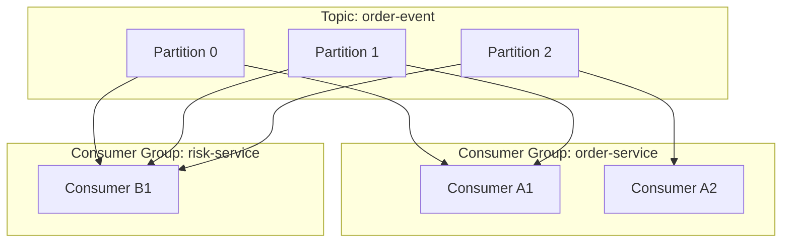
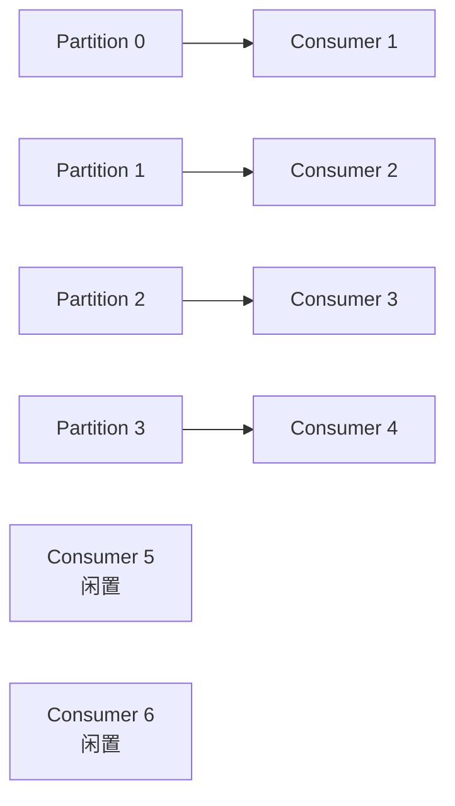
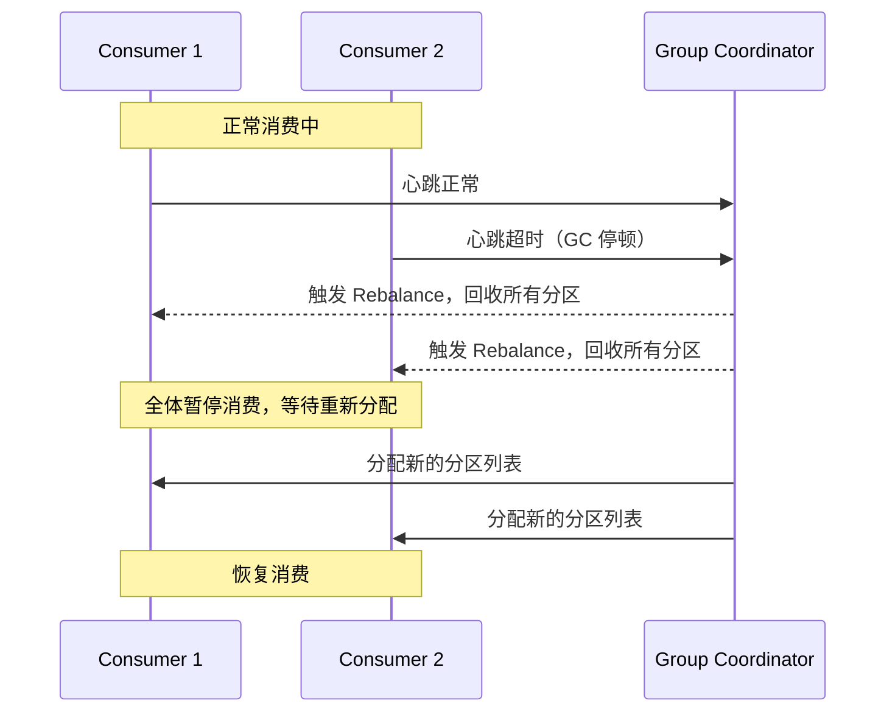

# Kafka 分区和消费组如何决定吞吐与顺序？

> Kafka 的吞吐和顺序，本质上都是分区数和消费组分配策略算出来的结果，不是靠调参数“调”出来的。

面试里问“Kafka 为什么快”“Kafka 怎么保证顺序”，很多人会背“分区”“顺序写”“零拷贝”这几个词，但说不清楚它们具体是怎么互相制约的。

这篇只讲一件事：**Topic、Partition、Consumer Group 这三者的关系，怎么决定了 Kafka 能跑多快、什么时候有序、什么时候会抖一下。**

## Topic、Partition、Consumer Group 到底是什么关系

先把几个词摆到一张图里，比背定义有用得多。



这张图里藏着三条最容易被忽略的规则：

1. **一个 Topic 可以有多个 Partition**，Partition 才是真正存消息、能被并行读写的物理单位。Topic 更像一个逻辑名字，物理上落在各个 Partition 里。
2. **同一条消息只属于一个 Partition**，不会被拆开或复制到多个 Partition 里（副本是另一回事，副本是同一个 Partition 数据的备份，不是数据拆分）。
3. **不同 Consumer Group 之间互不影响**，各自维护各自的消费进度（offset）。上图里 `order-service` 和 `risk-service` 会各自完整地把 `order-event` 这个 Topic 的消息都消费一遍，谁也不会抢谁的消息。

用一句话总结这三者的关系：

**Topic 是消息的逻辑分类，Partition 是并行处理的物理单位，Consumer Group 是"谁来消费"的组织单位。**

| 概念           | 回答的问题             | 关键特性                       |
| -------------- | ---------------------- | ------------------------------ |
| Topic          | 这批消息属于哪类业务   | 逻辑概念，可以横跨多个 Broker  |
| Partition      | 消息物理上存在哪       | 分区内追加写，分区内严格有序   |
| Consumer Group | 谁负责消费、进度记到哪 | 组内共享消费进度，组间互不干扰 |

## 分区内有序，全局无序

Kafka 只保证一件事：**同一个 Partition 内，消息按写入顺序被消费。** 除此之外没有任何顺序承诺。

举个例子，一个电商场景里，同一个订单会产生三条事件：`创建订单`、`支付成功`、`发货`。如果这三条消息落到了三个不同的 Partition，消费者拉取到的顺序完全可能是"发货"先到、"创建订单"后到——因为不同 Partition 之间的消费是并行的，谁先被拉到、谁先被处理，跟写入时间没有必然关系。

要让这三条事件按顺序被消费，唯一靠谱的办法是**让它们进同一个 Partition**。Kafka 发消息时可以带上 `key`，只要 `key` 相同，就会被路由到同一个 Partition（路由规则下一节讲）。所以这个场景应该用订单号做 key：

```java
// key 用订单号，同一订单的三个事件必然进同一分区，分区内天然有序
producer.send(new ProducerRecord<>("order-event", orderId, eventPayload));
```

但即使做到了这一步，也只能说"同一订单的事件有序"，不同订单之间谁先谁后依然是无序的——而且业务上通常也不需要不同订单之间有序，强行要求反而会把所有消息都压到一个 Partition，吞吐直接打回单线程水平。

所以顺序设计的正确问法从来不是"Kafka 能不能保证顺序"，而是：

**我需要的顺序粒度是什么？是按订单、按用户，还是按设备？** 粒度越细，能并行的 Partition 就越多，吞吐就越高。

## 消费组内：一个分区同一时刻只能被一个消费者消费

这是理解消费组分配最核心的一条规则，很多"消费者数量该配多少"的问题都是从这条规则推出来的。

**同一个 Consumer Group 内，一个 Partition 在同一时刻只会分配给组内的一个 Consumer 实例。** 但反过来，一个 Consumer 实例可以同时消费多个 Partition。

假设 `order-event` 这个 Topic 有 4 个 Partition，看几种不同消费者数量下的分配结果：

| 消费者数量 | 分配结果                                 | 说明                                              |
| ---------- | ---------------------------------------- | ------------------------------------------------- |
| 1 个消费者 | C1 消费 P0/P1/P2/P3                      | 单实例顶全部并行度，等于没并行                    |
| 2 个消费者 | C1 消费 P0/P1，C2 消费 P2/P3             | 每个消费者分到 2 个分区，比较均衡                 |
| 4 个消费者 | C1~C4 各消费 1 个分区                    | 并行度打满，这是这个 Topic 能达到的消费并行上限   |
| 6 个消费者 | C1~C4 各消费 1 个分区，C5、C6 分不到分区 | **多出来的 2 个消费者完全闲置**，一条消息都拉不到 |

最后一种情况是很多人踩过的坑：**消费者数量超过分区数之后，多出来的消费者不会帮忙分担负载，只会白白占用一个连接、什么都干不了。** 排查"为什么加了消费者实例吞吐没提升"时，第一步就该去看分区数够不够。

用图表示 6 个消费者、4 个分区的场景会更直观：



## 分区数决定并行度上限，扩容要趁早规划

把上一节的规则往前推一步，可以得到一个更直接的结论：

**一个 Consumer Group 对某个 Topic 的最大有效消费并行度 = 这个 Topic 的分区数。**

这也是为什么 Kafka 官方和大多数团队都建议：**分区数要按业务峰值提前规划，不要等吞吐不够了才临时加。** 原因是加分区这件事有个隐藏代价——

**新增分区不会重新分配存量消息，只对新消息生效，而且已有的 key → 分区映射关系会被打乱。** 假设原来 4 个分区，`key=user_123` 一直落在 Partition 1；扩到 8 个分区之后，`key=user_123` 大概率会被算到别的分区去，新消息和旧消息之间就断了顺序保证。所以"业务量涨了就加分区"听起来简单，实际操作时如果业务依赖 key 的顺序性，是需要谨慎评估的，很多团队会选择新建一个分区数更大的 Topic 做迁移，而不是直接在原 Topic 上加分区。

那分区是不是越多越好？也不是，分区数往上加会带来这些代价：

- 每个分区在 Broker 上对应一组文件句柄和内存开销，分区数太多会增加 Broker 的资源压力和 Controller 管理成本。
- 分区越多，一次 Full GC 或者 Leader 切换涉及的分区选举也越多，故障恢复时间可能变长。
- 生产端如果开了幂等或者事务，分区数越多，需要维护的序列号状态也越多。

所以分区数是一个"按峰值吞吐和消费者规模倒推，同时留一点扩容余量"的容量规划问题，不是配置项里随便填的数字。

## Rebalance：为什么会有卡顿感

Rebalance（再均衡）指的是 Consumer Group 内 Partition 到 Consumer 的分配关系重新计算的过程。触发条件常见的有这几种：

| 触发原因         | 典型场景                                  |
| ---------------- | ----------------------------------------- |
| 消费者数量变化   | 新实例上线、旧实例下线或发布重启          |
| 订阅关系变化     | 消费者动态修改了订阅的 Topic              |
| 消费者心跳超时   | 网络问题、GC 停顿导致没能按时发心跳       |
| 单批消息处理超时 | 业务逻辑太慢，超过 `max.poll.interval.ms` |
| Topic 分区数变化 | 运维给 Topic 加了分区                     |

为什么 Rebalance 会让人觉得"卡了一下"？因为在传统的 **Eager（饿汉式）再均衡策略** 下，触发 Rebalance 时，**组内所有消费者都要先放弃当前持有的全部分区，然后重新参与分配**，这段时间内整个 Consumer Group 是完全停止消费的——这就是通常说的"Rebalance 期间感觉像 STW（Stop-The-World）"的来源，虽然它不是 JVM 层面的 STW，但对这个消费组来说效果类似：**分配没算完，谁都不能拉消息。**



新版本 Kafka（2.4+）引入了 **Cooperative Sticky（协作粘性）分配策略**，改进点是：**不需要动的分区就不动**，只重新分配真正需要变化的那部分，其余消费者可以继续消费，不用整体暂停。生产环境如果对 Rebalance 抖动敏感，优先确认消费者的 `partition.assignment.strategy` 是不是已经切到 Cooperative Sticky，而不是还停留在默认的 Range 或 RoundRobin。

日常降低 Rebalance 影响的思路：

- 发布时尽量滚动、分批重启，避免一次性大批量实例同时上下线。
- 合理设置 `max.poll.interval.ms` 和单次拉取条数，避免业务处理时间超过阈值被判定"假死"。
- 用静态成员（`group.instance.id`）让短暂重启不触发离组，减少不必要的 Rebalance。
- 消费端始终按幂等设计，因为 Rebalance 前后 offset 提交和业务处理之间仍可能出现重复消费。

## key 决定分区路由，也决定了热点 key 的风险

Kafka 生产者发消息时可以指定 `key`，默认分区器的规则大致是：

- **指定了 key**：对 key 做哈希，然后对分区数取模，`hash(key) % numPartitions`，同一个 key 永远落到同一个分区（分区数不变的前提下）。
- **没指定 key**：走轮询或者粘性分区（Sticky Partitioner），尽量把消息打散到各个分区，追求负载均衡。

这个规则决定了顺序性，也带来了一个很容易被忽视的副作用——**热点 key**。

举个例子：一个直播打赏场景，用 `主播ID` 做 key，绝大多数主播的打赏量都很正常，但头部主播的打赏消息量可能是普通主播的几十倍。这些消息全部固定落到同一个分区，负责这个分区的那一个消费者就会成为整条链路的瓶颈——**哪怕你把消费者实例扩到再多，这个分区的消费速度也不会变快，因为一个分区同一时刻只能被一个消费者处理。**

| 现象                                         | 原因                                        | 常见应对                                                                        |
| -------------------------------------------- | ------------------------------------------- | ------------------------------------------------------------------------------- |
| 某个分区 Consumer Lag 持续偏高，其他分区正常 | 该分区的 key 是热点 key，消息量远超其他分区 | 给热点 key 加随机后缀"打散"，比如 `主播ID_0~9`，牺牲该 key 的严格全局顺序换吞吐 |
| 加了消费者实例但整体吞吐没变化               | 瓶颈在单个热点分区，不是消费者数量不够      | 排查各分区的 Lag 分布，而不是只看消费者数量                                     |
| 业务方坚持要求该 key 严格有序，又要求吞吐高  | 顺序和并行度天然冲突                        | 和业务确认真实的顺序粒度，比如按"打赏批次"而不是"主播"做二次拆分                |

处理热点 key 的核心思路就一句话：**在能接受的顺序粒度范围内，尽量把一个大 key 拆成多个小 key，用空间换并行度。**

## offset 提交和重复消费的关系（点到为止）

分区和消费组只解决了"谁读哪一条"的问题，没有解决"读了算不算数"的问题——这是 offset 提交时机决定的：提交早了可能丢消息，提交晚了可能重复消费。这部分和幂等设计强相关，属于另一个话题，这里不展开，可以看 [`MQ 如何处理重复消费和幂等？`](/high-performance/high-performance-message-idempotency.html)。

这里只强调一个跟本文相关的点：**Rebalance 发生时，如果 offset 提交不及时，会导致分区被重新分配后，新的消费者从一个旧的 offset 位置重新开始拉取，天然造成重复消费。** 所以 Rebalance 频繁的系统，重复消费的概率也会明显升高——这也是为什么前面说"消费端必须幂等"不是一句空话，而是和 Rebalance、offset 提交时机直接挂钩的工程要求。

## 面试里可以这样收束

如果被问到"Kafka 分区和消费组是怎么回事"，可以按这条线讲：

1. Topic 是逻辑分类，Partition 是物理并行单位，Consumer Group 是消费组织单位，三者互不重叠。
2. Kafka 只保证分区内有序，全局无序；顺序粒度由 key 决定，粒度越细并行度越高。
3. 同一个分区在同一时刻只能被组内一个消费者消费，所以消费者数量超过分区数会出现空闲实例。
4. 分区数是消费并行度的硬上限，需要按峰值提前规划，而不是事后随便加。
5. Rebalance 会造成短暂停顿甚至重复消费，Eager 策略下影响是全组级别的，Cooperative Sticky 能明显缓解。
6. key 的哈希路由决定了分区归属，也带来了热点 key 风险，本质是顺序和并行度的取舍。

## 容易踩的坑

### 只加消费者，不看分区数

消费者数量一旦超过分区数，多出来的实例只是摆设。加消费者之前先确认分区数够不够。

### 把"分区内有序"说成"Kafka 全局有序"

这是最常见的表述错误。准确说法是：Kafka 只保证同一分区内有序，全局顺序需要业务自己通过 key 设计来收敛粒度。

### 以为加分区没有代价

加分区会打乱存量 key 到分区的映射关系，影响依赖顺序性的业务。分区数要提前按容量规划，扩容要评估对顺序的影响。

### 把 Rebalance 只理解成"重新分配分区"

更完整的理解是：它会带来短暂的组内停顿（Eager 策略下尤其明显）和重复消费风险，需要结合分配策略、心跳参数和消费端幂等一起看。

### 忽略热点 key 对单分区的压力

分区数和消费者数量都充足，但某个 key 流量远超其他 key 时，瓶颈仍然会卡在承载这个 key 的单个分区上，扩容消费者解决不了这个问题。

## 小结

- Topic 是逻辑分类，Partition 是并行处理的物理单位，Consumer Group 是消费组织单位，三者分工不同。
- Kafka 只承诺分区内有序，全局无序；顺序粒度由 key 路由决定，粒度越细吞吐越高。
- 消费组内一个分区同一时刻只归一个消费者消费，消费者数超过分区数会导致实例闲置。
- 分区数是消费并行度的硬上限，需要按峰值提前规划，事后扩容会影响 key 的顺序映射。
- Rebalance 会带来停顿感和重复消费风险，Cooperative Sticky 分配策略能显著降低影响范围。
- key 哈希决定分区归属，热点 key 会让单个分区成为瓶颈，需要在顺序粒度和并行度之间做取舍。

## 参考

综合自仓库内高性能与消息队列参考材料，并结合 Apache Kafka 公开文档中关于分区、消费组分配、再均衡协议和分区器实现的说明整理。
