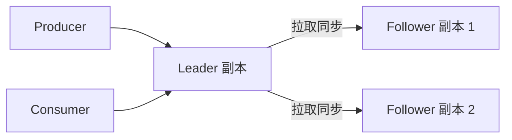
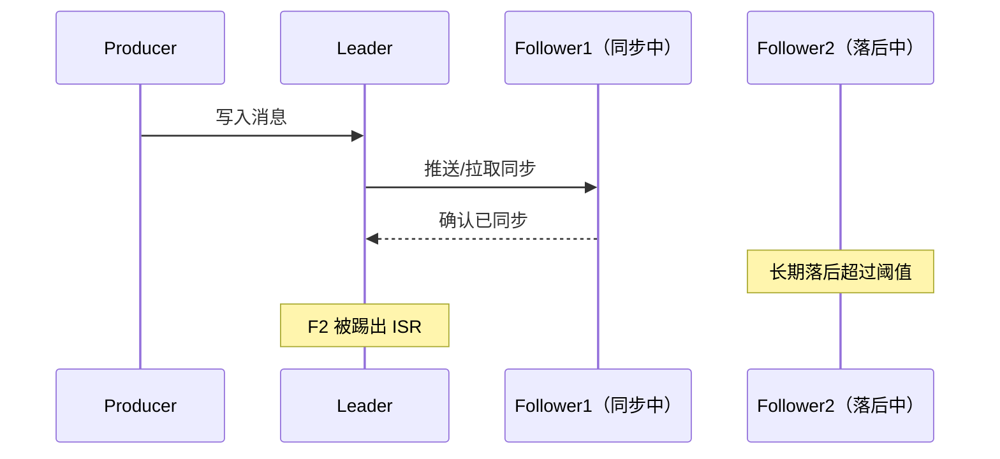
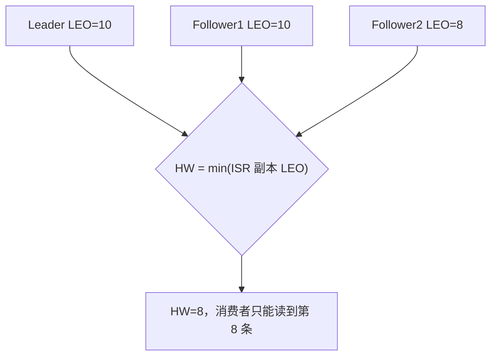
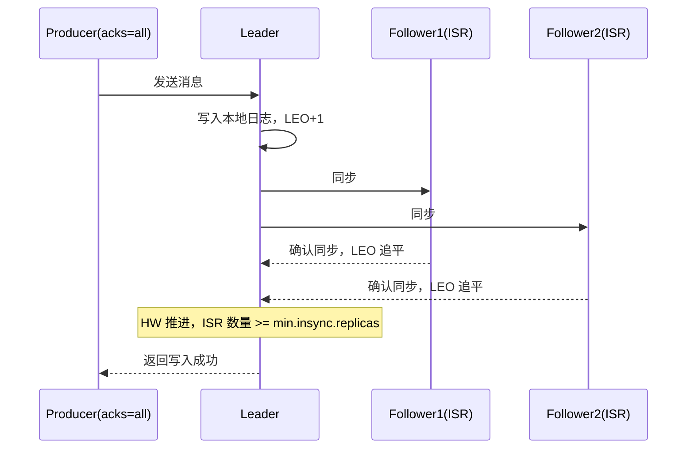

# Kafka 副本、ISR 和 ACK 如何影响消息可靠性？

> Kafka 默认配置下，Leader 挂了是可能丢消息的。“Kafka 不丢消息”不是天生的，是一组参数一起配出来的。

这题很容易答成一句话：

> Kafka 有多副本机制，所以消息不会丢。

面试官接着问一句“那 acks 你怎么配的”，很多人就卡住了。

真实情况是：Kafka 默认参数（`acks=1`）本身并不能保证不丢消息。副本机制只是提供了“可以不丢”的能力，能不能真的不丢，取决于你怎么组合 `acks`、`min.insync.replicas`、`unclean.leader.election.enable` 这几个开关。

这篇把这条链路拆开讲：副本是什么、ISR 是什么、HW/LEO 在保护什么、acks 到底在等谁确认、以及这几个参数怎么组合才算“真的不丢”。

## 先搞清楚：副本是给谁用的

Kafka 的每个分区（Partition）可以配置多个副本（Replica），分布在不同的 Broker 上。这些副本里只有一个是 **Leader**，其余是 **Follower**。

- 生产者和消费者只跟 Leader 打交道，读写都发给 Leader。
- Follower 不对外提供读写服务，它唯一的工作是不停地从 Leader 拉取消息，让自己的数据追上 Leader。
- 如果 Leader 所在的 Broker 挂了，Kafka 会从副本里选一个新 Leader 顶上。

你可以把 Follower 理解成“Leader 的热备份”，它们存在的唯一意义就是在 Leader 挂掉时能顶上去，尽量不丢数据。

但这里立刻会有一个问题：如果新选出来的 Leader 数据比老 Leader 少，消费者之前读到的消息在新 Leader 上根本不存在，这不就是丢消息吗？

这正是 ISR 要解决的问题。

## ISR：不是所有副本都有资格当 Leader

ISR 全称 **In-Sync Replicas**，直译是“同步中的副本集合”。通俗点说：

**ISR 是一份“跟得上 Leader 的副本名单”。**

一个 Follower 只有满足和 Leader 之间的同步延迟在阈值内（由 `replica.lag.time.max.ms` 控制），才能留在 ISR 里。掉队太多的 Follower 会被踢出 ISR，等它追上来了再加回去。

为什么要搞这么一个名单，而不是直接看副本数？因为副本数只能说明“有几个备份”，不能说明“这几个备份数据新不新”。

举个例子：Topic 设了 3 个副本，但其中一个 Follower 所在机器磁盘 I/O 很慢，长期落后 Leader 几万条消息。如果允许它随时当 Leader，一旦真选中它，前面几万条消息就直接消失了。ISR 机制的作用就是把这种“落后太多的副本”提前排除在“候选 Leader”之外。

**ISR 的核心作用只有一句话：只有跟上进度的副本，才有资格在 Leader 挂掉时被选为新 Leader。** 落后的副本可以存在，但不能参选。

## HW 和 LEO：消费者到底能读到哪条消息

理解了 ISR，还差最后一块拼图：消费者能读到哪条消息，是由谁决定的？这里要认识两个概念，其实不难，就是两个“位置指针”。

- **LEO（Log End Offset）**：每个副本自己已经写到的最新位置。Leader 有自己的 LEO，每个 Follower 也有自己的 LEO，各写各的进度。
- **HW（High Watermark）**：ISR 里所有副本 LEO 的最小值。**消费者只能读到 HW 之前的消息**，HW 之后的消息即使 Leader 已经写了，对消费者也是不可见的。

为什么消费者不能直接读到 Leader 的最新数据（LEO），非要等 HW？

因为 HW 之后的消息还没有被 ISR 里的所有副本确认同步。如果这时候 Leader 突然挂了，新选出来的 Leader 未必有这部分数据。让消费者提前读到这部分消息，将来 Leader 切换后消息又“凭空消失”，这比不让消费者读更糟糕。

用一个例子说清楚：

| 副本      | 是否在 ISR | LEO |
| --------- | ---------- | --- |
| Leader    | 是         | 10  |
| Follower1 | 是         | 10  |
| Follower2 | 是         | 8   |

ISR 里三个副本的 LEO 分别是 10、10、8，取最小值，**HW = 8**。也就是说即使 Leader 已经写到第 10 条，消费者目前也只能读到第 8 条。等 Follower2 追上来，LEO 变成 10，HW 才会推进到 10，第 9、10 条才对消费者可见。

一句话总结 HW/LEO 的关系：**LEO 是“我写到哪了”，HW 是“ISR 里最慢的那个写到哪了”，消费者的可见范围永远卡在最慢的那个人手里。**

## acks：生产者到底在等谁确认

前面讲的都是 Broker 内部怎么同步、怎么保证一致。但消息会不会丢，第一道关卡其实在生产者这边——**生产者发出去的消息，要等到什么程度的确认，才算发送成功？** 这就是 `acks` 参数管的事。

| acks 取值                    | 语义                                 | 丢消息的边界                                                        | 特点               |
| ---------------------------- | ------------------------------------ | ------------------------------------------------------------------- | ------------------ |
| `acks=0`                     | 发出去就算成功，不等任何确认         | 网络抖动、Broker 没收到，生产者根本不知道                           | 最快，最不可靠     |
| `acks=1`                     | Leader 写入本地日志后就返回成功      | Leader 刚写完还没同步给 Follower 就挂了，这部分消息随 Leader 一起丢 | Kafka 默认值，折中 |
| `acks=all`（等价 `acks=-1`） | ISR 中所有副本都确认收到后才返回成功 | 只要 ISR 里至少留有一个副本存活，消息就不会丢                       | 最安全，延迟最高   |

需要纠正一个常见的误解：**`acks=all` 等的不是“所有副本”，而是“当前 ISR 里的所有副本”。**

这就带出一个隐藏风险：如果 ISR 因为网络问题只剩下 Leader 自己（其他 Follower 全部因为落后被踢出 ISR），那么 `acks=all` 实际上退化成了只等 Leader 自己确认——和 `acks=1` 效果差不多。这也是为什么只配 `acks=all` 还不够，需要下一节的 `min.insync.replicas` 兜底。

## min.insync.replicas：给 acks=all 设一条底线

`min.insync.replicas` 的意思是：ISR 里至少要有多少个副本存活，Leader 才接受写入。

它和 `acks=all` 是配合关系，不是替代关系：

- `acks=all` 决定“要等 ISR 里所有副本确认”。
- `min.insync.replicas` 决定“ISR 至少要有几个副本，这次写入才算数”。

两者一起配置，语义才完整：**至少要有 N 个副本存活并且都确认收到，才算写入成功；不满足就直接拒绝写入，宁可报错也不接受“可能不安全”的写入。**

举例：`replication.factor=3`，`min.insync.replicas=2`，`acks=all`。

- 正常情况：3 个副本都在 ISR，写入等 3 个都确认。
- 有一个 Follower 掉线：ISR 剩 2 个（Leader + 1 Follower），仍然 ≥ 2，写入继续正常工作，只是少了一层冗余。
- 再掉一个：ISR 只剩 Leader 自己，1 < 2，Kafka 会直接拒绝写入并返回异常（`NotEnoughReplicasException`），而不是"降级成单副本确认"。

这里能看出 Kafka 可靠性设计的一个取舍：**用可用性换安全性**。ISR 副本数不够时宁可写入失败，也不愿意在“可能不安全”的情况下假装成功。

另外要注意一个容易踩的坑：`replication.factor` 不能等于 `min.insync.replicas`。如果两者相等（比如都是 3），只要有一个副本掉线，整个分区就写不进去了，可用性会变得很差。业界常见做法是 `replication.factor = min.insync.replicas + 1`，比如 3 副本配 `min.insync.replicas=2`，留出一个副本的容错空间。

## unclean.leader.election.enable：允许落后的副本当 Leader 吗

前面说过，ISR 里的副本才有资格竞选新 Leader。但如果 Leader 挂掉的时候，ISR 里**一个副本都不剩**（全都因为落后被踢出去了），Kafka 该怎么办？

这时候 `unclean.leader.election.enable` 这个参数就登场了：

- `false`（Kafka 0.11.0.0 之后的默认值）：不允许从 ISR 之外选 Leader，宁可这个分区暂时不可用，也不选一个数据不全的副本上来当 Leader。
- `true`：允许从 ISR 之外（哪怕落后很多）选一个副本强行顶上当 Leader，分区能继续对外服务，但这个新 Leader 之前没同步到的消息会永久丢失。

一句话理解这个参数在赌什么：**赌的是“可用性”还是“数据完整性”。** 金融、交易这类不能丢数据的场景，必须保持默认的 `false`；一些允许短暂数据缺口、但要求服务不能中断的场景，才会考虑打开 `true`。

## 组合起来看：Kafka 到底怎么配才算“不丢”

把前面几节串起来，一次典型的“可靠写入”大概是这样的：

真正做到“消息不丢”，需要下面这几项配合，缺一不可：

1. `replication.factor >= 3`：保证一个分区有足够的副本冗余。
2. `acks=all`：生产者等 ISR 全部副本确认，而不是只等 Leader。
3. `min.insync.replicas >= 2`（且小于 `replication.factor`）：给 `acks=all` 兜底，ISR 存活不够就拒绝写入，不弄虚作假。
4. `unclean.leader.election.enable=false`：Leader 挂了也不允许数据不全的副本顶上去当 Leader。
5. 生产者开启重试和幂等（`enable.idempotence=true`），避免因为网络抖动重试导致的重复写入。
6. 消费者手动提交 offset，并且是“业务处理成功后再提交”，避免消费端过早确认。

这六项里，前四项负责“Broker 到 Leader 挂掉这段不丢”，后两项负责“生产者重试不重复、消费者处理失败不算数”。只有这条链路整体闭环，才能说“这套 Kafka 部署基本不丢消息”。

反过来说，Kafka 默认参数（`acks=1`、`min.insync.replicas=1`）其实是偏向吞吐和延迟的配置，默认情况下 Leader 挂掉是有丢消息窗口的。这也是为什么这题不能简单回答“Kafka 靠多副本保证不丢”——**副本机制只是给了你“配出可靠性”的工具，默认值本身并不可靠。**

## 关于 ZooKeeper 和 KRaft，顺带说一句

副本、ISR、Leader 选举这些元数据以前是存在 ZooKeeper 里的。Kafka 2.8 引入了基于 Raft 协议的 KRaft 模式替代 ZooKeeper，3.3.x 开始 KRaft 面向新集群标记为生产可用，到 Kafka 4.0，ZooKeeper 模式被彻底移除，只支持 KRaft。这一点了解版本边界即可，不影响本文讲的副本、ISR、acks 这套可靠性逻辑——不管元数据存在 ZooKeeper 还是 KRaft 的 Controller Quorum 里，Leader/Follower/ISR/HW 这套机制是不变的。

## 容易踩的坑

### 以为 acks=all 就万无一失

`acks=all` 等的是 ISR 而不是全部副本数。如果没配 `min.insync.replicas`，ISR 缩水到只剩 Leader 时，`acks=all` 实际保护力度和 `acks=1`没有本质区别。

### 把 min.insync.replicas 设成等于 replication.factor

这样任何一个副本掉线都会导致整个分区拒绝写入，可用性会变得很差，属于过度追求安全性而牺牲可用性。

### 忽略 unclean.leader.election.enable

只关注 acks 和 min.insync.replicas，却没检查这个参数是不是被改成了 `true`。一旦是 `true`，前面的努力在极端情况下（ISR 全军覆没）会被绕过。

### 把 HW 和 LEO 弄混

LEO 是某个副本自己写到哪，HW 是 ISR 里最慢的副本写到哪。面试里被问“消费者能读到最新消息吗”，答案永远要落到 HW，而不是 Leader 的 LEO。

### 只讲 Broker 端，不讲生产者和消费者

即使 Broker 侧的副本、ISR、acks 全部配对，生产者重试导致重复写入、消费者提前提交 offset，仍然会让“看起来没丢”变成“业务上真丢了”。这题往往是可靠性系列题目的一部分，最好能和消息重复消费、幂等一起讲，参考 [`MQ 如何保证消息不丢？`](/high-performance/high-performance-message-reliability.html)。

## 小结

- Leader 负责读写，Follower 只负责从 Leader 拉取同步，是“热备份”而不是负载分担。
- ISR 是“跟得上 Leader 进度”的副本集合，只有 ISR 里的副本才有资格在 Leader 挂掉时当选新 Leader。
- LEO 是某个副本自己的写入进度，HW 是 ISR 里最慢副本的进度，消费者只能读到 HW 之前的消息。
- `acks=0/1/all` 决定生产者等谁确认，`acks=all` 等的是 ISR 而不是全部副本，默认值 `acks=1` 并不能保证 Leader 挂掉时不丢消息。
- `min.insync.replicas` 是 `acks=all` 的安全底线，ISR 存活数不够就直接拒绝写入，避免“确认了但其实不安全”。
- `unclean.leader.election.enable=false` 决定 Leader 全部掉线时，Kafka 是选择停服还是选择接受数据丢失，核心业务应保持关闭。
- Kafka“不丢消息”从来不是默认行为，而是副本数、acks、min.insync.replicas、unclean 选举开关、生产者幂等、消费者提交时机组合出来的结果。

## 参考

综合自仓库内 Kafka 相关面试参考材料，并结合 Apache Kafka 官方文档中关于副本机制、ISR、High Watermark、Log End Offset、Producer acks 配置、min.insync.replicas 及 unclean.leader.election.enable 参数说明整理。
