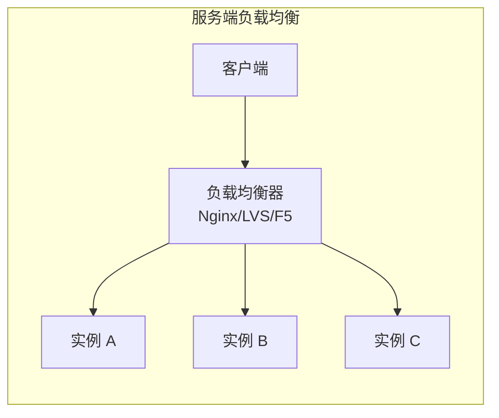
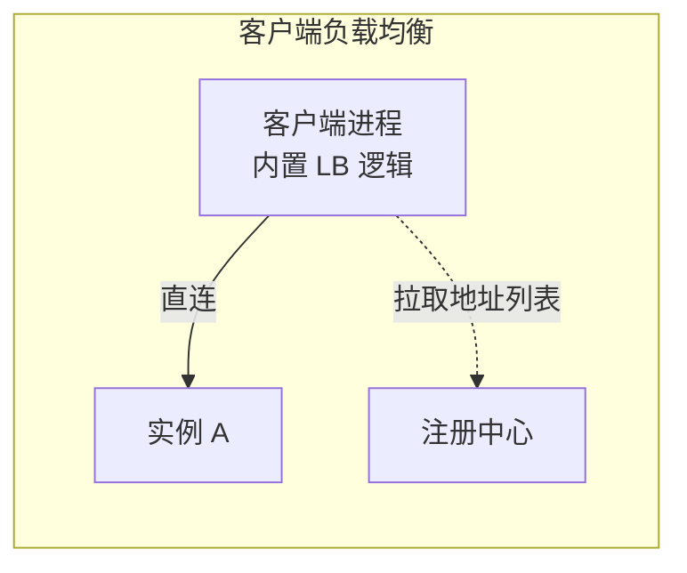
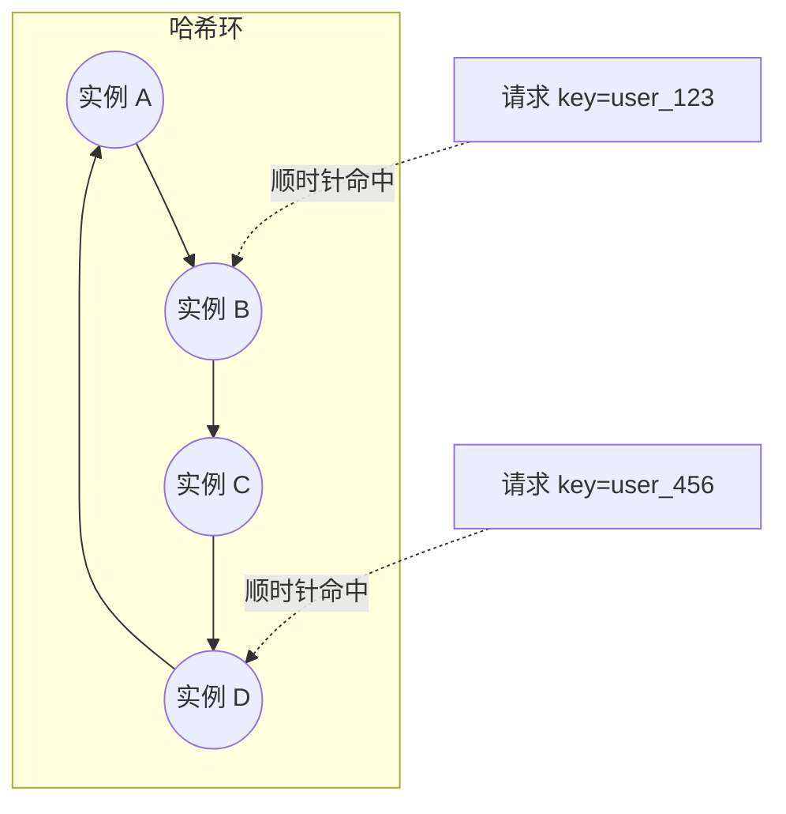
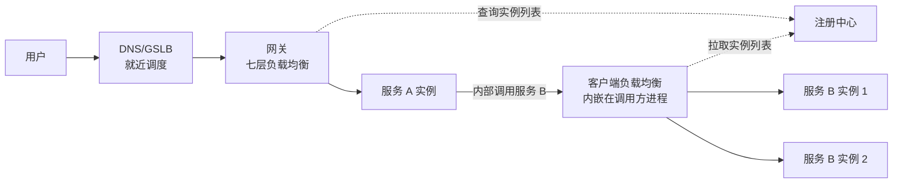

# 负载均衡怎么做？四层、七层和客户端 LB 有什么区别？

> 负载均衡解决的是"把请求分散到多台机器"这一件事，搞清楚它分散在哪一层、按什么规则分散，比背算法名字更重要。

## 负载均衡到底解决什么问题

假设一个商品服务只部署一个实例，请求量一大，这台机器的 CPU、连接数、线程池很快就会被打满，哪怕代码写得再好也扛不住。解决办法很直接：多部署几份，让请求分摊到不同机器上处理。负载均衡就是干这件事的组件——它站在请求和一组后端实例之间，按某种规则把请求转发出去。

这里有一个很容易被忽略的边界：负载均衡只负责"分请求"，不负责"让请求变快"。如果某条 SQL 本身很慢，或者所有节点都因为同一个下游依赖而卡住，负载均衡最多是把慢请求更均匀地分给每台机器，系统整体还是慢的。这一点和消息队列很像——[MQ 能削峰、能解耦，但同样解决不了慢 SQL 本身](/high-performance/high-performance-mq-selection.html)。遇到"上了负载均衡/上了 MQ 系统还是慢"这种问题，思路都应该是回去找真正的瓶颈，而不是怀疑分流手段本身。

## 服务端负载均衡 vs 客户端负载均衡

按负载均衡器"部署在哪"，可以分成两大类。

**服务端负载均衡**：独立于调用方和被调用方，作为一个中间节点存在，通常挡在系统入口或网关前面。客户端只知道负载均衡器的地址，完全不知道后面有几台真实服务器。Nginx、LVS、硬件 F5 都属于这一类。

**客户端负载均衡**：负载均衡的逻辑内嵌在调用方进程里。调用方自己维护一份服务实例列表（通常来自注册中心），发请求前先在本地按算法选出一台，再直接发过去，中间不经过额外的网络跳转。Dubbo 内置的负载均衡、Spring Cloud Load Balancer 都是这个模式。

两者的核心差异可以归纳成一张表：

| 对比维度     | 服务端负载均衡                 | 客户端负载均衡                                 |
| ------------ | ------------------------------ | ---------------------------------------------- |
| 部署位置     | 独立节点，通常在网关/入口层    | 内嵌在调用方进程里                             |
| 网络跳转     | 多一跳（客户端 → LB → 服务端） | 直连，少一跳                                   |
| 语言限制     | 无关，任何客户端都能用         | 受限于组件的实现语言                           |
| 实例列表维护 | LB 自己维护                    | 客户端自己维护，通常来自注册中心               |
| 典型场景     | 系统外部入口、跨语言调用       | 微服务内部同语言调用（如 Dubbo、Spring Cloud） |
| 代表实现     | Nginx、LVS、F5                 | Dubbo 内置 LB、Spring Cloud Load Balancer      |

需要补充一点资料里没细说的：现在很多 Service Mesh 方案（比如 Istio + Envoy）会把负载均衡逻辑做成 Sidecar，跟业务进程部署在同一个 Pod 但是不同的进程。它既不是传统意义的"独立服务端节点"，也不是"和业务代码同进程"，本质上是客户端负载均衡的一种变种——把选实例的逻辑从业务进程里剥离出来，交给旁边的代理进程做，业务代码本身对负载均衡完全无感知。面试如果被问到"了解 Service Mesh 的负载均衡吗"，这是一个可以补充的点。

Dubbo 的服务发现、负载均衡和容错是怎么串起来配合工作的，可以看专门的这篇：[Dubbo 的注册发现、负载均衡和容错怎么配合？](/distributed-system/rpc/dubbo-discovery-loadbalance-faulttolerance.html)

## 四层负载均衡 vs 七层负载均衡

这是按 OSI 模型划分的另一个维度，和上面"服务端/客户端"是两条独立的分类线，很多人会把它们混在一起讲，其实是两回事——服务端负载均衡里既有做四层的（LVS），也有做七层的（Nginx）。

- **四层负载均衡**工作在传输层，只看得到 TCP/UDP 报文里的源 IP、源端口、目的 IP、目的端口，不解析报文里的具体内容。转发效率高，但没法根据 URL、Header 这些应用层信息做路由。
- **七层负载均衡**工作在应用层，会把 HTTP 报文完整解析出来，可以根据 URL 路径、Header、Cookie 内容做路由决策，因此也常被叫做反向代理服务器。功能更强，但每个请求都要多做一次报文解析，开销比四层大。

| 对比维度            | 四层负载均衡                        | 七层负载均衡                       |
| ------------------- | ----------------------------------- | ---------------------------------- |
| 工作层次            | 传输层（TCP/UDP）                   | 应用层（HTTP/HTTPS）               |
| 转发依据            | 源/目的 IP、端口                    | 域名、路径、Header、Cookie         |
| 性能开销            | 更低                                | 更高（但现代硬件下差距通常可忽略） |
| 能否做灰度/路径路由 | 不能                                | 能                                 |
| 典型实现            | LVS、F5                             | Nginx、HAProxy                     |
| 典型场景            | 大流量入口、数据库代理、纯 TCP 服务 | 网关、灰度发布、按路径路由         |

举个直观的例子：同样是把 `/api/order/**` 和 `/api/user/**` 转发到不同的服务集群，四层负载均衡做不到——它压根看不到 URL；只有七层负载均衡能读懂报文内容再做决策。反过来，如果只是把 3306 端口的 TCP 流量转发到一组数据库代理上，用四层就足够，没必要多花一次报文解析的开销。

实际生产里的组合通常是：LVS 顶在最外层做四层入口，扛住大流量，把请求转发给一层 Nginx 集群做七层的精细路由（按域名、按路径分发到不同的业务网关）。这样既有 LVS 的高吞吐，又有 Nginx 的灵活性。

## 常见的负载均衡算法怎么选

算法要解决的是同一个问题："一堆请求，怎么分给一组实例"。选哪种，取决于实例是否等配、是否要保证同一个用户命中同一台机器、以及要不要感知实例的实时负载。

| 算法            | 核心规则                               | 适合场景                         | 明显缺点                                     |
| --------------- | -------------------------------------- | -------------------------------- | -------------------------------------------- |
| 轮询 / 加权轮询 | 按顺序依次分发，权重越高分到的请求越多 | 实例配置相近或按权重区分性能差异 | 不感知实例的实时负载，慢节点也会按比例接请求 |
| 随机 / 加权随机 | 按概率随机选择                         | 和轮询类似，实现更简单           | 短时间内可能出现分布不均                     |
| 最少连接数      | 选当前连接数最少的实例                 | 长连接、连接耗时差异大的场景     | 连接数不完全等于真实负载，有些连接很轻量     |
| 最少活跃数      | 选当前正在处理请求数最少的实例         | 比最少连接更贴近真实处理能力     | 需要维护额外的活跃计数状态                   |
| 一致性哈希      | 相同 key 的请求固定落到同一实例        | 需要会话粘滞、本地缓存命中的场景 | 实现和运维比轮询复杂，扩缩容仍有少量请求漂移 |

轮询和加权轮询能覆盖绝大部分场景，没有特殊需求时优先用它。真正值得展开讲的是一致性哈希，因为它解决的是另一类问题：**同一个用户或同一个 key 的请求，能不能每次都落到同一台机器**。

### 为什么普通哈希不够用，要上一致性哈希

如果直接用 `hash(用户ID) % 实例数` 来选机器，一旦实例数量变化（扩容或有节点下线），几乎所有请求的取模结果都会变，等于全量重新分布——这对于依赖"同一用户固定落在同一机器"的场景是灾难性的。

一致性哈希把这个问题解决掉了：把实例和请求的 key 都映射到同一个哈希环上，每个请求顺时针找到环上第一个实例节点，就是它的目标机器。节点增加或减少时，只影响这个节点在环上相邻的那一小段区间，其余节点上的映射关系不受影响，不会引发全量重新分布。

这里有一个容易讲错的细节：节点变化时"只影响该节点自己"这个说法不够准确。准确的说法是——只影响哈希环上**紧邻在它之后**的那个节点原本承接的一部分请求，其余节点完全不受影响。比如上图里如果实例 C 下线，原本应该落在 C 上的 key 会顺时针漂移到 D 上，但落在 A、B 上的 key 丝毫不受影响。

### 一致性哈希解决的两个实际问题

**会话粘滞（Session Sticky）**：如果一个用户的会话状态（比如登录态、购物车）只存在某一台服务器的内存里，那这个用户后续所有请求都必须固定落到这台机器，否则会出现"登录了又要求重新登录"的问题。用一致性哈希对用户 ID 做 key，可以自然实现粘滞。不过更推荐的做法是把会话状态放到 Redis 等共享存储里，让服务本身保持无状态——这样任何一台机器都能处理任意用户的请求，粘滞失败（比如目标节点正好挂了）也不会丢状态，负载均衡策略也能随便换。会话粘滞更像是"没条件做无状态化时的权宜方案"。

**缓存亲和（Cache Affinity）**：如果每台服务实例本地都有一份热点数据的缓存（比如本地 Guava Cache），同一个商品 ID 的请求总是落到同一台机器，本地缓存命中率会非常高；如果每次都随机落到不同机器，本地缓存几乎形同虚设，缓存命中率骤降，全部请求都要穿透到数据库或者远程缓存。这种场景下一致性哈希是明显更优的选择，因为它不依赖存储会话状态，纯粹是为了提高缓存命中率。

## Nginx、LVS、硬件负载均衡怎么选

这部分不需要展开太细，记住定位差异就够：

| 方案            | 类型                | 特点                              | 适用场景                               |
| --------------- | ------------------- | --------------------------------- | -------------------------------------- |
| Nginx           | 软件，七层为主      | 部署简单、灵活性强，社区生态成熟  | 绝大多数公司的默认选择                 |
| LVS             | 软件，四层          | 基于 Linux 内核，吞吐量大、性能强 | 超大流量入口，中小公司较少直接接触     |
| F5 / A10 等硬件 | 硬件，四层/七层均有 | 性能强、稳定性好，但价格昂贵      | 大型企业、金融等对稳定性要求极高的场景 |

日常开发里接触最多的是 Nginx；LVS 和硬件负载均衡更多出现在大厂或者流量规模很大的场景，不是每家公司都用得上，也没必要为了背概念强行去学它的部署细节。

## 健康检查与摘流量

负载均衡上线之后，真正决定稳定性的往往不是算法选得多精妙，而是**能不能及时发现并摘掉有问题的节点**。算法解决的是"正常情况下怎么分"，健康检查解决的是"异常节点还能不能继续接流量"这个更关键的问题。

常见的健康检查方式：

- **TCP 检查**：端口能连通就判定为可用，成本最低，适合四层场景，但连不上并不代表业务逻辑正常。
- **HTTP 检查**：定期访问一个 `/health` 之类的接口，根据状态码和响应内容判断，能覆盖大部分应用层异常。
- **业务探活**：连带检查数据库、缓存等关键依赖是否正常，能发现更深层的问题，但探活逻辑本身不能太重，否则反而拖慢整个健康检查链路。

摘流量还有两个容易被忽略的时机：

- **节点上线预热**：新节点刚启动，JIT 还没热身、连接池和本地缓存都是空的，直接打满流量容易导致这台机器抖动甚至被压垮，应该让流量逐步爬坡。
- **节点下线优雅摘除**：先把节点从可用列表里摘掉、停止接收新请求，再等存量请求处理完再真正关闭进程，避免正在处理中的请求被强行掐断。

## 和网关、注册中心怎么配合

一次完整的请求链路里，负载均衡通常不止出现一次，而是在不同层各司其职：

- 最外层是 DNS 甚至 GSLB，负责把用户调度到地理上更近的机房，解决的是跨地域延迟问题。
- 进入机房后是网关层的七层负载均衡，负责把外部请求路由到具体的业务服务集群，这里通常也是做灰度发布、按 Header/Cookie 分流的地方。
- 服务与服务之间的内部调用，走的是客户端负载均衡：调用方从注册中心拉取目标服务的实例列表，本地按算法选一个直连，不再经过额外的中间节点。

也就是说负载均衡和注册中心其实是两件配合的事——**注册中心负责回答"现在有哪些实例、它们是否健康"，负载均衡负责回答"这一次该选哪个实例"**。注册中心的健康检查结果，往往就是客户端负载均衡能不能把某个实例纳入候选列表的依据。这一整套协作在 Dubbo 里体现得很完整，服务目录怎么维护、失败了怎么重试、和负载均衡算法怎么衔接，可以参考 [Dubbo 的注册发现、负载均衡和容错怎么配合？](/distributed-system/rpc/dubbo-discovery-loadbalance-faulttolerance.html)。

## 容易踩的坑

- **DNS 轮询不算严格意义的七层负载均衡**。有些资料把 DNS 解析归为七层负载均衡的一种实现方式，但 DNS 只是把域名解析成不同的 IP，并不会去解析 HTTP 报文的内容（URL、Header、Cookie），跟"基于报文内容做路由决策"的七层负载均衡本质不同。更准确的说法是：DNS 轮询是一种应用层的调度手段，能实现简单的流量分摊，但不具备七层负载均衡的路由能力。
- **一致性哈希扩缩容"只影响该节点自己"是不严谨的**，准确说法是只影响哈希环上紧邻其后的那个节点原本承接的一部分请求，其他节点不受影响——这个细节在面试被追问时经常成为区分是否真正理解原理的点。
- **硬件负载均衡的价格数字没必要死记**。类似"F5 最低 20 多万"这种具体报价会随时间和厂商政策变化，记住结论就够：硬件性能强但贵，绝大多数公司的量级用软件负载均衡完全够用。
- **客户端负载均衡不止"和业务代码同进程"这一种形态**。传统的 Dubbo、Spring Cloud Load Balancer 是内嵌在业务进程里，但 Service Mesh 模式下（如 Envoy Sidecar）负载均衡逻辑被剥离到旁边的代理进程，业务代码本身对此无感，本质上仍属于客户端负载均衡的范畴，只是形态变了。
- **会话粘滞不是最优解，是权宜之计**。能做到服务无状态化、把状态放进共享存储，永远比依赖哈希粘滞更稳，粘滞方案在节点故障时天然有用户状态丢失的风险。

## 小结

1. 负载均衡解决的是"把请求分散到多台机器"，不能替代慢 SQL 优化、线程池调优这类根因排查。
2. 服务端负载均衡是独立节点（Nginx、LVS、硬件），客户端负载均衡内嵌在调用方进程里（Dubbo、Spring Cloud Load Balancer），Service Mesh Sidecar 是客户端负载均衡的变种形态。
3. 四层负载均衡只看 IP/端口，性能强但不能按内容路由；七层负载均衡能解析 HTTP 报文，能做灰度和路径路由，但开销更高——这是和"服务端/客户端"完全独立的另一条分类线。
4. 轮询/加权轮询覆盖大多数场景；一致性哈希用来解决会话粘滞和本地缓存亲和这类"同一 key 必须落到同一实例"的需求。
5. 健康检查和摘流量比算法选型更决定生产稳定性，负载均衡要和注册中心、网关配合，才能构成完整的调度链路。

## 参考

综合自仓库内负载均衡参考材料，并结合 Nginx 官方对四层、七层负载均衡的说明；对 DNS 解析的分类归属、一致性哈希扩缩容的影响范围、客户端负载均衡的形态边界做了核实和补充。
