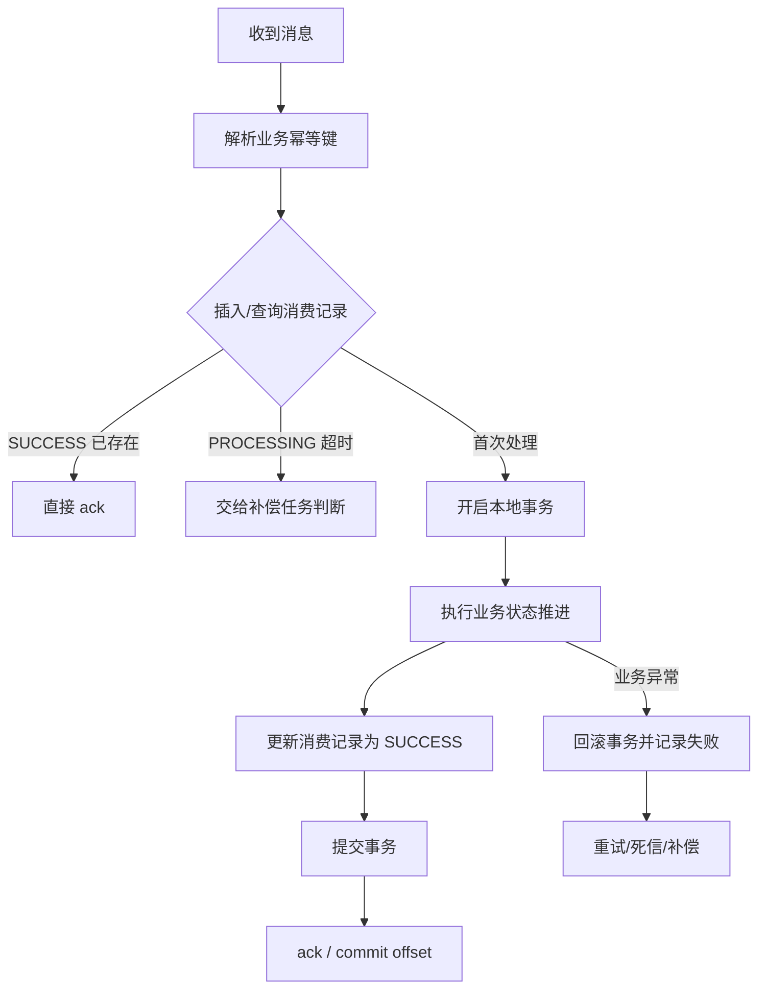

# MQ 如何处理重复消费和幂等？

> 真正成熟的 MQ 设计，不是幻想消息绝不重复，而是默认重复会发生，然后在消费侧把它兜住。

消息幂等题经常和“消息不丢”一起出现，因为这两件事本来就互相牵制：

- 你为了不丢，通常会更偏向“至少一次投递”
- 至少一次投递，天然就接受“可能重复消费”

所以这题最核心的一句话是：

**不要追求消息绝不重复，重点是重复了业务也只正确执行一次。**

上一篇
[`MQ 如何保证消息不丢？`](/high-performance/high-performance-message-reliability.html)
里已经讲过：为了不丢，消费端通常会在业务成功后再 ack / commit offset。
这会带来一个自然结果：

```text
业务提交成功 -> ack 失败 / 消费者宕机 -> 消息重新投递
```

所以“不丢”和“不重复”很难同时靠 MQ 自己解决。
工程上更常见的选择是：

**允许至少一次投递，再用业务幂等保证最终结果正确。**

## 为什么消息会重复消费

常见原因包括：

- 消费者业务已经执行成功，但 ack 丢了
- 消费者处理超时，被 Broker 认为没成功
- 消费者重启、rebalance、重平衡后重新拉消息
- 生产者重试时，业务方把同一业务事件又发了一次

所以“重复消费”不是异常边角，而是消息系统默认要接受的现实。

可以把重复来源按链路拆开：

| 来源     | 典型情况                                   | 风险                           |
| -------- | ------------------------------------------ | ------------------------------ |
| 生产者   | 发送超时后重试，同一业务事件发了两次       | 下游收到两条业务语义相同的消息 |
| Broker   | 投递后没收到消费确认，再次投递             | 消费者重复执行业务动作         |
| 消费者   | 业务成功后 ack / offset commit 前宕机      | 消息重投                       |
| 消费组   | 重平衡、实例重启、处理超时导致分区重新分配 | 局部重复、消费抖动             |
| 人工补偿 | 运维或脚本重新投递历史事件                 | 消息 ID 变了，但业务事件没变   |

这些来源决定了一个结论：

**只靠消息 ID 去重通常不够，必须回到业务事件本身。**

## 先区分两个层次

| 层次       | 重点                     |
| ---------- | ------------------------ |
| 消息级重复 | 同一条消息被投递多次     |
| 业务级重复 | 同一笔业务事件被重复执行 |

系统最终要兜的是第二个：

**同一笔业务别真的多执行。**

比如：

- 同一条“发券消息”投递两次，用户只能拿到一张券。
- 同一笔“支付成功事件”补偿两次，订单只能从未支付变成已支付一次。
- 同一条“发货事件”重放两次，不能创建两条发货单。

## 第一步：先设计幂等键，而不是先选 Redis 还是数据库

很多人会顺手说：

> 用消息 ID 去重。

这不一定够。

因为：

- 同一笔业务在补偿、重发、重建消息时，消息 ID 可能不同
- 但业务本意还是同一笔事
- 不同消息系统生成消息 ID 的规则和稳定性也不一样

所以更稳的是使用业务唯一键。

### 幂等键怎么选

| 场景       | 推荐幂等键                              | 说明                     |
| ---------- | --------------------------------------- | ------------------------ |
| 支付成功   | 支付流水号 / 订单号 + 事件类型          | 防重复记账、重复触发履约 |
| 发货       | 订单号 + 发货事件类型                   | 防重复创建发货单         |
| 发券       | 活动 ID + 用户 ID + 发券请求号          | 防重复发券               |
| 积分变更   | 积分流水号 / 业务流水号                 | 防重复加积分或扣积分     |
| 库存扣减   | 订单号 + SKU + 扣减流水号               | 防重复扣库存             |
| 通用消费表 | 业务类型 + 业务唯一号 + 事件类型 + 版本 | 便于日志排查和跨业务隔离 |

一个比较实用的格式是：

```text
PAYMENT_SUCCESS:pay_202606300001:v1
ORDER_DELIVER:order_202606300001:v1
COUPON_ISSUE:activity_618:user_10001:req_abc:v1
```

这样可以避免不同业务误用同一个 key，也能在日志里快速定位是哪类事件重复。

一句话总结：

**消费幂等优先靠业务唯一键，不要只依赖 MQ 自动生成的消息 ID。**

### 幂等键要满足这几个条件

- **稳定**：重试、补偿、重放时不变。
- **精确**：不会把两笔正常业务误判成同一笔。
- **可追踪**：日志、消费记录、业务表里都能查到。
- **有作用域**：要区分业务类型、租户、商户、事件类型。
- **能校验**：外部传入的 key 不能被越权复用。

如果幂等键设计错了，后面无论用数据库、Redis 还是锁，都会在错误的前提上做判断。

## 常见幂等方案有哪些

### 1. 唯一索引

适合创建类操作。

比如一条“发券消息”，业务要求同一次活动里一个用户只能领一次券，可以建唯一约束：

```sql
create unique index uk_coupon_issue
on t_coupon_record(activity_id, user_id, issue_request_id);
```

或者支付流水本身就应该唯一：

```sql
create unique index uk_payment_trade
on t_payment_flow(trade_no);
```

优点：

- 简单
- 强约束
- 并发竞态下也能兜住

但它只能解决“不要重复插入”，不代表完整业务语义自动成立。

唯一冲突之后不能直接吞掉，要继续查第一次处理结果：

```text
尝试写入业务记录
  ├─ 成功：第一次处理，继续业务
  └─ 唯一冲突：按幂等键查询历史记录
       ├─ SUCCESS：确认重复消息，直接 ack
       ├─ PROCESSING：稍后重试或交给补偿任务
       └─ FAILED：按失败类型决定是否允许重试
```

### 2. 消费记录表

思路是：

1. 消费前先尝试插入“已处理记录”
2. 插入成功，继续处理业务
3. 插入失败，说明重复，直接跳过

这个方案特别适合：

- 没法直接在业务表上加唯一约束
- 想把消费状态独立记录
- 想统计重复命中、失败原因和补偿状态

但要记住一个关键点：

**消费记录和业务处理最好放同一个事务里。**

否则会出现：

- 记录显示“已消费”
- 实际业务没做成

下一次消息再来，又会被误判成已经处理。

消费记录不要只存一个“已消费”标记，最好有状态：

| 状态         | 含义                         | 重复消息到达时怎么处理             |
| ------------ | ---------------------------- | ---------------------------------- |
| `INIT`       | 已接收，尚未处理             | 允许进入处理流程                   |
| `PROCESSING` | 已开始处理但还没提交业务结果 | 返回稍后重试，或由超时扫描任务接管 |
| `SUCCESS`    | 已处理成功                   | 直接确认成功，不再执行业务动作     |
| `FAILED`     | 已失败                       | 看失败类型，允许重试或进入人工补偿 |
| `DEAD`       | 重试超限或无法自动恢复       | 死信处理、人工修复后再重放         |

一个简化表结构可以这样理解：

| 字段              | 作用                               |
| ----------------- | ---------------------------------- |
| `idempotency_key` | 标识同一笔业务事件                 |
| `message_id`      | 记录本次投递的消息 ID，便于排查    |
| `biz_type`        | 区分支付、发券、发货、积分等业务   |
| `biz_id`          | 关联订单号、支付流水号、发券请求号 |
| `status`          | 记录处理生命周期                   |
| `retry_count`     | 记录重试次数                       |
| `last_error`      | 记录最后一次失败原因               |
| `updated_at`      | 支持超时扫描和补偿任务             |

如果消费记录和业务表在同一个库，优先放同一个事务里。
如果不在同一个库，就要靠业务状态机、补偿任务和对账任务兜底，不能假装它们天然一致。

### 3. 状态机

很多消费逻辑本质上是在推进业务状态。

例如：

```text
PAID -> DELIVERING -> DELIVERED
```

如果消息重复到达，而订单已经是 `DELIVERED`，那这次消费就应该直接跳过。

所以消费幂等很多时候真正依赖的是：

**状态只能按合法方向推进一次。**

状态推进最好落成数据库条件更新：

```sql
update t_order
set status = 'DELIVERING'
where order_no = ? and status = 'PAID';
```

更新行数为 1，说明这次消息真正推进了状态。
更新行数为 0，就要查当前状态：

- 如果已经是 `DELIVERING` 或 `DELIVERED`，说明重复消息可以直接确认。
- 如果是 `CLOSED`、`REFUNDED` 这类状态，就不能继续发货，要记录异常。
- 如果还是 `PAID` 但更新失败，要继续查锁冲突、版本号或数据库异常。

状态机的价值是把“能不能继续做”交给持久化状态判断，而不是只靠消费者内存判断。

### 4. Redis 短期去重

适合一些短时间窗口内的重复控制，比如：

- 短期幂等令牌
- 高频重复投递抑制

但 Redis 更适合做辅助层，不太适合单独承担所有幂等语义。

因为它还要面对：

- 过期时间怎么定
- 持久化和丢失风险
- Redis 自身故障时怎么处理

所以 Redis 去重更适合做旁路优化，而不是核心资金、库存、发货这类强一致幂等的唯一依据。

### 5. 锁或单 key 顺序消费

如果同一业务资源并发竞争非常激烈，比如：

- 同一订单多个事件同时到达
- 同一支付流水在多个消费者实例同时撞上
- 同一用户的发券事件大量并发

可以考虑：

- 按业务 key 加锁。
- 同一业务 key 进入同一分区 / 队列。
- 对同一业务 key 串行消费。

但锁只能辅助串行化，不能替代幂等。

拿到锁后仍然要查业务状态或消费记录。
否则锁只能防住“同时执行”，防不住“历史上已经执行过”。

## 处理顺序很重要：先业务还是先标记

这是最容易埋坑的一点。

错误做法通常是：

1. 先记“这条消息处理过了”
2. 再执行业务
3. 业务失败

这会留下“假成功”。

更稳的方式通常是：

- 幂等记录和业务更新放同一个事务
- 或者基于业务唯一约束 / 状态机原子推进

可以把几种顺序放到一起看：

| 顺序                             | 风险或效果                         |
| -------------------------------- | ---------------------------------- |
| 先 ack，再执行业务               | 业务失败后消息不会再投，可能业务丢 |
| 先写“已消费”，再执行业务         | 业务失败后留下假成功               |
| 先执行业务，成功后 ack           | 不容易丢，但 ack 失败会重复投递    |
| 业务更新和幂等记录在同一事务提交 | 更稳，重复投递靠幂等记录识别       |

更推荐的流程是：



这里的关键不是表多漂亮，而是：

**业务状态和消费状态不能互相撒谎。**

消费记录显示成功，业务就应该真的成功；
业务已经成功，重复消息再来就应该能被识别出来。

## 重复消息来了，到底应该返回什么

MQ 消费不是 HTTP 返回，但消费结果仍然会影响 Broker 后续动作：

- 正常返回 / ack：Broker 认为消费成功。
- 抛异常 / nack：Broker 可能重试或重新投递。
- 重试超限：可能进入死信。

所以重复消息怎么处理很关键。

| 当前判断结果               | 推荐处理                          |
| -------------------------- | --------------------------------- |
| 已确认第一次处理成功       | 直接当作成功，ack / commit offset |
| 第一次还在处理中           | 让消息稍后重试，或由补偿任务接管  |
| 上次失败且是临时异常       | 允许退避重试                      |
| 上次失败且是业务参数非法   | 进入死信或异常表，避免无限重试    |
| 当前业务状态已经不允许推进 | 记录异常，必要时人工介入          |

不要把所有异常都丢回队列。
无限重试会拖慢整个消费组，最后演变成消息积压。

## “Exactly Once” 不要答成神话

面试里如果聊到“精准一次”，更稳的表述是：

**很多系统宣传的 exactly-once，通常也是在特定边界内成立，业务最终仍然需要靠幂等兜底。**

因为从端到端业务语义看：

- 网络会抖
- 消息会重试
- 消费者会重启

只要这些现实存在，业务层就不能放弃幂等设计。

更准确地说：

- 消息系统可以减少重复，或在特定生产消费边界内提供更强语义。
- 但端到端业务还要经过数据库、外部接口、本地事务、ack 等多个边界。
- 只要跨出消息系统边界，业务幂等就仍然必要。

所以不要把“中间件支持精确一次”当成最终答案。

## 和高可用专题里的幂等是什么关系

它们本质一样，但视角不同：

- 高可用专题更偏“接口 / 支付回调 / 重复请求”
- 这里更偏“异步消费 / 至少一次投递”

所以消息幂等完全可以和本站
[`接口幂等怎么设计？`](/high-availability/high-availability-idempotency-design.html)
以及
[`支付回调和消息重复消费怎么做幂等？`](/high-availability/high-availability-idempotency-cases.html)
连起来讲。

这里的重点更偏消费侧：

- ack / offset commit 顺序。
- 消费记录状态。
- 重试、死信、补偿。
- 消费组重平衡带来的重复。
- 重复消息到达时是否直接确认成功。

## 上线后怎么观测

幂等设计如果线上不可观测，事故发生后很难判断到底是第一次、重复、处理中还是假成功。

至少要把这些字段打进日志或指标：

| 维度     | 关键字段或指标                              |
| -------- | ------------------------------------------- |
| 消息维度 | messageId、topic、partition / queue、offset |
| 业务维度 | idempotencyKey、bizType、bizId、eventType   |
| 消费状态 | PROCESSING、SUCCESS、FAILED、DEAD           |
| 重试状态 | retryCount、lastError、nextRetryTime        |
| 重复命中 | duplicateHitCount、duplicateSuccessCount    |
| 业务结果 | 状态推进是否成功、更新行数、最终业务状态    |

排障时常见问题包括：

- 重复消息是否被识别出来。
- 识别出来后有没有继续执行业务副作用。
- 消费记录是否长时间停在 `PROCESSING`。
- 死信消息是否能按幂等键安全重放。
- 重放后是否造成重复发券、重复发货、重复记账。

## 怎么验证这套设计

可以专门做几类测试：

1. 同一条消息并发投递 50 次，最终只能产生一条业务记录。
2. 业务提交成功后模拟 ack 失败，消息重投后不能重复发券或发货。
3. 消费记录写入成功但业务事务回滚时，不能留下 `SUCCESS` 假状态。
4. 同一业务事件换一个 messageId 重放，仍然能被业务幂等键识别。
5. `PROCESSING` 状态超时后，补偿任务能查业务真实状态并修复记录。
6. 业务参数非法的消息重试超限后进入死信，不拖慢正常消息。
7. 死信修复后重放，能安全推进或直接识别为已处理。

这些测试比只测“正常消费一条消息”更接近真实线上风险。

## 一条更稳的回答方式

如果被问“MQ 如何处理重复消费”，可以直接这样答：

1. 先接受至少一次投递语义，重复消费本来就可能发生。
2. 不要只用消息 ID 做去重，优先使用业务唯一键，比如订单号、支付流水号、业务事件 ID。
3. 对创建类操作用唯一索引，对状态推进类操作用状态机，对复杂场景配消费记录表。
4. 幂等记录和业务处理要尽量放在同一事务里，避免假成功。
5. ack / offset commit 放在业务成功之后，重复消息来了靠幂等识别。
6. 对已成功处理的重复消息直接确认成功，对失败消息按错误类型重试、死信或补偿。
7. 最后用日志、指标、补偿任务和故障注入验证幂等设计真的有效。

## 小结

- 重复消费不是例外，而是至少一次投递、重试、重平衡和补偿重放下的默认现实。
- 消费幂等真正要保护的是业务状态，不只是“同一条消息别看两次”。
- 幂等键优先绑定业务唯一标识，消息 ID 只能做辅助排查。
- 唯一索引、消费记录表、状态机、同库事务和必要的锁，是消费幂等的常见组合。
- ack 要在业务成功之后，重复消息要靠幂等识别；观测、死信和补偿要一起闭环。

## 参考

综合自仓库内高性能消息队列、接口幂等与高可用幂等场景参考材料，并结合 Apache Kafka、Apache RocketMQ、RabbitMQ 公开文档中关于重复消费、offset / ack、消费确认、死信和业务幂等边界的说明整理。
