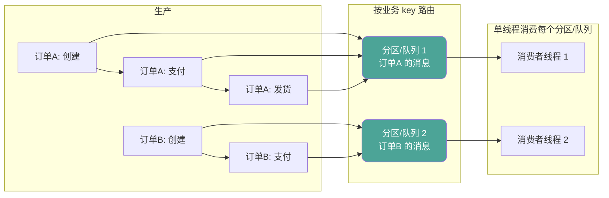

# 顺序消息怎么保证？分区顺序和全局顺序差在哪？

> “保证消息顺序”这句话本身就不完整。要先问顺序是全局的，还是某个业务维度内的。

顺序消息这题很容易被答成“把 Topic 只设一个分区就行了”，然后就没有下文了。

面试官真正想听的，往往是另外三件事：

- 你知不知道全局顺序要付出多大代价，值不值得。
- 你有没有做过“局部顺序”的设计，也就是按业务维度分组保证顺序。
- 出问题（失败重试、消息重发）的时候，顺序会不会被打乱，你打算怎么兜。

先说结论：

**能不做全局顺序，就不要做全局顺序。绝大多数业务需要的是“同一个业务对象内部有序”，而不是“系统里所有消息全局有序”。**

## 从一个业务场景说起：订单状态变更

拿订单系统举例，一笔订单在履约过程中会依次产生这些事件：

```text
创建订单 -> 支付成功 -> 开始发货 -> 确认收货
```

如果这几条消息的消费顺序被打乱，比如“确认收货”先于“支付成功”被处理，轻则状态机报错，重则触发一堆不该触发的下游动作（比如收货了但订单显示未支付，对账直接对不上）。

但反过来想：订单 A 和订单 B 之间的消息顺序重要吗？

**不重要。** 订单 A 的状态推进和订单 B 的状态推进,谁先谁后完全不影响业务正确性。

这就是顺序消息设计里最核心的一个判断：

**顺序要求几乎永远是“同一个业务对象内部有序”，不是“不同业务对象之间也要排队”。**

如果把这个判断搞反了，会出现两种典型误区：

| 误区                        | 后果                                           |
| --------------------------- | ---------------------------------------------- |
| 以为顺序消息就该全局有序    | 系统被迫退化成单队列/单线程，吞吐直接打骨折    |
| 以为顺序不重要,随便乱序也行 | 状态机被跳步触发，业务数据出现无法解释的中间态 |

## 全局顺序代价有多高

想要全局顺序，本质要求是：**同一时刻只能有一条消息在被处理。**

这意味着：

- 生产者只能单线程、串行发送，不能并发发送，发送吞吐直接被砍到底。
- Broker 层面只能用一个队列 / 一个分区存所有消息，没法把消息分散到多台机器。
- 消费端只能单线程消费，不能起多个消费者并行处理，消费吞吐同样被砍到底。
- 这一个队列/分区所在的节点一旦故障，整条链路直接不可用，没有并行的备份路径能接住流量。

用一张表看代价：

| 维度         | 全局顺序                          | 局部（分区/消息组）顺序              |
| ------------ | --------------------------------- | ------------------------------------ |
| 并发发送     | 不允许                            | 允许（不同分组间并行）               |
| 存储扩展     | 单队列/单分区，无法水平扩展       | 可以按分组打散到多个分区             |
| 消费并行度   | 单线程消费                        | 每个分组内部单线程，分组间并行       |
| 故障影响面   | 整条链路                          | 通常只影响同一分组的消息             |
| 典型适用场景 | binlog 同步这类必须严格全序的场景 | 订单、支付、账户这类“对象内有序”场景 |

所以严格全局顺序基本只出现在类似数据库 binlog 同步这种“连一个字节都不能错位”的场景。绝大多数业务系统，包括电商订单、账户流水、物流状态，要的都是局部顺序。

## 局部顺序才是主流：把“谁跟谁比顺序”想清楚

局部顺序的核心思路是：**先按业务维度分组，组内严格有序，组间互不影响。**

分组的 key 通常就是这条消息所属的业务实体，比如：

- 订单场景：用订单号做分组 key。
- 账户余额变更：用账户 ID 做分组 key。
- 用户行为流：用用户 ID 做分组 key。

只要同一个 key 的消息始终落在同一个“顺序单元”里，并且这个单元内部是单线程处理，顺序就有了保证。不同 key 之间完全可以并行，谁也不用等谁。

Kafka 和 RocketMQ 的做法本质上是同一个思路，只是叫法和实现细节不一样。

### Kafka：同 key 进同分区 + 单线程消费该分区

Kafka 保证顺序靠两个条件叠加：

1. **生产者侧**：发送消息时指定 key（比如订单号），Kafka 会保证同一个 key 的消息始终发到同一个分区。分区内部是尾加法写入，天然有序。
2. **消费者侧**：一个分区在同一个消费组里，同一时刻只能被一个消费者线程消费。也就是说，只要不在应用层自己搞并发处理同一个分区拉到的消息，分区内的消费顺序和写入顺序就是一致的。

需要注意的是，Kafka 只保证**分区内有序**，不保证跨分区有序。如果两条消息 key 不同，被分到了不同分区，它们之间完全没有顺序关系，也不需要有。

### RocketMQ：MessageGroup + 生产串行 + 顺序投递消费

RocketMQ 5.x 用的是 MessageGroup（消息组）的概念，思路和 Kafka 的 key 分区几乎一样，但拆得更细：

1. **生产顺序性**：要求同一个生产者串行发送（多线程并发发送时，不同线程产生的消息本身就没法判断先后），同一个消息组的消息会被保证按发送顺序存到同一个队列里。
2. **消费顺序性**：消费者（PushConsumer）按队列存储顺序一条一条投递，同一时刻同一个队列只有一条消息在被处理，处理完才会投递下一条。

也就是说 RocketMQ 把“顺序”拆成生产、存储、消费三段都要对齐，任何一段掉链子（比如生产端并发发送、消费端并发拉取处理）顺序保证就会失效。

两者的共同点非常清楚：



订单 A 的三条消息全部落在分区/队列 1，被同一个线程按序消费；订单 B 的消息落在分区/队列 2，两条队列互不阻塞，可以并行跑。这就是局部顺序的全部精髓：**该串行的地方串行，能并行的地方尽量并行。**

## 失败重试是怎么把顺序打乱的

顺序消息最容易在“正常路径”上看起来没问题，一到失败重试就露馅。

典型场景：订单 A 的消息按顺序是 `创建 -> 支付 -> 发货`，如果“支付”这条消息处理失败：

- 如果消费框架允许**跳过失败消息继续消费后面的**，那“发货”会先于“支付”被处理，顺序直接乱了。这在无序消费里是常规操作（重试几次跳过继续往后消费），但在顺序消费里是致命的。
- 所以顺序消费的正确做法是：**这一条消息没处理成功，同一分组后续消息必须等着，不能往前走。**

这就带来一个矛盾：

| 做法                                       | 顺序保证     | 代价                                 |
| ------------------------------------------ | ------------ | ------------------------------------ |
| 失败后阻塞同分组后续消息，直到这条重试成功 | 顺序不被破坏 | 一条“毒消息”能堵死整条分组的消费进度 |
| 失败重试超限后跳过，继续消费后面的消息     | 顺序被打破   | 需要业务层自己兜住乱序后果           |

RocketMQ 对这个问题的处理方式是折中的：**顺序消息重试是有限次数的，超过最大重试次数后不再重试，跳过这条消息继续消费。** 也就是官方默认承认“完全不跳过”在工程上不现实——不能让一条脏消息把整个分组永久堵死，但也提醒你：跳过的这条消息，顺序保证已经在这里断了一次，后面靠业务自己兜。

所以顺序消息的失败处理，本质是在两个坏结果里选一个:

- 要么接受**分组消费卡死**的风险（毒消息不跳过）。
- 要么接受**局部乱序**的风险（重试超限后跳过）。

工程上更常见的选择是后者，同时给这条跳过的消息打上强告警，走人工或补偿链路兜底，而不是假装它没发生过。

## 业务上怎么降低对顺序的依赖

比起死磕“消息层面 100% 有序”，更实际的做法是让业务逻辑本身对乱序有一定容忍度。常见的两个手段：

### 1. 状态机：只允许合法方向推进

回到订单例子，状态机大致是这样：

```text
待支付 -> 已支付 -> 发货中 -> 已完成
```

如果“发货中”这条消息因为网络重试，比“已支付”晚到甚至先到，只要消费逻辑做的是**条件更新**而不是无脑覆盖状态，乱序造成的影响就能被兜住：

```sql
update t_order
set status = '发货中'
where order_no = ? and status = '已支付';
```

- 如果这条更新命中了 0 行，说明当前状态不是“已支付”，可能是顺序错乱、消息重复，或者是这条消息本来就该被拒绝。这时候不能硬推进，而是要查当前状态再决定：忽略、重试还是报警。
- 命中 1 行，说明这次真正往前推进了一步，才继续走后续动作。

状态机的价值在于：**就算个别消息的处理顺序被打乱，只要状态迁移的合法性检查在，就不会真的把订单状态推错。**

### 2. 版本号：识别“这是不是最新的状态”

对于需要覆盖式更新（而不是状态机迁移）的场景，比如账户信息、商品详情这类“更新即覆盖”的数据，可以给每条变更消息带上版本号或时间戳：

```sql
update t_account_profile
set info = ?, version = ?
where account_id = ? and version < ?;
```

即使“旧消息”因为重试晚到，只要版本号比当前记录的版本旧，这次更新就会被拒绝，不会用旧数据覆盖新数据。

这两个手段共同的思路是：**消息层面的顺序只是“尽量保证”，业务层面要有能力识别和拒绝“过时的顺序”，而不是完全依赖消息中间件不出错。**

## 和幂等的关系：顺序乱了 + 至少一次 = 更容易错账

这里要把顺序消息和 [消息幂等](/high-performance/high-performance-message-idempotency.html)、[消息可靠性](/high-performance/high-performance-message-reliability.html) 两篇串起来看，因为它们经常同时踩坑。

前面讲过，为了不丢消息，工程上普遍选择“至少一次投递”，这天然带来重复消费的风险。而顺序消息一旦叠加重试跳过、消费者重启、重平衡这些情况，就会同时出现：

- **消息重复**：同一条消息可能被投递不止一次。
- **顺序错乱**：重试跳过、并发消费等场景下，处理顺序不再等于发送顺序。

这两个问题叠加在一起，比单独出现任何一个都危险。举个例子：

```text
1. “扣款 100 元”先到，处理成功
2. “扣款 100 元”因为 ack 丢失，被重新投递
3. 与此同时“退款 100 元”因为顺序错乱，比重复的“扣款”先被处理
```

如果消费端只做了简单的幂等（比如只按消息 ID 去重），完全防不住这种顺序 + 重复交织出来的错账，因为这条重复消息的 ID 变了，业务语义却没变，而且它出现的时间点也不对。

所以顺序消息场景下的幂等设计，通常要比普通场景更严格一点：

| 只考虑幂等                     | 顺序 + 幂等一起考虑                                  |
| ------------------------------ | ---------------------------------------------------- |
| 按消息 ID 或业务唯一键去重即可 | 还要判断“这条消息相对当前状态是不是合法的下一步”     |
| 重复消息直接确认成功即可跳过   | 重复消息还要确认它不会绕过状态机被提前/延后应用      |
| 幂等键通常只关心“处理没处理过” | 幂等键 + 状态机/版本号一起校验“这次处理是否仍然合法” |

一句话总结这块：**顺序消息的幂等，不能只回答“这条消息是不是第一次来”，还要回答“这条消息现在处理是不是还合法”。**

## 容易踩的坑

### 把“1 个 Topic 只用 1 个分区”当成万能解法

这确实能保证顺序，但代价是把整个 Topic 的吞吐压缩到单分区、单线程的水平，通常只适用于流量很小或者必须严格全序的场景，不适合当默认方案。

### 只关注生产顺序,忽略消费端并发

即使生产端严格保证同一个 key 进同一个分区/队列，如果消费端在应用层自己把拉到的一批消息丢进线程池并发处理，顺序照样会被打乱。顺序是端到端的，生产、存储、消费三段都要对齐。

### 顺序消费卡死却没人发现

一条毒消息如果被配置成“无限重试直到成功”，会让同一分组/分区的所有后续消息永久堵住。这类问题往往是消费积压排查时才发现，最好提前给顺序消费的重试设置上限和告警。

### 以为“顺序保证了”业务就一定不会乱

消息层面顺序正确，不代表业务状态一定正确。生产者重发、Broker 短暂主从切换、消费者重启，都可能带来短暂的顺序抖动。业务层的状态机、版本号这类兜底手段依然需要。

## 一条更稳的回答方式

如果被问“顺序消息怎么保证”，可以按这个顺序回答：

1. 先反问或明确：需要的是全局顺序还是局部顺序,绝大多数业务场景要的是局部顺序。
2. 局部顺序的核心思路是按业务 key 分组：Kafka 用同 key 进同分区 + 单线程消费分区；RocketMQ 用 MessageGroup，要求生产串行 + 消费按存储顺序投递。
3. 说明失败重试对顺序的影响：顺序消费失败要么阻塞同组后续消息，要么重试超限后跳过并接受局部乱序，这是权衡不是完美解。
4. 补一句业务兜底：状态机的条件更新、版本号校验，能在消息顺序出现抖动时依然保证业务状态正确。
5. 提一句和幂等的关系：顺序错乱叠加至少一次投递，比单独的重复消费更容易出业务错误，幂等设计要连着顺序一起考虑。

## 小结

- 全局顺序要求全链路单线程,代价极高，只适合 binlog 同步这类必须严格全序的场景。
- 局部顺序（分区/消息组内有序）才是主流做法，靠业务 key 分组把“该串行的串行、能并行的并行”。
- Kafka 靠同 key 进同分区 + 单线程消费分区；RocketMQ 靠 MessageGroup + 生产串行 + 顺序投递消费。
- 失败重试是顺序最容易被打破的地方：阻塞会堵死分组，跳过会破坏顺序，二选一之后要靠业务兜底。
- 状态机的条件更新和版本号校验，能让业务在消息顺序抖动时仍然保持正确。
- 顺序错乱叠加至少一次投递，比单纯重复消费更容易导致错账，幂等设计要和顺序一起考虑，不能割裂来看。

## 参考

综合自仓库内高性能消息队列参考材料，并结合 Apache Kafka、Apache RocketMQ 公开文档中关于分区顺序、消息组、顺序消费重试策略的说明整理。
