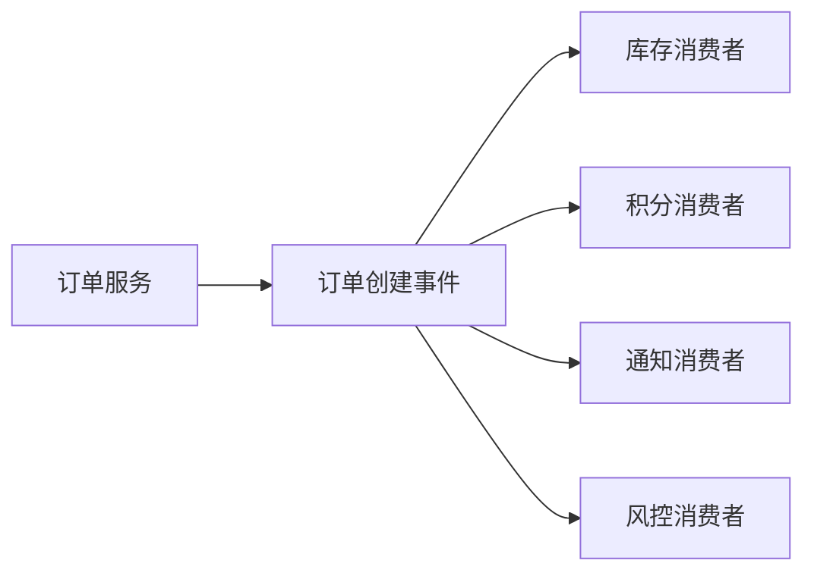

# 消息队列解决了什么问题？又引入了什么问题？

> MQ 从来不是“上了就更高级”，它本质上是在用异步和缓冲换吞吐、解耦与弹性，同时把一致性和运维复杂度一起带进来。

很多高性能题最后都会落到一句：

> “这里可以上消息队列。”

但如果只说到这里，基本还停留在工具名词层面。
更完整的判断至少要回答四件事：

1. 这段链路为什么适合异步。
2. 上 MQ 能解决什么具体问题。
3. 上 MQ 会把哪些新问题带进来。
4. 这些新问题准备怎么治理。

只有收益和代价都讲清楚，才像真实工程判断。

## 先判断：这件事到底能不能异步

MQ 的前提不是“流量大”，而是业务能接受某些动作延后完成。

比如用户下单，一般可以拆成两类动作：

| 动作                         | 更适合的协作方式 | 原因                             |
| ---------------------------- | ---------------- | -------------------------------- |
| 校验库存、创建订单、扣减余额 | 同步 RPC / 事务  | 用户必须立刻知道核心结果         |
| 发短信、加积分、写画像、通知 | MQ 异步事件      | 可以晚一点完成，失败后可重试补偿 |
| 风控复核、对账、报表刷新     | MQ / 任务队列    | 不阻塞主链路，但要保留处理轨迹   |

所以设计时先问一句：

**用户现在看到的成功，到底代表“核心业务已经成功”，还是“请求已经被系统接收，后续会继续处理”？**

如果连这个语义都没讲清楚，后面说异步、削峰、解耦都容易变成口号。

## MQ 真正解决的四类问题

### 1. 异步化：缩短主链路响应时间

最典型的场景是：

- 用户下单
- 主链路只做核心校验和落单
- 发短信、加积分、写操作日志、刷新推荐画像放到异步消费者

这样主链路不用等待所有后置动作执行完，用户响应时间会更短。

但要注意一个边界：

**异步化不是“所有业务都完成了”，而是“主链路先完成，后置动作稍后继续处理”。**

这句话在订单、支付、履约类系统里特别重要。
如果用户界面显示“下单成功”，但库存、优惠券、积分、通知还在异步处理中，就要在业务状态上表达清楚：

- 哪些状态已经确定。
- 哪些状态还在处理中。
- 哪些失败可以补偿。
- 哪些失败必须告警或人工介入。

所以能不能异步，先看业务是否接受最终一致。

### 2. 削峰填谷：把瞬时冲击变成可消化的队列

秒杀、大促、抢券这类场景，最怕的不是日常平均流量，而是瞬时峰值。

MQ 的价值就在于：

- 前面先把请求写进队列
- 后面消费者按自己承受能力慢慢吃
- 下游数据库、库存服务、履约服务不用瞬间承接全部流量

这能避免数据库、库存服务、订单服务被瞬间冲垮。

所以在高性能语境里，MQ 很多时候更像：

**一个带缓冲区的流量整形器。**

但削峰不是无限缓冲。

如果生产速度长期大于消费速度，队列只是在延迟故障爆发。
前 10 分钟看起来系统没挂，后面可能变成：

- 积压越来越大。
- 消费延迟越来越长。
- 业务状态长时间停在处理中。
- 重试消息和新消息互相挤占消费能力。

所以削峰必须配合容量上限、积压告警、限流降级和补偿策略。

### 3. 解耦：让调用方不用同步等所有下游

如果订单创建后要通知：

- 库存
- 营销
- 积分
- 物流
- 通知中心

同步 RPC 一路串下去，链路会很长，而且每多一个下游，主链路就更脆弱。

换成 MQ 之后，订单服务只负责发事件，谁关心谁订阅。

这让系统从“同步串行调用”变成“事件驱动协作”。

可以用一个简单流程看清这种变化：

这类解耦的价值是扩展性。
后面新增一个“会员成长值消费者”，订单服务理论上不需要再加一个同步调用。

但解耦不是不要契约。
事件一旦发出去，就等于对下游发布了一份长期接口契约，至少要约定：

- 事件名和业务语义。
- 消息字段、版本和兼容规则。
- 同一业务事件的唯一标识。
- 下游消费失败时谁负责补偿。
- 是否允许重复、乱序和延迟。

如果没有这些约定，MQ 只会把“调用耦合”换成“事件语义耦合”，问题照样会回来。

### 4. 失败恢复：给重试、死信和补偿留轨迹

同步 RPC 一旦失败，调用方通常只能：

- 重试
- 返回失败

但 MQ 天然更适合沉淀恢复链路：

- 可重试
- 可入死信
- 可补偿
- 可人工回放

所以它在一些“可以稍后处理，但不能直接丢”的业务里特别有价值。

比如优惠券发放链路：

1. 用户完成某个活动任务。
2. 活动服务发送“发券事件”。
3. 发券消费者调用券系统。
4. 券系统临时超时。

如果是纯同步链路，活动服务很可能只能返回失败或反复重试。
如果用 MQ，失败消息可以进入重试队列或死信队列，后续通过补偿任务继续处理。

这里 MQ 的价值不只是“异步”，更是给失败处理留下了可追踪的中间状态。

## MQ 的代价：它会把哪些新问题带进来

### 1. 一致性不再天然同步

同步调用时，一个事务里成败更直观。

换成 MQ 之后，常见问题会变成：

- 本地事务成功了，消息没发出去怎么办
- 消费者失败了，业务是不是半成功
- 链路里多个下游成功了一半怎么办

这也是为什么上 MQ 之后，很多团队会顺手引入：

- 本地消息表
- 事务消息
- 对账补偿
- 状态机

这里最容易误解的一句话是：

**发送成功不等于业务完成。**

消息进了 Broker，只代表消息系统收到了这件事。
后面消费者有没有执行成功、执行了几次、执行到哪一步，都还要靠消费侧确认、业务状态和补偿链路兜住。

这也是下一篇
[`MQ 如何保证消息不丢？`](/high-performance/high-performance-message-reliability.html)
要单独拆生产者、Broker、消费者三段讲的原因。

### 2. 重复消费和幂等问题一定会来

大多数 MQ 在工程语义上都更接近“至少一次投递”。

这意味着：

- 同一条消息可能被消费不止一次
- 消费端必须自己兜幂等

所以 MQ 不是帮你消灭重复，而是要求你正面设计重复。

重复的来源可能是：

- 生产者发送超时后重试。
- Broker 已经投递，但消费者 ack 丢了。
- 消费者处理超时，被认为失败后重新投递。
- 消费组重平衡后，部分消息重新被拉取。
- 人工补偿脚本重新投递同一笔业务事件。

所以消费端必须有业务唯一键、唯一索引、消费记录或状态机。
这一点会在
[`MQ 如何处理重复消费和幂等？`](/high-performance/high-performance-message-idempotency.html)
里继续展开。

### 3. 顺序不一定天然成立

很多人以为队列天然有序，但真实问题更细：

- 单分区内部能否保证顺序
- 多分区之间怎么保证
- 一个消费者失败重试时会不会打乱顺序

所以“要不要保证顺序、顺序粒度多大”是上 MQ 前就该问清的问题。

更准确的说法是：

**很多 MQ 只能在特定粒度内保证顺序，不能天然保证全局顺序。**

比如同一个订单的创建、支付、发货事件可以按订单 ID 落到同一分区或同一消息组里；
但不同订单之间没有必要强行全局有序，否则吞吐会被压得很低。

顺序越严格，通常并行度越低。
所以顺序设计不是“要不要有序”这么简单，而是要回答：

- 按用户有序，还是按订单有序？
- 是否允许不同业务 key 并行？
- 前一条消息失败时，后面的消息是等待、跳过，还是进入异常处理？
- 乱序到达时，业务状态机能不能挡住旧消息覆盖新状态？

### 4. 消息积压和运维复杂度会上来

同步调用慢，通常一眼能看到接口慢。

MQ 链路慢时，更常见的是：

- 生产正常
- 消费跟不上
- backlog 一路涨
- 上游以为自己已经成功发出

也就是说，问题从“同步超时”变成了“异步堆积”。

而且你还得多管这些东西：

- Broker 存活
- Topic / Queue / Partition 规划
- 消费组状态
- 死信队列
- 重试策略
- 告警和回放

积压治理不能只说“加消费者”。

如果分区数或队列数太少，消费者再多也吃不起来；
如果真正瓶颈在消费者里的慢 SQL 或下游 RPC，盲目扩容还可能把数据库或下游服务打穿。

所以积压问题要按生产速率、消费速率、分区并行度和下游瓶颈一起看。
这部分会在
[`MQ 消息积压怎么排查？`](/high-performance/high-performance-message-backlog.html)
里单独拆。

### 5. 可用性和成本会多一层

引入 MQ 之后，系统依赖不再只有应用、数据库、缓存、下游服务，还多了 Broker 集群。

这会带来几个现实问题：

- Broker 挂了，生产者和消费者怎么降级？
- Topic、Queue、Partition 怎么规划？
- 是否需要多副本、同步刷盘、仲裁队列或高可用队列？
- 消息保留时间多长，磁盘打满怎么办？
- 谁负责处理死信、重放、堆积和消费失败？
- 消费者发布时如何避免长时间暂停或重复消费激增？

所以 MQ 是中间件，不是免费的管道。
越核心的链路，越要把它纳入容量评估、故障演练和监控告警。

## MQ 和 RPC 的边界怎么讲

高频追问通常是：

**RPC 和 MQ 到底怎么选？**

可以用一句话先立住：

- RPC 解决“我现在就要调你，并且马上拿结果”。
- MQ 解决“这件事可以拆开异步做，或者广播给多个下游做”。

更具体一点：

| 维度     | RPC 更适合                       | MQ 更适合                              |
| -------- | -------------------------------- | -------------------------------------- |
| 结果要求 | 立即返回结果                     | 可以延后完成                           |
| 调用关系 | 点对点请求                       | 一对多事件通知                         |
| 一致性   | 更偏同步一致                     | 更偏最终一致                           |
| 失败处理 | 超时、重试、熔断                 | 重试、死信、补偿、回放                 |
| 典型场景 | 鉴权、查余额、同步扣款、实时校验 | 发通知、加积分、刷新画像、活动后置处理 |
| 主要风险 | 链路变长、下游超时拖慢主流程     | 丢失、重复、乱序、积压、可观测成本上升 |

如果业务必须立刻知道结果，比如：

- 实时鉴权
- 强一致扣款
- 同步校验配额

那 RPC 往往更直接。

MQ 更适合的是：

- 可以稍后完成
- 能接受最终一致
- 高峰期下游扛不住同步压力
- 需要事件广播给多个下游

所以 RPC 和 MQ 不是互斥关系。
真实系统里经常是：

- 主链路用 RPC 做核心决策。
- 决策成功后发 MQ 事件驱动后置动作。
- MQ 消费失败后再通过补偿任务或人工入口兜底。

## 上 MQ 前先过一遍判断清单

如果你在设计里犹豫要不要上 MQ，可以先问：

1. 这件事必须同步完成吗？
2. 下游结果必须立刻返回给用户吗？
3. 高峰流量是否明显超过下游处理能力？
4. 失败后是否需要重试、补偿、回放？
5. 同一业务事件有没有稳定的唯一标识？
6. 业务是否接受最终一致和处理延迟？
7. 是否需要严格顺序？顺序粒度是什么？
8. 团队能不能管住 MQ 的监控、积压、死信和补偿？

如果前两题都偏“必须立刻”，那大概率不是 MQ 优先。

如果后面几题答不上来，即使场景适合 MQ，也说明治理设计还没准备好。

## 真落地时要补哪些治理能力

上 MQ 之后，至少要把下面几类能力补齐。

### 1. 可靠投递

核心链路不能只写一行 `send()` 就结束。
需要明确：

- 生产者有没有发送确认。
- 本地事务和消息发送如何保持最终一致。
- Broker 是否持久化和多副本。
- 消费者是业务成功后再 ack，还是提前提交 offset。

### 2. 消费幂等

消费端要默认消息可能重复。
常见抓手包括：

- 业务唯一键。
- 数据库唯一约束。
- 消费记录表。
- 状态机条件更新。
- 对账补偿任务。

### 3. 积压与延迟观测

MQ 链路不能只看接口 RT。
至少要看：

- 生产速率。
- 消费速率。
- 消息积压量。
- 消费延迟。
- 重试量和死信量。
- 消费者处理耗时。

这些指标最好和订单号、支付单号、活动 ID 这类业务维度能关联起来。
否则线上只知道“积压了”，不知道积压的是哪类业务消息。

### 4. 死信和补偿流程

死信队列不是垃圾桶。

进入死信的消息要能回答：

- 为什么失败。
- 是否还能自动重试。
- 是否需要人工处理。
- 修复后能否安全重放。
- 重放时是否会重复执行业务。

没有这些流程，死信只是把问题从在线链路挪到了没人看的角落。

### 5. 契约和版本治理

事件也要像接口一样维护契约。

尤其是多消费者场景，生产者不能随便删字段、改字段含义或改枚举语义。
更稳的做法是：

- 新增字段保持兼容。
- 事件语义变化时加版本。
- 下游按版本兼容消费。
- 重要事件保留 schema、样例和变更记录。

## 容易踩的坑

### 只讲好处，不讲代价

面试里如果只说异步、削峰、解耦，不说一致性和幂等，通常会被继续追问。

### 为了“解耦”无脑上 MQ

如果本来只是一个简单同步依赖，上 MQ 之后可能把问题从“一个调用”变成“一条异步链路”。

### 把削峰当成无限缓冲

MQ 可以吸收短时峰值，但不能解决长期容量不足。
只要生产速度长期大于消费速度，积压迟早会变成业务延迟或故障。

### 把“发送成功”当成“业务完成”

很多场景里，消息只是进了队列，不代表消费者已经真正处理完成。

### 忽略事件契约

发布事件不是随便丢一个 JSON。
字段、语义、版本、唯一键、幂等要求都要约定，否则后续下游会互相影响。

## 面试里可以这样收束

如果被问“消息队列解决了什么问题，又引入了什么问题”，可以按这条线说：

1. MQ 主要解决异步化、削峰、解耦和失败恢复。
2. 它适合可以延后完成、能接受最终一致、需要广播或需要缓冲恢复的场景。
3. 它不适合必须立刻返回强一致结果的核心同步判断。
4. 引入后必须补可靠投递、幂等、顺序、积压、死信、补偿和监控。
5. 所以 MQ 不是性能银弹，而是在吞吐、响应时间、耦合度和一致性复杂度之间做交换。

## 小结

- MQ 的核心收益是异步化、削峰、解耦和失败恢复，本质是用缓冲和事件驱动换吞吐、弹性与扩展性。
- MQ 不是性能银弹，它会引入最终一致、重复消费、顺序、积压、死信、补偿和运维成本。
- 判断是否上 MQ，先看业务是否允许延后完成，以及用户看到的成功语义到底是什么。
- RPC 更适合立即拿结果，MQ 更适合异步事件和一对多通知，真实系统通常两者配合使用。
- 成熟的 MQ 设计必须同时回答可靠投递、消费幂等、积压观测、死信补偿和事件契约治理。

## 参考

综合自仓库内高性能与消息队列参考材料，并结合 Apache Kafka、Apache RocketMQ、RabbitMQ 公开文档中关于消息模型、可靠性、顺序、积压和选型边界的说明整理。
