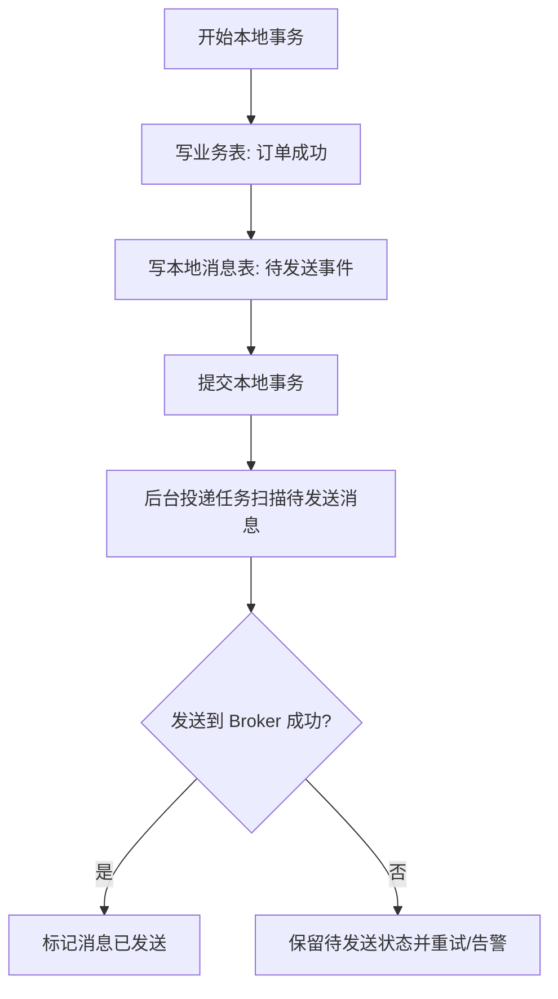

# MQ 如何保证消息不丢？

> “开启持久化”不是消息可靠性的完整答案。消息可能在生产者、Broker、消费者三段里分别丢。

“MQ 如何保证消息不丢”是高频经典题，但最容易答成一句：

> 持久化、ack、重试。

这些词都对，但还不够。
因为线上真正关心的不是“Broker 里有没有一条消息”，而是：

**这笔业务事件最终有没有被正确处理。**

比如订单已经创建成功，但“订单创建事件”没有被库存、积分、通知系统处理。
从业务视角看，这就是“消息丢了”。

所以这题要先把链路拆开：

```text
业务事务 -> 生产者发送 -> Broker 存储 -> 消费者处理 -> 业务对账补偿
```

任何一段漏掉，答案都不完整。

## 第一段：生产者到 Broker，消息怎么不丢

这个阶段最常见的问题是：

- 业务本地事务已经成功
- 但消息还没真正发到 MQ

比如订单已经写库成功，但“订单创建事件”没发出去，后面库存、积分、通知都没收到。

### 先分清两个动作

生产者这里其实有两个动作：

| 动作     | 说明                       | 典型风险                          |
| -------- | -------------------------- | --------------------------------- |
| 业务落库 | 订单、支付、库存等本地事务 | 业务成功后消息还没发出去          |
| 消息发送 | 把业务事件交给 Broker      | 发送超时、路由失败、Broker 不可用 |

只关注 `send()` 成功与否是不够的。
真正难的是：**本地事务和消息发送如何保持最终一致。**

### 1. 发送确认：不能只相信 send 调用返回

生产者不能只“调用了 send”，要知道 Broker 到底有没有收下。

不同 MQ 的叫法不同，核心都是让生产者拿到明确结果：

- 发送成功：Broker 已经按当前配置接收了消息。
- 发送失败：生产者要记录失败、有限重试或进入补偿。
- 发送超时：不能简单当成功，也不能无限重试，要能查最终状态。

几个常见例子：

| 中间件   | 生产者确认重点                                          |
| -------- | ------------------------------------------------------- |
| Kafka    | `acks`、ISR、副本确认、发送回调、生产者重试和幂等生产者 |
| RocketMQ | 发送结果、同步 / 异步发送回调、事务消息的半消息和回查   |
| RabbitMQ | Publisher Confirm、Mandatory Return、路由失败处理       |

这张表不是让你背参数，而是提醒面试时要把“生产者知道消息有没有进 Broker”讲出来。

### 2. 失败重试：要有限、可观测、可去重

如果是临时网络抖动或 Broker 短暂不可达，生产者可以做重试。

但重试有三个边界：

1. **不能无限重试**：否则 Broker 抖动时，生产者会把故障放大。
2. **要有退避间隔**：短时间连续重试可能只是在同一个故障窗口里空转。
3. **要配合幂等键**：发送超时后重试，Broker 可能已经收到了第一条消息，业务事件会重复。

所以更稳的做法是：

- 核心消息带业务唯一键，比如订单号、支付流水号、业务事件 ID。
- 发送失败和发送超时必须落日志或落表。
- 重试超过阈值后进入补偿任务或人工告警。

**重试解决的是“尽量送到”，不是“送到后业务就一定完成”。**

### 3. 本地消息表 / Outbox：兜住业务成功但消息没发出去

普通发送最怕这个窗口：

```text
1. 订单写库成功
2. 进程还没来得及发送 MQ
3. 机器宕机
```

结果是订单存在，但订单事件没发出去。

本地消息表，也常叫 Outbox，解决的就是这个窗口。



它的关键点是：

- 业务数据和待发送消息在同一个本地事务里提交。
- 投递任务可以反复扫描未发送消息。
- 发送成功后再标记已发送。
- 发送失败不会丢记录，后续还能继续补。

这样即使进程在发送前宕机，消息表里也还留着“该发但没发”的证据。

### 4. 事务消息：解决的是生产端一致，不是端到端一致

有些 MQ 提供事务消息能力。
典型思路是：

1. 先发一条对消费者不可见的半消息。
2. Broker 确认半消息后，生产者执行本地事务。
3. 本地事务成功就提交消息，失败就回滚消息。
4. 如果生产者没返回明确结果，Broker 通过回查确认本地事务状态。

这类能力想解决的是：

**本地业务事务和消息发送之间的一致性。**

但它不是银弹，因为：

- 回查逻辑必须能查到可靠的本地事务状态，不能只放内存。
- 半消息长时间未决会带来额外压力。
- 它通常不保证消费者业务一定成功。
- 下游消费仍然需要重试、幂等和补偿。

所以事务消息可以降低生产端不一致，但不能替代消费端可靠性设计。

## 第二段：Broker 收到之后，怎么避免存储阶段丢失

消息到 Broker 了，也不代表万事大吉。

还要继续问：

- 是只进内存，还是已经落盘？
- 是单副本，还是多副本？
- 返回成功时，到底有几个副本确认？
- Broker 切换时有没有数据窗口？
- 消息会不会因为 TTL、保留策略或磁盘打满被清理？

### 1. 持久化：不是开关，而是刷盘时机

Broker 至少要把消息写到可靠存储，而不是只放在内存里。

但“持久化”还要继续追问刷盘策略：

| 策略     | 大致含义                       | 取舍                         |
| -------- | ------------------------------ | ---------------------------- |
| 同步刷盘 | 写入后等待刷盘成功再返回       | 更可靠，但写入延迟更高       |
| 异步刷盘 | 先返回成功，后台线程再批量刷盘 | 吞吐更好，但宕机时有丢失窗口 |

所以如果业务是支付、交易、履约主链路，通常要更关注同步刷盘或更强的确认策略。
如果是日志、埋点、非核心通知，可能更愿意接受异步刷盘换吞吐。

这里没有“永远正确”的配置，只有和业务风险匹配的取舍。

### 2. 多副本：看确认条件，不只看副本数

单副本 Broker 宕了，磁盘坏了，消息还是可能丢。

多副本能降低这个风险，但要看两个问题：

1. 写入成功时，是否等待多个副本确认？
2. 故障切换时，是否允许落后的副本当新主？

以 Kafka 为例，可靠性通常要同时看：

- Topic 副本数。
- `acks` 的取值。
- 最小同步副本数。
- 是否允许不干净选举。

以 RabbitMQ 高可靠队列为例，要看是否使用基于多数派确认的复制队列。
以 RocketMQ 为例，要看刷盘、主从复制、是否支持选举切换等部署模式。

这些实现不一样，但底层问题一样：

**Broker 返回写入成功时，消息到底安全到了什么程度？**

### 3. 高可用不是只防丢，也要防不可用

有些配置会更可靠，但会牺牲可用性和吞吐。

比如：

- 等待更多副本确认，写入延迟会上升。
- 多数派不可用时，为了不丢数据，可能拒绝写入。
- 同步刷盘更稳，但磁盘抖动会直接拉高写入 RT。
- 更严格的顺序或复制策略，可能降低并行度。

这也是为什么消息可靠性不是“所有配置拉满”。
你需要按业务分级：

| 消息类型        | 可靠性倾向                     | 典型例子           |
| --------------- | ------------------------------ | ------------------ |
| 核心资金 / 交易 | 强确认、多副本、补偿和对账     | 支付成功、退款成功 |
| 关键业务事件    | 可靠投递、可重试、死信可恢复   | 订单创建、库存变更 |
| 普通通知        | 可重试，但可接受少量延迟或失败 | 短信、站内信       |
| 日志 / 埋点     | 更看重吞吐，允许采样或部分丢失 | 行为日志、诊断日志 |

不同等级用不同策略，才是工程上更合理的做法。

### 4. 保留策略和 TTL 也会造成“看起来像丢消息”

消息不是永久存在。
如果消息长时间没人消费，可能遇到：

- 消息过期。
- Topic / Queue 保留时间到期。
- 磁盘空间不足触发清理或写入失败。
- 死信队列没人处理，最终堆满或过期。

这类问题不完全是“MQ 不可靠”，更多是容量和治理设计没跟上。

所以核心 Topic 要有：

- 消息保留时间。
- 积压告警阈值。
- 磁盘水位告警。
- 死信处理流程。
- 必要时从业务库重放的能力。

## 第三段：消费者处理时，怎么避免“看似消费了，实际没处理成”

这是消息链路里最容易被漏掉的一段。

因为很多人只盯着 Broker，不盯消费端。

### 1. 最常见的错误顺序：ack 太早

1. 先 ack / 提交 offset
2. 再执行业务
3. 业务失败

这时消息对 MQ 来说已经“消费成功”，但业务实际没成功，这类丢失最隐蔽。

更稳的原则是：

**业务处理成功后，再确认消费成功。**

也就是：

- 先执行业务
- 成功后再 ack / commit

如果处理失败，则按错误类型处理：

| 失败类型                    | 处理方式                       |
| --------------------------- | ------------------------------ |
| 临时网络抖动、下游超时      | 退避重试                       |
| 数据库死锁、锁等待超时      | 有限重试，并观察是否集中爆发   |
| 参数缺失、状态非法          | 进入死信或异常表，避免无限重试 |
| 业务已经处理成功但 ack 失败 | 允许重投，消费端靠幂等识别重复 |

### 2. 业务事务和 ack 之间仍然有窗口

即使你遵守“业务成功后再 ack”，也还有一个窗口：

```text
1. 消费者执行业务成功
2. 本地事务提交成功
3. 还没来得及 ack / commit offset
4. 消费者宕机
```

这时 MQ 会认为消息没消费成功，后续可能再次投递。

所以消费者侧通常无法同时做到：

- 绝对不丢。
- 绝对不重复。
- 不引入额外分布式事务。

工程上更常见的选择是：

**允许重复投递，用业务幂等保证重复后结果仍然正确。**

这就是下一篇
[`MQ 如何处理重复消费和幂等？`](/high-performance/high-performance-message-idempotency.html)
要继续讲的内容。

### 3. 重试要分层，不要让失败消息拖垮新消息

消费失败后不能一股脑无限重试。

更合理的是分层：

1. 短暂异常，内存内快速重试一两次。
2. 仍失败，回队列或进入延迟重试。
3. 达到最大次数，进入死信队列。
4. 死信由补偿任务或人工处理。

这样可以避免一个毒性消息一直阻塞正常消息。

顺序消费场景要更谨慎。
如果前一条消息一直失败，后续同一 key 的消息可能都不能继续处理。
这时要在“严格顺序”和“系统可恢复”之间做取舍。

### 4. 消费端要留下可追踪状态

只靠日志很难排查消息事故。

关键消费链路最好能查到：

- 消息 ID。
- 业务事件 ID。
- 消费组。
- 第几次重试。
- 当前消费状态。
- 失败原因。
- 最后一次处理时间。

如果业务很关键，可以维护消费记录表：

| 状态         | 含义                         | 后续动作             |
| ------------ | ---------------------------- | -------------------- |
| `INIT`       | 消息已接收，尚未处理         | 等待消费者处理       |
| `PROCESSING` | 正在处理                     | 超时后由补偿任务检查 |
| `SUCCESS`    | 业务处理成功                 | 重复消息直接确认成功 |
| `FAILED`     | 处理失败但还可恢复           | 重试或进入补偿       |
| `DEAD`       | 重试超限或业务异常无法自动修 | 人工处理、修复后重放 |

这张表不是每个场景都必须有，但核心链路必须有等价的可追踪能力。

## 真正完整的可靠性思路，是“确认 + 持久化 + 重试 + 补偿”

如果压缩成一句高频面试答案，可以这样说：

1. 生产者侧要有发送确认，必要时用本地消息表或事务消息兜住业务事务和消息发送之间的不一致。
2. Broker 侧要有持久化、多副本和高可用机制，明确刷盘、副本确认和故障切换边界。
3. 消费者侧要在业务成功后再确认消费，失败时走有限重试、死信和补偿。
4. 业务侧还要有幂等、对账、补偿和告警，兜住极端异常。

这四层一起，才更接近“可靠性设计”。

## 业务兜底：别把可靠性全压给 MQ

再强的 MQ 也不能替你理解业务。

核心链路通常还要做业务兜底。

### 1. 对账任务

比如订单系统可以定期检查：

- 已支付订单是否都发出了支付成功事件。
- 已创建订单是否都触发了库存、积分、通知等后置流程。
- 消费记录是否长时间停在处理中。
- 死信消息是否还没有处理。

对账的价值是发现“理论上不该发生，但线上确实发生了”的漏处理。

### 2. 补偿任务

发现漏处理之后，要能补。

常见补偿方式：

- 从本地消息表重新投递。
- 从业务库按状态扫描，重建业务事件。
- 死信修复后重新投递。
- 人工确认后推进业务状态。

补偿必须配合幂等，否则补消息可能变成重复扣款、重复发券、重复发货。

### 3. 告警和可观测

可靠性不是上线文档写一句“有重试”就结束。
至少要有这些指标：

| 维度       | 关键指标                                           |
| ---------- | -------------------------------------------------- |
| 生产者     | 发送成功率、发送失败数、发送超时数、重试次数       |
| Broker     | 写入延迟、刷盘延迟、副本同步状态、磁盘水位、积压量 |
| 消费者     | 消费成功率、消费耗时、ack 失败、重试量、死信量     |
| 业务一致性 | 待发送消息数、处理中消息数、对账差异数、补偿成功率 |

没有这些指标，出了问题只能靠猜。

## 可靠性和性能本来就是交换关系

很多人答这题会有一个误区：

> 只要把所有可靠性配置都拉满，不就最稳了吗？

现实里不是这样。

比如：

- 同步刷盘更稳，但写入更慢
- 等待更多副本确认更稳，但吞吐会下降
- 重试更多次更稳，但链路更长、重复风险更高

所以消息可靠性从来不是孤立目标，而是：

**和吞吐、延迟、成本一起权衡。**

更成熟的做法是按业务分级：

- 核心资金类消息，宁愿慢一点，也要确认、持久化、对账和人工兜底。
- 普通业务事件，要保证可重试、可补偿、可观测。
- 日志埋点类消息，可以更偏吞吐和成本，允许少量丢失或采样。

面试里如果能讲出这个分级，就比单纯背配置更像实际做过。

## 怎么验证“消息不丢”设计

这类设计不能只靠代码评审，最好做故障注入。

可以按这几类场景测：

1. 业务事务提交成功后，发送 MQ 前进程宕机，本地消息表能否补发。
2. 生产者发送超时但 Broker 实际收到，重复发送后消费端是否幂等。
3. Broker 主节点宕机，未同步副本是否会造成数据窗口。
4. 消费者执行业务成功后、ack 前宕机，消息重投是否重复执行业务。
5. 消费者连续失败后，消息是否按预期进入重试和死信。
6. 死信修复后重放，是否能安全推进业务状态。
7. 积压超过阈值时，告警是否能发现，补偿是否能跟上。

这些测试覆盖了“生产者、Broker、消费者、业务兜底”四层，比只测正常收发更有价值。

## 容易踩的坑

### 只说“开启持久化”

如果不讲生产者确认和消费者确认，答案是不完整的。

### 把发送成功当成业务成功

生产者发送成功，只说明 Broker 按当前配置接收了消息。
消费者有没有正确处理，还要看消费确认、业务状态和补偿。

### 本地事务和消息发送没有一致性方案

如果订单写库和发送 MQ 是两个孤立动作，中间宕机就可能漏事件。
核心链路至少要有本地消息表、事务消息或对账补偿。

### 把“消息进 Broker”当成“业务完成”

消息只是进入队列，不代表消费者已经正确执行业务。

### 消费端提前 ack

先 ack 再执行业务，一旦业务失败，MQ 已经认为消息消费成功，这就是隐蔽的业务丢失。

### 没有补偿和对账

再可靠的链路也会有极端异常，没有补偿的话，理论可靠性很难变成业务可靠性。

### 为了不丢而忽略幂等

越强调不丢，越可能采用至少一次投递和重试。
这会自然带来重复消费，所以可靠性和幂等必须一起设计。

## 小结

- 消息不丢要按生产者、本地事务、Broker 存储、消费者处理和业务补偿五层看。
- 生产者侧重点是发送确认、有限重试、本地消息表或事务消息，避免业务成功但消息没发出去。
- Broker 侧重点是持久化、多副本、确认条件、保留策略和故障切换窗口。
- 消费者侧重点是业务成功后再 ack，失败后走重试、死信和补偿，同时用幂等兜住重复投递。
- 真正的可靠性不是只配 MQ 参数，而是确认、持久化、重试、幂等、对账、补偿和告警一起闭环。

## 参考

综合自仓库内高性能与消息队列参考材料，并结合 Apache Kafka、Apache RocketMQ、RabbitMQ 公开文档中关于生产者确认、Broker 持久化、副本复制、消费者确认、死信和补偿机制的说明整理。
