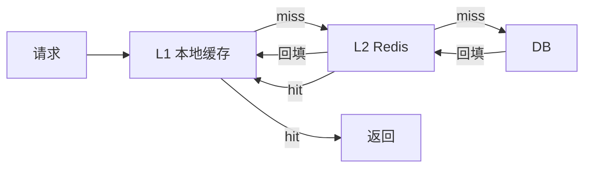

# 多级缓存怎么做？本地缓存和 Redis 怎么配合？

> 多级缓存能降延迟，也会把一致性问题乘上级数。先问值不值得上。

很多团队一听“本地缓存 + Redis”就觉得高级，恨不得所有读路径都叠两层。结果往往是：延迟确实掉了几毫秒，但改配置、改库存、改活动价时，多实例本地缓存各唱各的，线上出现“有的节点看到新值、有的节点还是旧值”。

多级缓存不是默认架构，它是在**单级 Redis 已经不够用**时再加的一层武器。

## 先分清三层各自干什么

常见落地是 L1 本地 + L2 Redis + L3 DB：

| 级  | 位置                    | 延迟量级       | 容量         | 是否共享   | 一致性难度 |
| --- | ----------------------- | -------------- | ------------ | ---------- | ---------- |
| L1  | 进程内 Caffeine / Guava | 微秒级         | 小，受堆限制 | 每实例一份 | 最高       |
| L2  | Redis 集群              | 亚毫秒到毫秒   | 中           | 多实例共享 | 中         |
| L3  | MySQL 等源库            | 毫秒到几十毫秒 | 大           | 源数据     | 源         |

读路径一般是：



写路径才是真正难的地方：你不仅要更新 DB，还要决定删不删 L2、怎么通知所有实例清 L1。相关一致性细节见 [缓存一致性](/database/redis/redis-cache-consistency.html)。

## 为什么不直接只用本地缓存

单体时代本地缓存很香：无网络、实现简单、依赖少。到了多实例：

1. **各实例缓存不共享**。实例 A 刚刷新了配置，实例 B 还拿旧值。
2. **容量被单机堆限制**。业务对象一大，本地缓存很容易和业务堆争内存。
3. **负载均衡策略会放大问题**。轮询下同一用户请求落到不同机器，用户维度本地缓存命中率会很差。

所以现代系统里，本地缓存通常只放：

- 全局几乎不变的数据（字典、灰度开关、类目树）
- 真正的极热点（秒杀商品、首页配置）
- 能接受秒级不一致的读多写少数据

用户余额、可售库存、支付状态这类写后立即读的关键路径，别急着塞 L1。

## 为什么有了 Redis 还要 L1

因为本地命中比 Redis 再快一个数量级，且能把 Redis 的 QPS 和带宽压力砍掉一大截。

典型触发条件：

| 信号                   | 说明                                |
| ---------------------- | ----------------------------------- |
| Redis 单 key 被打穿    | 热 key 把分片 CPU / 带宽打满        |
| 同对象被同一实例反复读 | 接口内部多次拼装都要读同一配置      |
| RT 预算极紧            | 活动页、网关鉴权配置，多 1ms 都嫌多 |
| Redis 抖动时要兜底     | L1 短时顶住，避免全量回源 DB        |

反过来，如果 Redis 命中率已经很高、延迟稳定、没有热 key，再上 L1 往往只是多一层复杂度。

## 什么时候该上 L1，什么时候别上

适合：

- 读多写少，变更间隔远大于 TTL
- 可接受秒级到十几秒的短暂不一致
- 对象不大，拷贝/序列化成本可控
- 已经确认瓶颈在 Redis 热 key 或网络 RTT

不适合：

- 强一致写后读（余额、库存最终以 DB 为准）
- 变更非常频繁，L1 刚写进去就失效
- 大对象、大集合把堆打爆，诱发 Full GC
- 业务还没把 [缓存穿透 / 击穿 / 雪崩](/database/redis/redis-cache-problems.html) 单级问题处理干净

一个实用判断：**先证明单级 Redis 不够，再上 L1。** 不是架构图上多画一层就更“高性能”。

## 一致性怎么处理：最终一致是常态

多级缓存几乎做不到低成本强一致。工程上常见四件套：

### 1. TTL 分层

L1 更短，L2 更长。例如：

| 层级 | TTL 示例   | 目的                 |
| ---- | ---------- | -------------------- |
| L1   | 1~5 秒     | 即使漏删也能快速收敛 |
| L2   | 分钟到小时 | 挡住 DB，承载主命中  |

短 TTL 是最后一道保险丝，不是唯一手段。

### 2. 变更后删缓存，而不是先改缓存

更稳的顺序通常是：

1. 更新 DB
2. 删除 L2（Redis）
3. 广播删除各实例 L1

为什么倾向删而不是直接更新缓存？因为并发写时“更新缓存”更容易把旧值盖回去。细节仍回到 [缓存一致性](/database/redis/redis-cache-consistency.html)。

### 3. L1 失效通知

多实例 L1 没有共享内存，必须靠通知：

| 方案                   | 优点           | 代价                     |
| ---------------------- | -------------- | ------------------------ |
| Redis Pub/Sub          | 实现简单       | 订阅者短时离线可能丢消息 |
| Redis Stream / MQ 广播 | 可落盘、可重试 | 组件更重                 |
| Canal 听 binlog 再广播 | 业务代码侵入小 | 链路更长                 |

没有可靠删除通知时，**只能靠短 TTL 收敛**。面试里把这句话说清楚，比背框架名字更有用。

### 4. singleflight + 空值缓存

L1/L2 同时 miss 时，同一 key 只放一个请求去打 DB，其余等待复用结果，避免击穿。

查询不存在的数据时缓存短空值，避免穿透。这两点在单级 Redis 就该做，多级缓存只是把问题放大了。

## 读穿、回填和写路径的具体例子

假设商品详情 `product:1001`：

```text
读：
1. 查 L1 product:1001
2. miss → 查 Redis
3. miss → 查 DB，回填 Redis，再回填本机 L1
4. 返回

写（改价格）：
1. 更新 DB
2. DEL Redis product:1001
3. 广播 invalidate product:1001
4. 各实例删除本地 L1
5. 下一次读重新回填
```

注意两个坑：

- **回填 L1 时别共享可变对象引用**。调用方改了返回对象，等于直接改坏了缓存。
- **L1 和 L2 的 key 规则必须统一**。一个用 `product:1001`，一个用 `p_1001`，删除永远对不上。

## 热 key 场景：L1 往往比“只加 Redis 分片”更直接

热 key 只存在 L2 时，所有实例都打同一个 Redis 分片。常见组合拳：

1. L1 接住本机重复读
2. 对热 key 做本地 short TTL
3. 必要时 key 打散到多个 Redis 副本 key（会牺牲一点一致性窗口）

热 key / big key 的识别与治理见 [大 key 与热 key](/database/redis/redis-bigkey-hotkey.html)。

## 本地缓存实现选型，别只记名字

| 方案                     | 适合                   | 备注                               |
| ------------------------ | ---------------------- | ---------------------------------- |
| `ConcurrentHashMap` 手搓 | 极简单、几乎不变的数据 | 缺过期和淘汰，生产慎用             |
| Guava Cache              | 老项目存量             | API 成熟，但性能通常不如 Caffeine  |
| Caffeine                 | 新项目默认首选         | W-TinyLFU 淘汰，命中率和吞吐更好   |
| Spring Cache 注解        | 快速接入               | 易用，但穿透/空值/失效广播要自己补 |

选型不是重点，重点是你有没有：

- 最大容量
- 过期策略
- 命中率统计
- 失效广播
- 防止缓存可变对象被外部修改

少任何一项，线上都可能埋雷。

## 容易踩的坑

1. **把多级缓存当银弹**。业务 QPS 不高、Redis 很闲，上 L1 只增加故障面。
2. **L1 缓存可变对象**。返回前要做不可变封装或防御性拷贝。
3. **只删 L2 不通知 L1**。多实例会在 TTL 内长期脏读。
4. **L1 TTL 设太长**。通知一旦丢，脏数据挂很久。
5. **大对象进 L1**。堆被吃满后 GC 停顿，比 Redis RTT 更伤。
6. **写路径和读路径 key 不一致**。删除永远 miss。
7. **在强一致接口上用 L1**。用户改完资料立刻刷新仍看到旧值，体感就是 bug。

## 和 CDN、Redis 单级缓存怎么分工

- 浏览器 / CDN：离用户最近的静态与可缓存页面，见 [CDN](/high-performance/high-performance-cdn.html)
- Redis：服务间共享的业务缓存主战场
- 本地 L1：进程内极热点与稳定配置

它们是不同层级，不是互相替代。把商品 HTML 丢 CDN、把商品详情 JSON 丢 Redis、把类目树丢 L1，比“全部塞进一种缓存”清晰得多。

## 小结

1. 多级缓存用更低延迟换一致性和运维复杂度，不是默认必选项。
2. L1 适合极热点、读多写少、可接受短暂不一致的数据；强一致写后读慎用。
3. 工程基本盘是：TTL 分层、变更删缓存、L1 失效广播、singleflight、空值缓存。
4. 没有可靠删除通知时，只能靠短 TTL 收敛，面试要把这个边界讲明白。
5. 先把单级 Redis 的命中率、热 key、一致性做稳，再评估是否上 L1。

## 参考

综合自仓库内 Redis 缓存一致性、缓存问题与热 key 相关笔记，结合本地缓存与多级缓存的常见工程取舍整理。
