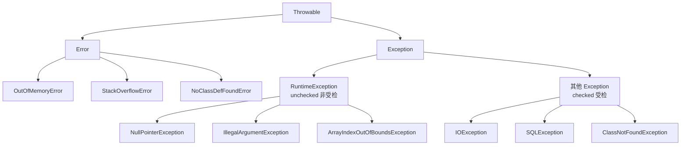

# Java 异常体系是怎么设计的？checked 和 unchecked 怎么选？

> 异常不是"出错了随便抛一下"，它是一套有层次、有分工的类型体系。搞清楚这套继承树，你才知道什么该 catch、什么该往上抛、什么根本不该碰。

## 先看这棵继承树

Java 里所有能被 `throw` 出去、能被 `catch` 接住的东西，都得是 `Throwable` 的子类——这是编译器的硬性规定。`Throwable` 底下分成两条完全不同的路：



记住这张图的两个分叉点，后面所有问题都是从它引出来的：

1. **`Error` vs `Exception`**——这是"程序该不该管"的分界。
2. **`RuntimeException` vs 其他 `Exception`**——这是"编译器强不强制你管"的分界。

## Error 和 Exception 差在哪？

一句话：`Error` 是 JVM 层面的严重问题，程序基本无力回天；`Exception` 是程序运行中的可处理状况。

`Error` 表示的是虚拟机自身出了大麻烦，比如堆内存耗尽的 `OutOfMemoryError`、方法递归太深把栈撑爆的 `StackOverflowError`。这类问题往往不是你这一行代码的错，也不是靠 `try-catch` 能"修好"的——内存都没了，你 catch 住又能干嘛？所以正确态度是：**不要试图捕获 `Error`**，让它把线程/进程干掉，然后去排查内存配置、递归逻辑这些根因。

这里要纠正一个常见的说法。有的资料写"`Error` 没办法通过 catch 捕获"，这在语法上是错的——`Error` 也是 `Throwable` 的子类，你完全可以 `catch (Throwable t)` 或 `catch (Error e)` 把它接住，编译运行都没问题。准确的表述是**"不建议 catch"**，而不是"没办法 catch"。区别听着小，面试时说错就露怯了。

`Exception` 则是设计出来让你处理的：文件读不到、网络断了、参数不合法……这些都是程序运行中预期之内可能发生的情况，你该 catch 就 catch，该向上抛就抛。

## checked 和 unchecked 到底怎么分？

这是异常这块最高频的考点，核心只有一句：**编译器强不强制你处理。**

- **Unchecked（非受检）异常**：`RuntimeException` 及其所有子类。编译器不管你，不处理也能通过编译。
- **Checked（受检）异常**：除了 `RuntimeException` 那一支之外，其余所有 `Exception` 子类。编译器强制你要么 `try-catch`，要么在方法签名上 `throws` 声明，否则**编译都过不了**。

注意分界线是画在 `RuntimeException` 上的，不是画在"运行时才发生"上——受检异常也是运行时才发生的，别被 "Runtime" 这个词误导。

看两个例子对比就清楚了：

```java
// checked：不处理就编译报错
public void readFile() throws IOException {   // 必须 throws，否则编译不过
    Files.readAllBytes(Paths.get("a.txt"));
}

// unchecked：编译器不管
public int div(int a, int b) {
    return a / b;   // b 为 0 会抛 ArithmeticException，但编译器不强制你处理
}
```

日常开发里高频出现的 unchecked 异常，建议记熟：

| 异常                             | 触发场景                                                 |
| -------------------------------- | -------------------------------------------------------- |
| `NullPointerException`           | 访问 null 引用的成员                                     |
| `IllegalArgumentException`       | 方法入参不合法                                           |
| `NumberFormatException`          | 字符串转数字失败（是 `IllegalArgumentException` 的子类） |
| `ArrayIndexOutOfBoundsException` | 数组下标越界                                             |
| `ClassCastException`             | 强制类型转换失败                                         |
| `ArithmeticException`            | 除零等算术错误                                           |

常见的 checked 异常则有 `IOException`、`SQLException`、`ClassNotFoundException` 这些——它们的共同点是"错误来自程序外部、且调用方大概率需要知道并应对"。

## 那你会更倾向用 checked 还是 unchecked？

这题问的其实是设计取舍，能答出"为什么"才算过关。

checked 异常的初衷是好的：把"可能失败"写进方法签名，逼调用方正视它，不处理就不让编译。但它的代价也很实在——**侵入性太强**。一个底层方法抛了 `IOException`，签名上的 `throws` 会像传染病一样一路蔓延到每一层调用方；调用方要么层层 `throws`，要么写一堆自己也不知道怎么处理的 `try-catch`，最后往往退化成"catch 了什么也不干"的空块，反而把异常吞了。

正因如此，实践中的主流倾向是**默认用 unchecked**：

- 把 `NullPointerException`、`IllegalArgumentException` 这类看作**代码 bug**。对 bug 最好的处理不是 catch 掩盖，而是让它暴露、然后去修代码。
- 只有当这个异常是**业务逻辑的正常分支、且调用方必须处理**时，才考虑 checked。比如"余额不足"——它不是 bug，是一条正常的业务路径，用 checked 强制调用方去处理（提示充值），能保证业务完整性。

这也是为什么像 Spring 这类框架大量把底层的 checked 异常（如 `SQLException`）包装成 unchecked 的运行时异常再抛出——让业务代码从满屏的 `throws` 里解脱出来。所以答案不是非黑即白，而是"默认 unchecked，业务必须处理时才 checked"。

## ClassNotFoundException 和 NoClassDefFoundError 别搞混

名字长得像，但一个是 `Exception`、一个是 `Error`，分属继承树的两条路，触发时机完全不同。

`ClassNotFoundException` 是**受检异常**，发生在**运行时想动态加载某个类，却找不到它**的时候。典型场景是反射 `Class.forName("com.xxx.Driver")`、或者 `ClassLoader.loadClass()`——你用字符串指定类名去加载，结果 classpath 里压根没这个类。因为是 checked，用到这些 API 时编译器会强制你处理它。

`NoClassDefFoundError` 是 **Error**。它的意思很微妙：这个类**编译时是存在的**（所以代码能编译通过），但**运行时链接阶段却找不到了**。最常见的原因是打包/部署时漏掉了某个 jar，或者这个类在静态初始化（`static` 块）时抛了异常导致类初始化失败，后续再引用就报 `NoClassDefFoundError`。

一个记忆抓手：

|          | ClassNotFoundException                 | NoClassDefFoundError        |
| -------- | -------------------------------------- | --------------------------- |
| 类型     | Exception（checked，可处理）           | Error（不该 catch）         |
| 编译时   | 本来就没打算静态引用                   | 类存在，编译通过            |
| 触发     | 主动动态加载（反射/loadClass）时找不到 | 运行时链接/初始化时缺失     |
| 常见诱因 | 反射类名写错、驱动没引入               | jar 漏打、static 初始化失败 |

## Throwable 有哪些常用方法？

调异常信息基本就靠这几个：

- `getMessage()`：返回构造异常时传入的详细信息，最常用。
- `toString()`：返回"异常类名 + message"的简要描述。
- `getLocalizedMessage()`：本地化信息，子类不覆盖时和 `getMessage()` 一样。
- `printStackTrace()`：把完整调用栈打到标准错误流，排查问题时的常客。

## try-catch-finally 怎么用，finally 一定执行吗？

结构本身很简单：`try` 放可能出错的代码，`catch` 处理捕获到的异常，`finally` 放"无论如何都要跑"的收尾逻辑（比如释放资源）。`catch` 可以有零到多个，但如果一个 `catch` 都没有，就必须跟一个 `finally`。

`finally` 的定位是"必定执行"，但"必定"是有边界的。**绝大多数情况下会执行，包括 try/catch 里有 return 时——finally 会在方法真正返回之前先跑完。** 但下面这些情况它不会执行：

- `finally` 之前执行了 `System.exit()`，直接把 JVM 干掉了。
- JVM 崩溃、断电、进程被强杀。
- 执行 `finally` 的线程被杀死，或 try 块里陷入死循环/死锁，代码根本走不到 finally。

```java
try {
    System.out.println("try");
    System.exit(0);        // JVM 直接退出
} finally {
    System.out.println("finally");   // 不会打印
}
```

### finally 里写 return 是个坑

这是必须避开的反模式。如果 `try` 和 `finally` 里都有 `return`，**finally 的 return 会覆盖 try 的 return**，而且会把 try 里已经算好、暂存待返回的值也一并丢弃：

```java
public static int f(int value) {
    try {
        return value * value;   // 2*2=4 被暂存，本打算返回
    } finally {
        if (value == 2) {
            return 0;           // 直接覆盖，最终返回 0
        }
    }
}
// f(2) 返回 0，不是 4
```

这种代码可读性极差、行为反直觉，还会静默吞掉 try 里抛出的异常。**finally 里只做清理，永远不要放 return（也别在 finally 里抛异常）。**

## 为什么推荐 try-with-resources 代替手动关资源？

关资源这件事，用老式 `try-finally` 手写既啰嗦又容易出错：

```java
Scanner scanner = null;
try {
    scanner = new Scanner(new File("read.txt"));
    while (scanner.hasNext()) {
        System.out.println(scanner.nextLine());
    }
} catch (FileNotFoundException e) {
    e.printStackTrace();
} finally {
    if (scanner != null) {   // 还得判空，多个资源时嵌套更恶心
        scanner.close();
    }
}
```

Java 7 引入的 **try-with-resources** 把这一切自动化了。只要资源实现了 `AutoCloseable`（或它的子接口 `Closeable`），把它声明在 `try(...)` 的括号里，JVM 就会在 try 块结束后**自动调用 `close()`**，无论正常结束还是抛异常：

```java
try (Scanner scanner = new Scanner(new File("read.txt"))) {
    while (scanner.hasNext()) {
        System.out.println(scanner.nextLine());
    }
} catch (FileNotFoundException e) {
    e.printStackTrace();
}
```

多个资源用分号隔开就行，关闭顺序和声明顺序相反（后声明的先关）：

```java
try (BufferedInputStream in = new BufferedInputStream(new FileInputStream("in.txt"));
     BufferedOutputStream out = new BufferedOutputStream(new FileOutputStream("out.txt"))) {
    int b;
    while ((b = in.read()) != -1) {
        out.write(b);
    }
} catch (IOException e) {
    e.printStackTrace();
}
```

它比手写 finally 强的地方，除了简洁，还有一个容易被忽略的关键点——**正确处理"关闭时也抛异常"的场景**。想象 try 块里抛了业务异常 A，接着 `close()` 时又抛了异常 B。手写 finally 的话，B 会把 A 覆盖掉，你最后只看到 B，真正的病根 A 反而丢了。try-with-resources 不会这样：它保留最先抛出的 A 作为主异常，把 close 抛的 B 作为**被抑制异常（suppressed exception）**挂在 A 上，通过 `e.getSuppressed()` 还能取到。这一点在排查问题时非常值钱。

## 容易踩的坑

- **别吞异常**：`catch (Exception e) {}` 空块是重罪，出了问题连堆栈都没有，排查起来两眼一抹黑。至少要记日志，且日志一定要带上异常对象（`log.error("msg", e)`）把堆栈打出来，而不是只打 `e.getMessage()`。
- **别用异常控制正常流程**：异常对象的创建要抓取调用栈，开销不小。用抛异常来代替 `if` 判断（比如靠捕获 `NumberFormatException` 来判断字符串是不是数字），性能和可读性都很差。
- **catch 要抓具体异常**：优先 `catch (IOException e)` 而不是一把梭 `catch (Exception e)`，后者会把你没预料到的异常（甚至 `RuntimeException`）一起接住并掩盖。
- **抛异常也要抛具体的**：字符串转数字失败该抛 `NumberFormatException`，而不是它的父类 `IllegalArgumentException`——信息越具体，调用方越好处理。
- **别把异常定义成静态变量复用**：异常里带着创建时的调用栈，静态复用会导致堆栈信息张冠李戴。每次抛都 `new` 一个新的。
- **别重复记日志**：底层 catch 已经完整记过（类型+信息+堆栈），上层再原样记一遍只会让日志膨胀、掩盖真正的源头。

## 小结

1. `Throwable` 是所有异常的根，底下分 `Error`（JVM 严重问题，不该 catch）和 `Exception`（程序可处理）。
2. checked / unchecked 的分界是 `RuntimeException`：前者编译器强制处理，后者不强制。默认用 unchecked，只有"业务必须处理的正常分支"才用 checked。
3. `ClassNotFoundException` 是 checked，动态加载类找不到时抛；`NoClassDefFoundError` 是 Error，编译时有、运行时链接不到时抛。
4. finally 绝大多数会执行，例外是 `System.exit()`、JVM 崩溃、线程被杀；finally 里放 return 会覆盖 try 的返回值，是反模式。
5. 关资源优先用 try-with-resources，不仅简洁，还能通过被抑制异常保留真正的病根。

## 参考

综合整理自项目内 Java 基础资料的异常章节，并结合 JLS 与《Effective Java》做了复核。改写中纠正了原资料两处不严谨表述：一是"`Error` 没办法通过 catch 捕获"实为"不建议 catch"（语法上可捕获）；二是把 finally 不执行的条件收敛为 `System.exit()`、JVM 崩溃、线程终止/走不到 finally 这几类准确说法，并补充了 try-with-resources 的被抑制异常（suppressed）机制。
