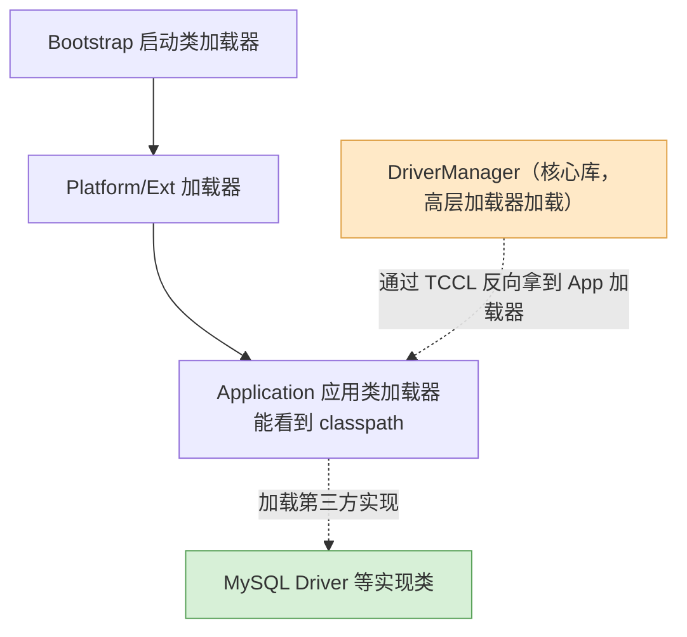

# SPI 是什么？和 API 有什么区别？

> 一句话点题：SPI 是一套「接口我来定、实现你来给、运行时再装配」的扩展机制，本质是把「选哪个实现」的控制权从代码里挪到代码外。

## 先想清楚：接口到底是"谁"定的

平时写代码，接口和实现基本都在同一个人手里：我定义 `UserService` 接口，也顺手把 `UserServiceImpl` 写了，调用方直接 `new` 或者注入进来用。接口对调用方来说是「说明书」，照着调就行。

但有一类场景反过来了：**接口是框架/平台先定好的，实现却要等第三方以后再补上**。

举个最典型的例子——数据库驱动。JDK 的 `java.sql` 包里早就定义好了 `Driver` 接口，但 JDK 自己一行 MySQL 驱动代码都没写，也不可能写。真正的实现（`com.mysql.cj.jdbc.Driver`）是 MySQL 官方提供的，Oracle、PostgreSQL 各有各的。JDK 在写 `DriverManager` 的时候，根本不知道未来会有哪些数据库，它只能约定一个「插槽」，谁来了就把谁插进去。

这个「先留插槽、运行时再发现并装配实现」的机制，就是 **SPI（Service Provider Interface，服务提供者接口）**。它的思想和控制反转（IoC）是一脉相承的：装配用哪个实现，不再由代码写死，而是交给程序之外去决定。

SPI 想解决的核心矛盾是：面向对象鼓励「面向接口编程」以降低耦合、遵循开闭原则（对扩展开放、对修改封闭），可一旦代码里直接 `new` 了某个具体实现，换实现就得改代码，开闭原则又破了。SPI 把这层依赖彻底外置——换实现只需换一个 jar 包，调用方代码一个字都不用动。

## SPI 和 API 到底差在哪

这是最爱考的一点。两者都叫「接口」，但角色完全相反，抓住三个问题就不会混：**接口谁定的、实现谁给的、调用往哪个方向流**。

| 对比点           | API                             | SPI                                   |
| ---------------- | ------------------------------- | ------------------------------------- |
| 接口由谁定义     | 实现方（提供能力的一方）        | 调用方 / 框架                         |
| 实现由谁提供     | 实现方自己                      | 外部第三方按规则填                    |
| 接口和实现放在哪 | 都在实现方的包里                | 接口在框架侧，实现在第三方 jar 里     |
| 调用方向         | 调用方 → 实现方（我用你的能力） | 框架 → 第三方实现（你来满足我的规则） |
| 谁「反向」了     | 正常调用                        | 控制反转，框架回调实现                |

一句话概括：**API 是「我提供能力，你来调我」；SPI 是「我定规矩，你来实现，我在运行时把你装进来」**。

打个比方。你用一个 JSON 库，调它的 `parse()` 方法把字符串变成对象——这是 API，接口和实现都是这个库给的，你只管用。而 JDBC 的 `Driver` 接口是 JDK 定的，MySQL 按这个接口写实现，最后是 `DriverManager`（框架侧）在运行时把 MySQL 的实现找出来用起来——这是 SPI，接口的「甲方」是框架，实现的「乙方」是数据库厂商。

## JDK 自带的 SPI：ServiceLoader + META-INF/services

JDK 从 1.6 起内置了一套 SPI 实现，核心是 `java.util.ServiceLoader` 加上一个约定俗成的配置目录 `META-INF/services/`。规则很朴素：

- 在 `META-INF/services/` 下建一个文件，**文件名就是接口的全限定名**；
- 文件内容是**实现类的全限定名**，一行一个，可以写多个；
- 运行时用 `ServiceLoader.load(接口.class)` 去发现并加载这些实现。

走一遍完整的例子。假设我们做一个支付渠道的扩展点：

先定接口（这就是 SPI，留给别人实现的插槽）：

```java
package com.example.spi;

public interface PayChannel {
    boolean support(String type);   // 这个渠道支不支持某种支付方式
    void pay(long amount);
}
```

再写两个实现（真实项目里这两个类往往在各自独立的 jar 包里）：

```java
package com.example.spi.impl;

import com.example.spi.PayChannel;

public class AlipayChannel implements PayChannel {
    public boolean support(String type) { return "alipay".equals(type); }
    public void pay(long amount) { System.out.println("支付宝支付 " + amount + " 分"); }
}

public class WechatPayChannel implements PayChannel {
    public boolean support(String type) { return "wechat".equals(type); }
    public void pay(long amount) { System.out.println("微信支付 " + amount + " 分"); }
}
```

关键一步——写配置文件。文件路径是 `src/main/resources/META-INF/services/com.example.spi.PayChannel`（文件名就是接口全名），内容：

```plain
com.example.spi.impl.AlipayChannel
com.example.spi.impl.WechatPayChannel
```

最后调用方通过 `ServiceLoader` 把所有实现捞出来：

```java
ServiceLoader<PayChannel> loader = ServiceLoader.load(PayChannel.class);
for (PayChannel channel : loader) {          // 遍历时才真正实例化
    if (channel.support("wechat")) {
        channel.pay(999);
    }
}
```

注意调用方代码里没有出现任何一个实现类的名字。想再加一个「银联渠道」，只要新写一个实现类、在配置文件里补一行（或者干脆丢进一个新 jar 包），主流程完全不用改——这就是 SPI 的可插拔。

## ServiceLoader 是怎么找到实现的

原理不复杂，本质还是**读配置文件 + 反射实例化**。`ServiceLoader.load()` 内部会拿到一个类加载器，去所有 jar 包的 `META-INF/services/` 下找那个以接口全名命名的文件，解析出实现类的全名，再用反射（`Class.forName` + 构造实例）把对象创建出来。

有一个细节值得纠正：有的说法是「加载时会先把这些配置文件里的实现类全部读进内存实例化」。其实不准确——**`ServiceLoader` 是懒加载的**。它内部用的是一个 `LazyIterator`，你调 `load()` 只是准备好迭代器，真正去读文件、反射建对象，是在你**遍历（`iterator`/`for`）到某个元素时**才发生的，并且建好的实例会缓存下来。所以「什么时候实例化」取决于你什么时候迭代，而不是 `load` 那一刻。

另一个和版本相关的点：老资料里常看到 `clazz.newInstance()` 这种写法，那是 JDK 8 及以前的实现。`Class.newInstance()` 在 JDK 9 起已被标记废弃，JDK 9 重写 `ServiceLoader` 以适配模块系统（module-info 里可以用 `provides ... with ...` 声明），内部改成了 `Constructor.newInstance()`。原理没变，细节要认版本。

## 它凭什么能加载到第三方实现——线程上下文类加载器

这里藏着一个和双亲委派模型冲突的问题，面试进阶常问。

正常情况下，类加载遵循**双亲委派**：子加载器先把请求往上抛给父加载器，父加载器能加载就父加载器加载。核心类库（如 `java.sql` 里的 `DriverManager`）是由启动类加载器 / 平台类加载器加载的，级别很高。可问题来了：`DriverManager` 需要加载 MySQL 驱动，而驱动是第三方 jar，在应用 classpath 上，只有**应用类加载器**才看得见。按双亲委派，高层加载器是没法反过来加载低层（classpath）的类的。

JDK 的解法是**线程上下文类加载器（Thread Context ClassLoader，TCCL）**。`ServiceLoader.load()` 默认取的就是它：

```java
ClassLoader cl = Thread.currentThread().getContextClassLoader();
```

这个 TCCL 默认就是应用类加载器。于是核心库代码借助它，就能「向下」加载到 classpath 上的第三方实现，相当于**开了一个口子绕过双亲委派**。



（类加载和双亲委派的完整机制有专篇讲，这里点到为止：记住「核心库要加载第三方实现 → 双亲委派挡路 → 用 TCCL 破例」这条线即可。）

## 经典应用：JDBC、SLF4J、Dubbo

**JDBC 加载驱动**是最标准的 SPI 案例。JDBC 4.0 起，`DriverManager` 会用 `ServiceLoader` 扫描 `META-INF/services/java.sql.Driver`，自动发现并注册驱动。所以现在写 JDBC 代码，早就不需要 `Class.forName("com.mysql.jdbc.Driver")` 这句了，只要驱动 jar 在 classpath 上就能自动装配。MySQL 驱动 jar 里正好就带着这个配置文件。

**SLF4J 绑定日志实现**常被拿来当 SPI 的例子，但这里得说清楚边界。SLF4J 是一个日志门面（接口层），底下可以换 Logback、Log4j2 等实现，换实现只改 pom 依赖不改代码——这个「门面 + 可替换实现」的**思想**确实是 SPI 式的。不过实现手段要分版本看：SLF4J 1.x 用的**不是** JDK 的 `ServiceLoader`，而是一套自己的静态绑定——启动时去 classpath 上找一个约定好的类 `org.slf4j.impl.StaticLoggerBinder`，谁提供了这个类就绑谁；直到 **SLF4J 2.0 才改用 JDK `ServiceLoader`**（通过 `META-INF/services/org.slf4j.spi.SLF4JServiceProvider`）。所以说「SLF4J 靠 JDK SPI 实现」在 2.0 之前并不严格成立，思想对、机制不完全是。

**Dubbo SPI** 则是「嫌 JDK 原生 SPI 不够用，自己造了一套更强的」。Dubbo 的扩展点配置放在 `META-INF/dubbo/`（以及 `services/`）下，格式是 `名字=实现类全名` 的键值对。相比 JDK SPI，它的增强在于：能**按名字精确取某一个实现**（`getExtension("dubbo")`），支持**自适应扩展**（运行时根据参数选实现）、以及扩展点之间的 **IoC 依赖注入和 AOP 包装**。这些恰好补上了 JDK SPI 的短板。

## JDK SPI 的短板，也是 Dubbo/Spring 造轮子的原因

JDK 原生 SPI 好用，但确实有几处硬伤：

- **只能全量遍历，不能按需取单个**。`ServiceLoader` 只给你一个迭代器，想要「叫 alipay 的那个实现」没有直接办法，只能遍历所有实现挨个 `support()` 判断。实现一多，把用不上的也全实例化了，浪费。
- **获取实现的方式不灵活**。拿到的就是一串实例，既不能按名字点名，也没有优先级、条件筛选这类能力。
- **`ServiceLoader` 实例本身不是线程安全的**。多个线程共用同一个 `ServiceLoader` 并发迭代/`reload` 会有问题（各线程各自 `load` 一个则没事）。

正是这些局限，催生了 Dubbo SPI、Spring 的 `SpringFactoriesLoader`（读 `META-INF/spring.factories`，Spring Boot 自动装配就靠它）这类增强版——它们保留了「配置外置、运行时发现」的内核，又补上了按名加载、依赖注入、条件装配等能力。

## 容易踩的坑

- **别以为 `ServiceLoader.load()` 就把实现全建好了**——它是懒加载，实例化发生在迭代时，且会缓存。
- **配置文件的文件名是接口全名，内容是实现类全名**，两个都别写反，路径必须是 `META-INF/services/`，少写一层都找不到。
- **「SLF4J 用 JDK SPI」要分版本**：1.x 是自定义静态绑定，2.0 才换成 `ServiceLoader`，别一概而论。
- **JDBC 4.0 之后不用再 `Class.forName` 加载驱动**了，还这么写只是历史惯性，靠的正是 SPI 自动发现。
- **SPI ≠ Spring SPI ≠ Dubbo SPI**：三者思想同源，但配置目录、格式和能力都不同（`META-INF/services/` vs `spring.factories` vs `META-INF/dubbo/`），面试别混着答。

## 小结

1. SPI 是「接口由框架定、实现由第三方给、运行时发现装配」的扩展机制，思想上等同于控制反转，目的是解耦、可插拔、面向扩展开放。
2. 和 API 的根本区别在于「谁定接口、谁给实现、调用方向」：API 是实现方定接口供人调用，SPI 是调用方定接口让别人实现并被反向装配。
3. JDK 原生 SPI = `ServiceLoader` + `META-INF/services/接口全名` 文件（内容写实现类全名），本质是读配置 + 反射实例化，且为懒加载。
4. 它靠线程上下文类加载器绕过双亲委派，才能让核心库加载到 classpath 上的第三方实现，JDBC 驱动自动发现就是这么来的。
5. JDK SPI 的短板是只能全量遍历、不能按名取、非线程安全，所以 Dubbo/Spring 各自造了更强的 SPI；SLF4J 的可替换是 SPI 思想，但 2.0 前用的是静态绑定而非 `ServiceLoader`。

## 参考

综合自项目内 SPI 机制与 Java 基础面试资料的 SPI 段落，并做了如下核对与改写：纠正了「加载时一次性全部实例化」的说法（实际为 `LazyIterator` 懒加载）、`newInstance()` 的版本差异（JDK 9 起重写为 `Constructor.newInstance()`）、以及 SLF4J 绑定机制的版本边界（1.x 静态绑定、2.0 起才用 `ServiceLoader`）；双亲委派相关细节以 JVM 类加载专篇为准，此处只作接驳说明。
