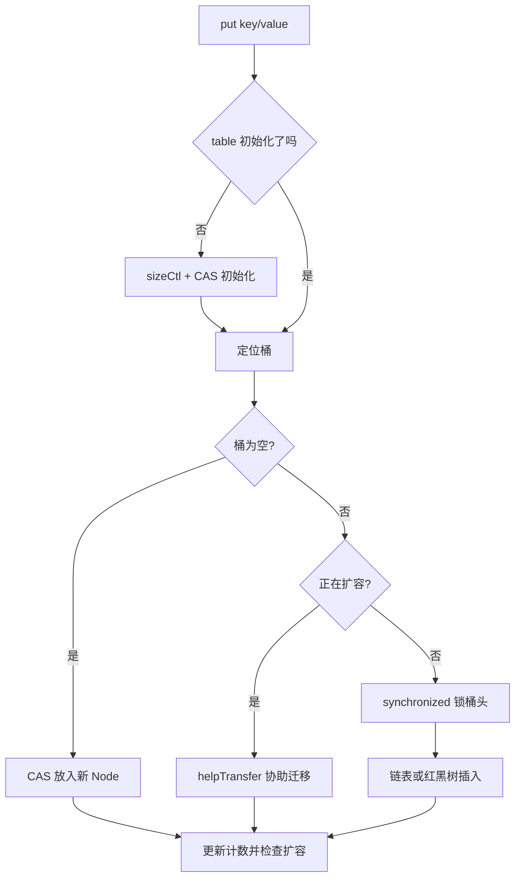

# ConcurrentHashMap 是怎么从分段锁演进到 CAS + synchronized 的？

> `ConcurrentHashMap` 的演进核心是缩小锁粒度：JDK 7 锁 Segment，JDK 8 尽量锁到桶级别。

## 为什么需要 ConcurrentHashMap？

并发 Map 有三个常见候选：

| 容器                               | 特点                  | 问题                             |
| ---------------------------------- | --------------------- | -------------------------------- |
| `Hashtable`                        | 方法级 `synchronized` | 锁粒度太粗，老旧                 |
| `Collections.synchronizedMap(...)` | 给普通 Map 包一层同步 | 仍是粗粒度锁，迭代要额外手动同步 |
| `ConcurrentHashMap`                | 面向并发读写设计      | 复合操作仍需使用原子 API         |

`ConcurrentHashMap` 不是“所有操作都无锁”，而是尽量让不同 key 的操作少互相阻塞。

## JDK 7：Segment 分段锁

JDK 7 的结构可以理解成：

```text
ConcurrentHashMap
└── Segment[]
    ├── Segment 0 -> HashEntry[]
    ├── Segment 1 -> HashEntry[]
    └── ...
```

每个 `Segment` 继承 `ReentrantLock`，内部维护一段哈希表。不同 Segment 之间可以并发写，写同一个 Segment 才会竞争锁。

这就是“分段锁”的来源。默认并发级别常被说成 16，本质是希望把全表大锁拆成多把小锁。

这种设计比 `Hashtable` 好很多，但也有问题：

1. Segment 个数初始化后基本固定，粒度仍然偏粗。
2. 结构比普通 HashMap 更复杂。
3. 全局统计 size 需要跨 Segment 汇总。

## JDK 8：数组 + 链表/红黑树 + 桶级同步

JDK 8 取消了 Segment 主结构，结构更接近 HashMap：

```text
Node[] table
├── 空桶：CAS 放入
├── 链表：锁桶头节点
└── 红黑树：锁树根相关节点
```

它的并发控制可以按 `put` 流程理解：



几个关键点：

- 空桶插入用 CAS，不需要加锁。
- 非空桶写入用 `synchronized` 锁住桶头节点，不是全表锁。
- 读操作通常不加锁，依赖 volatile 读和节点字段可见性。
- 扩容时用 `ForwardingNode` 标记迁移状态，其他线程遇到后可以一起帮忙迁移。

## 为什么 JDK 8 又用了 synchronized？

很多人会误以为 `synchronized` 一定比 `ReentrantLock` 慢，所以 JDK 8 用它很奇怪。

更准确的理解是：JDK 8 之后 `synchronized` 已经有偏向锁、轻量级锁、自旋等优化，短临界区成本可以接受。而桶级锁的临界区很小，代码也更简单。

所以 JDK 8 的思路不是“完全无锁”，而是：

```text
能 CAS 就 CAS
不能 CAS 就只锁当前桶
扩容时让多个线程协助迁移
```

## size 为什么不是强一致？

在高并发下，每次写都竞争一个全局计数器会很慢。JDK 8 的计数思路类似 `LongAdder`：用 `baseCount + CounterCell[]` 分散热点。

这带来一个边界：并发修改过程中，`size()` 看到的是一个瞬时统计，不适合用来做强一致业务判断。

例如不要这样写：

```java
if (cache.size() < 1000) {
    cache.put(key, value);
}
```

多个线程都可能同时看到小于 1000，然后一起写进去。容量控制应该交给专门缓存组件，或用额外同步机制。

## null key 和 null value 为什么不允许？

`HashMap` 允许 `null` key 和 `null` value，`ConcurrentHashMap` 不允许。

核心原因是并发语义会变模糊。假设 `map.get(key)` 返回 `null`，你无法区分：

1. key 不存在。
2. key 存在，但 value 就是 `null`。

在并发环境中，靠 `containsKey` 再确认也不可靠，因为两次调用之间状态可能已经变了。所以 `ConcurrentHashMap` 直接禁止 `null`，让 `null` 返回值明确表示“没有映射”。

## 容易踩的坑

1. JDK 8 `ConcurrentHashMap` 不是完全无锁，非空桶写入仍会加 `synchronized`。
2. 链表达到树化阈值也要看数组长度，小于 64 时通常优先扩容。
3. `size()` 不是并发强一致判断工具。
4. 单个方法线程安全，不代表多个方法组合起来也原子。
5. `computeIfAbsent` 的计算函数不要做耗时或递归修改同一个 Map 的复杂逻辑。

## 小结

- JDK 7 `ConcurrentHashMap` 通过 Segment 分段锁降低竞争。
- JDK 8 取消 Segment，改成空桶 CAS、非空桶锁桶头、扩容协助迁移。
- `synchronized` 在桶级短临界区里成本可接受，不等于退回粗粒度锁。
- `get` 通常无锁，`size` 在并发修改中只能视为瞬时统计。
- 复合操作要用 `putIfAbsent`、`computeIfAbsent` 等原子 API。

## 参考

综合自《ConcurrentHashMap 源码分析》《Java 常见并发容器总结》《Java 集合常见面试题总结》，并与本站并发专题错位组织为源码结构、锁粒度和工程边界视角。
