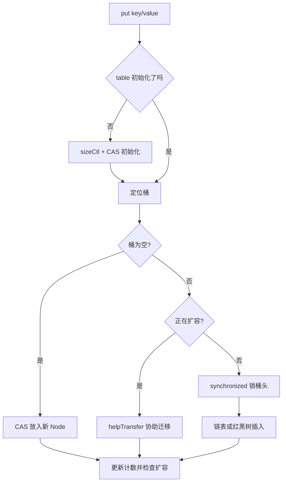

# ConcurrentHashMap 是怎么从分段锁演进到 CAS + synchronized 的？

> `ConcurrentHashMap` 的演进核心是缩小锁粒度：JDK 7 锁 Segment，JDK 8 尽量锁到桶级别。

## 为什么需要 ConcurrentHashMap？

并发 Map 有三个常见候选：

| 容器                               | 特点                  | 问题                             |
| ---------------------------------- | --------------------- | -------------------------------- |
| `Hashtable`                        | 方法级 `synchronized` | 锁粒度太粗，老旧                 |
| `Collections.synchronizedMap(...)` | 给普通 Map 包一层同步 | 仍是粗粒度锁，迭代要额外手动同步 |
| `ConcurrentHashMap`                | 面向并发读写设计      | 复合操作仍需使用原子 API         |

`ConcurrentHashMap` 不是“所有操作都无锁”，而是尽量让不同 key 的操作少互相阻塞。

## JDK 7：Segment 分段锁

JDK 7 的结构可以理解成：

```text
ConcurrentHashMap
└── Segment[]
    ├── Segment 0 -> HashEntry[]
    ├── Segment 1 -> HashEntry[]
    └── ...
```

每个 `Segment` 继承 `ReentrantLock`，内部维护一段哈希表。不同 Segment 之间可以并发写，写同一个 Segment 才会竞争锁。

这就是“分段锁”的来源。默认并发级别常被说成 16，本质是希望把全表大锁拆成多把小锁。

这种设计比 `Hashtable` 好很多，但也有问题：

1. Segment 个数初始化后基本固定，粒度仍然偏粗。
2. 结构比普通 HashMap 更复杂。
3. 全局统计 size 需要跨 Segment 汇总。

默认并发级别常被简化成“最多 16 个线程同时写”。更准确地说，是不同线程写入不同 Segment 时可以并行；如果多个热点 key 落到同一个 Segment，仍然会排队竞争同一把锁。并发级别不是吞吐量保证，只是锁分片数量的上限。

## JDK 8：数组 + 链表/红黑树 + 桶级同步

JDK 8 取消了 Segment 主结构，结构更接近 HashMap：

```text
Node[] table
├── 空桶：CAS 放入
├── 链表：锁桶头节点
└── 红黑树：锁树根相关节点
```

它的并发控制可以按 `put` 流程理解：



几个关键点：

- 空桶插入用 CAS，不需要加锁。
- 非空桶写入用 `synchronized` 锁住桶头节点，不是全表锁。
- 读操作通常不加锁，依赖 volatile 读和节点字段可见性。
- 扩容时用 `ForwardingNode` 标记迁移状态，其他线程遇到后可以一起帮忙迁移。

### sizeCtl 在控制什么？

`sizeCtl` 是 JDK 8 实现里很关键的状态字段，可以粗略理解成“表初始化和扩容的控制器”：

| `sizeCtl` 状态 | 含义                             |
| -------------- | -------------------------------- |
| `0`            | 还没初始化，使用默认容量         |
| 正数           | 下一次触发扩容的大致阈值         |
| `-1`           | 正在初始化，其他线程先让出       |
| 小于 `-1`      | 正在扩容，并记录参与迁移的线程数 |

所以初始化不是简单地 `new Node[]`。线程会先通过 CAS 抢初始化资格；抢不到的线程不会重复初始化，而是让出或稍后重试。

### 扩容时为什么要协助迁移？

普通 `HashMap` 扩容由当前线程一次性迁移。并发容器如果也这么做，单个写线程会被大迁移拖住，其他线程还可能一直撞到旧表。

JDK 8 的做法是分批迁移：某个桶迁移完成后，会在旧表对应位置放一个 `ForwardingNode`。其他线程访问到这个标记时，就知道这个桶已经迁往新表；如果发现整体还在扩容，还可以调用 `helpTransfer` 参与迁移。

```text
旧 table[i] = 普通链表
      │
      ├── 迁移到新 table
      ↓
旧 table[i] = ForwardingNode
```

读线程遇到 `ForwardingNode` 时，可以沿着它转到新表继续查找；写线程遇到它时，则更可能参与协助迁移。这能把扩容成本摊给多个写线程，减少单线程长时间停顿。

## 为什么 JDK 8 又用了 synchronized？

很多人会误以为 `synchronized` 一定比 `ReentrantLock` 慢，所以 JDK 8 用它很奇怪。

更准确的理解是：JDK 8 之后 `synchronized` 已经有偏向锁、轻量级锁、自旋等优化，短临界区成本可以接受。而桶级锁的临界区很小，代码也更简单。

所以 JDK 8 的思路不是“完全无锁”，而是：

```text
能 CAS 就 CAS
不能 CAS 就只锁当前桶
扩容时让多个线程协助迁移
```

## 链表什么时候会树化？

`ConcurrentHashMap` 和 `HashMap` 一样，不是链表一到 8 个节点就无条件树化。典型条件是：

1. 桶内链表长度达到树化阈值 8。
2. table 长度至少达到 64。

如果 table 还比较小，优先扩容，而不是马上把链表变红黑树。原因是小表里冲突多，通常先扩容就能把节点分散开；过早树化会增加维护成本。

当树节点数量降到较低水平时，还可能退化回链表。面试里不需要死背每个常量，但要知道“树化是冲突严重且容量足够后的兜底优化”，不是主要路径。

## size 为什么不是强一致？

在高并发下，每次写都竞争一个全局计数器会很慢。JDK 8 的计数思路类似 `LongAdder`：用 `baseCount + CounterCell[]` 分散热点。

这带来一个边界：并发修改过程中，`size()` 看到的是一个瞬时统计，不适合用来做强一致业务判断。

例如不要这样写：

```java
if (cache.size() < 1000) {
    cache.put(key, value);
}
```

多个线程都可能同时看到小于 1000，然后一起写进去。容量控制应该交给专门缓存组件，或用额外同步机制。

如果确实只需要近似判断，比如监控展示、日志采样，`mappingCount()` 返回 `long`，比 `size()` 的 int 上限更友好。但它同样不是强一致事务计数。

## 迭代是强一致的吗？

不是。`ConcurrentHashMap` 的迭代器是弱一致的：遍历过程中不会像 fail-fast 集合那样因为并发修改就立刻抛异常，它可能看到遍历期间的一部分新数据，也可能看不到。

这适合“边遍历边容忍并发变化”的管理类任务，例如后台扫描缓存、导出当前在线会话快照。但如果业务要求“遍历时 Map 内容完全冻结”，就要自己做额外同步，或者先复制一份快照再处理。

## null key 和 null value 为什么不允许？

`HashMap` 允许 `null` key 和 `null` value，`ConcurrentHashMap` 不允许。

核心原因是并发语义会变模糊。假设 `map.get(key)` 返回 `null`，你无法区分：

1. key 不存在。
2. key 存在，但 value 就是 `null`。

在并发环境中，靠 `containsKey` 再确认也不可靠，因为两次调用之间状态可能已经变了。所以 `ConcurrentHashMap` 直接禁止 `null`，让 `null` 返回值明确表示“没有映射”。

## computeIfAbsent 应该怎么用？

`computeIfAbsent` 能把“没有就创建”的复合操作合并成一个原子方法：

```java
UserProfile profile = profiles.computeIfAbsent(userId, id -> loadFromLocalCache(id));
```

但计算函数要满足几个约束：

1. 尽量快，不要在里面做慢 SQL、远程 RPC 或长时间阻塞。
2. 不要修改同一个 `ConcurrentHashMap`，避免嵌套更新同一桶导致复杂交互。
3. 返回 `null` 表示不建立映射，不要把它当成可以缓存 `null` 值的入口。
4. 能重复执行也不破坏业务，因为高并发和异常重试下，函数执行次数不应该承载不可重复副作用。

如果创建逻辑很重，可以先在外部准备轻量占位对象，或者把耗时加载放到专门的缓存组件里。

## 容易踩的坑

1. JDK 8 `ConcurrentHashMap` 不是完全无锁，非空桶写入仍会加 `synchronized`。
2. 链表达到树化阈值也要看数组长度，小于 64 时通常优先扩容。
3. `size()` 不是并发强一致判断工具。
4. 单个方法线程安全，不代表多个方法组合起来也原子。
5. `computeIfAbsent` 的计算函数不要做耗时或递归修改同一个 Map 的复杂逻辑。
6. 弱一致迭代不是错误，但不能拿它做需要冻结视图的业务流程。

## 小结

- JDK 7 `ConcurrentHashMap` 通过 Segment 分段锁降低竞争。
- JDK 8 取消 Segment，改成空桶 CAS、非空桶锁桶头、扩容协助迁移。
- `synchronized` 在桶级短临界区里成本可接受，不等于退回粗粒度锁。
- `get` 通常无锁，`size` 在并发修改中只能视为瞬时统计。
- 复合操作要用 `putIfAbsent`、`computeIfAbsent` 等原子 API。

## 参考

基于 Oracle Java SE API Documentation 与 OpenJDK Java Collections Framework 源码中 List、Map、Set、Queue、Concurrent Collections 等相关内容整理。
