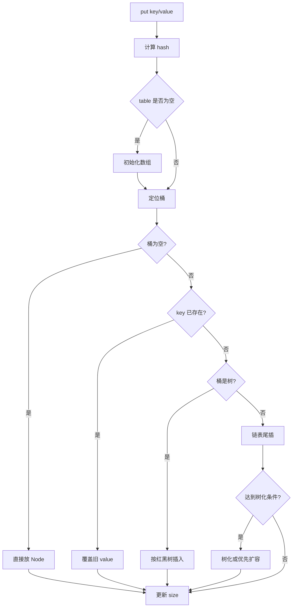

# HashMap 的底层结构和扩容流程是什么？

> `HashMap` 的核心不是“数组加链表”这几个字，而是 hash 怎么定位、冲突怎么处理、什么时候扩容、什么时候树化。

## HashMap 解决的是什么问题？

`HashMap` 希望用 key 快速找到 value。理想情况下，它把 key 的哈希值映射成数组下标：

```text
key.hashCode()
     ↓ 扰动
hash
     ↓ (table.length - 1) & hash
bucket index
```

数组查下标是 O(1)，所以只要哈希分布足够均匀，`put/get` 就能接近 O(1)。

但现实里不同 key 可能落到同一个桶，这就是哈希冲突。JDK 8 的 `HashMap` 用三层结构处理这个问题：

```text
table[]
├── 空桶
├── 单个 Node
├── 链表 Node -> Node -> Node
└── 红黑树 TreeNode
```

JDK 8 之前主要是数组 + 链表；JDK 8 之后在链表过长时引入红黑树，避免极端冲突下查询退化得太厉害。

## put 一次会发生什么？

可以把 `put(key, value)` 理解成 6 步：

1. 计算 key 的 hash。`null` key 的 hash 视为 0。
2. 如果底层数组还没初始化，先初始化或扩容。
3. 用 `(n - 1) & hash` 找到桶下标。
4. 桶为空，直接放新节点。
5. 桶不为空，先判断第一个节点 key 是否相等；不相等再走链表或红黑树。
6. 插入后 `size` 超过阈值则扩容。

一个简化版流程图：



注意 JDK 8 链表插入使用尾插法，和 JDK 7 的头插法不同。这个差异会影响并发扩容问题，下一篇单独讲。

## 为什么容量要保持 2 的幂？

如果数组长度是 2 的幂，取模可以写成位运算：

```text
hash % length == hash & (length - 1)
```

这只是第一层原因。更重要的是扩容时迁移更简单。

假设旧容量是 16，新容量是 32。某个节点扩容后只有两种位置：

```text
旧下标不变
或
旧下标 + oldCap
```

因为新数组只比旧数组多看了一位 hash。那一位是 0，位置不变；是 1，就移动到后半区。

```text
oldCap = 16
bucket i:
  low  list -> 仍在 i
  high list -> 移到 i + 16
```

这就是为什么 HashMap 扩容时不需要对每个节点重新做完整取模。

## 扩容阈值怎么理解？

两个参数决定扩容时机：

| 参数     | 默认值 | 含义                         |
| -------- | ------ | ---------------------------- |
| 初始容量 | 16     | 第一次真正初始化后的数组长度 |
| 负载因子 | 0.75   | 控制数组使用到多满时扩容     |
| 扩容阈值 | 12     | `16 * 0.75`                  |

当 `size > threshold` 时触发扩容，通常容量翻倍。

如果你预计要放 1000 个元素，不应该直接 `new HashMap<>(1000)` 就结束思考。因为阈值是容量乘负载因子，要尽量避免放到 1000 个时扩容，容量应至少能覆盖 `1000 / 0.75`，并且会向上取整到 2 的幂。

## 链表什么时候变红黑树？

常见背法是：“链表长度到 8 变红黑树”。这句话需要补上边界。

JDK 8 的逻辑更准确地说是：

1. 插入后桶内节点数达到树化阈值附近，会尝试树化。
2. 如果 table 长度小于 64，优先扩容，而不是马上树化。
3. 只有容量达到 64 后，才真正把链表转成红黑树。
4. 扩容拆分或删除后节点变少，也可能从树退回链表。

为什么不一上来就树化？因为红黑树节点更重，维护旋转和平衡也有成本。小表里冲突多，通常先扩容更划算。

## 容易踩的坑

1. “链表长度大于 8 就树化”不严谨，还要看数组长度是否至少 64。
2. `HashMap` 的容量不是你传多少就是多少，会调整为 2 的幂。
3. `HashMap` 允许一个 `null` key，但这不代表所有 Map 都允许，比如 `ConcurrentHashMap` 不允许。
4. 遍历顺序不能依赖。即使某次输出看起来有序，也只是当前实现和数据分布的结果。

## 小结

- JDK 8 `HashMap` 底层是数组 + 链表 + 红黑树。
- `put` 的关键路径是算 hash、定位桶、处理冲突、必要时树化或扩容。
- 容量保持 2 的幂，既能用位运算定位，也能简化扩容迁移。
- 默认负载因子 0.75 是查询效率和空间占用之间的折中。
- 树化不是只看链表长度，还要看 table 容量是否达到 64。

## 参考

综合自《HashMap 源码分析》《Java 集合常见面试题总结》，并重点核对了 JDK 8 的尾插、树化阈值、最小树化容量、扩容拆分和容量取整边界。
