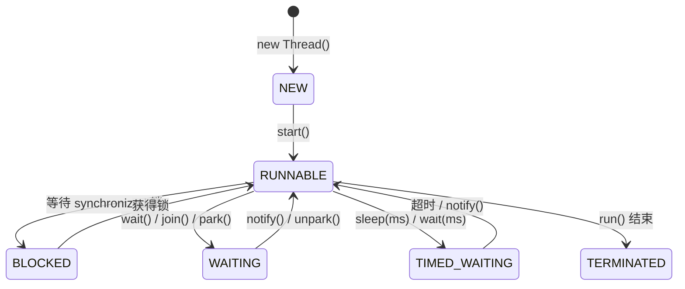

# 线程有哪几种创建方式？生命周期状态怎么转换？

> 并发编程的第一步是搞清楚「线程是什么」以及「线程在 JVM 里到底经历了什么」。

## 进程与线程：先理清关系

进程是程序的一次执行过程，是操作系统进行资源分配的基本单位。线程是比进程更小的执行单位，一个进程内可以包含多个线程。

从 JVM 的角度看，线程之间共享堆和方法区（JDK 8 之后的元空间），但每个线程有自己的程序计数器、虚拟机栈和本地方法栈：

| 区域       | 线程私有还是共享 | 为什么这么设计                       |
| ---------- | ---------------- | ------------------------------------ |
| 程序计数器 | 私有             | 线程切换后能恢复到正确的执行位置     |
| 虚拟机栈   | 私有             | 保证局部变量不被其他线程访问         |
| 本地方法栈 | 私有             | 同上（HotSpot 中与虚拟机栈合二为一） |
| 堆         | 共享             | 对象实例需要被多个线程访问           |
| 方法区     | 共享             | 类信息、常量、静态变量是全局的       |

Java 程序天生就是多线程的。即使你只写了一个 `main` 方法，JVM 启动时也会创建 main 线程、Finalizer 线程、Reference Handler 线程等。

## Java 线程和操作系统线程的关系

JDK 1.2 之前，Java 线程基于「绿色线程」（用户级线程）实现，JVM 自己模拟多线程调度，不能利用多核。JDK 1.2 之后改为基于操作系统原生线程实现。

在 Windows 和 Linux 等主流操作系统上，HotSpot JVM 采用**一对一线程模型**：一个 Java 线程对应一个操作系统内核线程。线程的调度和管理由操作系统内核完成，Java 线程的本质就是操作系统线程。

> JDK 21 引入的虚拟线程打破了这个一对一关系，虚拟线程由 JDK 调度器管理，可以映射到少量平台线程上。虚拟线程的内容在[后面的专题](./java-concurrency-virtual-thread.html)单独展开。

## 创建线程的方式

常见的说法是「四种方式」：继承 `Thread`、实现 `Runnable`、实现 `Callable`、使用线程池。但严格来说，Java 创建线程只有一种方式：`new Thread().start()`。

其他方式只是在定义「线程要执行的任务」：

```java
// 方式一：继承 Thread
class MyThread extends Thread {
    public void run() { System.out.println("running"); }
}
new MyThread().start();

// 方式二：实现 Runnable（推荐，避免单继承限制）
new Thread(() -> System.out.println("running")).start();

// 方式三：实现 Callable（有返回值）
Future<String> future = executorService.submit(() -> "result");

// 方式四：线程池（生产环境推荐）
executor.execute(() -> System.out.println("running"));
```

继承 `Thread` 和实现 `Runnable` 的区别在于：`Thread` 类本身实现了 `Runnable`，继承 `Thread` 是把「任务」和「线程」耦合在一起了。实现 `Runnable` 更灵活，也更适合配合线程池使用。

> `start()` 和 `run()` 的区别是经典面试题：`start()` 会启动新线程并自动调用 `run()`；直接调 `run()` 只是普通方法调用，在当前线程同步执行，不会开启新线程。

## 线程的 6 种状态

Java 线程在生命周期中只可能处于以下 6 种状态之一（定义在 `Thread.State` 枚举中）：

| 状态            | 说明                              | 典型触发方式                             |
| --------------- | --------------------------------- | ---------------------------------------- |
| `NEW`           | 线程已创建但未启动                | `new Thread()` 后尚未调 `start()`        |
| `RUNNABLE`      | 已启动，正在运行或等待 CPU 时间片 | `start()` 后                             |
| `BLOCKED`       | 等待 monitor 锁                   | 进入 `synchronized` 块但锁被占用         |
| `WAITING`       | 无限等待，需其他线程显式唤醒      | `wait()`、`join()`、`LockSupport.park()` |
| `TIMED_WAITING` | 有超时的等待                      | `sleep(ms)`、`wait(ms)`、`join(ms)`      |
| `TERMINATED`    | 线程执行完毕                      | `run()` 方法正常退出或异常退出           |



### JVM 为什么不区分 READY 和 RUNNING？

操作系统层面线程有就绪（READY）和运行（RUNNING）两种状态，但 JVM 层面只看到 `RUNNABLE`。原因是现代操作系统采用时间片轮转调度，线程在 CPU 上的运行和切换非常快（通常 10-20ms 级别），区分这两种状态意义不大。

### sleep() 和 wait() 的核心区别

| 对比项     | `sleep()`    | `wait()`                                 |
| ---------- | ------------ | ---------------------------------------- |
| 定义位置   | `Thread` 类  | `Object` 类                              |
| 是否释放锁 | 不释放       | 释放                                     |
| 使用前提   | 任意位置     | 必须持有对象锁（在 `synchronized` 块内） |
| 唤醒方式   | 超时自动唤醒 | 需 `notify()`/`notifyAll()` 或超时       |
| 用途       | 暂停当前线程 | 线程间通信                               |

`wait()` 定义在 `Object` 而不是 `Thread`，是因为 `wait()` 的语义是「释放当前对象锁并等待」，操作的是对象（Object）的 monitor，而不是线程本身。

## 线程上下文切换

线程在执行过程中有自己的运行上下文（程序计数器、栈信息等）。当出现以下情况时，线程会退出 CPU：

- 主动让出：调用了 `sleep()`、`wait()`、`yield()` 等
- 时间片用完：操作系统防止一个线程长期占用 CPU
- 遇到阻塞操作：如 I/O 请求、锁竞争

切换时需要保存当前线程的上下文、加载下一个线程的上下文，这个过程会消耗 CPU 和内存资源。频繁的上下文切换是性能杀手，这也是为什么线程池要控制线程数量——线程太多反而降低吞吐。

## 如何正确停止线程

Java 没有「安全停止线程」的方法。`Thread.stop()` 已被废弃，因为它直接终止线程，可能导致锁未释放、数据不一致。正确的方式是**中断机制**。

### 中断机制三件套

| 方法                     | 作用                                     |
| ------------------------ | ---------------------------------------- |
| `thread.interrupt()`     | 设置线程的中断标志位为 true              |
| `thread.isInterrupted()` | 检查中断标志位（不清除）                 |
| `Thread.interrupted()`   | 静态方法，检查并清除当前线程的中断标志位 |

### 正确的停止方式

```java
Thread worker = new Thread(() -> {
    while (!Thread.currentThread().isInterrupted()) {
        // 正常工作
        try {
            Thread.sleep(1000);
        } catch (InterruptedException e) {
            // sleep/wait/join 被中断时会抛 InterruptedException
            // 同时会清除中断标志位，所以需要重新设置
            Thread.currentThread().interrupt();
            break;
        }
    }
    System.out.println("worker stopped gracefully");
});
worker.start();

Thread.sleep(5000);
worker.interrupt(); // 请求停止
```

关键点：

1. 线程自己决定何时响应中断——调用 `interrupt()` 只是「提议」，不是「命令」。
2. 如果线程正在 `sleep()`/`wait()`/`join()`，中断会抛 `InterruptedException` 并**清除中断标志位**，所以 catch 里要重新调 `interrupt()` 或直接退出。
3. 线程池关闭时，`shutdownNow()` 会对所有正在执行的线程调 `interrupt()`，所以任务代码必须正确响应中断。

### 为什么 stop() 被废弃？

`Thread.stop()` 会直接终止线程，不管线程执行到哪一步。如果线程正在修改共享数据，被 stop 后可能留下不一致的状态，而且锁不会被释放——其他等待同一把锁的线程会永远阻塞。这是设计层面的不安全，所以从 JDK 1.2 就废弃了。

## 守护线程

守护线程（Daemon Thread）是一种特殊线程，当所有非守护线程结束时，JVM 不会等待守护线程完成就直接退出。

```java
Thread t = new Thread(() -> {
    while (true) {
        // 后台任务，如垃圾回收、心跳检测
    }
});
t.setDaemon(true); // 必须在 start() 之前设置
t.start();
```

典型应用：GC 线程、Finalizer 线程都是守护线程。虚拟线程也是守护线程——这就是为什么 Spring Boot 接入虚拟线程时需要设置 `keep-alive: true`，防止 JVM 过早退出。

> 守护线程的 `finally` 块不保证执行，因为 JVM 退出时不会等待守护线程完成。所以不要在守护线程中做需要可靠清理的操作。

## yield() 的语义

`Thread.yield()` 是一个「提示」——告诉调度器当前线程愿意让出 CPU。但调度器可以忽略这个提示，线程可能继续运行。

```java
if (cpuBusy) {
    Thread.yield(); // 建议让出 CPU，但不保证
}
```

`yield()` 和 `sleep(0)` 的区别：`yield` 是提示调度器重新调度（可能选同一个线程），`sleep(0)` 在某些实现中等同于 yield，但在 Windows 上可能直接返回。实践中 `yield()` 很少使用，因为它语义模糊、行为不可预测。

## 容易踩的坑

**直接调用 `run()` 而不是 `start()`。** 这是初学者最常犯的错误，代码不会报错，但任务在当前线程同步执行，完全没有多线程效果。

**混淆线程状态和操作系统状态。** Java 的 `BLOCKED` 只针对 `synchronized` 锁等待。使用 `ReentrantLock` 时，线程阻塞在 `lock()` 上，状态是 `WAITING` 而不是 `BLOCKED`——因为 `ReentrantLock` 使用 `LockSupport.park()`，不涉及 monitor。

**认为 `sleep()` 会释放锁。** `sleep()` 让线程暂停执行，但不会释放任何锁。如果在 `synchronized` 块内 `sleep()`，其他线程仍然无法进入该同步块。

## 小结

- Java 线程本质是操作系统线程，采用一对一模型（虚拟线程除外）。
- 创建线程只有 `new Thread().start()` 一种方式，其他方式只是定义任务。
- 线程有 6 种状态，JVM 不区分 READY 和 RUNNING，统称 `RUNNABLE`。
- `sleep()` 不释放锁，`wait()` 释放锁且定义在 `Object` 上。
- 上下文切换有成本，线程数量不是越多越好。

## 参考

综合自《Java 并发编程的艺术》及多篇并发面试题总结资料，交叉验证后修正了部分资料中线程状态变迁图的三处错误（JVM 不区分 READY/RUNNING、`BLOCKED` 仅针对 `synchronized`）。
