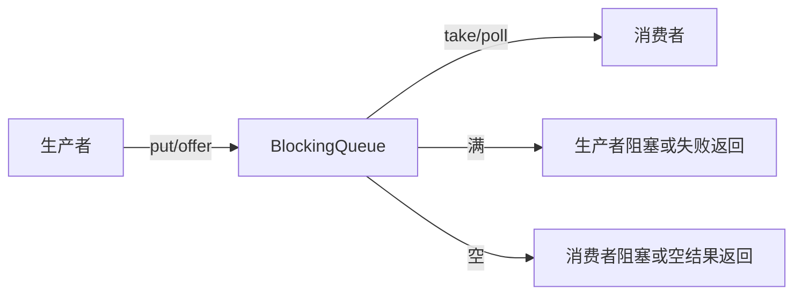
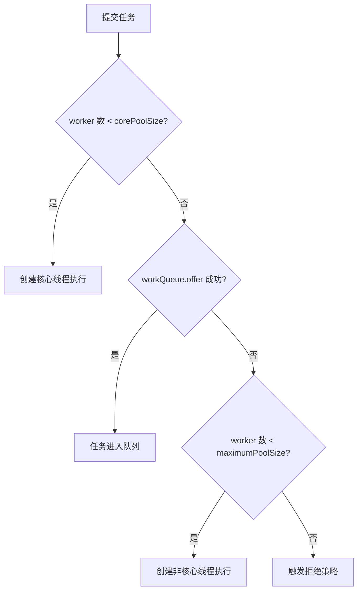

# BlockingQueue 怎么选？它和线程池是什么关系？

> BlockingQueue 的核心价值不是“线程安全队列”这么简单，而是把生产者和消费者隔开：队列可缓冲，满了能形成背压，空了能阻塞等待。线程池里的 workQueue 就是这个模型的典型应用。

## 为什么阻塞队列是生产者消费者的分界线？

普通 `Queue` 只表达“先进先出或按规则出队”，但并发场景还要回答三个问题：

1. 生产者比消费者快时怎么办？
2. 消费者暂时没任务时怎么办？
3. 队列满、队列空、等待超时时分别怎么返回？

`BlockingQueue` 把这些行为都放进接口里：



这就是它和线程池天然适配的原因：提交任务的一方是生产者，工作线程是消费者，队列在中间承担缓冲和背压。

## 四组 API 先分清

`BlockingQueue` 的方法不是都阻塞。面试里可以按“失败时怎么表现”来记：

| 操作语义 | 抛异常      | 返回特殊值     | 一直阻塞 | 超时等待                  |
| -------- | ----------- | -------------- | -------- | ------------------------- |
| 插入     | `add(e)`    | `offer(e)`     | `put(e)` | `offer(e, timeout, unit)` |
| 移除     | `remove()`  | `poll()`       | `take()` | `poll(timeout, unit)`     |
| 查看队首 | `element()` | `peek()`       | 无       | 无                        |
| 满/空时  | 直接抛异常  | `false`/`null` | 等到可用 | 超时仍不可用则返回        |

工程里最常用的是这几类：

- 生产者消费者：`put()` / `take()`，让速度不一致的两端自然等待。
- 尝试提交：`offer()`，失败后交给拒绝策略或降级逻辑。
- 限时交付：`offer(timeout)` / `poll(timeout)`，避免永久挂住调用线程。

`ThreadPoolExecutor.execute()` 提交任务时用的是 `workQueue.offer(command)`，不是 `put()`。这意味着队列满时不会把提交线程无限阻塞，而是让线程池继续尝试创建非核心线程或触发拒绝策略。

## ArrayBlockingQueue：容量固定，背压最直观

`ArrayBlockingQueue` 底层是定长数组，创建时必须指定容量。它适合用在需要明确上限的地方，比如订单异步处理队列、图片压缩队列、普通业务线程池的任务队列。

```java
BlockingQueue<Runnable> queue = new ArrayBlockingQueue<>(1000);

ThreadPoolExecutor pool = new ThreadPoolExecutor(
    8,
    16,
    60,
    TimeUnit.SECONDS,
    queue,
    threadFactory,
    new ThreadPoolExecutor.CallerRunsPolicy()
);
```

它的阻塞依赖一把 `ReentrantLock` 和两个条件队列：

```text
notFull  ：队列满时，生产者等待
notEmpty ：队列空时，消费者等待
```

入队时写 `putIndex`，出队时读 `takeIndex`，两个下标在数组里循环移动。队列满了，`put()` 等待 `notFull`；队列空了，`take()` 等待 `notEmpty`。

它的优点是容量边界清晰，出问题时能很快从监控里看到队列堆积；缺点是容量要估算，设太小容易频繁拒绝，设太大又会把延迟藏在队列里。

## LinkedBlockingQueue：别忘了指定容量

`LinkedBlockingQueue` 基于链表，可以指定容量，也可以不指定容量。不指定时容量是 `Integer.MAX_VALUE`，工程上基本可以看成近似无界。

它比 `ArrayBlockingQueue` 更容易被误用：很多人觉得“链表队列吞吐高”，但在线程池里如果默认无界，后果是任务会一直入队，`maximumPoolSize` 很难发挥作用，最终风险从“线程数太多”变成“队列堆到 OOM”。

```java
// 不推荐：默认容量接近无界
new LinkedBlockingQueue<>();

// 至少要明确容量
new LinkedBlockingQueue<>(1000);
```

`Executors.newFixedThreadPool()` 和 `newSingleThreadExecutor()` 默认使用的就是这种近似无界的 `LinkedBlockingQueue`，这也是生产环境不建议直接用 `Executors` 快捷方法的重要原因。

## SynchronousQueue：不存任务，只做直接移交

`SynchronousQueue` 没有容量，不保存元素。一次 `put` 必须等到另一个线程 `take`，一次 `offer` 如果没有消费者接手就会失败。

放在线程池里，它会把行为推向“直接交给线程执行”：

```text
提交任务 -> 核心线程不够 -> queue.offer 失败
        -> 只要当前线程数 < maximumPoolSize，就创建新线程
```

`Executors.newCachedThreadPool()` 用的就是 `SynchronousQueue`，再配上非常大的最大线程数。它适合大量短小、执行很快、峰值不可预测但资源风险可控的任务；如果任务会阻塞或下游慢，很容易把线程数打爆。

## PriorityBlockingQueue：有优先级，但默认无界

`PriorityBlockingQueue` 是线程安全的优先级队列，出队顺序由元素的自然顺序或传入的 `Comparator` 决定。

它适合“任务有优先级”的场景，比如告警任务高于普通统计任务。但它有几个边界：

- 默认是无界队列，放在线程池里同样会让 `maximumPoolSize` 基本失效。
- 同优先级任务不保证严格 FIFO。
- 任务对象必须能比较大小，否则运行时会因为无法比较而失败。
- 低优先级任务可能长期排不到，业务上要考虑饥饿问题。

如果要在线程池里用优先级队列，通常需要自己控制容量，或者在拒绝策略、任务降级、监控告警上额外补强。

## DelayQueue：到期才能取，不等于调度系统

`DelayQueue` 存放实现了 `Delayed` 接口的元素，队首元素只有到期后才能被 `take()` 取出。它底层用优先队列管理到期时间，并用锁和条件队列协调等待线程。

典型场景：

- 本地订单超时关闭。
- 本地缓存过期清理。
- 轻量延迟任务触发。

但它不是完整调度系统。它不负责持久化、不负责服务重启后的恢复、不负责分布式一致性，也不负责失败重试。关键链路的延迟任务通常要结合数据库扫描、MQ 延迟消息或调度平台。

## LinkedTransferQueue：高吞吐的传递队列

`LinkedTransferQueue` 可以看成 `ConcurrentLinkedQueue`、`SynchronousQueue`、`BlockingQueue` 思路的组合。它支持普通入队，也支持 `transfer(e)` 这种“等消费者接收后才返回”的传递语义。

它适合对吞吐要求高、希望生产者和消费者能直接配对的高级场景。普通业务线程池里不需要优先考虑它，除非你非常明确需要 `TransferQueue` 的语义。

## 线程池为什么特别在意队列？

`ThreadPoolExecutor` 的执行流程里，队列不是最后兜底，而是排在非核心线程之前：



所以队列选择会直接改变线程池行为：

| 队列选择                          | 对线程池的影响                        | 风险                                     |
| --------------------------------- | ------------------------------------- | ---------------------------------------- |
| 无界 `LinkedBlockingQueue`        | 任务几乎都能入队，最大线程数很少生效  | 延迟堆积、内存上涨、OOM                  |
| 有界 `ArrayBlockingQueue`         | 队列满后才扩非核心线程，再满就拒绝    | 容量估算不合理会过早拒绝或隐藏延迟       |
| `SynchronousQueue`                | 不缓冲任务，倾向于快速扩线程          | 下游慢时线程数暴涨                       |
| 无界 `PriorityBlockingQueue`      | 任务按优先级排队，最大线程数很少生效  | 低优先级饥饿、任务堆积                   |
| `DelayQueue` / `DelayedWorkQueue` | 按触发时间出队，常见于定时/延迟线程池 | 无界堆积，服务重启和失败恢复需要额外方案 |

这也纠正一个常见误解：**不是“线程池满了才进队列”，而是核心线程满了就先尝试进队列，队列满了才扩到非核心线程。**

## 项目里怎么选

可以按下面的思路判断：

1. 普通业务线程池优先选有界队列，常见是 `ArrayBlockingQueue` 或指定容量的 `LinkedBlockingQueue`。
2. 任务提交量可能突然暴涨时，要让队列容量、最大线程数、拒绝策略一起生效，别只靠扩大队列。
3. 任务有明确优先级时才考虑 `PriorityBlockingQueue`，并补上容量控制和饥饿监控。
4. 任务到期后才能执行时用 `DelayQueue`，但关键任务要考虑持久化和重试。
5. 希望生产者直接把任务交给消费者、不想排队时再考虑 `SynchronousQueue`。

一个比较稳的默认模板是：

```java
ThreadPoolExecutor pool = new ThreadPoolExecutor(
    core,
    max,
    60,
    TimeUnit.SECONDS,
    new ArrayBlockingQueue<>(queueCapacity),
    namedThreadFactory,
    new ThreadPoolExecutor.CallerRunsPolicy()
);
```

然后通过压测和监控调整 `core`、`max`、`queueCapacity`。线上至少看四个指标：活跃线程数、当前线程数、队列长度、拒绝次数。队列长度持续上涨，说明消费者处理能力跟不上生产速度，不是简单把队列调大就能解决。

## 容易踩的坑

| 坑                                   | 为什么危险                       | 更稳妥的做法                         |
| ------------------------------------ | -------------------------------- | ------------------------------------ |
| 默认 `new LinkedBlockingQueue<>()`   | 容量接近无界，可能把内存吃光     | 显式指定容量                         |
| 只调大队列容量                       | 延迟被藏起来，故障发现更晚       | 配合拒绝策略、限流、监控和降级       |
| 以为 `maximumPoolSize` 一定会生效    | 无界队列下几乎不会扩到最大线程数 | 用有界队列理解执行流程               |
| `PriorityBlockingQueue` 当普通队列用 | 无界且可能导致低优先级任务饥饿   | 只在确有优先级时使用                 |
| `DelayQueue` 当可靠延迟任务系统      | 不负责持久化、分布式、重试       | 关键链路用 MQ、DB 扫描或调度平台     |
| 在业务代码里无脑 `put()`             | 调用线程可能永久阻塞             | 优先考虑 `offer(timeout)` 或拒绝兜底 |

## 小结

- `BlockingQueue` 解决的是生产者消费者之间的缓冲、阻塞和背压，不只是“线程安全队列”。
- 线程池执行流程是核心线程 → 队列 → 非核心线程 → 拒绝策略，队列容量决定 `maximumPoolSize` 什么时候生效。
- 普通业务线程池优先选择有界队列；默认无界的 `LinkedBlockingQueue` 和无界优先级队列都容易把问题拖到 OOM。
- `SynchronousQueue` 不存任务，适合直接移交；`DelayQueue` 到期才能取，但不是可靠调度系统。
- 队列选型必须和线程数、拒绝策略、限流、监控一起看，不能孤立调一个参数。

## 参考

综合自本地资料《Java 常见并发容器总结》《Java 线程池最佳实践》《Java 并发常见面试题》《ArrayBlockingQueue 源码分析》《DelayQueue 源码分析》，并对照现有集合专题里的队列选型文章做了去重。资料中关于线程池队列和 `Executors` 风险的结论保留，但本文重新强调了 `ThreadPoolExecutor` 的真实顺序：核心线程满后先入队，队列满后才扩非核心线程；同时对 `DelayQueue` 的工程边界做了补充，不把它说成可靠调度系统。
