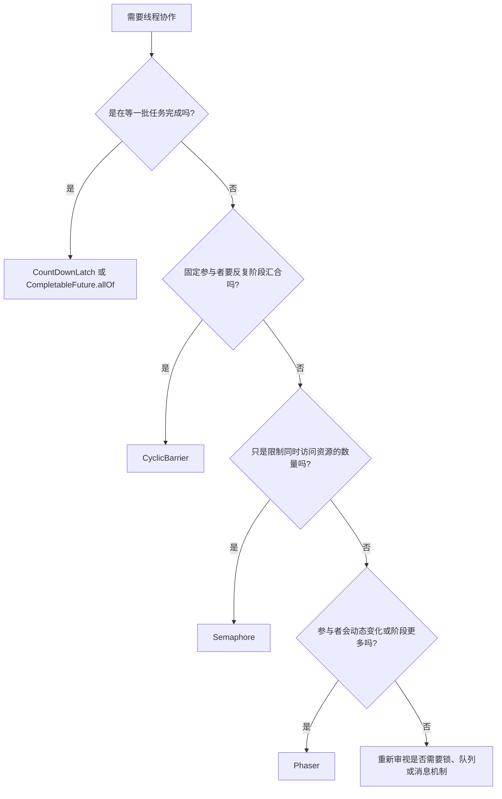

# CountDownLatch、CyclicBarrier、Semaphore、Phaser 分别解决什么问题？

> 这几个工具都在做线程协作，但它们解决的问题不一样：CountDownLatch 等结果，CyclicBarrier 等队友，Semaphore 控制并发许可，Phaser 处理动态参与者的多阶段协作。

## 先用一个场景区分它们

假设我们要做一个批量导入任务：读取 100 个文件、清洗数据、写库、通知下游。不同阶段会遇到不同协作问题：

| 问题                                      | 更合适的工具     | 关键语义                               |
| ----------------------------------------- | ---------------- | -------------------------------------- |
| 主线程提交 100 个子任务后，要等它们都完成 | `CountDownLatch` | 一次性倒计时，计数归零后放行等待线程   |
| 10 个 worker 每轮都要清洗完再一起写库     | `CyclicBarrier`  | 固定参与者在屏障点汇合，可循环使用     |
| 同一时刻最多只能有 20 个任务调用下游接口  | `Semaphore`      | 获取许可才能进入，释放许可后别人再进入 |
| 每轮参与任务数会变化，还要跨多个阶段推进  | `Phaser`         | 动态注册/注销参与者，按 phase 推进     |

面试里最容易答混的是 `CountDownLatch` 和 `CyclicBarrier`：二者都能“等”，但 `CountDownLatch` 通常是**一个或多个等待线程等一批任务完成**，而 `CyclicBarrier` 是**一组参与线程互相等到齐**。

## CountDownLatch：等一批任务完成

`CountDownLatch` 像一道一次性门闩。构造时给一个计数，任务完成一次就 `countDown()`，等待方调用 `await()` 阻塞，直到计数变成 0。

```java
ExecutorService pool = Executors.newFixedThreadPool(8);
CountDownLatch latch = new CountDownLatch(files.size());

for (Path file : files) {
    pool.execute(() -> {
        try {
            importOneFile(file);
        } finally {
            latch.countDown();
        }
    });
}

boolean finished = latch.await(30, TimeUnit.SECONDS);
if (!finished) {
    throw new TimeoutException("import timeout");
}
```

这里有三个关键点：

1. `countDown()` 要放在 `finally` 里。子任务抛异常也要扣减计数，否则主线程可能永远卡在 `await()`。
2. `CountDownLatch` 是一次性的。计数归零后不能重置，下一批任务要重新创建。
3. 能用超时等待就不要无限等。`await(timeout, unit)` 能让调用方有机会降级、告警或取消后续流程。

从实现上看，它基于 AQS 共享模式：`state` 初始化为 `count`，`countDown()` 通过 CAS 递减 `state`，`await()` 在 `state != 0` 时入队阻塞，`state == 0` 后唤醒等待线程。

## CyclicBarrier：固定参与者到齐后一起走

`CyclicBarrier` 更像“集合点”。参与者数量是固定的，每个线程执行到某个阶段时调用 `await()`，最后一个到达的线程负责打开屏障，所有等待线程继续执行下一段逻辑。

```java
CyclicBarrier barrier = new CyclicBarrier(3, () -> flushBatchMetric());

Runnable worker = () -> {
    while (hasNextRound()) {
        readAndClean();
        try {
            barrier.await();
            writeDatabase();
        } catch (InterruptedException e) {
            Thread.currentThread().interrupt();
            return;
        } catch (BrokenBarrierException e) {
            rollbackCurrentRound();
            return;
        }
    }
};
```

它和 `CountDownLatch` 的区别可以抓住四个点：

| 对比点   | `CountDownLatch`              | `CyclicBarrier`                            |
| -------- | ----------------------------- | ------------------------------------------ |
| 谁在等   | 通常是主线程等子任务          | 参与者彼此等待                             |
| 是否复用 | 一次性，归零后不能重置        | 可以循环使用，每一代屏障结束后进入下一代   |
| 实现基础 | AQS 共享模式                  | `ReentrantLock` + `Condition`              |
| 异常影响 | 某个任务不 `countDown` 会卡住 | 中断、超时或 barrier action 失败会打破屏障 |

`CyclicBarrier` 的 `barrierAction` 会在最后一个到达的线程里执行。如果这个动作很慢，所有其他参与者都会被拖住；如果它抛异常，屏障会进入 broken 状态，其他等待线程会收到 `BrokenBarrierException`。

## Semaphore：用许可控制资源入口

`Semaphore` 解决的不是“等谁完成”，而是“同一时间最多放多少人进去”。它维护一组许可，线程 `acquire()` 成功才能访问资源，访问完必须 `release()`。

```java
Semaphore permits = new Semaphore(20);

public Result callPartner(Request request) throws InterruptedException {
    permits.acquire();
    try {
        return partnerClient.call(request);
    } finally {
        permits.release();
    }
}
```

典型场景是本地并发保护：

- 限制同时调用某个下游接口的线程数，避免把对方或自己打爆。
- 限制同时处理大文件、图片压缩、报表生成这类重资源任务。
- 在虚拟线程场景下限制具体资源，而不是池化虚拟线程本身。

实现上，`Semaphore` 也基于 AQS 共享模式：`state` 表示剩余许可数，`acquire()` 尝试扣减许可，许可不足就进入 AQS 队列阻塞；`release()` 增加许可并唤醒等待线程。

需要注意边界：`Semaphore` 是**进程内并发许可**，不是完整的分布式限流方案。多实例服务要控制全局 QPS，通常还要结合 Redis、网关、令牌桶、漏桶或专门的限流组件。

## Phaser：参与者会变化的多阶段协作

`Phaser` 可以理解为更灵活的屏障。它也有“阶段”的概念，但参与者可以动态注册和注销，适合任务数在运行过程中变化、并且要分多轮推进的流程。

```java
Phaser phaser = new Phaser(1); // 先注册主线程

for (Path file : files) {
    phaser.register();
    pool.execute(() -> {
        try {
            parse(file);
            phaser.arriveAndAwaitAdvance();

            validate(file);
            phaser.arriveAndAwaitAdvance();

            persist(file);
        } finally {
            phaser.arriveAndDeregister();
        }
    });
}

phaser.arriveAndDeregister(); // 主线程不再作为参与者
```

它的几个方法要分清：

| 方法                      | 语义                                    |
| ------------------------- | --------------------------------------- |
| `register()`              | 新增一个参与者                          |
| `arrive()`                | 标记自己到达当前阶段，但不等待别人      |
| `arriveAndAwaitAdvance()` | 到达当前阶段，并等待阶段推进            |
| `arriveAndDeregister()`   | 到达当前阶段，同时注销自己这个参与者    |
| `awaitAdvance(phase)`     | 等待 phaser 从指定 phase 推进到下一阶段 |

`Phaser` 还能通过重写 `onAdvance(int phase, int registeredParties)` 在阶段推进时做收尾，或者在满足条件时终止。它的能力很强，但可读性也比前三个工具差；如果只是“主线程等一批任务完成”，优先用 `CountDownLatch` 或 `CompletableFuture.allOf()`，不要为了高级而高级。

## 和线程池一起用时先看池大小

协作工具经常和线程池一起出现，坑也常在这里。

最典型的问题是：**在线程池任务内部互相等待，但线程池容量不足。**

```java
ExecutorService pool = Executors.newFixedThreadPool(2);
CyclicBarrier barrier = new CyclicBarrier(3);

for (int i = 0; i < 3; i++) {
    pool.execute(() -> {
        doWork();
        barrier.await(); // 第三个任务可能永远没有线程执行
    });
}
```

上面代码只有 2 个工作线程，却需要 3 个任务同时到达屏障。前两个任务会占住线程并等待第三个任务，第三个任务排在队列里拿不到线程，最终形成饥饿式死锁。

写这类代码时要先检查三件事：

1. 线程池容量是否能支撑所有必须同时到达屏障的参与者。
2. 等待是否设置超时，异常后是否能打断流程。
3. 任务失败时是否能释放许可、扣减 latch、注销 phaser party。

## 怎么选

可以按下面这条线判断：



工程上再补两条经验：

- 只是异步编排结果，`CompletableFuture` 往往比 `CountDownLatch` 更好表达异常传播和结果合并。
- 只是生产者消费者，不要用这些工具硬拼，优先用 `BlockingQueue`，让队列承担缓冲和背压。

## 容易踩的坑

| 坑                                          | 后果                           | 更稳妥的做法                        |
| ------------------------------------------- | ------------------------------ | ----------------------------------- |
| `CountDownLatch.countDown()` 没放 `finally` | 异常时等待方永久阻塞           | `try/finally` 中扣减计数            |
| 用太小的线程池跑 `CyclicBarrier`            | 参与者到不齐，任务卡死         | 池大小覆盖并发参与者，等待加超时    |
| `Semaphore.acquire()` 后忘记 `release()`    | 许可泄漏，最终所有请求都被阻塞 | `try/finally` 中释放许可            |
| 把 `Semaphore` 当分布式限流                 | 多实例下总并发仍然失控         | 用集中式限流或网关限流              |
| 滥用 `Phaser`                               | 代码难读，问题难排查           | 只有动态 party 或多阶段协作时再使用 |

## 小结

- `CountDownLatch` 是一次性倒计时，适合一个或多个线程等待一批任务完成，`countDown()` 必须放在 `finally`。
- `CyclicBarrier` 是固定参与者的阶段汇合，适合“大家到齐再一起往下走”，但要警惕线程池容量不足导致卡死。
- `Semaphore` 用许可数限制本地并发访问，适合保护下游接口、连接、文件处理等具体资源，不等于分布式限流。
- `Phaser` 是更灵活的多阶段协作工具，支持动态注册和注销参与者，但简单场景优先选更直观的工具。
- 这些工具都不是线程池的替代品；和线程池配合时，要同时考虑队列、池大小、超时、异常和资源释放。

## 参考

综合自本地资料《AQS 详解》《Java 并发常见面试题》《从 ReentrantLock 的实现看 AQS 的原理及应用》、本地操作系统同步原语资料，并对照 Java SE 21 API 中 `CountDownLatch`、`CyclicBarrier`、`Semaphore`、`Phaser` 的语义做了校验。本文重点改写了协作工具的选型边界，尤其区分了 `CountDownLatch` 与 `CyclicBarrier` 的等待对象、`Semaphore` 与分布式限流的边界，以及 `Phaser` 的动态参与者场景。
