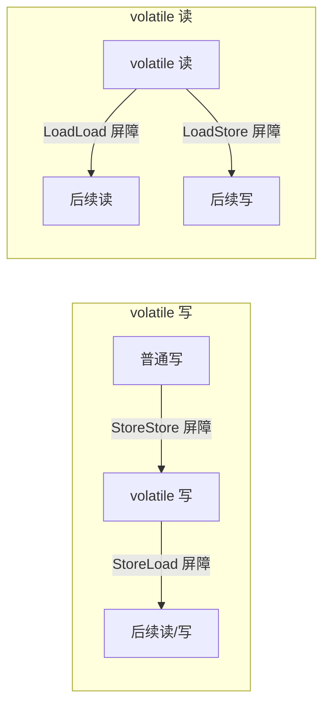

# JMM 是什么？happens-before 原则怎么理解？

> JMM（Java Memory Model）不是 JVM 内存结构，而是 Java 定义的并发编程规范——它规定了线程之间如何通过主内存共享变量的可见性。

## 为什么要搞一个 JMM？

先看问题的根源：CPU 缓存和指令重排序。

### CPU 缓存模型

CPU 处理速度远快于内存，为了弥补这个差距，现代 CPU 引入了多级缓存（L1/L2/L3 Cache）。数据先从内存读到缓存，CPU 从缓存读写，运算完再写回内存。

这带来了**缓存一致性问题**：两个线程各自从 CPU 缓存读到 `i=0`，各自做 `i++`，写回内存后 `i=1` 而不是 `2`。

CPU 通过**缓存一致性协议**（如 MESI）来缓解这个问题，但编程语言不能直接依赖硬件协议——不同 CPU 架构的内存模型不同，直接复用操作系统内存模型会导致代码跨平台行为不一致。

### 指令重排序

为了提升性能，编译器和处理器会对指令进行重排序：

- **编译器优化重排**：编译器在不改变单线程语义的前提下重新安排语句顺序。
- **指令并行重排**：处理器利用指令级并行技术，在不存数据依赖时改变指令执行顺序。
- **内存系统重排**：缓存和写缓冲区导致内存操作看起来被重排。

重排序**保证单线程语义一致，但不保证多线程语义一致**。一段在单线程下正确的代码，多线程下可能因为重排序而行为异常。

### JMM 的定位

JMM 是一层抽象规范，向上为程序员提供 happens-before 规则（简单易用的编程模型），向下通过内存屏障等机制约束编译器和处理器的重排序行为。

## JMM 的核心抽象：主内存与工作内存

JMM 把内存分为两部分：

- **主内存**：所有共享变量存储在这里，所有线程可见。
- **工作内存**：每个线程有自己的工作内存，保存了共享变量的副本。线程只能操作自己工作内存中的变量，不能直接读写主内存。

线程间通信必须经过主内存：线程 A 修改变量后同步回主内存，线程 B 再从主内存读取。

> 工作内存是 JMM 的抽象概念，不真实存在。它涵盖了 CPU 缓存、寄存器、写缓冲区等硬件和编译器优化。

### JMM ≠ JVM 内存结构

这是面试常被追问的区别：

| 对比项       | JVM 内存结构                             | JMM                                      |
| ------------ | ---------------------------------------- | ---------------------------------------- |
| 关注什么     | 运行时数据如何分区存储（堆、栈、方法区） | 线程间如何通过主内存共享变量的可见性     |
| 属于什么领域 | 虚拟机实现                               | 并发编程规范                             |
| 典型问题     | 对象分配在哪里？GC 怎么回收？            | 为什么一个线程改了变量另一个线程看不到？ |

### JMM 定义了 8 种同步操作

JMM 规范中定义了 8 种操作来完成主内存和工作内存之间的交互。面试时不需要逐条背诵，但了解它们的存在有助于理解 JMM 的严谨性：

| 操作     | 作用于   | 说明                               |
| -------- | -------- | ---------------------------------- |
| `lock`   | 主内存   | 把一个变量标识为线程独占           |
| `unlock` | 主内存   | 释放独占状态                       |
| `read`   | 主内存   | 读取变量值，传输到工作内存         |
| `load`   | 工作内存 | 将 read 读到的值放入工作内存的副本 |
| `use`    | 工作内存 | 把工作内存的值传给执行引擎         |
| `assign` | 工作内存 | 把执行引擎的值赋给工作内存变量     |
| `store`  | 工作内存 | 把工作内存的值传输到主内存         |
| `write`  | 主内存   | 将 store 传来的值写入主内存变量    |

这些操作必须满足一些规则，比如 `read` 和 `load` 必须成对出现，`store` 和 `write` 必须成对出现，不允许线程丢弃最近的 `assign` 操作等。实践中你不会直接接触这些操作——它们是 JMM 规范的底层定义，`volatile`、`synchronized` 等关键字已经封装好了这些交互。

## 并发编程的三个特性

| 特性 | 含义 | Java 中的保障手段 |
| **原子性** | 操作不可被中断，要么全执行要么不执行 | `synchronized`、`Lock`、Atomic 类（CAS） |
| **可见性** | 一个线程修改了共享变量，其他线程能立即看到 | `volatile`、`synchronized`、`final` |
| **有序性** | 代码执行顺序符合预期（防止有害重排序） | `volatile`（禁止重排序）、`synchronized` |

`count++` 不是一个原子操作——它包含「读、加 1、写」三步。两个线程同时执行 `count++` 可能丢失一次更新，即使 `count` 用 `volatile` 修饰也没用，因为 `volatile` 只保证可见性和有序性，不保证原子性。

### 一个可见性问题的完整例子

```java
public class VisibilityDemo {
    // 不加 volatile，程序可能永远不停止
    // 加上 volatile 后，主线程的修改对工作线程立即可见
    private static volatile boolean running = true;

    public static void main(String[] args) throws InterruptedException {
        new Thread(() -> {
            while (running) {
                // 空循环——JIT 可能优化掉对 running 的读取
                // volatile 保证每次都从主内存读
            }
            System.out.println("worker stopped");
        }).start();

        Thread.sleep(1000);
        running = false; // 主线程修改后，工作线程能立刻看到
    }
}
```

不加 `volatile` 时，JIT 编译器可能把 `running` 的值缓存在寄存器中，工作线程永远读到 `true`，程序不会停止。这是 CPU 缓存 + 编译器优化共同导致的可见性问题——不是 bug，而是没有正确同步导致的未定义行为。

## happens-before 原则

happens-before 是 JMM 提供给程序员的核心规则，用来判断两个操作之间的内存可见性。

**核心含义**：如果操作 A happens-before 操作 B，那么 A 的结果对 B 可见，且 A 的执行顺序排在 B 之前。

> 注意：happens-before 并不禁止重排序。只要重排序不改变程序执行结果（单线程或正确同步的多线程），JMM 就允许。它约束的是「可见性」，不是严格的「执行先后」。

### 完整的 8 条规则

| 规则                  | 含义                                                                    |
| --------------------- | ----------------------------------------------------------------------- |
| **程序顺序规则**      | 同一线程内，代码书写在前面的操作 happens-before 后面的操作              |
| **volatile 变量规则** | 对 volatile 变量的写操作 happens-before 后续对该变量的读操作            |
| **锁规则**            | 一个锁的 unlock 操作 happens-before 后续对同一把锁的 lock 操作          |
| **传递性**            | 如果 A happens-before B，且 B happens-before C，则 A happens-before C   |
| **线程启动规则**      | `Thread.start()` happens-before 该线程内的所有操作                      |
| **线程终止规则**      | 线程的所有操作 happens-before 其他线程检测到该线程终止（`join()` 返回） |
| **线程中断规则**      | `Thread.interrupt()` 的调用 happens-before 被中断线程检测到中断事件     |
| **对象终结规则**      | 对象的构造函数执行完毕 happens-before 它的 `finalize()` 方法开始执行    |

前 5 条是面试高频，后 3 条了解即可。

### 一个例子

```java
int x = 1; // 操作 A
int y = 2; // 操作 B
int z = x + y; // 操作 C
```

- A happens-before B（程序顺序规则）
- B happens-before C（程序顺序规则）
- A happens-before C（传递性）

但 A 和 B 之间没有数据依赖，编译器可以对调它们的执行顺序——这不违反 happens-before，因为结果不变。

## 内存屏障：JMM 的底层实现

happens-before 规则最终通过**内存屏障**（Memory Barrier）落地。内存屏障是 CPU 指令，作用有两个：禁止特定类型的重排序，强制刷新缓存。

JMM 定义了 4 种屏障：

| 屏障类型       | 插入位置           | 作用                                                                         |
| -------------- | ------------------ | ---------------------------------------------------------------------------- |
| **StoreStore** | 在 volatile 写之前 | 确保之前的所有普通写已刷新到主内存，再执行 volatile 写                       |
| **StoreLoad**  | 在 volatile 写之后 | 确保 volatile 写对其他处理器可见，之后再读。**开销最大**，因为需要清空读缓冲 |
| **LoadLoad**   | 在 volatile 读之后 | 确保 volatile 读完成后才执行后续读操作                                       |
| **LoadStore**  | 在 volatile 读之后 | 确保 volatile 读完成后才执行后续写操作                                       |



> StoreLoad 屏障是 4 种屏障中开销最大的，因为它要求处理器清空写缓冲区并等待内存操作完成。在 x86 架构上，`StoreLoad` 通常映射到 `mfence` 或 `lock` 前缀指令。

## happens-before 和 JMM 的关系

JMM 是一个中间层：

1. **向上**：通过 happens-before 规则为程序员提供简单的编程模型。程序员只要遵守规则，就能保证多线程下的可见性，不需要关心底层重排序。
2. **向下**：将 happens-before 规则映射到具体的内存屏障实现。JMM 只禁止「影响执行结果的重排序」，对不影响结果的重排序保持开放，最大限度释放硬件性能。

这两层是等价的——如果一个操作 A happens-before 操作 B，那么 JMM 就会在底层插入必要的内存屏障来保证 A 的结果对 B 可见。程序员写 `volatile`、`synchronized` 时，JVM 会自动插入对应的屏障，不需要手动干预。

## 容易踩的坑

**把 JMM 当成 JVM 内存结构。** 这是概念性错误。JMM 是并发规范，JVM 内存结构是运行时数据区域划分。

**认为 happens-before 等于「按顺序执行」。** happens-before 保证的是前一个操作的结果对后一个操作可见，不禁止不改变结果的重排序。

**认为 `volatile` 能保证原子性。** `volatile` 保证可见性和有序性，但 `i++` 这种复合操作不是原子的。需要 `AtomicInteger` 或 `synchronized`。

## 小结

- JMM 是 Java 并发编程规范，抽象了主内存和工作内存的关系，解决 CPU 缓存和指令重排序带来的多线程可见性问题。
- 并发三特性：原子性、可见性、有序性。`volatile` 保证可见性和有序性，不保证原子性。
- happens-before 是 JMM 向程序员提供的可见性规则，核心是「前一个操作的结果对后一个操作可见」。
- JMM 不是 JVM 内存结构，两者关注的问题完全不同。

## 参考

综合自《Java 并发编程的艺术》第三章及多篇 JMM 详解资料。部分资料关于八种同步操作（lock/unlock/read/load/use/assign/store/write）的描述较为繁琐，实践中了解即可，本文未逐条展开，而是聚焦在 happens-before 和三特性上。
