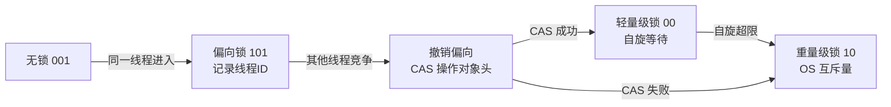

# synchronized 的底层原理是什么？锁优化怎么回事？

> synchronized 是 Java 内置的同步机制，它同时提供互斥和内存可见性。理解它的底层实现，才能回答好面试中关于锁优化的追问。

## synchronized 的三种用法

```java
// 1. 修饰实例方法——锁的是当前实例 this
public synchronized void method() { ... }

// 2. 修饰静态方法——锁的是当前类的 Class 对象
public static synchronized void method() { ... }

// 3. 修饰代码块——锁的是指定对象
synchronized (lockObj) { ... }
```

关键点：**synchronized 锁的是对象，不是代码**。每把锁都关联一个 monitor（管程），同一时刻只有一个线程能持有某个对象的 monitor。

## 字节码层面：monitorenter 和 monitorexit

同步代码块在字节码层面通过 `monitorenter` 和 `monitorexit` 指令实现：

```java
synchronized (obj) {
    // 临界区
}
```

编译后大致为：

```
monitorenter      // 获取 obj 的 monitor
// 临界区代码
monitorexit       // 正常退出，释放 monitor
// ...
monitorexit       // 异常退出，释放 monitor（编译器自动生成）
```

同步方法不使用这两个指令，而是在方法访问标志中设置 `ACC_SYNCHRONIZED`，JVM 调用方法时检查这个标志。

### monitor 的工作机制

每个对象有一个 monitor 计数器：

- 线程进入 `monitorenter` 时，如果计数器为 0，获取锁，计数器设为 1。
- 同一线程再次进入（可重入），计数器加 1。
- 线程执行 `monitorexit` 时，计数器减 1，减到 0 时释放锁。
- 其他线程尝试获取时如果计数器不为 0，会阻塞等待。

## synchronized 的内存语义

synchronized 不仅保证互斥，还保证可见性：

- **加锁时**：清空工作内存，从主内存重新读取共享变量。
- **解锁时**：把工作内存的修改刷新回主内存。

这对应 happens-before 的锁规则：一个锁的 unlock happens-before 后续对同一把锁的 lock。

> 这也是 synchronized 和"只做互斥"的普通概念锁不同的地方。如果只保护临界区但不建立可见性，另一个线程可能仍然读到旧值。

## 对象头与 Mark Word

synchronized 的锁优化都围绕**对象头**展开。HotSpot 的对象头（Object Header）包含两部分：

- **Mark Word**：存储哈希码、GC 分代年龄、锁状态标志位等
- **Klass Pointer**：指向类元数据

在 64 位 JVM 下，Mark Word 为 64 bit，不同锁状态下复用这段空间存储不同信息：

| 锁状态   | Mark Word 存储内容        | 标志位 |
| -------- | ------------------------- | ------ |
| 无锁     | hashCode、GC 年龄         | `001`  |
| 偏向锁   | 线程 ID、epoch            | `101`  |
| 轻量级锁 | 指向栈中锁记录的指针      | `00`   |
| 重量级锁 | 指向 ObjectMonitor 的指针 | `10`   |
| GC 标记  | 空                        | `11`   |

> 这就是为什么 `hashCode()` 和偏向锁有冲突：一旦调用过 `hashCode()`，对象头的 hashCode 位就被占用了，不能再存线程 ID，偏向锁就无法生效。JDK 15+ 偏向锁已废弃，这个细节了解即可。

## synchronized 锁优化：别把"锁升级"背成固定口诀

很多资料会把 synchronized 讲成"无锁 → 偏向锁 → 轻量级锁 → 重量级锁"。这条线索对理解 HotSpot 早期优化很有帮助，但**不能脱离版本**。

### 各级锁的定位

| 锁状态   | 适用场景                   | 核心思路                                      |
| -------- | -------------------------- | --------------------------------------------- |
| 偏向锁   | 同一线程反复进入同一把锁   | 在对象头记录线程 ID，下次进入直接比对，免 CAS |
| 轻量级锁 | 多线程交替进入，竞争不激烈 | 用 CAS 操作对象头，失败则自旋                 |
| 重量级锁 | 竞争激烈                   | 使用 ObjectMonitor，线程阻塞/唤醒             |

### 版本演进（面试必答）

| JDK 版本    | 偏向锁状态                                                 |
| ----------- | ---------------------------------------------------------- |
| JDK 6 ~ 14  | 默认启用                                                   |
| JDK 15      | JEP 374 默认禁用偏向锁，废弃相关参数                       |
| JDK 18      | 偏向锁相关参数被 obsoleted，传入后忽略并警告               |
| JDK 21 ~ 23 | 虚拟线程在 synchronized 中阻塞可能 pin 住平台线程          |
| JDK 24      | JEP 491 改进，虚拟线程在 synchronized 上阻塞可释放载体线程 |

> 面试时可以讲"HotSpot 曾经通过偏向锁、轻量级锁、重量级锁降低 synchronized 成本"，但不要把偏向锁说成现代 JDK 一定会走的默认路径。JDK 15+ 已经默认禁用偏向锁。

### 锁升级流程（面试画图题）



- **偏向锁**：第一个线程进入时，对象头记录线程 ID，后续同一线程进入只需比对 ID，无需 CAS。
- **轻量级锁**：出现竞争时，线程在栈帧中创建 Lock Record，CAS 把对象头的 Mark Word 拷贝到 Lock Record。成功则获得锁，失败则自旋。
- **重量级锁**：自旋超过阈值（自适应自旋）仍未获得锁，膨胀为重量级锁。底层使用 ObjectMonitor，依赖操作系统的互斥量（Mutex），线程被 park 挂起。

### 锁消除与锁粗化

除了锁升级，JIT 还会做两种优化：

**锁消除**：JIT 通过逃逸分析发现某个锁对象不可能被其他线程访问，直接消除锁操作。

```java
// StringBuffer 的 append 是 synchronized 方法
// 但 sb 是局部变量，不可能逃逸到其他线程
// JIT 会消除这个锁
public String concat(String a, String b) {
    StringBuffer sb = new StringBuffer();
    sb.append(a);  // 锁被消除
    sb.append(b);  // 锁被消除
    return sb.toString();
}
```

**锁粗化**：JIT 发现对同一对象连续加锁解锁，会把多个锁操作合并成一个更大的锁范围。

```java
// 优化前：每次循环都加锁解锁
for (int i = 0; i < 1000; i++) {
    synchronized (lock) {
        // do something
    }
}

// 锁粗化后：合并成一个锁
synchronized (lock) {
    for (int i = 0; i < 1000; i++) {
        // do something
    }
}
```

### 工程上的结论

早年那句"能不用 synchronized 就不用"已经不适合今天的 JDK。普通互斥场景下，synchronized 语法简单、异常释放安全（JVM 自动处理）、JIT 优化成熟。只有需要公平锁、可中断获取、超时获取、多个条件队列时，才更自然地转向 `ReentrantLock`。

## 可重入性

synchronized 是可重入的。同一线程持有某对象的 monitor 后，可以再次进入同一把锁保护的代码，JVM 会记录重入次数，退出时逐层递减：

```java
class ReentrantDemo {
    public synchronized void outer() {
        inner(); // 同一线程可以再次进入 this 的 monitor
    }

    public synchronized void inner() {
        // 正常执行，不会死锁
    }
}
```

## 容易踩的坑

**锁对象不稳定。** 锁对象可变（如字符串拼接、装箱对象、可重新赋值的字段），导致不同线程锁到不同对象：

```java
private Object lock = new Object();

public void update() {
    synchronized (lock) {
        lock = new Object(); // 后续线程可能锁到另一把锁！
    }
}
```

锁对象应该定义为 `private final`，不要暴露给外部。

**锁住外部可见对象。** `synchronized (this)` 或 `synchronized (SomeClass.class)` 可能被外部代码拿来加锁，导致锁竞争范围不可控。库代码推荐使用私有 final 锁对象。

**持锁期间做慢操作。** 持锁时访问数据库、调用 RPC、写大文件，会拉长锁占用时间，增加等待线程数、超时和死锁风险。

## synchronized vs ReentrantLock

| 对比项   | synchronized                               | ReentrantLock             |
| -------- | ------------------------------------------ | ------------------------- |
| 语法     | 关键字，JVM 内置                           | API 类，需要 try/finally  |
| 锁释放   | 自动（异常/正常退出）                      | 手动 unlock，必须 finally |
| 可中断   | 不可                                       | `lockInterruptibly()`     |
| 超时获取 | 不可                                       | `tryLock(timeout)`        |
| 公平锁   | 不支持                                     | 支持                      |
| 条件队列 | 一个（wait/notify）                        | 多个 Condition            |
| 锁优化   | 偏向锁（JDK 15- 废弃）、轻量级锁、重量级锁 | CAS + AQS 队列            |

详细的 ReentrantLock 和 AQS 原理在[下一篇](./java-concurrency-reentrantlock.html)展开。

## 小结

- synchronized 通过 monitor 实现互斥，字节码层面用 `monitorenter`/`monitorexit`，同步方法用 `ACC_SYNCHRONIZED` 标志。
- synchronized 同时保证互斥和可见性（加锁清空工作内存、解锁刷新主内存）。
- 锁优化要结合版本讲：偏向锁 JDK 15 已默认禁用，不要当固定口诀背。
- 今天普通互斥场景直接用 synchronized 就够了，需要高级特性时再上 ReentrantLock。

## 参考

基于 Oracle Java SE API Documentation、Java Language Specification、OpenJDK JEP 与 java.util.concurrent 官方 API 中并发、JMM、锁、线程池和虚拟线程相关内容整理。
