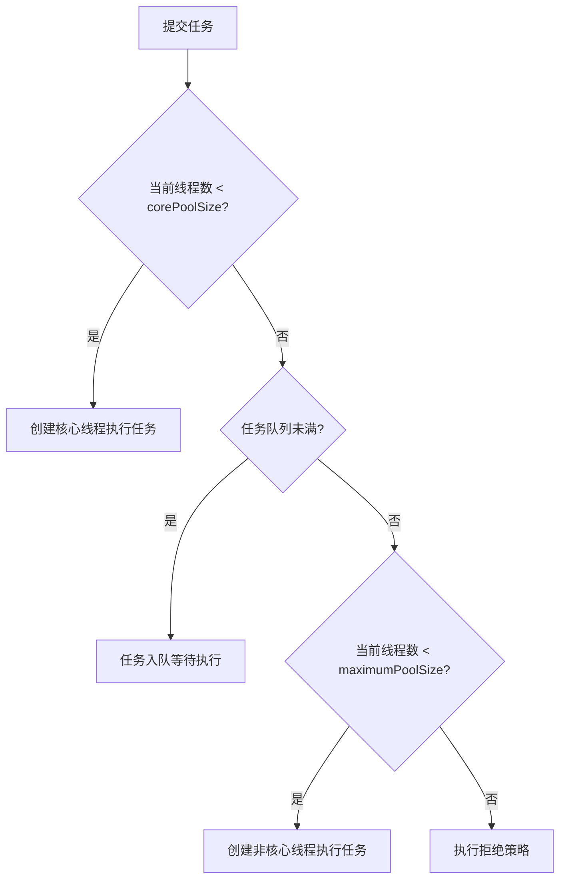

# 线程池 7 个参数怎么理解？执行流程是怎样的？

> 线程池是面试高频中的高频。面试官通常从"7 个参数"切入，然后追问执行流程、拒绝策略、队列选择和线上配置——一条龙下来，能测出候选人的并发功底。

## 为什么用线程池？

不用线程池，每次任务都 `new Thread()`，有三个问题：

1. **创建/销毁开销大**：线程创建涉及操作系统系统调用。
2. **无限制创建可能 OOM**：高并发下线程数量失控。
3. **缺乏管理**：无法监控、无法限流、无法优雅关闭。

线程池通过**池化复用**解决这些问题：线程预先创建并复用，任务队列缓冲，拒绝策略兜底。

## ThreadPoolExecutor 的 7 个参数

```java
public ThreadPoolExecutor(
    int corePoolSize,           // 1. 核心线程数
    int maximumPoolSize,        // 2. 最大线程数
    long keepAliveTime,         // 3. 空闲线程存活时间
    TimeUnit unit,              // 4. 时间单位
    BlockingQueue<Runnable> workQueue,        // 5. 任务队列
    ThreadFactory threadFactory,              // 6. 线程工厂
    RejectedExecutionHandler handler          // 7. 拒绝策略
)
```

| 参数              | 作用                           | 典型值                             |
| ----------------- | ------------------------------ | ---------------------------------- |
| `corePoolSize`    | 常驻线程数，即使空闲也不会回收 | CPU 密集型 ≈ N+1，IO 密集型 ≈ 2N   |
| `maximumPoolSize` | 线程池能创建的最大线程数       | 根据任务类型和资源上限估算         |
| `keepAliveTime`   | 非核心线程空闲超过此时间后回收 | 60s                                |
| `unit`            | keepAliveTime 的时间单位       | `TimeUnit.SECONDS`                 |
| `workQueue`       | 存放等待执行的任务的阻塞队列   | `ArrayBlockingQueue`（有界，推荐） |
| `threadFactory`   | 创建线程的工厂，可自定义线程名 | 自定义工厂便于排查                 |
| `handler`         | 任务太多处理不过来时的拒绝策略 | 见下文                             |

## 执行流程：面试必背

任务提交到线程池后的处理路径：



用一句话记住：**核心线程 → 队列 → 非核心线程 → 拒绝策略**。

> 关键细节：非核心线程执行完初始任务后不会立刻销毁，而是从队列拉取任务继续执行（核心线程用 `workQueue.take()` 阻塞等待，非核心线程用 `workQueue.poll(keepAliveTime)` 超时等待）。所以新任务放入队列后，空闲的非核心线程会抢先取走执行。

## 任务队列的选择

| 队列类型                | 特点                          | 使用场景                 |
| ----------------------- | ----------------------------- | ------------------------ |
| `ArrayBlockingQueue`    | 有界，数组实现                | **推荐**，防止 OOM       |
| `LinkedBlockingQueue`   | 默认无界（Integer.MAX_VALUE） | 不推荐直接用，需指定容量 |
| `SynchronousQueue`      | 不存储元素，直接传递          | CachedThreadPool 用      |
| `PriorityBlockingQueue` | 支持优先级排序                | 任务有优先级时           |

> 《阿里巴巴 Java 开发手册》强制要求：线程池不允许用 `Executors` 创建，必须用 `ThreadPoolExecutor` 构造函数。原因是 `Executors.newFixedThreadPool` 和 `newSingleThreadExecutor` 用的 `LinkedBlockingQueue` 默认无界，可能堆积大量任务导致 OOM。

## 4 种内置拒绝策略

| 策略                  | 行为                            | 适用场景                     |
| --------------------- | ------------------------------- | ---------------------------- |
| `AbortPolicy`（默认） | 抛 `RejectedExecutionException` | 核心业务，要求必须感知到拒绝 |
| `CallerRunsPolicy`    | 在调用者线程中执行任务          | 不允许丢任务，且可接受反压   |
| `DiscardPolicy`       | 静默丢弃                        | 非关键路径（日志、监控）     |
| `DiscardOldestPolicy` | 丢弃队列最老的任务              | 只关心最新数据（行情推送）   |

生产环境常见的做法是**自定义拒绝策略**：记录监控指标、写入数据库后续补偿、或放入消息队列异步重试。`CallerRunsPolicy` 的价值在于形成天然反压：调用者线程被迫执行任务，在此期间无法继续提交新任务。

## 线程池的状态

ThreadPoolExecutor 用一个 `AtomicInteger` 类型的 `ctl` 变量同时存储运行状态和工作线程数：

| 状态         | 说明                                                                   |
| ------------ | ---------------------------------------------------------------------- |
| `RUNNING`    | 接受新任务，处理队列任务（初始状态）                                   |
| `SHUTDOWN`   | 不接受新任务，处理队列中已有任务（`shutdown()` 后）                    |
| `STOP`       | 不接受新任务，不处理队列任务，中断正在执行的任务（`shutdownNow()` 后） |
| `TIDYING`    | 所有任务终止，工作线程数为 0                                           |
| `TERMINATED` | `terminated()` 钩子方法执行完毕                                        |

状态单向流转：`RUNNING → SHUTDOWN → TIDYING → TERMINATED`。

## Executors 工具类为什么不推荐

| 方法                      | 风险                                          |
| ------------------------- | --------------------------------------------- |
| `newFixedThreadPool`      | `LinkedBlockingQueue` 无界 → 任务堆积 OOM     |
| `newSingleThreadExecutor` | 同上                                          |
| `newCachedThreadPool`     | 最大线程数 `Integer.MAX_VALUE` → 线程过多 OOM |
| `newScheduledThreadPool`  | `DelayedWorkQueue` 无界 → 任务堆积 OOM        |

正确做法是直接用 `ThreadPoolExecutor` 构造函数，明确指定每个参数。

## 核心线程数怎么估算

| 任务类型   | 经验公式  | 说明                                                                    |
| ---------- | --------- | ----------------------------------------------------------------------- |
| CPU 密集型 | N + 1     | N = CPU 核心数。多 1 个线程是为了在某个线程偶尔阻塞时其他线程能用满 CPU |
| IO 密集型  | 2N 或更多 | IO 等待期间 CPU 空闲，可以切换到其他线程                                |

> 公式只是起点。实际配置要看任务耗时比例、下游依赖、内存限制，结合压测调整。也可以用 Little's Law 估算：线程数 = 目标 QPS × 平均响应时间。

## Worker 是什么：线程池怎么管理线程

ThreadPoolExecutor 内部用 `Worker` 类封装工作线程。Worker 继承 AQS（实现独占锁），同时实现 Runnable：

```java
private final class Worker extends AbstractQueuedSynchronizer implements Runnable {
    final Thread thread;       // Worker 对应的线程
    Runnable firstTask;        // 创建时传入的第一个任务（可能为 null）
    volatile long completedTasks; // 已完成任务数

    Worker(Runnable firstTask) {
        setState(-1); // 抑制中断直到 runWorker 开始
        this.firstTask = firstTask;
        this.thread = getThreadFactory().newThread(this);
    }

    public void run() {
        runWorker(this);
    }
}
```

Worker 的核心是 `runWorker` 方法——线程池的线程不会执行完一个任务就退出，而是循环从队列取任务：

```java
final void runWorker(Worker w) {
    Thread wt = Thread.currentThread();
    Runnable task = w.firstTask;
    w.firstTask = null;
    w.unlock(); // 允许中断
    try {
        while (task != null || (task = getTask()) != null) {
            w.lock(); // Worker 加锁，标记线程正在执行任务
            // 检查线程池状态和中断状态...
            try {
                beforeExecute(wt, task); // 钩子方法
                task.run();              // 实际执行任务
                afterExecute(task, null); // 钩子方法
            } catch (Throwable ex) {
                afterExecute(task, ex);
            } finally {
                task = null;
                w.completedTasks++;
                w.unlock();
            }
        }
    } finally {
        processWorkerExit(w, false); // 线程退出清理
    }
}
```

`getTask()` 从队列取任务，核心线程用 `workQueue.take()` 阻塞等待，非核心线程用 `workQueue.poll(keepAliveTime)` 超时等待。超时返回 null，循环退出，线程被回收。

> 这也解释了一个常见疑问：为什么非核心线程执行完初始任务后不会立刻销毁？因为 `runWorker` 的 while 循环会继续调 `getTask()` 从队列拉任务。只要队列非空，非核心线程就会继续工作。

## execute() vs submit()

`execute()` 和 `submit()` 都用来提交任务，区别在于返回值和异常处理：

| 对比项   | `execute(Runnable)`                         | `submit(Callable/Runnable)`            |
| -------- | ------------------------------------------- | -------------------------------------- |
| 返回值   | `void`                                      | `Future<T>`                            |
| 异常处理 | 未捕获异常触发 `afterExecute`，线程可能退出 | 异常被封装在 Future 中，`get()` 时抛出 |
| 参数类型 | `Runnable`                                  | `Runnable` 或 `Callable`               |

```java
// execute：异常会直接抛出
pool.execute(() -> {
    throw new RuntimeException("boom"); // 线程会终止，线程池创建新线程替代
});

// submit：异常被吞进 Future
Future<?> future = pool.submit(() -> {
    throw new RuntimeException("boom"); // 不报错
});
future.get(); // 这里才抛 ExecutionException
```

> 生产中常见的坑：用 `submit` 提交 `Runnable` 但不调 `get()`，异常被静默吞掉，任务失败但无感知。建议用 `submit` 时一定要处理 `Future`，或者自定义 `ThreadFactory` 设置 `UncaughtExceptionHandler`。

## 项目实战要点

**业务隔离。** 不同业务用不同线程池，避免慢任务拖垮核心链路。比如订单创建用独立线程池，日志异步上报用另一个。

**监控必不可少。** 关注：活跃线程数、队列长度、拒绝次数、任务执行耗时。核心指标建议接入 Prometheus + Grafana。

**队列必须有界。** 无界队列会把 OOM 从线程数维度转移到内存维度，问题更难排查。

**优雅关闭。** `shutdown()` 让队列任务执行完再关闭，`shutdownNow()` 立即中断并返回未执行的任务列表。Spring 应用可以注册 `@PreDestroy` 钩子。

## 线程池监控指标

生产环境必须监控线程池的核心指标，否则线程池打满时只能干看着：

| 指标         | 获取方式                             | 含义                   |
| ------------ | ------------------------------------ | ---------------------- |
| 活跃线程数   | `getActiveCount()`                   | 正在执行任务的线程数   |
| 当前线程数   | `getPoolSize()`                      | 线程池当前线程总数     |
| 队列堆积数   | `getQueue().size()`                  | 等待执行的任务数       |
| 已完成任务数 | `getCompletedTaskCount()`            | 历史完成任务总数       |
| 拒绝次数     | 自定义 RejectedExecutionHandler 统计 | 被拒绝策略拒绝的任务数 |

推荐做法：自定义一个 `MonitorableThreadPool` 继承 `ThreadPoolExecutor`，重写 `beforeExecute`/`afterExecute`/`rejectedExecution`，把指标上报到 Prometheus。

```java
public class MonitorableThreadPool extends ThreadPoolExecutor {
    private final AtomicLong rejectedCount = new AtomicLong();

    @Override
    protected void afterExecute(Runnable r, Throwable t) {
        super.afterExecute(r, t);
        // 上报：活跃线程数、队列大小、已完成任务数
        Metrics.gauge("pool.active", getActiveCount());
        Metrics.gauge("pool.queue.size", getQueue().size());
    }

    @Override
    public void rejectedExecution(Runnable r, ThreadPoolExecutor executor) {
        rejectedCount.incrementAndGet();
        Metrics.counter("pool.rejected").increment();
        super.rejectedExecution(r, executor);
    }
}
```

## Spring 中的线程池配置

Spring Boot 中推荐用 `@Bean` 定义线程池，而不是用 `Executors`：

```java
@Configuration
public class ThreadPoolConfig {

    @Bean("orderExecutor")
    public ThreadPoolExecutor orderExecutor() {
        return new ThreadPoolExecutor(
            8,                              // corePoolSize
            16,                             // maximumPoolSize
            60, TimeUnit.SECONDS,           // keepAliveTime
            new ArrayBlockingQueue<>(200),  // 有界队列
            new ThreadFactoryBuilder()
                .setNameFormat("order-pool-%d")
                .setUncaughtExceptionHandler((t, e) ->
                    log.error("thread {} error", t.getName(), e))
                .build(),
            new ThreadPoolExecutor.CallerRunsPolicy() // 拒绝策略
        );
    }
}

// 使用
@Autowired
@Qualifier("orderExecutor")
private ThreadPoolExecutor orderExecutor;
```

线程命名很重要——线上排查时 `jstack` 看到的线程名能直接定位是哪个线程池出了问题。

## 小结

- 7 个参数记住核心三件套：`corePoolSize`（常驻）、`maximumPoolSize`（上限）、`workQueue`（缓冲）。
- 执行流程四步走：核心线程 → 队列 → 非核心线程 → 拒绝策略。
- 拒绝策略根据业务选：零容忍用 AbortPolicy，允许反压用 CallerRunsPolicy。
- 不用 `Executors`，用 `ThreadPoolExecutor` 构造函数，队列必须有界。
- 核心线程数按任务类型初估，再结合压测调整。

## 参考

基于 Oracle Java SE API Documentation、Java Language Specification、OpenJDK JEP 与 java.util.concurrent 官方 API 中并发、JMM、锁、线程池和虚拟线程相关内容整理。
