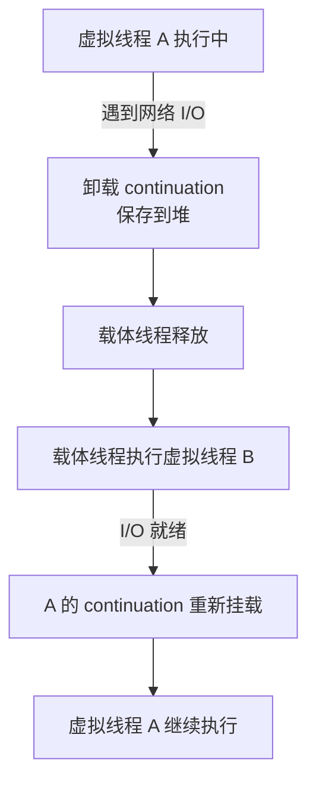

# 虚拟线程解决了什么问题？和平台线程什么关系？

> 虚拟线程是 JDK 21 正式引入的轻量级线程（JEP 444）。它不是"更快的线程"，而是"可以创建很多、阻塞成本更低的线程"。

## 问题背景：平台线程太贵

一个 Web 请求进来，代码要查数据库、调 RPC、读写文件。按传统的同步写法，这个请求会占住一个平台线程，哪怕大部分时间都在等 I/O。

线程池能缓解线程创建成本，但平台线程数量受操作系统线程、内存和调度成本限制。当并发请求持续增加，线程池被排队任务占满，吞吐量很快卡住。

异步编程（Reactive、CompletableFuture 链）可以把线程从等待 I/O 中释放出来，但代价是调用链被拆成回调，异常处理、调试和上下文传递都变复杂。

虚拟线程试图保留同步代码的简洁性，同时让等待 I/O 时不占用昂贵的平台线程。

## 虚拟线程是什么？

虚拟线程是 `java.lang.Thread` 的一种实现，由 JDK 调度和管理，而不是直接和操作系统线程一一绑定。

```
虚拟线程 (百万级)
  ↓ 挂载/卸载
平台线程 / 载体线程 (有限)
  ↓ 一对一
操作系统线程
```

- 虚拟线程执行 Java 代码时挂载到某个平台线程上。
- 遇到可挂起的阻塞操作（如网络 I/O、`BlockingQueue.take()`）时，虚拟线程卸载，平台线程被释放出来执行其他虚拟线程。
- 阻塞操作就绪后，虚拟线程再被调度回某个平台线程继续执行。

这个过程对业务代码透明——你写的仍然是普通同步代码。

## 虚拟线程 vs 平台线程

| 对比项         | 平台线程        | 虚拟线程                 |
| -------------- | --------------- | ------------------------ |
| 与 OS 线程关系 | 一对一          | 多对少（由 JDK 调度）    |
| 创建成本       | 高（系统调用）  | 低（Java 对象）          |
| 数量上限       | 数千级          | 百万级                   |
| 栈存储         | 固定大小，OS 栈 | 栈块对象，存放在 Java 堆 |
| 适合任务       | CPU 密集型      | I/O 密集型               |
| 池化           | 推荐线程池      | **不要池化**             |

## 调度器与 continuation

虚拟线程不绑定固定平台线程，由 JDK 内置的调度器管理：

- **调度器**：一个共享的 `ForkJoinPool`，并行度默认等于 CPU 核心数（可用 `-Djdk.virtualThreadScheduler.parallelism` 调整）。
- **载体线程**：调度器从池中取出平台线程（载体线程），将虚拟线程挂载上去执行。
- **卸载（unmount）**：虚拟线程遇到可挂起的阻塞操作时，JDK 把它的执行栈保存为 continuation 对象，从载体线程上卸载。载体线程被释放，可以执行其他虚拟线程。
- **重新挂载**：阻塞操作就绪后，continuation 被调度器重新挂载到某个载体线程继续执行。



> continuation 是 JDK 内部机制，不暴露给开发者。但你可以在 `Thread.dump` 中看到 `<continuation>` 栈帧——这是虚拟线程与传统线程最直观的区别。

## 结构化并发（预览特性）

JDK 21+ 还引入了**结构化并发**（Structured Concurrency，JEP 453，预览阶段），让虚拟线程的生命周期管理更清晰：

```java
try (var scope = new StructuredTaskScope.ShutdownOnFailure()) {
    // 并行执行多个子任务
    Subtask<String> user = scope.fork(() -> fetchUser(id));
    Subtask<Order> order = scope.fork(() -> fetchOrder(id));

    scope.join();           // 等待所有子任务完成
    scope.throwIfFailed();  // 任一失败则抛异常，取消其他子任务

    // 所有子任务都成功
    return new Result(user.get(), order.get());
}
```

核心思想：子任务的生命周期限定在 scope 内，scope 关闭时所有未完成的子任务自动取消。避免了传统并发编程中"任务泄漏"（子任务跑飞了没人管）的问题。

> 结构化并发目前还在预览阶段（JDK 21-24），API 可能变化。面试时提到它代表"虚拟线程配套的编程模型方向"即可。

## 如何创建虚拟线程

```java
// 方式一：直接启动
Thread.startVirtualThread(() -> {
    System.out.println("hello virtual thread");
});

// 方式二：Builder API
Thread t = Thread.ofVirtual()
    .name("order-query")
    .start(() -> queryOrder());

// 方式三：ExecutorService（最常用）
try (ExecutorService executor = Executors.newVirtualThreadPerTaskExecutor()) {
    Future<String> future = executor.submit(() -> queryOrder());
    System.out.println(future.get());
}
```

> `Executors.newVirtualThreadPerTaskExecutor()` 不是传统线程池——它为每个任务创建一个新的虚拟线程，不复用。虚拟线程本身不是稀缺资源，池化没有意义。

## Pinning：虚拟线程的坑

Pinning（固定）是指虚拟线程暂时无法从载体线程上卸载。在 JDK 21 到 JDK 23 中，最典型的场景是**虚拟线程在 `synchronized` 代码块中执行阻塞操作**：

```java
public synchronized String load() throws IOException {
    return httpClient.send(request, BodyHandlers.ofString()).body();
    // JDK 21-23: 阻塞时 Pinning，载体线程被占住
}
```

Pinning 会让虚拟线程连带占住底层操作系统线程，扩展性变差。

### 版本差异

| JDK 版本    | synchronized + 阻塞 | 处理建议                                              |
| ----------- | ------------------- | ----------------------------------------------------- |
| JDK 21 ~ 23 | 可能 Pinning        | 避免 synchronized 内做慢 I/O；用 `ReentrantLock` 替代 |
| JDK 24+     | JEP 491 解决        | synchronized 可以正常使用                             |

### 如何检测 Pinning

```bash
# JFR 观察 Pinning 事件
jdk.VirtualThreadPinned

# 临时打开栈追踪（JDK 21-23）
-Djdk.tracePinnedThreads=full

# 线程转储
jcmd <pid> Thread.dump_to_file -format=json thread-dump.json
```

## 虚拟线程的注意事项

**不要当作 CPU 提速工具。** 虚拟线程提升的是等待型任务的并发承载能力。CPU 密集型任务最终要抢 CPU 时间片，虚拟线程再多也突破不了物理核心数。

**不要池化虚拟线程。** 需要限制并发时，限制具体资源（数据库连接池、`Semaphore`、限流器），而不是限制虚拟线程数量。

**小心 ThreadLocal 缓存大对象。** 以前线程池几十个线程，每个缓存一份大对象问题不大。迁移到虚拟线程后，百万级线程各持一份副本，内存会被放大。传 TraceId、用户 ID 没问题，缓存数据库连接、formatter 就要重新评估。

**虚拟线程不消除线程安全问题。** 虚拟线程让创建线程更便宜，也意味着更容易同时跑起大量并发任务。原来因为线程池小而没暴露的数据竞争，切到虚拟线程后可能更容易出现。

**注意下游容量。** 很多服务迁移到虚拟线程后，第一个瓶颈不再是业务线程池，而是数据库连接池、HTTP 连接池、Redis 连接数或下游限流。虚拟线程让更多任务有机会同时推进，但真正的共享资源仍然要按容量管理。

## Spring Boot 接入

Spring Boot 3.2 开始提供直接开关：

```yaml
spring:
  threads:
    virtual:
      enabled: true
  main:
    keep-alive: true # 虚拟线程是守护线程，需要保持 JVM 存活
```

开启后，Spring MVC 的请求处理线程会使用虚拟线程。适合同步阻塞、I/O 等待明显的接口。

## 什么时候用虚拟线程，什么时候不用

| 场景                                 | 是否适合虚拟线程            |
| ------------------------------------ | --------------------------- |
| 同步阻塞的 Web 接口（查 DB、调 RPC） | ✅ 非常适合                 |
| 消息消费中含阻塞 I/O                 | ✅ 适合                     |
| 批量并发调用下游接口                 | ✅ 适合                     |
| CPU 密集型计算（哈希、排序、压缩）   | ❌ 不适合                   |
| 已经全链路 Reactive/WebFlux          | ⚠️ 不一定有收益，混用更复杂 |

## 小结

- 虚拟线程是 JDK 21 的轻量级线程，由 JDK 调度，可以映射到少量平台线程上。
- 虚拟线程适合 I/O 密集型任务，不适合 CPU 密集型任务，不要池化。
- JDK 21-23 中 `synchronized` 内阻塞可能 Pinning，JDK 24 的 JEP 491 已解决。
- 迁移要点：不要缓存大对象到 ThreadLocal、注意下游容量、虚拟线程不消除线程安全问题。
- Spring Boot 3.2+ 可通过 `spring.threads.virtual.enabled=true` 一键开启。

## 参考

综合自多篇虚拟线程总结资料及 JEP 444 官方文档。部分资料对虚拟线程的创建方式、底层原理、Pinning 检测和 Spring Boot 接入有完整介绍，本文在此基础上突出了版本差异（JDK 21-23 vs JDK 24+）和迁移注意事项——这两点是面试和实践中最容易被追问的。
