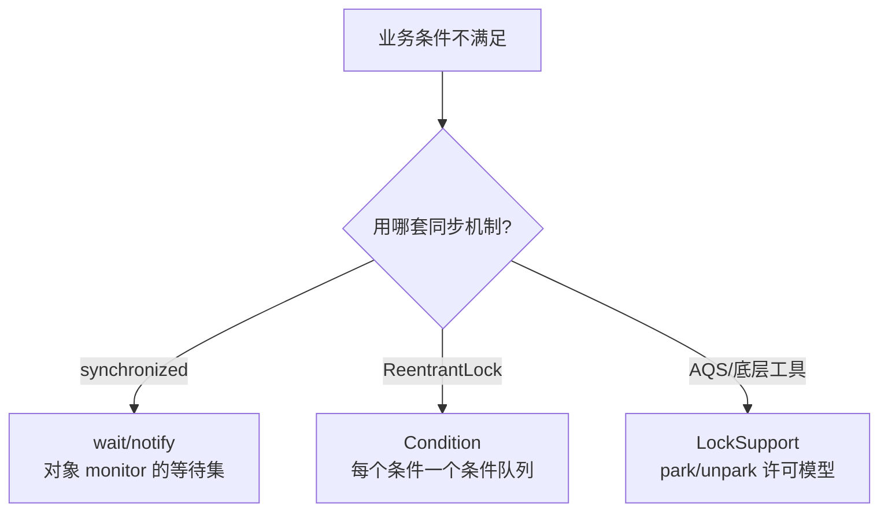
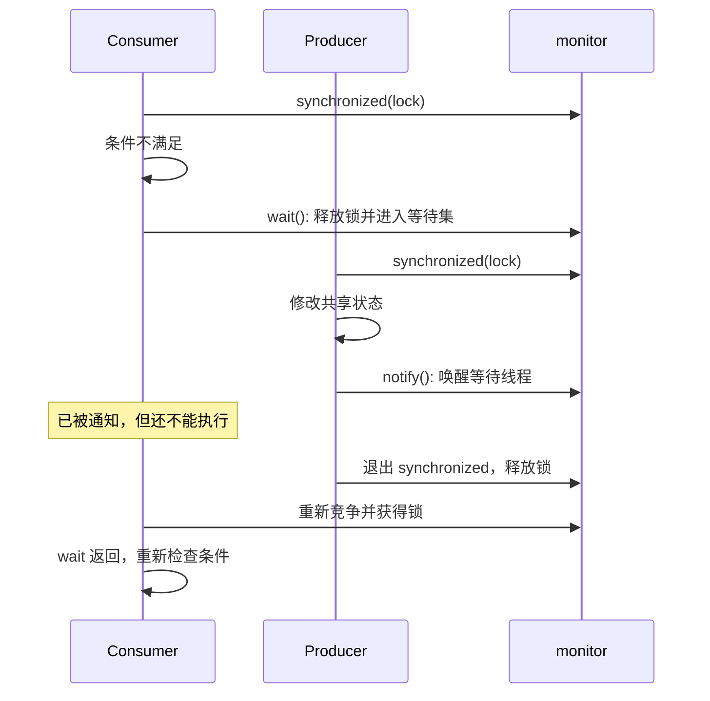
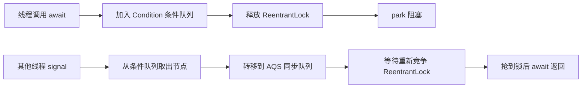

# wait/notify、Condition、LockSupport 有什么区别？

> 等待唤醒不是"暂停线程这么简单"：`wait/notify` 依赖 monitor，`Condition` 依赖
> `Lock` 和条件队列，`LockSupport` 则是更底层的许可模型。

## 为什么线程不能只靠 while 空转等待？

先看一个生产者消费者问题：队列为空时，消费者不能继续取；队列满时，生产者不能继续放。

最粗暴的写法是一直循环检查：

```java
while (queue.isEmpty()) {
    // 什么都不做，反复检查
}
E item = queue.remove();
```

这叫忙等。它虽然能等到条件变化，但会持续占用 CPU。条件一时半会儿不满足时，线程只是白白烧
CPU 时间。

更合理的做法是：**条件不满足时让线程睡下去，条件可能满足时再把它叫醒**。Java 里常见的三套
工具就是：

- `Object.wait/notify/notifyAll`
- `Condition.await/signal/signalAll`
- `LockSupport.park/unpark`

它们都能让线程等待和被唤醒，但所在层级不一样，使用规则也不一样。



## wait/notify：依附在对象 monitor 上

`wait/notify` 是 `Object` 上的方法，不属于 `Thread`。原因很关键：它等待的不是"某个线程本身"，而是
**某个对象 monitor 保护下的条件**。

典型写法如下：

```java
class SimpleBuffer<E> {
    private final Queue<E> queue = new ArrayDeque<>();
    private final int capacity;

    SimpleBuffer(int capacity) {
        this.capacity = capacity;
    }

    public synchronized void put(E item) throws InterruptedException {
        while (queue.size() == capacity) {
            wait(); // 释放 this 的 monitor，进入 this 的等待集
        }
        queue.add(item);
        notifyAll(); // 队列状态变了，通知等待线程重新检查条件
    }

    public synchronized E take() throws InterruptedException {
        while (queue.isEmpty()) {
            wait();
        }
        E item = queue.remove();
        notifyAll();
        return item;
    }
}
```

这里有几条规则必须记牢。

**第一，调用 `wait/notify` 前必须持有同一个对象的 monitor。**

也就是说，`obj.wait()` 必须出现在 `synchronized (obj)` 或锁住同一个对象的同步方法里。否则会抛
`IllegalMonitorStateException`。

```java
synchronized (lock) {
    lock.wait();
}
```

**第二，`wait()` 会释放 monitor，`sleep()` 不会。**

线程调用 `wait()` 后，会释放当前持有的对象 monitor，并进入这个对象的等待集。否则消费者等队列不空时还
一直占着锁，生产者根本进不来放数据，系统就卡死了。

`Thread.sleep()` 只是让当前线程休眠一段时间，不会释放已经持有的锁。所以它不能用来做条件等待。

**第三，被 `notify` 唤醒不等于马上执行。**

`notify()` 只是从对象等待集中挑一个线程唤醒。被唤醒的线程会从等待集转到锁竞争里，等当前线程退出
`synchronized`、释放 monitor 后，它还要重新抢到这把锁，`wait()` 才能返回。

用时间线看更清楚：



**第四，条件判断必须用 `while`，不要用 `if`。**

这不是风格问题，而是正确性问题：

- 线程可能被虚假唤醒；
- `notifyAll()` 会叫醒多个线程，但条件可能只够一个线程消费；
- 被叫醒后还要重新竞争锁，等它抢到锁时，条件可能已经被别的线程改变。

所以等待条件的标准写法永远是：

```java
synchronized (lock) {
    while (!condition) {
        lock.wait();
    }
    // 条件成立后再执行
}
```

## notify 还是 notifyAll？

`notify()` 只唤醒一个等待线程，`notifyAll()` 唤醒这个对象等待集里的所有线程。

如果一个对象上只有一种等待条件，`notify()` 可能足够；但只要同一个 monitor 上混了多种条件，
`notify()` 就容易叫错人。

还是生产者消费者的例子。队列有两个条件：

- 队列不满：生产者才能放。
- 队列不空：消费者才能取。

如果生产者放入一个元素后调用 `notify()`，被唤醒的可能也是另一个生产者。它醒来发现队列仍然满，又睡回去；
真正该醒的消费者没醒，系统吞吐就可能异常，极端情况下还会卡住。

`notifyAll()` 更保守：把所有等待线程都叫醒，让它们自己用 `while` 重新检查条件。代价是可能唤醒一批没必要醒的
线程，带来额外竞争。

这也解释了为什么 `Condition` 有价值：它能把不同条件拆成不同队列，减少"叫错人"。

## Condition：一把锁可以有多个条件队列

`Condition` 通常和 `ReentrantLock` 搭配使用。它提供的能力和 `wait/notify` 类似，但队列划分更细。

```java
class BoundedBuffer<E> {
    private final ReentrantLock lock = new ReentrantLock();
    private final Condition notFull = lock.newCondition();
    private final Condition notEmpty = lock.newCondition();
    private final Queue<E> queue = new ArrayDeque<>();
    private final int capacity;

    BoundedBuffer(int capacity) {
        this.capacity = capacity;
    }

    public void put(E item) throws InterruptedException {
        lock.lockInterruptibly();
        try {
            while (queue.size() == capacity) {
                notFull.await(); // 只让生产者在 notFull 条件上等
            }
            queue.add(item);
            notEmpty.signal(); // 只唤醒等 notEmpty 的消费者
        } finally {
            lock.unlock();
        }
    }

    public E take() throws InterruptedException {
        lock.lockInterruptibly();
        try {
            while (queue.isEmpty()) {
                notEmpty.await(); // 只让消费者在 notEmpty 条件上等
            }
            E item = queue.remove();
            notFull.signal(); // 只唤醒等 notFull 的生产者
            return item;
        } finally {
            lock.unlock();
        }
    }
}
```

这段代码里，生产者和消费者不再挤在同一个等待集里：

- 队列满了，生产者进入 `notFull` 条件队列。
- 队列空了，消费者进入 `notEmpty` 条件队列。
- 放入元素后，只通知 `notEmpty`。
- 取出元素后，只通知 `notFull`。

它比 `synchronized + wait/notifyAll` 更精细。

### await/signal 背后的队列迁移

`Condition` 的底层实现和 AQS 关系很深。可以简化成两个队列：

- **条件队列**：调用 `await()` 后先进入这里，每个 `Condition` 有自己的条件队列。
- **同步队列**：AQS 的 CLH 变体队列，负责真正竞争 `ReentrantLock`。

`await()` 大致做三件事：

1. 当前线程必须已经持有 `ReentrantLock`，否则抛异常。
2. 把当前线程包装成节点，放入当前 `Condition` 的条件队列。
3. 释放锁，然后通过 `LockSupport.park()` 挂起。

`signal()` 也不是让线程立刻运行，而是：

1. 检查当前线程是否持有锁。
2. 从条件队列取出一个等待节点。
3. 把它转移到 AQS 同步队列。
4. 等当前线程释放锁后，被唤醒线程再去竞争锁。



所以，`Condition.signal()` 和 `Object.notify()` 有一个共同点：**它们都不是直接把线程送进临界区**，
只是让线程从“条件等待”进入“锁竞争”。

## LockSupport：更底层的许可模型

`LockSupport` 是很多并发工具的底层积木。AQS 线程入队后真正阻塞时，用的就是
`LockSupport.park()`；释放锁唤醒后继节点时，用的是 `LockSupport.unpark(thread)`。

它的模型可以理解成：每个线程有一个最多为 1 的许可。

- `unpark(thread)`：给目标线程发一个许可。如果许可已经有了，不会累加。
- `park()`：如果有许可，直接消费许可并返回；如果没有许可，阻塞当前线程。

这带来一个和 `wait/notify` 很不一样的能力：**可以先 unpark，再 park**。

```java
Thread worker = new Thread(() -> {
    LockSupport.park(); // 如果许可已经提前发放，这里会直接返回
    System.out.println("continue");
});

LockSupport.unpark(worker);
worker.start();
```

这段代码里，`unpark` 可以发生在 `park` 之前。许可会先放在线程身上，等线程之后执行 `park()` 时直接消费。

`wait/notify` 没这个能力。如果没有线程正在 `wait()`，一次 `notify()` 就过去了，不会被保存成未来可用的通知。

不过 `LockSupport` 也有边界：

- 它不帮你管理任何业务条件，只负责阻塞和放行。
- `park()` 可能因为中断、超时或虚假返回而醒来。
- `park()` 不会像 `wait()` 那样自动释放某个 monitor。

所以业务代码很少直接用 `LockSupport` 写同步逻辑。它更适合作为 AQS、线程池、阻塞队列这类并发组件的底层工具。

## 三者怎么选？

| 对比项       | `wait/notify`         | `Condition`                    | `LockSupport`             |
| ------------ | --------------------- | ------------------------------ | ------------------------- |
| 依赖对象     | 对象 monitor          | `Lock`，典型是 `ReentrantLock` | 线程自身的许可            |
| 等待队列     | 每个对象一个等待集    | 每个 `Condition` 一个条件队列  | 不维护业务条件队列        |
| 调用前提     | 必须持有对象 monitor  | 必须持有关联的锁               | 不要求持有锁              |
| 等待时释放锁 | `wait()` 释放 monitor | `await()` 释放关联锁           | `park()` 不自动释放任何锁 |
| 唤醒语义     | `notify` 转入锁竞争   | `signal` 转入 AQS 同步队列     | `unpark` 发放一个许可     |
| 通知能否预发 | 不能，没人等待就丢失  | 不能按业务条件预发             | 可以，许可会保留一次      |
| 典型场景     | 简单 monitor 条件等待 | 多条件队列、可中断/超时锁配合  | AQS、线程池等底层并发组件 |

实际选型可以简单记：

- 已经用 `synchronized` 管共享状态，条件也很简单，可以用 `wait/notifyAll`。
- 需要多个条件队列、可中断加锁、超时获取锁，优先用 `ReentrantLock + Condition`。
- 写并发框架或底层同步器，才直接考虑 `LockSupport`。

## 容易踩的坑

**把 `wait` 和 `sleep` 混为一谈。**

`wait()` 会释放对象 monitor，适合条件等待；`sleep()` 不释放锁，只是让线程休眠。持锁后 `sleep()` 可能把其他线程都堵住。

**用 `if` 判断等待条件。**

等待条件必须放在 `while` 里反复检查。线程被唤醒只代表“该再看一眼条件了”，不代表条件一定成立。

**调用 `notify` 后以为对方已经执行。**

被通知线程还要等当前线程释放锁，再重新竞争 monitor。`signal()` 也是同理，被 signal 的线程要先进入同步队列，再抢锁。

**在不同对象上 wait 和 notify。**

`lockA.wait()` 只能被 `lockA.notify()` 或 `lockA.notifyAll()` 唤醒。用错锁对象，等待线程可能永远醒不过来。

**直接用 LockSupport 写业务等待，忘了业务条件。**

`park/unpark` 只是阻塞和许可，不表达“队列是否为空”“库存是否足够”这类业务条件。即使用
`LockSupport`，醒来后也必须检查条件。

## 小结

- `wait/notify` 依赖对象 monitor：调用前必须持有同一把 monitor，`wait()` 会释放锁，醒来后要重新竞争锁。
- `Condition` 依赖 `ReentrantLock`：一个锁可以拆出多个条件队列，`await()` 释放锁并进入条件队列，`signal()` 把节点转到 AQS 同步队列。
- `LockSupport` 是底层许可模型：`unpark` 可以先于 `park`，但它不管理业务条件，也不会自动释放锁。
- 等待条件必须用 `while` 反复检查，因为唤醒不等于条件成立，也不等于线程马上执行。
- 简单 monitor 协作用 `wait/notifyAll`，多条件协作用 `Condition`，底层同步器才直接用 `LockSupport`。

## 参考

综合本仓库 `docs/` 下 Java 锁、AQS、ReentrantLock、多线程同步资料，以及 Java SE API 中 `Object`、`Condition`、`LockSupport` 的语义整理；重点核对了 `wait` 释放 monitor、`Condition` 条件队列到 AQS 同步队列的迁移、`park/unpark` 的许可模型和唤醒后必须重新检查条件这些边界。
