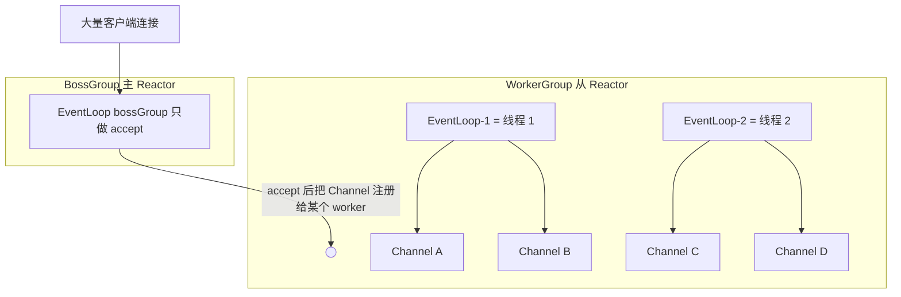
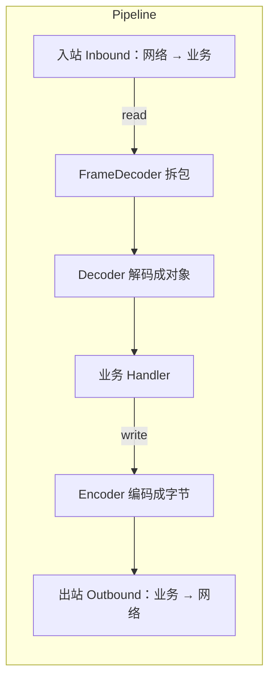

# Netty 的线程模型是怎样的？为什么高性能？

> Netty 的高性能不是某一个魔法开关，而是主从 Reactor、无锁串行化、零拷贝和内存池这几件事叠出来的结果。

## Netty 到底解决了原生 NIO 的什么麻烦

如果直接用 JDK 的 NIO 写一个高并发服务端，你会很快撞上一堆和业务无关的坑：

- **Selector 空轮询 bug**：早期 JDK 在 Linux 上有一个著名问题，`Selector.select()` 明明没有就绪事件却立刻返回，导致某个线程 CPU 空转到 100%。要自己写代码检测并重建 Selector 才能绕过去。
- **API 琐碎易错**：`ByteBuffer` 的 `flip()` / `clear()` / `compact()` 用错一步数据就乱了；注册、取消注册、`SelectionKey` 的 `interestOps` 管理都要手写。
- **粘包拆包要自己兜**：TCP 是字节流，一次 `read` 读到的可能是半条消息，也可能是一条半，得手动缓存、按协议切分。
- **断连、异常、背压、心跳**：这些健壮性问题原生 NIO 一个都没帮你处理。

Netty 就是把这些反复要写的东西沉淀成了框架：它底层仍然是 NIO/epoll 的非阻塞就绪通知，但对上暴露的是「事件驱动 + 处理链」这套干净模型。空轮询它内部帮你规避，编解码有现成解码器，内存和背压有专门机制。这也是为什么 Dubbo、RocketMQ、gRPC-Java、Elasticsearch 这些框架的网络层几乎清一色选它——网络编程这层脏活没必要每家再造一遍。

关于 Reactor 模式本身是怎么把 IO 多路复用组织成事件分发的，可以先看 [Reactor 模型为什么支撑 Netty？](/cs-basics/operating-system/os-reactor-netty.html)，这里默认你已经知道「少量线程监听大量连接」这件事，重点放在 Netty 的落地。

## 主从 Reactor 多线程模型长什么样

Netty 最典型的服务端配置是两个线程组：

```java
EventLoopGroup bossGroup = new NioEventLoopGroup(1);   // 主 Reactor
EventLoopGroup workerGroup = new NioEventLoopGroup();  // 从 Reactor，默认 2×CPU
ServerBootstrap b = new ServerBootstrap();
b.group(bossGroup, workerGroup)
 .channel(NioServerSocketChannel.class)
 .childHandler(new MyInitializer());
```

- **BossGroup（主 Reactor）**：只负责监听端口、`accept` 新连接。连接建立后，它把这条新的 Channel 交给 WorkerGroup，自己继续去接下一个连接。
- **WorkerGroup（从 Reactor）**：负责已建立连接上的读写事件，也就是真正跑业务处理链的地方。

画成图大致是这样：



这里有几个容易混的概念，一次讲清：

| 概念             | 是什么         | 关键关系                                                            |
| ---------------- | -------------- | ------------------------------------------------------------------- |
| `EventLoopGroup` | 一组 EventLoop | 相当于线程池，Boss、Worker 各是一个                                 |
| `EventLoop`      | 一个事件循环   | **一个 EventLoop 绑定一个线程**，循环做 select、处理 IO、跑任务队列 |
| `Channel`        | 一条连接       | **一个 Channel 一生只绑定一个 EventLoop**                           |

要特别记住这两条多对一：一个 EventLoop 会同时管**多个** Channel（一个线程扛一批连接，这才省线程）；但反过来，一个 Channel 从注册那一刻起，它的所有事件就固定在**同一个** EventLoop、同一个线程上处理，直到关闭。

## 一个 Channel 一生绑一个线程，好处是无锁

上面这条「Channel 绑死一个 EventLoop」的设计，是 Netty 编程模型舒服的核心原因，叫**无锁串行化**。

设想一下：同一条连接的读事件、写事件、编解码、业务 handler，如果被多个线程抢着处理，你就得给这条连接的状态（拆包缓冲区、会话数据、写队列）加锁，稍不小心就是竞态和死锁。

Netty 直接从模型上回避了这个问题——既然一条 Channel 的所有事件都在同一个线程里**排队串行**执行，那么同一时刻绝不会有两个线程碰同一条连接的状态，自然就不用加锁。它用「串行无锁」换掉了「并行加锁」，在高并发下这笔账很划算：锁竞争和 CPU 缓存抖动往往比串行执行本身更贵。

举个具体例子：假设一条连接上先后来了两个包，触发读事件 R1 和 R2。在 Netty 模型里它们进的是同一个 EventLoop 的任务队列，R1 处理完才轮到 R2，拆包缓冲区这种共享状态永远只有一个线程在碰。换成「多线程抢一条连接」的写法，R1、R2 可能被两个线程同时处理，拆包缓冲区就得加锁，还可能出现 R2 先于 R1 落库这种乱序，得再加序号协调——复杂度立刻上一个台阶。Netty 用模型把这些问题从根上消掉了。

由此还能推出一条实践铁律：**绝不能在 EventLoop 线程里做阻塞操作**。因为这个线程还管着同组的其它 Channel，你在某个 handler 里跑慢 SQL、同步 RPC、大文件压缩，被拖慢的不是一条连接，而是这个 EventLoop 名下的所有连接。耗时逻辑要丢给独立业务线程池。这块的排障细节在 [Reactor 模型为什么支撑 Netty？](/cs-basics/operating-system/os-reactor-netty.html) 里展开过。

如果确实要跨线程操作某个 Channel，Netty 提供了 `channel.eventLoop().execute(...)`，把任务投递回它自己的 EventLoop 线程执行，而不是自己直接上手改状态——这也是「串行化」在 API 层的体现。

## 为什么高性能：五个来源摆到一起看

「Netty 快」不是一句口号，把它拆开是这么几块，每一块解决一个具体开销：

| 来源                       | 干掉的开销                         | 一句话原理                            |
| -------------------------- | ---------------------------------- | ------------------------------------- |
| 主从 Reactor + IO 多路复用 | 一连接一线程的线程爆炸             | 少量 EventLoop 线程管海量连接         |
| 无锁串行化                 | 锁竞争、缓存抖动                   | 一个 Channel 的事件固定单线程串行处理 |
| 零拷贝                     | 用户态/内核态间多余的 payload 搬运 | 组合缓冲、堆外内存、文件直传          |
| 内存池                     | 频繁 malloc/free 与 GC 压力        | 复用预分配的内存块                    |
| 高效 ByteBuf               | ByteBuffer 的易错与低效            | 读写双指针，不用反复 flip             |

下面挑三块展开，剩下两块前面已经讲过（Reactor）或点到即可。

### 零拷贝：这里的「零」指什么

Netty 语境下的零拷贝主要有三层含义，注意它和操作系统层面的 `sendfile` 零拷贝不是一回事：

- **`CompositeByteBuf`**：把多个 ByteBuf 逻辑上拼成一个，不用真的把它们复制进一块新的大内存。比如消息头和消息体分开生成，合并时只是「组合视图」。
- **`FileRegion` / `DefaultFileRegion`**：文件传输时走底层 `transferTo`，让文件数据尽量从内核直接送到 socket，不经过用户态业务代码。
- **堆外内存（Direct Buffer）**：数据落在堆外，写 socket 时少一次「从 JVM 堆拷到内核」的中转。

要讲边界：文件一旦需要压缩、加密、改写，数据就必须进用户态，零拷贝收益就没了。操作系统层面到底少拷了哪几次，见 [零拷贝到底少拷了什么？](/cs-basics/operating-system/os-zero-copy.html)。

### 内存池：PooledByteBufAllocator

网络服务每秒要分配释放海量 ByteBuf，如果每次都向系统申请、用完就还，分配开销和 GC 压力都很大，堆外内存尤其贵。Netty 借鉴 jemalloc 的思路做了内存池：预先申请大块内存（Arena / Chunk / Page），按需切分复用，用完归还池子而不是还给系统。

从 Netty 4.1 起，`PooledByteBufAllocator` 已是默认分配器。代价是引用计数要自己管好——`ByteBuf` 用的是手动引用计数（`retain` / `release`），忘了 `release` 就是堆外内存泄漏。这也是线上「直接内存持续上涨」最常见的根因，排查时可以打开 Netty 的泄漏检测级别定位未释放路径。

### ByteBuf 为什么比 ByteBuffer 好用

JDK 的 `ByteBuffer` 只有一个 `position` 指针，读写切换必须 `flip()`，忘了就出错，扩容也不方便。Netty 的 `ByteBuf` 用了**读写两个独立指针**：

```text
+-------------------+------------------+------------------+
|  已读（可丢弃）    |   可读区间        |   可写区间        |
+-------------------+------------------+------------------+
0      <=      readerIndex   <=   writerIndex   <=   capacity
```

读推进 `readerIndex`，写推进 `writerIndex`，读写互不干扰，不用 flip；还支持自动扩容、`slice` 切片、池化和堆外。更深入的 ByteBuf 内存管理（读写指针、引用计数、何时深入）在 [读 Netty 源码应该先理解 Reactor 还是 ByteBuf？](/open-source-project/source-reading-netty-entry.html) 里有阅读顺序建议。

## 核心组件串一遍：一次请求怎么流过

把上面这些组件按一次请求的生命周期串起来，就好记了：

| 组件              | 角色               | 类比           |
| ----------------- | ------------------ | -------------- |
| `EventLoop`       | 事件循环，绑定线程 | 流水线的动力   |
| `Channel`         | 一条连接           | 流水线上的工件 |
| `ChannelPipeline` | handler 责任链     | 流水线本身     |
| `ChannelHandler`  | 一个处理环节       | 流水线上的工位 |
| `ByteBuf`         | 数据载体           | 工件上的原料   |

关键在于 `ChannelPipeline` 是一条**双向**责任链，handler 分入站（Inbound）和出站（Outbound）两类，走向相反：



一次典型的请求-响应：socket 收到字节 → 触发入站，`ByteBuf` 依次过拆包解码器、解码器变成业务对象、到业务 handler 处理；业务 handler 调 `write` → 触发出站，反方向过编码器变回 `ByteBuf`、最后 `flush` 写回 socket。入站从链头往链尾走，出站从链尾往链头走，两条方向靠 `ChannelInboundHandler` 和 `ChannelOutboundHandler` 区分。

```java
pipeline.addLast(new LengthFieldBasedFrameDecoder(1024, 0, 4, 0, 4)); // 先按长度拆包
pipeline.addLast(new StringDecoder());   // 入站：字节 → 字符串
pipeline.addLast(new StringEncoder());   // 出站：字符串 → 字节
pipeline.addLast(new MyBizHandler());    // 业务
```

这套责任链的好处是**可插拔**：加解密、日志、限流都能做成独立 handler 插进链里，业务 handler 只管业务，互不耦合。

## 粘包拆包：不是 TCP 的 bug

初学者常把粘包拆包当成 TCP 的缺陷，其实它是**应用层协议本来就要处理的边界问题**。TCP 是面向字节流的，它只保证字节按序、不丢，但**不保留应用消息的边界**。你连着 `write` 两条消息，对端一次 `read` 可能读到：一条半、两条粘在一起、或者只有半条——这取决于 Nagle 算法、MSS、接收缓冲区等一堆因素。

解决办法就是在协议里约定「一条消息到哪结束」，Netty 提供了对应的现成解码器：

| 解码器                         | 边界约定         | 适用                         |
| ------------------------------ | ---------------- | ---------------------------- |
| `LengthFieldBasedFrameDecoder` | 消息头带长度字段 | 最通用，自定义二进制协议首选 |
| `LineBasedFrameDecoder`        | 换行符分隔       | 文本行协议                   |
| `DelimiterBasedFrameDecoder`   | 自定义分隔符     | 特殊分隔符协议               |
| `FixedLengthFrameDecoder`      | 固定长度         | 定长报文                     |

放在 pipeline 最前面，业务 handler 拿到的就是一条条完整消息，不用自己攒缓冲区切分。生产上绝大多数自定义协议用的是「长度字段」方案，因为它对变长消息最省心。

## 容易踩的坑

- **别把 BossGroup 设很大**：accept 压力远小于连接上的读写，`NioEventLoopGroup(1)` 单线程 accept 通常够用，多了也是浪费。
- **别在 EventLoop 里阻塞**：慢 SQL、同步 RPC、大文件压缩会拖垮同一 EventLoop 上的所有连接，耗时逻辑丢业务线程池。
- **别忘了 release ByteBuf**：池化 + 手动引用计数，漏 `release` 就是堆外内存泄漏，表现为直接内存只涨不降。
- **别把 Netty 零拷贝等同于 sendfile**：`CompositeByteBuf` 是省掉合并复制，`FileRegion` 才是走底层文件直传，两者不是一回事，且加密压缩会让零拷贝失效。
- **别把粘包拆包甩锅给 TCP**：字节流没有消息边界是设计如此，解决它是应用层协议的责任。
- **别以为 EventLoop 线程越多越好**：默认 2×CPU 是权衡结果，线程数要结合 CPU 核数、连接数、事件处理耗时来定。

## 小结

- Netty 是 NIO 之上的高性能网络框架，屏蔽了空轮询 bug、Buffer 易错、粘包拆包等脏活，Dubbo、RocketMQ、gRPC-Java、Elasticsearch 的网络层都用它。
- 线程模型是主从 Reactor：BossGroup 只 accept，WorkerGroup 跑读写业务；EventLoopGroup 是线程池，一个 EventLoop 绑一个线程管一批 Channel。
- 一个 Channel 一生只绑一个 EventLoop，同一连接的事件单线程串行处理，这就是「无锁串行化」，用串行换掉了加锁。
- 高性能来自五块叠加：主从 Reactor + 多路复用、无锁串行化、零拷贝、内存池、双指针 ByteBuf。
- 粘包拆包是应用层协议的边界问题，用 `LengthFieldBasedFrameDecoder` 等解码器解决，不是 TCP 的缺陷。

## 参考

综合 Netty 官方用户指南、`NioEventLoopGroup` / `ChannelPipeline` / `PooledByteBufAllocator` / `ByteBuf` 相关源码路径，以及本站 Reactor 模型、零拷贝、Netty 源码入门专题整理；重点核对了主从 Reactor 分工、EventLoop 与 Channel 的绑定关系、无锁串行化、内存池默认版本与零拷贝边界。
