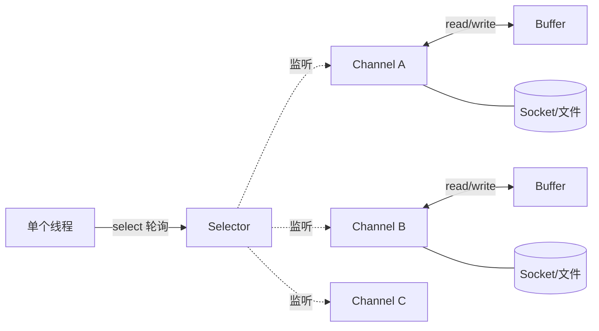

# NIO 的 Channel、Buffer、Selector 是怎么配合的？

> NIO 的门槛不在 API 多，而在这三个组件各管一段、缺一不可。搞懂它们怎么分工，剩下的都是细节。

## 先说清楚 NIO 到底解决了什么

传统的 BIO 是「一个连接一个线程」：线程调 `read()` 后就阻塞在那儿，直到数据来。连接一多，线程就跟着爆炸，而线程的创建、切换本身都很贵。

JDK 1.4 引入的 NIO（New IO，也常被解读成 Non-blocking IO）换了个思路：**用一个线程盯住一大堆连接，谁有数据了就处理谁**，没数据的连接不占线程。它有三个关键词——非阻塞、面向缓冲、基于通道，分别对应下面要讲的机制。

这里先泼一盆冷水：**NIO 不等于「更快」**。它的优势只在高并发、连接多但每个连接不太活跃的场景（典型是长连接网关、聊天服务）。如果连接数很少、或者是内网大文件顺序传输这种「一直有数据」的场景，BIO 反而更简单、未必更慢。选型看场景，别一上来就迷信 NIO。

## 三大组件是怎么分工的

一句话记住它们的关系：**Channel 是水管，Buffer 是水桶，Selector 是值班室的监控大屏。**

- **Channel（通道）**：连接数据源（文件、Socket）的双向管道，可读可写。数据从这里进出。
- **Buffer（缓冲区）**：一块内存中转站。NIO 读写数据**必须**经过 Buffer——读是把 Channel 的数据倒进 Buffer，写是把 Buffer 的数据灌进 Channel。你永远不会让数据「直接」在 Channel 和你的变量之间流动。
- **Selector（选择器）**：多路复用器。多个 Channel 注册到同一个 Selector 上，一个线程调一次 `select()` 就能问出「现在哪些 Channel 就绪了」，然后挨个处理。

三者协作大致是这样：



要注意一个常见的说法误区：有资料说「Selector 会分配线程去处理事件」。这不准确。**Selector 只负责告诉你哪些 Channel 就绪了，它自己不管线程**。事件就绪后是用当前线程处理、还是丢给业务线程池，完全由你的代码决定。Selector 干的是「监控 + 通知」，不是「调度」。

## Buffer：三个指针决定一切

Buffer 的本质就是一个数组加上几个记录读写位置的指针。它最容易把人绕晕，因为**同一块内存既用来写、又用来读，靠切换指针来区分模式**。搞懂三个核心指针，Buffer 就通了：

| 指针       | 含义                       | 关系       |
| ---------- | -------------------------- | ---------- |
| `capacity` | 容量，创建时定死，不可变   | 最大       |
| `limit`    | 读写的边界，能操作到哪为止 | ≤ capacity |
| `position` | 下一个要读/写的位置        | ≤ limit    |

还有个可选的 `mark`，用来记一个位置，之后 `reset()` 能跳回去。四者恒满足：`0 ≤ mark ≤ position ≤ limit ≤ capacity`。

关键在于**写模式和读模式下，这三个指针的含义会变**，而切换靠这几个方法：

- `flip()`：写完切读。把 `limit` 设成当前 `position`（标记「刚写到这」），再把 `position` 归零（从头读）。
- `clear()`：读完切写。`position` 归零、`limit` 拉回 `capacity`。注意它**不真正擦数据**，只是把指针复位，后续 `put` 会覆盖旧值。
- `rewind()`：`position` 归零、`limit` 不动。用于把刚读完的数据**再读一遍**。
- `compact()`：把还没读完的数据挪到开头，再切回写模式，适合「读一半又要接着写」的场景。

### 走一遍「写入 → flip → 读取」

拿一个容量为 8 的 Buffer，把整个生命周期的指针变化画出来，看一遍就记住了。`P` 是 position，`L` 是 limit，`C` 是 capacity。

**第 1 步：刚 `allocate(8)`，写模式。** position 在 0，limit 和 capacity 都在 8，整块都能写：

```
索引:  0   1   2   3   4   5   6   7
      [ ] [ ] [ ] [ ] [ ] [ ] [ ] [ ]
       ↑P                          ↑L=C
```

**第 2 步：`put` 写入 'a' 'b' 'c'。** 每写一个 position 前进一格，limit 不动：

```
索引:  0   1   2   3   4   5   6   7
      [a] [b] [c] [ ] [ ] [ ] [ ] [ ]
                   ↑P              ↑L=C
```

此时 `position=3, limit=8`。

**第 3 步：`flip()`，切读模式。** 这是最关键的一跳：`limit` 被设成当前的 `position`（=3，圈定「有效数据只到这」），`position` 归零（从头读）：

```
索引:  0   1   2   3   4   5   6   7
      [a] [b] [c] [ ] [ ] [ ] [ ] [ ]
       ↑P          ↑L                ↑C
```

现在 `position=0, limit=3`。`hasRemaining()` 判断的就是 `position < limit`，所以只会读出 a、b、c 这 3 个，不会把后面的空位也读出来——**这正是 flip 存在的意义：告诉读取方「真正写进去的只有前 3 个」**。

**第 4 步：`get` 读完 3 个字符后**，position 走到了 limit（P=L 都在索引 3）。

**第 5 步：`clear()`，重新切回写模式。** position 归零、limit 拉回 capacity，指针回到第 1 步的样子。注意 a、b、c 三个字节其实还躺在内存里，只是下次 `put` 会直接覆盖它们：

```
索引:  0   1   2   3   4   5   6   7
      [a] [b] [c] [ ] [ ] [ ] [ ] [ ]   ← 数据没被抹掉
       ↑P                          ↑L=C  ← 但指针已复位，可从头覆写
```

把这五步串起来看，就明白 NIO 里那句「**Buffer 写完要先 flip 才能读，读完要 clear 才能再写**」是怎么回事了。忘了 flip 直接读，读到的是从当前 position 到 capacity 的一堆空数据；忘了 clear 接着写，很快就会撞到 limit。这是新手最高频的 bug。

补一句代码里的坑：有的示例用 `buffer.mark()` 想「打印当前标记位置」，其实 `mark()` 是**设置**标记并返回 Buffer 本身，并不返回位置值，拿它当读数用是错的。想看标记得配合 `reset()` 理解，别被这种示例误导。

创建 Buffer 也别用 `new`，构造方法是私有的，只能走静态工厂：

```java
ByteBuffer heap = ByteBuffer.allocate(1024);       // 堆内存
ByteBuffer direct = ByteBuffer.allocateDirect(1024); // 直接内存（堆外）
```

## 堆内存 vs 直接内存：那次「多余的拷贝」

上面两种分配方式差别很大，面试常问。

普通的 `allocate` 分配的是**堆内存**（HeapByteBuffer），字节数组躺在 JVM 堆里，受 GC 管理。问题在于：操作系统做 IO 时不能直接用这块内存——因为 GC 可能在 IO 进行中移动它（内存整理），地址就不稳了。所以 JVM 在真正发起 IO 前，会先把堆内存的数据**临时拷贝到一块堆外内存**，再交给内核。这就是那次「多余的拷贝」。

`allocateDirect` 分配的是**直接内存**（DirectByteBuffer），直接落在堆外，操作系统能直接访问，省掉了上面那次拷贝。代价是：

| 维度                | 堆内存 `allocate`               | 直接内存 `allocateDirect`                   |
| ------------------- | ------------------------------- | ------------------------------------------- |
| IO 时是否多一次拷贝 | 是                              | 否，更快                                    |
| 分配/回收开销       | 小，随手可用                    | 大，申请慢                                  |
| 回收方式            | 直接归 GC 管                    | 不受 GC 直接管，靠 Cleaner/虚引用延迟释放   |
| 适用场景            | 生命周期短、频繁创建的小 Buffer | 长期存活、反复复用、参与频繁 IO 的大 Buffer |

结论：**别无脑用 DirectByteBuffer**。它适合「一次分配、长期复用」的大缓冲（比如 Netty 的池化缓冲），如果频繁 new 出来又扔掉，分配成本和堆外内存不好回收的风险反而会坑到你。堆外内存泄漏还特别难排查，因为它不在堆里，普通的堆 dump 看不到。

## Channel：双向的数据管道

Channel 和 BIO 的流最大的区别是**双向**。BIO 里 `InputStream` 只读、`OutputStream` 只写，泾渭分明；Channel 一根管子既能读又能写，这也更贴合底层操作系统（尤其 UNIX）Socket 全双工的本质。

常用的四种 Channel：

| 类型                  | 用途                                                       |
| --------------------- | ---------------------------------------------------------- |
| `FileChannel`         | 文件读写，从 `FileInputStream` / `RandomAccessFile` 等拿到 |
| `SocketChannel`       | TCP 客户端通道                                             |
| `ServerSocketChannel` | TCP 服务端监听通道，负责 accept 新连接                     |
| `DatagramChannel`     | UDP 通信通道                                               |

Channel 的核心方法就 `read` 和 `write` 两个，且都围着 Buffer 转：

```java
RandomAccessFile reader = new RandomAccessFile("test.in", "r");
FileChannel channel = reader.getChannel();
ByteBuffer buffer = ByteBuffer.allocate(1024);
channel.read(buffer);   // 从 Channel 读出数据，填进 Buffer
// 想接着读 buffer 内容，别忘了 buffer.flip()
```

补一个细节：**只有 SocketChannel、ServerSocketChannel、DatagramChannel 这类网络通道能配合 Selector 做非阻塞**（它们继承自 `SelectableChannel`），要先 `configureBlocking(false)`。而 `FileChannel` 是**阻塞**的，不能注册到 Selector 上——这是文件 IO 和网络 IO 的本质差异，别把它俩混为一谈。

## Selector：一个线程盯住一片连接

Selector 是 NIO 高并发的核心。它基于操作系统的 I/O 多路复用能力（Linux 上 JDK 用 `epoll` 实现，早年的 `select` 有 1024/2048 的句柄上限，`epoll` 没有这个限制），所以一个线程就能盯住成千上万个连接。

它的工作套路是固定三步：

1. **register**：把 Channel 注册到 Selector，并声明「我对哪些事件感兴趣」。
2. **select()**：阻塞，直到至少有一个 Channel 就绪，返回就绪数量。
3. **遍历 selectedKeys**：拿到就绪的 `SelectionKey` 集合，逐个判断事件类型并处理。

感兴趣的事件有四种，用 `SelectionKey` 上的常量表示：

| 事件         | 含义           | 典型使用者                |
| ------------ | -------------- | ------------------------- |
| `OP_ACCEPT`  | 有新连接进来了 | `ServerSocketChannel`     |
| `OP_CONNECT` | 连接建立完成   | `SocketChannel`（客户端） |
| `OP_READ`    | 有数据可读     | `SocketChannel`           |
| `OP_WRITE`   | 可以写数据了   | `SocketChannel`           |

一个 Selector 内部维护三个 key 集合：`keys()` 是所有注册的、`selectedKeys()` 是本轮就绪的（我们处理的就是它）、还有一个被取消的集合（内部用，一般不碰）。

### 一个最精简的 NIO 服务端骨架

把三步串起来，一个能跑的单线程 echo 服务端骨架长这样：

```java
ServerSocketChannel server = ServerSocketChannel.open();
server.configureBlocking(false);                 // 关键：非阻塞
server.bind(new InetSocketAddress(8080));

Selector selector = Selector.open();
server.register(selector, SelectionKey.OP_ACCEPT); // 监听连接事件

while (true) {
    selector.select();                            // 阻塞到有事件就绪
    Iterator<SelectionKey> it = selector.selectedKeys().iterator();
    while (it.hasNext()) {
        SelectionKey key = it.next();
        it.remove();                              // 处理完必须手动移除

        if (key.isAcceptable()) {                 // 新连接
            SocketChannel client = server.accept();
            client.configureBlocking(false);
            client.register(selector, SelectionKey.OP_READ);
        } else if (key.isReadable()) {            // 有数据可读
            SocketChannel client = (SocketChannel) key.channel();
            ByteBuffer buf = ByteBuffer.allocate(1024);
            int n = client.read(buf);
            if (n > 0) {
                buf.flip();                       // 读完 Channel，切读模式再取内容
                // ... 处理 buf 里的数据
            } else if (n < 0) {
                client.close();                   // 对端关闭
            }
        }
    }
}
```

这段代码里藏着两个高频坑，单独拎出来说。

**第一，`it.remove()` 不能漏。** `selectedKeys` 集合不会自动清空，你处理完一个 key 必须手动从集合里删掉。漏了的话，下一轮 `select()` 返回后，这个已处理的 key 还在集合里，你会把它当成新就绪事件重复处理。

**第二，`OP_WRITE` 别一直挂着。** 很多示例（包括一些教程）在读完后直接 `register(selector, OP_WRITE)`，然后在 write 分支里处理。问题是：Socket 发送缓冲区绝大多数时候都是可写的，所以 `OP_WRITE` 几乎永远就绪，`select()` 会被它反复唤醒，CPU 空转飙高。正确做法是：**平时只关心 `OP_READ`，只有当一次写没写完（缓冲区满了）时才临时打开 `OP_WRITE`，写完立刻用 `interestOps()` 关掉。** 直接用原生 NIO 手写这套很容易踩坑，这也是大家更愿意用 Netty 的原因之一。

## NIO 对零拷贝的支持

零拷贝是指做 IO 时，CPU 不用亲自把数据在几块内存之间来回搬，从而省掉多次拷贝和用户态/内核态的上下文切换。Kafka、RocketMQ、Netty 这些高吞吐项目都靠它。

NIO 提供了两个入口，你在 Java 层就用这两个 API，剩下的交给操作系统：

- **`FileChannel.transferTo()` / `transferFrom()`**：把一个 Channel 的数据直接「转」给另一个 Channel，不经过用户态 Buffer。最典型的用法是把文件直接怼到网络：

  ```java
  FileChannel file = new FileInputStream("big.dat").getChannel();
  // 把文件数据直接传给 socketChannel，中间不落用户态缓冲
  file.transferTo(0, file.size(), socketChannel);
  ```

- **`MappedByteBuffer`（内存映射）**：通过 `FileChannel.map()` 把文件（或一段）映射进内存，之后读写这块内存就等于读写文件，不用反复走 `read`/`write` 系统调用：

  ```java
  FileChannel fc = new FileInputStream(file).getChannel();
  MappedByteBuffer mbb = fc.map(FileChannel.MapMode.READ_ONLY, 0, fc.size());
  // 直接 mbb.get(...) 读文件内容
  ```

底层上，`transferTo` 大致对应操作系统的 `sendfile`、`MappedByteBuffer` 对应 `mmap`，真正省拷贝的是内核在做事。这里只讲「Java 层怎么用」——**DMA 拷贝、`sendfile`/`mmap` 的内核数据流、几种零拷贝方案的拷贝次数对比，属于操作系统的知识**，在专篇里展开更合适，见 [操作系统 · 零拷贝](/cs-basics/operating-system/os-zero-copy.html)。记住结论即可：想让文件走网络高效发出去，优先考虑 `transferTo`。

## 容易踩的坑

- **忘了 `flip()`**：往 Buffer 写完直接读，读到的是空数据；这是 NIO 最经典的一号错误。
- **`clear()` 以为清了数据**：它只复位指针，旧数据还在，靠后续覆写。真要读残留数据用 `compact()` 保留未读部分。
- **`selectedKeys` 处理完不 `remove()`**：导致事件被重复处理。
- **`OP_WRITE` 常驻**：让 `select()` 空转烧 CPU，只在写不完时临时开启。
- **无脑上 DirectByteBuffer**：小而短命的 Buffer 用直接内存反而更慢，还容易堆外泄漏。
- **拿 FileChannel 去注册 Selector**：文件通道是阻塞的、不是 `SelectableChannel`，注册会直接抛异常。
- **把「用了 NIO」当成「一定更快」**：低并发或大文件顺序传输场景，BIO 可能更合适。

## 小结

- NIO 三件套分工：**Channel 是双向数据管道、Buffer 是读写必经的内存中转、Selector 让一个线程复用多个连接**。
- Buffer 靠 `capacity/limit/position` 三个指针在读写模式间切换：**写完 `flip` 再读，读完 `clear` 再写**，`rewind` 重读、`compact` 保留未读。
- Selector 工作三步：`register` 声明感兴趣的事件（ACCEPT/READ/WRITE/CONNECT）→ `select()` 阻塞到就绪 → 遍历 `selectedKeys` 处理并 `remove`。它只通知就绪、不负责分配线程。
- 堆内存做 IO 会多一次到堆外的拷贝，DirectByteBuffer 省了这次但分配贵、不受 GC 直接管，**适合长期复用的大缓冲**。
- 零拷贝在 Java 层就是 `FileChannel.transferTo` 和 `MappedByteBuffer`，底层的 `sendfile`/`mmap`/DMA 细节看操作系统专篇。

## 参考

- 综合自项目内 Java NIO 核心资料，并做了以下核对与修正：纠正了「Selector 分配线程处理事件」的说法（它只通知就绪）、指出示例中 `buffer.mark()` 被误当读值的问题、补充了 `OP_WRITE` 常驻导致 CPU 空转、`FileChannel` 不可注册 Selector、`selectedKeys` 需手动 remove 等原文未强调的实践要点。
- 零拷贝底层机制（`mmap`/`sendfile`/DMA 拷贝次数）另见 [操作系统 · 零拷贝](/cs-basics/operating-system/os-zero-copy.html)。
