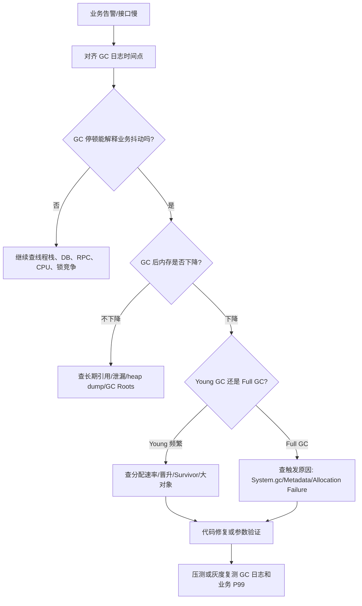

# GC 日志怎么看？如何从日志判断问题方向？

> GC 日志不是“打开后丢给工具”的附属品，而是 JVM 排障的时间线证据。先看什么时候 GC、为什么触发、回收前后变化和停顿多长，再决定是查分配速率、晋升、泄漏、元空间还是 G1 Region 问题。

## 先把日志开对

没有 GC 日志，JVM 调优基本是在猜。生产建议服务启动时就开启，事故后再加只能看到下一次问题。

JDK 8 常见配置：

```bash
-XX:+PrintGCDetails
-XX:+PrintGCDateStamps
-Xloggc:/var/log/app/gc-%t.log
-XX:+UseGCLogFileRotation
-XX:NumberOfGCLogFiles=14
-XX:GCLogFileSize=50M
```

JDK 9+ 使用统一日志（Unified Logging），JDK 11/17/21 常见写法：

```bash
-Xlog:gc*,safepoint:file=/var/log/app/gc-%t.log:time,uptime,level,tags:filecount=14,filesize=50M
```

这里有两个实践点：

1. 带上 `time` 和 `uptime`，方便把 GC 日志、应用日志、监控时间线对齐。
2. 带上 `safepoint`，因为线上卡顿不一定都来自 GC，也可能是偏向锁撤销、类重定义、线程栈遍历等安全点停顿。

## 一行 GC 日志要拆成哪些字段？

不同 JDK、不同收集器的日志格式不完全一样，但核心信息稳定：

| 字段            | 要回答的问题                               |
| --------------- | ------------------------------------------ |
| 时间点 / uptime | 这次 GC 是否和业务延迟、告警时间对应       |
| GC 编号         | 同一次 GC 的多行日志怎么串起来             |
| GC 类型         | Young、Mixed、Full、Concurrent Mark？      |
| 触发原因        | Allocation Failure、System.gc、Metadata？  |
| 回收前后容量    | GC 后堆、老年代、元空间有没有降下来        |
| 停顿时间        | 这次 STW 对业务造成多大影响                |
| 阶段耗时        | 慢在对象复制、引用处理、类卸载还是其他阶段 |

JDK 9+ G1 日志常见形态类似下面这样：

```text
[2026-07-06T10:15:01.123+0800][123.456s][info][gc,start] GC(42) Pause Young (Normal) (G1 Evacuation Pause)
[2026-07-06T10:15:01.159+0800][123.492s][info][gc,heap]  GC(42) Eden regions: 320->0(280)
[2026-07-06T10:15:01.159+0800][123.492s][info][gc,heap]  GC(42) Survivor regions: 12->18(40)
[2026-07-06T10:15:01.159+0800][123.492s][info][gc,heap]  GC(42) Old regions: 180->188
[2026-07-06T10:15:01.159+0800][123.492s][info][gc]       GC(42) Pause Young (Normal) (G1 Evacuation Pause) 1024M->420M(4096M) 35.678ms
```

这几行能读出：

- 第 42 次 GC 是一次 Young GC。
- 原因是 G1 Evacuation Pause，也就是疏散年轻代对象。
- 堆从 1024M 降到 420M，总堆 4096M。
- Old regions 从 180 增到 188，说明有对象晋升到老年代。
- 停顿 35.678ms。

JDK 8 的日志可能长这样：

```text
2026-07-06T10:15:01.123+0800: 123.456:
[GC (Allocation Failure)
  [PSYoungGen: 512000K->64000K(589824K)]
  1536000K->1090000K(2097152K),
  0.0456789 secs]
```

格式不同，但问题一样：什么时候、什么类型、为什么触发、回收前后多少、停顿多久。

## 第一步：先对齐业务时间线

不要一看到 GC 日志就直接改参数。先问：

1. 告警发生在几点几分？
2. 接口 P99/P999 抖动和哪几次 GC 重叠？
3. 单次停顿是否足以解释业务耗时？
4. GC 前后 CPU、负载、线程数、队列长度有没有同步变化？

如果接口慢 3 秒，但 GC 停顿只有 30ms，就不能把全部锅甩给 GC。反过来，如果业务每次抖动都和 1s 以上 Full GC 重合，GC 日志就是主证据。

## 第二步：看回收前后容量

GC 类型只告诉你“发生了什么动作”，容量变化才告诉你“动作有没有效果”。

| 日志现象                 | 常见方向                                     |
| ------------------------ | -------------------------------------------- |
| Young GC 后堆明显下降    | 大量短命对象，可能正常                       |
| Young GC 频率越来越高    | 分配速率高、年轻代偏小或流量上涨             |
| Young GC 后老年代持续涨  | 晋升过快、Survivor 放不下、大对象多          |
| Full GC 后老年代不下降   | 长生命周期对象、缓存失控或内存泄漏           |
| Full GC 后老年代明显下降 | 瞬时批任务、突发流量或参数水位问题           |
| 元空间持续涨             | 类加载多、动态代理、热部署、ClassLoader 泄漏 |

一个简单判断：

```text
GC 后占用能降下来 -> 更像容量/水位/突发压力问题
GC 后占用降不下来 -> 更像长期引用、泄漏或对象生命周期过长
```

这不是最终结论，但能决定下一步是先看 heap dump，还是先看分配速率和参数水位。

## Young GC 频繁怎么看？

Young GC 频繁不一定是坏事。年轻代回收本来就应该比老年代回收便宜，关键看它是否影响业务，以及是否把对象大量推向老年代。

重点看三类信号：

| 信号                          | 可能原因                       | 下一步                         |
| ----------------------------- | ------------------------------ | ------------------------------ |
| Eden 很快打满                 | 分配速率高                     | 用 JFR/async-profiler 看 alloc |
| Survivor 使用高、年龄分布异常 | Survivor 放不下，提前晋升      | 看对象年龄、Survivor 比例      |
| Young GC 后 Old 持续上涨      | 晋升过快或大对象直接进入老年代 | 看晋升、Humongous、大查询      |

JDK 8 可以补充年龄分布：

```bash
-XX:+PrintTenuringDistribution
```

但不要只靠年龄参数硬调。比如一次性查出几十万行数据、批量 JSON 序列化、Excel 导出、消息堆积在内存队列里，根因是分配模式，不是 `MaxTenuringThreshold` 背得不熟。

## Full GC 怎么从日志分叉？

Full GC 要先看触发原因，再看回收效果。

| 触发/信号                | 优先怀疑方向                          |
| ------------------------ | ------------------------------------- |
| `System.gc()`            | 显式 GC 调用、第三方库主动触发        |
| `Metadata GC Threshold`  | 元空间阈值、动态类加载、类加载器泄漏  |
| `Allocation Failure`     | 堆空间不足、晋升失败、老年代分配失败  |
| Full GC 后老年代不降     | 活对象太多、缓存无界、泄漏            |
| Full GC 后老年代明显下降 | 瞬时峰值、批处理、堆/年轻代水位不合理 |
| Full GC 时间越来越长     | 活对象集合变大，标记/整理成本上升     |

这里有个常见误区：**看到 Full GC 不等于立刻加内存。**

如果是 `System.gc()`，先找调用方；如果是元空间触发，先看类加载；如果 Full GC 后老年代完全降不下来，加内存只是把 OOM 延后；如果是瞬时批处理压力，加内存或调整年轻代可能有帮助，但仍要控制批大小。

## G1 日志重点看什么？

G1 不要只看“用了低停顿收集器”。要看它的几个关键阶段是否按预期发生：

```text
Young GC
  -> 回收年轻代 Region

Concurrent Mark
  -> 找出老年代 Region 的存活情况

Mixed GC
  -> 回收年轻代 + 一部分高收益老年代 Region
```

重点信号：

| G1 日志信号                | 可能含义                              |
| -------------------------- | ------------------------------------- |
| `Humongous` 相关日志很多   | 大对象过多，Region 利用率差           |
| Mixed GC 很少或追不上      | 老年代回收收益不足，增长快于回收      |
| `to-space exhausted`       | 疏散空间不足，可能退化到更重回收      |
| `Evacuation Failure`       | 对象复制失败，堆或 Region 压力大      |
| Concurrent Mark 周期很频繁 | 老年代增长快，G1 不断重新标记         |
| 停顿接近/超过目标          | `MaxGCPauseMillis` 目标过激或压力过大 |

`MaxGCPauseMillis` 是目标，不是 SLA。业务分配太快、堆太小、Humongous 对象太多、CPU 不够，G1 也会达不到目标。

## 只看平均停顿会漏什么？

线上看 GC，不要只看平均值。

| 指标          | 为什么重要                     |
| ------------- | ------------------------------ |
| 单次最大停顿  | 一次长停顿就可能打爆接口超时   |
| P95/P99 停顿  | 更接近用户感知和告警阈值       |
| 总 GC 耗时    | 反映吞吐损失                   |
| GC 频率       | 频率高但单次短，也可能吞掉 CPU |
| GC 后占用趋势 | 判断内存是否被真正回收         |

举个例子：平均停顿 20ms，但每 10 分钟有一次 2s Full GC，平均值看起来没问题，核心接口的 P99 却会被拉爆。

## 一个完整排查路径

可以按下面这条线走：



这条线的核心是先定位方向，再决定工具：

- 老年代不降：heap dump、MAT、GC Roots。
- 分配速率高：JFR allocation、async-profiler alloc。
- 元空间异常：`jstat -class`、`jcmd VM.classloader_stats`。
- 线程停顿不全是 GC：`jstack`、JFR、safepoint 日志。

## 容易踩的坑

| 误区                    | 更稳妥的判断                         |
| ----------------------- | ------------------------------------ |
| 看到 Full GC 就加堆     | 先看触发原因和 GC 后老年代是否下降   |
| Young GC 频繁一定有问题 | 要结合停顿、总耗时、晋升和业务延迟   |
| G1 就不会 Full GC       | G1 压力过大、Humongous、疏散失败也会 |
| 平均停顿低就没问题      | 还要看 P99、最大停顿和关键时间段     |
| GC 日志能解释所有卡顿   | safepoint、锁竞争、CPU、I/O 也会卡顿 |
| 事故后再补日志          | 只能看到下一次问题，生产要提前开启   |

## 小结

- GC 日志先看时间点、GC 类型、触发原因、回收前后容量、停顿时间和阶段耗时。
- JDK 8 用 `PrintGCDetails` 体系，JDK 9+ 用 `-Xlog:gc*` 统一日志，生产要提前配置滚动文件。
- Young GC 频繁重点看分配速率、Survivor 和晋升；Full GC 重点看触发原因和老年代是否能降下来。
- G1 要关注 Young、Concurrent Mark、Mixed、Humongous、to-space exhausted 和 Evacuation Failure。
- 调参前先用日志判断方向，再结合 heap dump、JFR、async-profiler、jstat、jcmd 做证据闭环。

## 参考

综合自本地资料《JVM垃圾回收详解》《最重要的JVM参数总结》《JDK监控和故障处理工具总结》、本项目《频繁 Full GC 怎么排查？》《JVM 参数调优到底在调什么？》《常见垃圾收集器怎么选？》《G1 相比 CMS 改进了什么？》，并对照 OpenJDK Unified Logging、G1 GC Tuning 与 Oracle JDK 工具文档校验 JDK 8/JDK 9+ 日志参数、G1 阶段和常见触发信号。本文重点纠正“看到 Full GC 就加内存”和“平均停顿低就没问题”这两个排障误区。
