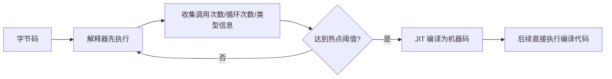

# JIT 编译器是怎么工作的？解释执行、C1、C2 有什么关系？

> HotSpot 不是把所有字节码都一次性编译成本地机器码，而是先解释执行、收集运行时信息，再把热点代码交给 JIT 分层编译。解释器负责快速启动，C1 负责较快编译和 profiling，C2 负责更激进的峰值优化。

## Java 代码从哪里进入执行引擎？

一段 Java 代码跑起来，大致会经历这条链路：

```text
.java 源码
  -- javac 编译 -->
.class 字节码
  -- 类加载、连接、初始化 -->
JVM 执行引擎
  -- 解释执行 / JIT 编译 -->
机器码
```

前面的类加载文章解决的是“.class 怎么变成 JVM 里可用的类元数据”。JIT 这篇接着往后看：字节码已经加载好了，CPU 又不能直接执行字节码，HotSpot 到底怎么把它跑起来？

答案不是二选一，而是两套路径配合：

| 执行路径 | 作用                          | 优点                           | 代价                            |
| -------- | ----------------------------- | ------------------------------ | ------------------------------- |
| 解释器   | 逐条解释字节码并执行          | 启动快，马上能跑，便于收集信息 | 热点代码重复解释会浪费 CPU      |
| JIT      | 把热点方法/循环编译成本地代码 | 长期运行性能高，可做激进优化   | 需要预热，编译本身消耗 CPU/内存 |

所以面试里不要简单说“Java 是解释型语言所以慢”，也不要说“Java 启动就全编译成本地代码”。更准确的表达是：**HotSpot 以解释执行启动，用即时编译优化热点代码。**

## 为什么不一上来全编译？

如果 JVM 启动时把所有方法都编译成本地机器码，看似后续执行会快，但会带来三个问题：

1. 启动慢。很多方法可能根本不会被调用，提前编译是在浪费时间。
2. 缺少运行时信息。真正的类型分布、分支概率、循环次数，只有跑起来才知道。
3. 代码缓存膨胀。JIT 编译后的机器码要放进 Code Cache，不可能无限制缓存所有方法。

HotSpot 的策略更像“先让程序跑起来，再把最值得优化的部分挑出来”。这也是 HotSpot 这个名字的含义：关注热点。



## 热点代码怎么被发现？

HotSpot 主要关心两类热点：

| 热点类型 | 典型来源                         | 为什么重要                         |
| -------- | -------------------------------- | ---------------------------------- |
| 热点方法 | 某个方法被频繁调用               | 方法体整体值得编译                 |
| 热点循环 | 方法调用不多，但内部循环跑很多次 | 长循环如果一直解释执行，浪费最明显 |

面试里可以把“热点探测”讲成两个计数器：

- **方法调用计数器**：统计方法被调用了多少次。
- **回边计数器**：统计循环回到循环头的次数，识别循环热点。

达到阈值后，方法会进入编译队列，由编译线程在后台生成机器码。业务线程不一定停下来等编译完成，它可以继续解释执行或执行已有版本；等编译结果准备好，再切换到编译后的入口。

这解释了两个常见现象：

1. Java 服务刚启动时吞吐没到峰值，跑一段时间后变快，这段过程就是预热。
2. 压测要有 warm-up 阶段，否则测到的可能是解释执行和编译中的混合状态。

## C1、C2、分层编译怎么配合？

HotSpot 里常说的两个 JIT 编译器是：

| 编译器 | 常见叫法        | 特点                               | 目标               |
| ------ | --------------- | ---------------------------------- | ------------------ |
| C1     | Client Compiler | 编译快，优化较轻，可插入 profiling | 更快进入可用性能   |
| C2     | Server Compiler | 编译慢，优化激进，生成代码质量更高 | 长期运行的峰值性能 |

早期可以粗略理解为客户端程序更在意启动速度，服务端程序更在意长期吞吐。现代 HotSpot 默认使用分层编译，把解释器、C1、C2 组合起来：

```text
解释执行
  -> C1 编译：较快生成机器码，并继续收集 profiling
  -> C2 编译：基于更充分的运行时信息做激进优化
```

分层编译的价值是折中：

- 解释器让程序马上启动。
- C1 让热点代码较快摆脱纯解释执行。
- C2 在热点足够明确后生成更高质量的机器码。

可以把它理解成“先有可用性能，再追峰值性能”。这也是为什么 JIT 不是一个单点动作，而是方法在运行期可能经历多个版本：解释版本、C1 编译版本、C2 编译版本。

## JIT 会做哪些优化？

JIT 的优势不只是把字节码翻译成机器码，它还能利用运行时信息做优化。典型优化包括：

| 优化                   | 大致含义                                                 |
| ---------------------- | -------------------------------------------------------- |
| 方法内联               | 把小方法调用展开到调用点，减少调用开销并打开后续优化空间 |
| 逃逸分析与标量替换     | 判断对象是否逃出作用域，可能消除对象分配                 |
| 锁消除 / 锁粗化        | 确定没有竞争时消除锁，或把相邻锁合并                     |
| 循环展开 / 循环优化    | 减少循环控制开销，改善 CPU 指令执行效率                  |
| 分支预测与类型推测     | 根据运行时类型和分支概率生成更偏向热点路径的代码         |
| 空值检查、边界检查优化 | 在安全前提下减少重复检查                                 |

下一篇逃逸分析会展开对象分配、标量替换和锁优化。这里先抓住主线：**JIT 能优化，是因为它拿到了运行时真实信息；这些信息越稳定，优化越有把握。**

## 去优化：优化假设失效怎么办？

JIT 的很多优化带有“乐观假设”。比如某个接口调用在过去一段时间里总是落到 `OrderServiceImpl`，C2 可能按这个类型分布把调用内联进去。

但 Java 是动态的：

- 后续可能加载新的实现类。
- 反射、代理、类加载器会改变调用目标。
- 分支和类型分布可能随业务流量改变。

当假设失效时，HotSpot 不能继续执行错误的机器码。它会触发**去优化（deoptimization）**：从编译后的机器码安全地退回解释执行，重新收集信息，必要时再编译一个新版本。

所以“C2 编译过就永远跑 C2”也不准确。JIT 编译代码可能被丢弃、替换、重新编译，这也是长期运行服务里性能曲线会随流量和代码路径变化的原因之一。

## Code Cache 和编译线程也会消耗资源

JIT 生成的机器码存放在 Code Cache。它属于非堆内存预算的一部分，常见参数是：

```bash
-XX:ReservedCodeCacheSize=256m
```

普通业务很少一上来调 Code Cache，但要知道它存在。Code Cache 太小、编译压力太大、生成代码过多时，可能影响后续编译和性能稳定性。

观察 JIT 可以用这些工具和参数：

```bash
jstat -compiler <pid>
jcmd <pid> Compiler.codecache
jcmd <pid> Compiler.queue

# 诊断环境使用，输出编译日志
-XX:+PrintCompilation
-XX:+UnlockDiagnosticVMOptions -XX:+PrintInlining
```

这些输出不适合直接背参数，面试时知道它们能看到“编译发生了什么、Code Cache 状态如何、是否有编译队列堆积”就够了。生产排查要结合 JFR、async-profiler 和 GC/线程指标看完整证据链。

## 面试怎么讲更稳？

可以按这条线回答：

```text
Java 源码先被 javac 编译成字节码，类加载后由 JVM 执行。
HotSpot 启动时先解释执行，保证启动快，并收集方法调用、循环回边、类型分布等运行时信息。
热点代码达到阈值后进入 JIT 编译。
现代 HotSpot 默认分层编译：解释器负责启动，C1 编译快并可收集 profiling，C2 编译慢但优化更激进。
JIT 不是编译所有代码，编译结果放在 Code Cache；如果优化假设失效，还可能去优化并重新编译。
```

再补两个边界，基本就不会答空：

- JIT 适合长期运行的服务，启动初期有预热成本；AOT 更偏启动速度和部署形态，但会受动态特性约束。
- 不要把性能问题都归因于“JIT 没优化”。真正定位要看 CPU 火焰图、分配、锁竞争、GC、Code Cache 和编译日志。

## 小结

- HotSpot 不是纯解释，也不是启动时全量编译，而是解释器和 JIT 配合：先跑起来，再优化热点。
- 热点探测主要看方法调用次数和循环回边次数，达到阈值后交给编译线程生成机器码。
- C1 编译快、优化轻，C2 编译慢、优化更激进；分层编译把解释器、C1、C2 串起来兼顾启动和峰值性能。
- JIT 优化依赖运行时信息，假设失效时会去优化，退回解释执行或重新编译。
- 编译后的机器码放在 Code Cache，JIT 本身也会消耗 CPU 和非堆内存，排查时要看证据而不是猜。

## 参考

综合自本地资料《Java 基础常见面试题》《大白话带你认识 JVM》《类加载过程详解》《JVM线上问题排查和性能调优案例》、本项目《Java 是编译型语言还是解释型语言？》《JVM 参数调优到底在调什么？》，并对照 Oracle《[Compilation Optimization](https://docs.oracle.com/en/java/javase/11/jrockit-hotspot/compilation-optimization.html)》和 OpenJDK HotSpot JIT 相关资料校验 C1/C2、分层编译、Code Cache 与去优化边界。本文重点纠正两个过度简化说法：Java 不是“纯解释所以慢”，JIT 也不是“把所有字节码都编译成本地代码”。
