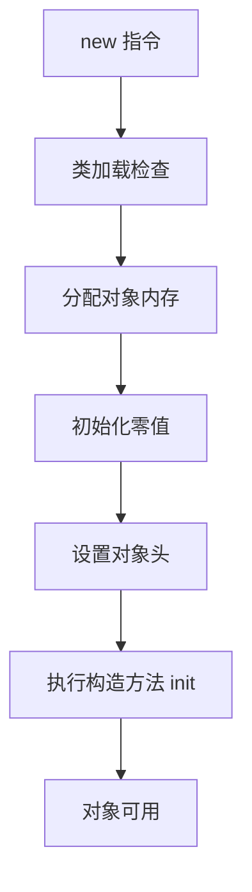

# 对象从创建到回收经历了什么？

> 一个对象不是 `new` 完就结束了，它会经历类加载检查、内存分配、对象初始化、分代流转，最后在不可达后被 GC 回收。

## new Object() 背后发生了什么？

虚拟机遇到 `new` 指令时，大致会走 5 步：



第一步不是直接分配内存，而是先检查这个类是否已经加载、解析和初始化。如果没有，先走类加载流程。

这个顺序能解释一个常见现象：第一次 `new User()` 时，可能先看到类初始化相关耗时；后续再创建同类对象，就主要是对象分配和构造成本。

```java
class User {
    static {
        loadConfig(); // 第一次主动使用类时执行
    }

    User() {
        // 每次 new 都会执行
    }
}
```

所以不要把类初始化和对象构造混成一件事：`<clinit>` 是类级别初始化，通常只执行一次；`<init>` 是对象构造，每创建一个对象都会执行。

## 对象内存怎么分配？

对象需要的内存大小在类加载完成后基本能确定。分配方式取决于堆是否规整：

| 分配方式 | 适合堆形态 | 理解方式                         |
| -------- | ---------- | -------------------------------- |
| 指针碰撞 | 规整       | 指针向空闲方向移动一段对象大小   |
| 空闲列表 | 不规整     | 从空闲块列表里找一块足够大的空间 |

并发分配时还要解决线程安全。HotSpot 常见做法：

- CAS 失败重试。
- TLAB：每个线程先在 Eden 区拿一小块私有分配缓冲区。

TLAB 的意义是减少多线程同时在堆上分配对象时的竞争。

TLAB 也不是“对象一定在 TLAB 里”。对象太大、TLAB 剩余空间不够，或者 JVM 根据运行状态决定不走 TLAB 时，仍会回到共享 Eden 区分配，并通过 CAS 等方式保证并发安全。

还有一个容易答绝对的点：HotSpot 有逃逸分析和标量替换。某些对象如果没有逃出方法范围，JIT 可能把它拆成若干标量，甚至不真正分配一个完整对象。工程表达里说“对象通常在堆上分配”比“对象一定在堆上分配”更稳。

## 为什么字段没赋值也有默认值？

内存分配后，JVM 会先把对象内存初始化为零值。比如 `int` 是 0，引用是 `null`。

然后设置对象头。HotSpot 对象头里通常包括：

- Mark Word：hash、GC 年龄、锁状态等。
- Klass Pointer：指向类元数据，用来知道“这个对象属于哪个类”。

最后执行构造方法，也就是 `<init>`。从 JVM 视角看，设置对象头后对象已经有了；从 Java 程序视角看，构造方法执行完才是业务上真正可用的对象。

## 对象在内存里长什么样？

HotSpot 对象布局可以简化为：

```text
对象头 Header
├── Mark Word
└── Klass Pointer
实例数据 Instance Data
└── 业务字段
对齐填充 Padding
```

对齐填充不是业务数据，只是为了满足对象大小按 8 字节对齐等实现要求。

访问对象也有两种思路：

| 方式     | reference 指向哪里 | 特点                        |
| -------- | ------------------ | --------------------------- |
| 句柄     | 句柄池             | 对象移动时 reference 更稳定 |
| 直接指针 | 对象地址           | 少一次间接定位，访问更快    |

HotSpot 主要采用直接指针。

数组对象还会额外保存数组长度。普通对象和数组对象都需要对象头，但数组要让 JVM 知道边界，否则无法做越界检查和正确遍历。

对象头里的 Mark Word 会随着运行状态变化：未锁定、轻量级锁、重量级锁、GC 年龄、identity hash 等信息都可能与它有关。因此对象头不是一块“只读元信息”，它会参与锁和 GC 的运行时状态管理。

## 对象怎么在分代里流转？

多数新对象会先在 Eden 或线程自己的 TLAB 中分配。

```text
Eden/TLAB
  ↓ Young GC 后仍存活
Survivor
  ↓ 年龄增长或 Survivor 放不下
Old
```

有几个边界要注意：

1. 大对象可能直接进入老年代，但具体行为和收集器、参数有关。
2. “对象年龄到 15 才晋升”不能绝对化。`MaxTenuringThreshold` 是上限，实际还有动态年龄判定。
3. G1 用 Region 管理堆，Humongous Object 等规则和传统连续分代口径不同。

动态年龄判定可以这样理解：如果某个年龄及更小年龄的对象加起来已经占了 Survivor 较大比例，JVM 可能提前把达到该年龄的对象晋升到老年代，避免 Survivor 放不下。也就是说，晋升不只看年龄，还看 Survivor 空间压力。

还有一种路径是分配担保：Young GC 前后，JVM 要确认老年代能不能接住可能晋升的对象。如果老年代空间不足或担保失败，就可能触发更重的 GC。频繁出现这种情况时，要同时看新生代大小、对象存活率和老年代剩余空间。

观察对象年龄和晋升可以看 GC 日志，也可以用：

```bash
jstat -gcutil <pid> 1000 10
```

JDK 8 还可以在压测环境用对象年龄分布日志辅助判断：

```bash
-XX:+PrintTenuringDistribution
```

JDK 11+ 则优先从统一 GC 日志里观察年龄、晋升和 Region 相关信息。

如果老年代使用率持续增长、Full GC 后也降不下来，就要怀疑长生命周期对象过多或内存泄漏。

## 对象什么时候进入回收流程？

GC 判断对象是否可回收，主流 HotSpot 不是用引用计数，而是可达性分析。对象从 GC Roots 出发不可达，才会进入回收候选。

一个对象从创建到死亡，常见路径是：

```text
创建 → Eden → 多次 Young GC 存活 → Survivor → Old → 不可达 → GC 回收
```

如果对象一直被静态集合、缓存、线程局部变量、未关闭资源引用着，即使业务上“用完了”，GC 也不会回收。

从排查角度看，可以把对象生命周期和证据对应起来：

| 阶段           | 常见证据                          | 说明                         |
| -------------- | --------------------------------- | ---------------------------- |
| 创建太快       | 分配速率高、Young GC 频繁         | 关注批量查询、序列化、大集合 |
| 晋升太快       | Survivor 放不下、老年代上升       | 关注对象存活率和年龄分布     |
| 回收不掉       | Full GC 后老年代不降、GC Roots 长 | 关注强引用链和泄漏点         |
| 本地内存没回收 | RSS 高但堆不高                    | 关注直接内存、线程栈、Native |

所以“对象生命周期”不是单纯讲创建步骤，它能直接连到 OOM 和 Full GC 排查。

## 容易踩的坑

1. `<clinit>` 和 `<init>` 不是一回事：前者是类初始化，后者是对象构造。
2. TLAB 是优化路径，不是所有对象都必须走 TLAB。
3. 对象年龄阈值不是固定 15，动态年龄判定和 Survivor 压力会改变晋升时机。
4. 大对象进入老年代没有一个跨收集器固定规则，G1 还要看 Humongous 相关行为。
5. Full GC 后对象不降，通常说明仍有强引用链，不要先怪 GC 算法。

## 小结

- `new` 会先做类加载检查，再分配内存、零值初始化、设置对象头、执行构造方法。
- 对象分配方式取决于堆是否规整，并发分配常靠 CAS 和 TLAB。
- HotSpot 对象布局包括对象头、实例数据和对齐填充。
- 对象通常先在 Eden/TLAB 分配，存活后进入 Survivor，再可能晋升老年代。
- GC 能否回收对象，关键看它是否还能从 GC Roots 走到。

## 参考

基于 Oracle Java SE Documentation、OpenJDK JEP、HotSpot VM 文档与 JDK 工具官方文档中 JVM、GC、类加载、监控与诊断相关内容整理。
