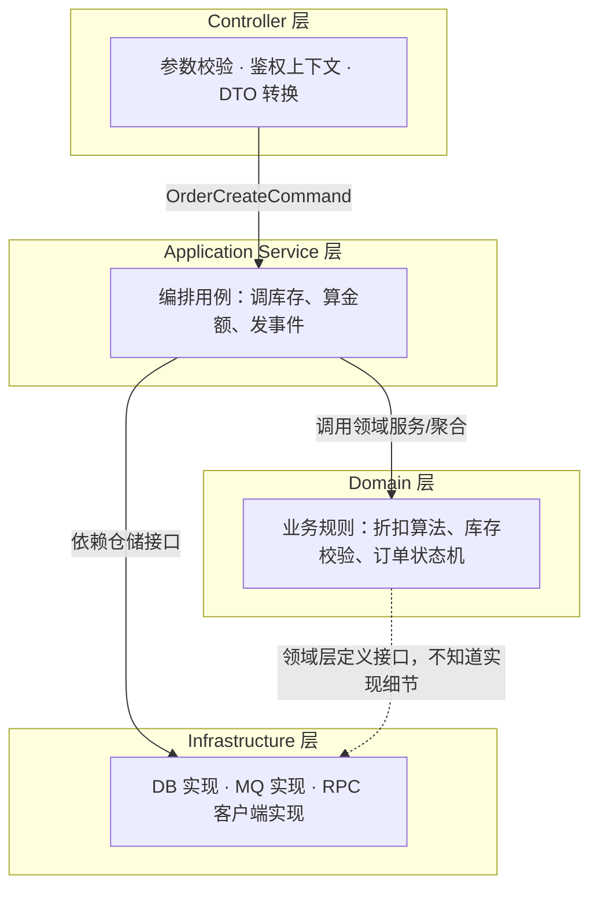

# 分层架构里 Controller、Service、领域模型怎么划界？

> 分层写烂的项目不是没分层，是每一层都在干别的层该干的事——Controller 里拼 SQL，Service 里塞几百个方法，事务注解贴在错误的地方。这篇讲怎么判断一段代码到底该放哪层。

## 先看一段能跑但会越改越烂的代码

大部分项目分层写烂，不是架构图画错了，是没人守住"这一层只能干什么、不能干什么"。看一个很典型的下单接口：

```java
@RestController
public class OrderController {

    @Autowired private JdbcTemplate jdbcTemplate;

    @PostMapping("/orders")
    public Result createOrder(@RequestBody Map<String, Object> body) {
        Long userId = (Long) body.get("userId");
        Long productId = (Long) body.get("productId");
        Integer count = (Integer) body.get("count");

        // 直接在 Controller 里查库存、算价格、写库
        Map<String, Object> product = jdbcTemplate.queryForMap(
            "select * from product where id = ?", productId);
        int stock = (int) product.get("stock");
        if (stock < count) {
            return Result.fail("库存不足");
        }
        jdbcTemplate.update("update product set stock = stock - ? where id = ?", count, productId);

        BigDecimal price = (BigDecimal) product.get("price");
        BigDecimal amount = price.multiply(new BigDecimal(count));
        if (amount.compareTo(new BigDecimal("10000")) > 0) {
            amount = amount.multiply(new BigDecimal("0.95")); // 大额订单打九五折
        }

        jdbcTemplate.update("insert into orders(user_id, product_id, count, amount) values (?,?,?,?)",
            userId, productId, count, amount);
        return Result.success();
    }
}
```

这段代码能跑，问题是它把四件不同的事焊在了一起：**接参数、查库存、算折扣规则、写库**。等产品要求"折扣规则要按会员等级区分"，或者要新增一个"后台批量创建订单"的入口时，你会发现这套折扣逻辑没法复用，只能在另一个 Controller 里再抄一遍——这就是分层缺失的代价：不是跑不起来，是没法安全地改和复用。

分层要解决的核心问题只有一个：**把"变化频率不同、变化原因不同"的代码分开放**，协议层的变化（换成 gRPC、加个 header 校验）不该牵连业务规则，业务规则的变化（改折扣算法）不该牵连怎么落库。

## 四层职责怎么切

用一个稍微规范点的四层模型来看这个下单流程该怎么拆：



关键不是"分几层"，是**依赖方向**：Domain 不认识 Infrastructure，Infrastructure 反过来实现 Domain 定义的接口。这条箭头画反了，分层就是摆设——下面挨个说每层具体该干什么、不该干什么。

### Controller：只做协议适配

Controller 的职责边界很窄，就三件事：**参数校验、把鉴权信息塞进上下文、DTO 转领域对象（或命令对象）**。改写前面那个例子：

```java
@RestController
public class OrderController {

    @Autowired private OrderAppService orderAppService;

    @PostMapping("/orders")
    public Result<Long> createOrder(@Valid @RequestBody OrderCreateRequest req) {
        Long userId = SecurityContext.currentUserId(); // 鉴权上下文，不是业务参数
        OrderCreateCommand cmd = OrderCreateCommand.from(req, userId); // DTO -> 命令对象
        Long orderId = orderAppService.createOrder(cmd);
        return Result.success(orderId);
    }
}
```

`@Valid` 做格式校验（数量必须大于 0、productId 不能为空），`SecurityContext` 拿当前登录用户，`OrderCreateCommand.from` 做类型转换。**这里不出现任何"库存够不够""要不要打折"这类判断**——那是业务规则，一旦 Controller 开始写 `if (count > 100)` 这种业务条件，就已经在越界了。

判断一段代码该不该留在 Controller，问自己一句：**这段逻辑跟"这是个 HTTP 请求"这件事有没有关系？** 没关系的，全部下沉。

### Application Service：编排用例，不重复造规则

Application Service（用例层，很多项目里就是习惯叫 `XxxService` 的那层）干的是"串起一个业务用例需要哪几步"，它自己不定义规则，只负责调度：

```java
@Service
public class OrderAppService {

    @Autowired private ProductRepository productRepository;
    @Autowired private OrderRepository orderRepository;
    @Autowired private ApplicationEventPublisher eventPublisher;

    @Transactional
    public Long createOrder(OrderCreateCommand cmd) {
        Product product = productRepository.findById(cmd.getProductId());
        product.deductStock(cmd.getCount());          // 库存规则在 Product 聚合内部
        Order order = Order.create(cmd, product);      // 折扣规则在 Order 内部
        orderRepository.save(product);
        orderRepository.save(order);
        eventPublisher.publishEvent(new OrderCreatedEvent(order));
        return order.getId();
    }
}
```

注意这里没有一行折扣计算、没有一行"库存不够就抛异常"的判断——这些规则被推到了 `Product` 和 `Order` 内部。Application Service 只负责"第一步查商品、第二步扣库存、第三步建单、第四步发事件"这个**编排顺序**，以及事务边界该开在哪。这也是为什么它常被叫"用例层"：一个方法基本对应一个用户故事。

### Domain：规则真正该待的地方

库存够不够扣、金额怎么打折，这些是业务规则，不是流程编排，应该活在领域对象或领域服务里：

```java
public class Product {
    private Long id;
    private int stock;
    private BigDecimal price;

    public void deductStock(int count) {
        if (stock < count) {
            throw new InsufficientStockException(id, count, stock);
        }
        this.stock -= count;
    }
}

public class Order {
    public static Order create(OrderCreateCommand cmd, Product product) {
        BigDecimal amount = product.getPrice().multiply(new BigDecimal(cmd.getCount()));
        amount = DiscountPolicy.apply(amount, cmd.getUserId()); // 折扣规则单独抽出来
        return new Order(cmd.getUserId(), product.getId(), cmd.getCount(), amount);
    }
}
```

跨多个聚合、不天然属于某一个实体的规则（比如"同一用户同一天下单超过 5 次要走风控"），才交给一个独立的领域服务（`RiskCheckDomainService` 这类），不要为了"看起来更 DDD"硬把简单规则也包一层服务类。领域层的判断标准很朴素：**这条规则脱离这次 HTTP 请求、脱离这次数据库调用，依然成立吗？** 折扣算法、库存不能为负，这些换个渠道调用（比如后台批量建单）结论也一样，这就是该待在领域层的规则。

### Infrastructure：技术细节的收纳箱

数据库怎么建连接、SQL 怎么拼、MQ 怎么发、下游 RPC 怎么调，这些通通是实现细节，领域层和用例层只依赖接口：

```java
public interface ProductRepository {
    Product findById(Long id);
    void save(Product product);
}

@Repository
public class ProductRepositoryImpl implements ProductRepository {
    @Autowired private ProductMapper productMapper; // MyBatis 生成的 Mapper

    @Override
    public Product findById(Long id) {
        ProductPO po = productMapper.selectById(id);
        return ProductConverter.toEntity(po); // PO -> 领域对象
    }

    @Override
    public void save(Product product) {
        productMapper.updateStock(product.getId(), product.getStock());
    }
}
```

这条"接口归业务定义、实现归基础设施提供"的原则，和依赖倒置原则（DIP）是同一件事——具体怎么判断该不该抽接口、Service 直接依赖 Mapper 的 Example API 有什么代价，[SOLID 五原则在后端项目里怎么落地？](./design-solid-principles.html) 那篇里有更细的反例。

## 常见坏味道

### 坏味道一：Controller 写 SQL

开头那个例子就是典型：Controller 直接注入 `JdbcTemplate` 或 `Mapper`，图快省一层调用。表面看省了几行代码，实际后果是——这段查询逻辑没法被别的入口复用（定时任务、MQ 消费者要用同样的下单逻辑，只能整段复制），而且单测 Controller 要么绕不开真实数据库，要么根本没法测，因为 HTTP 层的测试工具不擅长 mock SQL 执行结果。

### 坏味道二：Service 变成千行上帝类

`OrderService` 塞进库存、支付、积分、短信、报表导出，只因为它们都"跟订单沾边"，最后长成一个几十个 `@Autowired`、上千行的类，改一处功能测试整个类。这本质是没分清"用例编排"和"业务规则"两件事——库存扣减该在 `Product` 聚合里，短信通知该走事件监听，不该都堆在一个方法里。上帝类的成因和改法，[SOLID 那篇里 God Service 的例子](./design-solid-principles.html#s-单一职责原则-srp) 讲得更细，判断标准是同一个：**这几段逻辑会不会因为不同需求方、不同节奏独立变化**。

### 坏味道三：事务边界错位

两种最常见的错法：

**一种是事务开得太大**，把 RPC、发短信、调支付网关全塞进一个 `@Transactional` 方法里，数据库连接被外部调用的延迟拖着不放，高并发下连接池直接打满。

**另一种是事务开在了不该开的地方**——比如把 `@Transactional` 标在 Controller 上，或者标在被同类内部方法自调用的私有方法上，代理根本拦不到，事务名存实亡，出了问题排查半天才发现压根没进代理。这类问题的完整排查顺序，参见 [Spring 事务为什么会失效？](/system-design/framework/spring-transaction-failure-cases.html)——结论是一致的：**事务边界应该定义在 Application Service 层，只包必要的数据库操作，不做流程编排之外的事**。

## 不是所有项目都要上完整 DDD

看到这里容易走向另一个极端：所有项目都拆出 Controller / Application Service / Domain / Infrastructure 四层，每个字段都建聚合、建值对象、建仓储接口。

这在一个"十几张表、CRUD 为主、业务规则很薄"的后台管理系统里是过度设计——一个字段校验都要走三层接口跳转，团队每加一个字段都要改四个文件，维护成本比它解决的问题还大。这类项目里，"贫血模型 + Service 层直接操作"完全够用，是不是要往充血模型、领域服务这个方向演进，是下一篇要展开的取舍。

真正值得上完整分层（尤其是显式的 Domain 层）的信号，通常是这几条里占了大半：

- 业务规则复杂且会跨多个入口复用（Web、定时任务、MQ 消费者都要走同一套下单规则）；
- 规则变化频繁，且和"怎么存储"这件事变化节奏不同步；
- 团队规模大到需要靠代码结构本身来约束"这段逻辑该往哪写"，而不是靠口头约定。

反过来，一个内部小工具、一个业务规则几乎不变的报表系统，硬套四层只是徒增认知成本。分层是手段，不是目标——判断依据永远是"这个项目的复杂度撑不撑得起这套结构"，不是"DDD 听起来更专业"。

## 小结

1. 分层的本质是按"变化原因"切代码：协议怎么变不该牵连业务规则，业务规则怎么变不该牵连怎么落库。
2. Controller 只做参数校验、鉴权上下文、DTO 转换，业务判断一律不留在这层。
3. Application Service 负责编排用例顺序和事务边界，不重复定义业务规则。
4. 业务规则（库存校验、折扣算法）该下沉到领域对象或领域服务，跟"这是不是一次 HTTP 请求"无关的判断都属于这里。
5. 不是所有项目都要上完整 DDD 四层，规则简单、变化少的系统，贫血模型 + 薄 Service 更划算。

## 参考

结合 Java 后端常见分层实践与 DDD 分层架构模式整理，代码示例为自拟的下单场景，未照搬任何资料原文。
