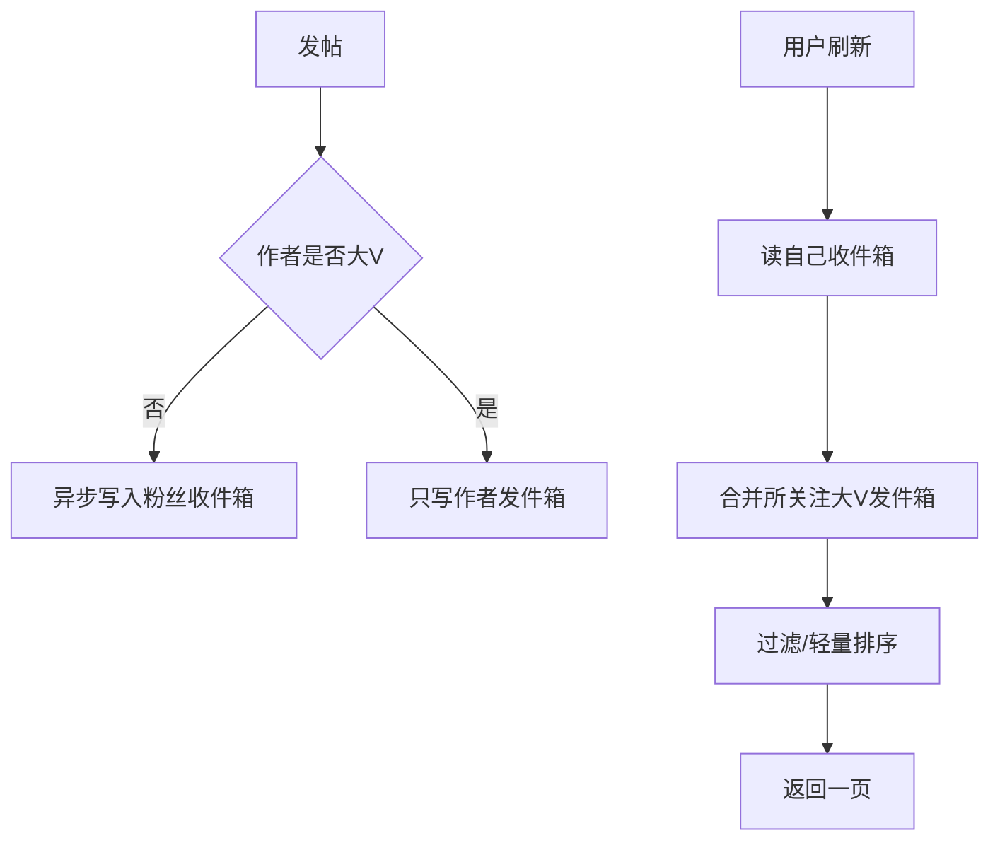

# Feed 流怎么设计读写模型？

> Feed 的核心矛盾是：写扩散贵，读聚合贵，名人效应会放大任何一边。

## 先把问题说清楚

Feed（关注时间线）要回答的是：用户打开 App，看到“我关注的人最近发了什么”，并按时间或相关性排序。难点不在发帖接口本身，而在**扇出模型**——一条帖子要让 N 个粉丝可见，成本摊在写时还是读时。

三个现实约束会决定架构：

1. 关注关系是长尾：绝大多数人粉丝很少，极少数人粉丝千万
2. 读远多于写：刷时间线的次数远高于发帖
3. 可见性规则多：删除、拉黑、仅好友可见、审核中

忽略名人效应，只按“平均粉丝数”估算，系统会在第一个大 V 发帖时被写放大打穿。

## 三种模型对比

| 模型         | 写路径                 | 读路径               | 优点     | 缺点         | 适合            |
| ------------ | ---------------------- | -------------------- | -------- | ------------ | --------------- |
| 推（写扩散） | 发帖写入每个粉丝收件箱 | 直接读自己收件箱     | 读极快   | 大 V 写爆炸  | 粉丝量可控      |
| 拉（读扩散） | 只写作者发件箱         | 读时聚合关注列表     | 写很轻   | 关注多时读慢 | 关注少、发帖少  |
| 混合         | 普通用户推，大 V 拉    | 收件箱 + 大 V 实时拉 | 平衡读写 | 实现复杂     | 大多数社交/内容 |

### 推模式举例

用户 A 有 500 粉丝，发一条帖子：

1. 帖子实体写入帖子库
2. 异步把 `post_id + ts` 写入 500 个粉丝的收件箱
3. 粉丝刷 Feed 时只读自己的收件箱 ZSet / 宽表

读路径简单到可以吃缓存。但若 A 是 2000 万粉丝的大 V，一次发帖就是 2000 万次写，峰值会把消息队列和存储打满，而且很多粉丝并不活跃，写了也浪费。

### 拉模式举例

发帖只写 A 的发件箱。用户 U 关注了 200 人，刷新时：

1. 取 U 的关注列表
2. 分别拉这 200 人发件箱的最新 K 条
3. 归并排序，截取一页

写很便宜，但读变重；关注数到上千、还要处理分页和缓存，延迟和复杂度都上去。

## 混合扇出：主流做法



阈值怎么定，要靠数据而不是拍脑袋：

| 信号              | 建议                               |
| ----------------- | ---------------------------------- |
| 粉丝数超过 N      | 视为大 V，走拉                     |
| 活跃粉丝占比低    | 更倾向拉，避免无效推               |
| 发帖频率极高      | 限制推的扇出速率                   |
| 用户关注大 V 很多 | 读侧对大 V 发件箱做本地/分布式缓存 |

N 可以先从 1 万或 10 万试，观察写队列堆积和读 P99，再调。混合模式的关键不是“有没有大 V 判断”，而是**发帖路径与刷 Feed 路径对大 V 的约定必须一致**，否则会出现“大 V 发了但粉丝永远看不见”或“两边都写了重复”。

## 存储怎么拆

时间线和帖子实体一定要分开。

| 存储     | 内容                        | 典型实现                  |
| -------- | --------------------------- | ------------------------- |
| 帖子实体 | 正文、媒体、状态、权限      | MySQL / 文档库            |
| 发件箱   | 作者维度有序 `post_id + ts` | Redis ZSet / 宽表         |
| 收件箱   | 用户维度有序时间线引用      | Redis ZSet / Cassandra 类 |
| 关系链   | 关注 / 粉丝 / 拉黑          | 关系服务                  |
| 计数     | 赞、评、未读                | 计数服务                  |

时间线里只存引用，不存正文。原因：

- 同一帖子出现在无数收件箱，存全文会爆炸
- 删帖、改可见性时改实体即可，不必改所有时间线
- 列表页可先返回 ID，再批量回源实体并填充

收件箱长度要有上限。例如只保留最近 1000～5000 条，更老的内容让用户去主页或搜索。无限增长的收件箱最终会变成又贵又慢的大 key。

## 刷 Feed 的详细读路径

一次刷新可以拆成：

1. 鉴权，取用户关注集合（可缓存）
2. 读收件箱最近一页候选
3. 找出关注列表里的大 V，批量拉发件箱增量
4. 按时间归并，做游标分页
5. 批量查帖子实体
6. 过滤删除、不可见、拉黑
7. 可选：轻量重排（置顶、降权、去广告重复）
8. 返回 DTO

分页用游标（`ts + postId`）比 `offset` 稳，避免新数据插入导致翻页重复或空洞。

```text
第一页：score <= now, limit 20
下一页：score < last_score, 或 score==last_score 且 postId < last_id
```

## 删除、拉黑与可见性

强一致地“立刻从所有收件箱物理删掉”成本极高，工程上更常见：

| 事件            | 常见策略                                   |
| --------------- | ------------------------------------------ |
| 删帖 / 审核下架 | 实体标记不可见；读时过滤；异步抽清洗时间线 |
| 取关            | 停止新推；旧收件箱惰性过滤或异步清理       |
| 拉黑            | 读时过滤关系；必要时双向限制互动           |
| 仅好友可见      | 读时鉴权，不满足则跳过                     |

产品上通常可接受“删除后短暂仍可见几秒到几分钟”，用缓存 TTL 和回源校验收敛。若业务是强合规场景（金融、医疗内容），要把失效做成主动通知 + 短 TTL，而不是指望用户下拉刷新。

## 未读数怎么做

未读不要每次 `count(*)` 扫收件箱。

更稳的做法是**水位**：

- `last_read_ts`：用户上次读到哪里
- `unread_cnt`：计数器，有新推送时加，打开 Feed 时清或减

注意：

1. 大 V 拉模式没有推送，未读不能只靠收件箱增量
2. 未读展示要封顶，如 “99+”，避免计数被刷成天文数字
3. 多端已读同步会有竞态，以服务端水位为准

## 缓存与异步

Feed 是缓存密集型系统：

- 关注列表缓存
- 收件箱热 key 本地缓存
- 大 V 发件箱高命中缓存
- 帖子实体批量缓存

写扩散必须异步：发帖接口先落实体和发件箱，再丢扇出任务。扇出任务要可重试、可分片（按粉丝 ID 分段），并监控堆积。详见 [多级缓存](/high-performance/high-performance-multi-level-cache.html) 与消息可靠性相关笔记。

## 排序：时间线还是推荐

严格时间序实现简单、可解释，适合“关注流”。信息流若要“相关推荐”，会变成：

1. 召回：关注内容 + 推荐候选
2. 粗排 / 精排
3. 混排与打散

那是另一套推荐系统，不要和关注 Feed 的推拉模型混成一团。很多 App 拆成“关注”和“推荐”两个 Tab，正是为了边界清晰。

## 容量估算直觉

假设：

- DAU 1000 万，人均日刷 20 次，每次读时间线
- 日发帖 100 万，平均粉丝 200，大 V 占比 1%

若全推：写放大约 `100 万 * 200` 量级，再被大 V 极端值拉高。  
若混合：99% 普通帖可推，1% 大 V 帖改拉，写放大会下降一个数量级以上，读只对大 V 多几次批量获取。这就是混合值得做的原因。

## 容易踩的坑

- **全员写扩散**：第一个明星账号发帖即事故
- **时间线存正文**：删改和存储都会崩
- **offset 分页**：插入新帖后翻页错乱
- **未读硬扫**：把计数打到主存储
- **可见性只在写时决定**：关系一变，读出来仍错

## 小结

1. Feed 先选推 / 拉 / 混合，再谈中间件。
2. 大 V 写扩散会把系统打爆，混合是主流。
3. 时间线存引用，实体分离，收件箱要有长度上限。
4. 删除与权限以读时过滤 + 异步清理更常见。
5. 未读数要用水位，分页用游标，扇出必须异步可监控。

## 参考

综合自内容 Feed 常见架构模式与仓库内缓存、异步化相关实践整理。
