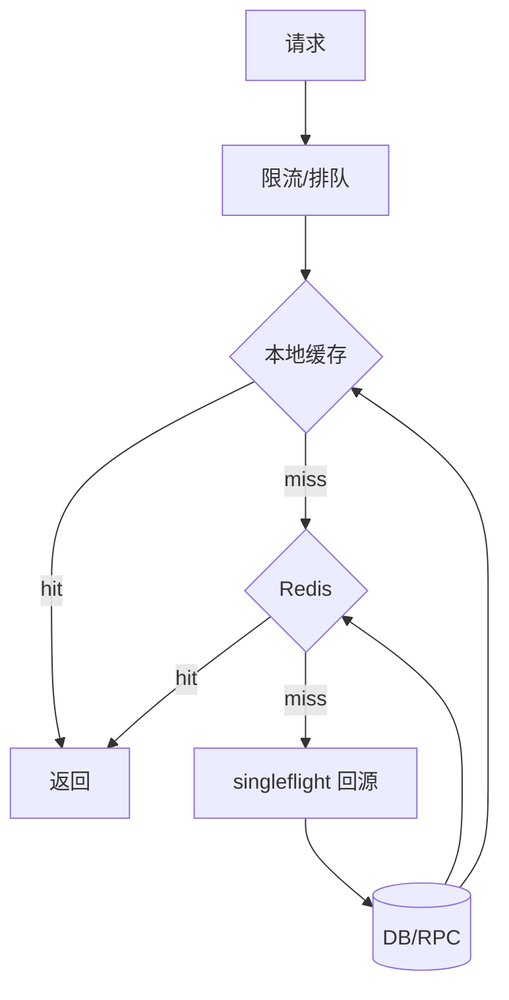

# 热 key 活动页怎么抗住瞬时流量？

> 活动页被打挂，常常不是整库不行，而是几个热 key 把缓存和 DB 打穿。

## 问题长什么样

大促、秒杀预热、爆款上架时，监控上经常看到：

- 总 QPS 没到理论容量，但错误率先飙
- Redis 某个分片 CPU 100%，其他分片很闲
- DB 出现相同 `product_id` 的海量查询
- 应用线程池被下游超时拖满

根因通常不是“机器不够”，而是访问分布极度倾斜：1% 的 key 吃掉 90% 的流量。活动页、商品详情、库存展示、配置开关都可能成为热 key。

## 先识别热点

不会识别，就只能在故障后扩容碰运气。

| 手段     | 怎么做                                 | 时机       |
| -------- | -------------------------------------- | ---------- |
| 实时统计 | 网关/应用按 URL、商品 ID 滑窗计 QPS    | 线上常开   |
| 缓存侧   | 单 key QPS、命中率、流量占比、分片 CPU | 线上常开   |
| 预标记   | 运营活动名单、爆款清单提前打标         | 活动前     |
| 采样分析 | 访问日志 TopN key                      | 复盘与预热 |

发现热点后要分类：

1. **读热点**：详情、价格、活动规则
2. **写热点**：库存扣减、计数器
3. **大 key**：单个 value 过大，和热 key 常叠加

读热点和写热点治理手段不同。把写热点只靠“加缓存”解决，往往会掩盖一致性问题。大 key/热 key 细节见 [Redis 大 key/热 key](/database/redis/redis-bigkey-hotkey.html)。

## 组合拳总览

抗瞬时读流量，很少靠单一技巧，而是一层层把回源压下去。



| 层级     | 作用           | 失败时            |
| -------- | -------------- | ----------------- |
| 入口限流 | 保护系统总容量 | 快速失败或排队页  |
| 本地缓存 | 吃掉重复读     | 回 Redis          |
| Redis    | 共享缓存       | singleflight 回源 |
| 回源合并 | 防止击穿       | 有限并发打 DB     |
| 降级     | 保核心体验     | 简版页/默认值     |

## 1. 入口限流与排队

活动页可以先挡在边缘：

- 按用户 / IP / 接口 QPS 限流
- 超限返回排队页或“活动太火爆”
- 对写接口更严格，对静态资源更宽松

限流不是为了“少卖货”，而是避免线程和连接被无效等待占满，导致所有人一起失败。算法与布置位置见 [限流算法](/high-availability/high-availability-rate-limiting.html)。

## 2. 多级缓存

只把数据放 Redis 往往不够。热 key 会把：

- Redis 单分片打满
- 应用与 Redis 之间的网卡打满

进程内本地缓存（Caffeine 等）能把热点请求挡在应用内存：

| 级  | 介质     | TTL 建议   | 注意                 |
| --- | -------- | ---------- | -------------------- |
| L1  | 本地内存 | 很短，秒级 | 多实例短暂不一致     |
| L2  | Redis    | 更长       | 防击穿、防穿透       |
| L3  | DB       | 真相源     | 绝不能被流量直接打穿 |

活动页字段要克制：首屏只放必要数据，长图文、评论、推荐拆接口，避免一个大 JSON 既是热 key 又是大 key。多级缓存系统化讨论见 [多级缓存](/high-performance/high-performance-multi-level-cache.html)。

## 3. singleflight：同一 key 只回源一次

缓存失效瞬间，上千请求同时打到同一个 key，会把 DB 打穿。这就是击穿。

singleflight / 请求合并的含义：

1. 第一个请求去加载
2. 相同 key 的并发请求等待第一次结果
3. 加载完成，大家一起返回
4. 写入 L1/L2

伪代码直觉：

```text
if cache hit: return
if loading[key] exists: wait that future
else:
  future = loadAsync(key)
  loading[key] = future
  value = future.get()
  cache.put(key, value)
  return value
```

它不替代限流，但能把“失效瞬间的并发回源”从 N 降到 1。

## 4. key 打散

如果单个 Redis key 仍然过热，可以把同一个逻辑值缓存多份：

```text
cache:product:1001:0
cache:product:1001:1
...
cache:product:1001:15
```

读取时：`shard = hash(userId or random) % 16`，打到不同副本。这样热点被摊到多个 key，甚至多个分片。

代价是更新时要删/改多个副本。常见做法：

- 更新 DB 后删除全部 shard key
- 或设短 TTL，靠过期收敛
- 接受短暂不一致

读多写少的活动展示数据，这个代价通常可接受。

## 5. 空值缓存与布隆过滤

热点活动常伴随乱扫和无效 ID：

- 缓存空值，短 TTL，防穿透
- 对已知合法 ID 空间可用布隆过滤器
- 参数校验先挡明显非法 ID

空值 TTL 太长会让“刚创建的数据一直读不到”，太短又防不住穿透，需要按业务创建延迟权衡。

## 6. 静态化与 CDN

活动页里能静态的尽量静态：

| 内容                     | 策略                |
| ------------------------ | ------------------- |
| 活动规则、头图、楼层配置 | CDN + 短 TTL 或刷新 |
| 商品详情主数据           | 边缘缓存 / 多级缓存 |
| 个性化推荐               | 可降级或异步加载    |
| 实时库存数字             | 单独接口，可降精度  |

很多“活动页被打挂”，其实是 HTML 模板和静态资源也走了应用集群。能上 CDN 的链路，不要和动态交易链路抢线程。CDN 相关见 [CDN](/high-performance/high-performance-cdn.html)。

## 写路径：热 key 更新怎么做

读扛住了，写仍可能出问题。库存、已售计数、点赞数都是经典写热点。

展示类数据更新：

1. 先更新 DB
2. 再删缓存（或延迟双删）
3. 让读路径重建缓存

交易类扣减：

- 不要把 DB 当唯一热点战场
- 可引入 Redis 预减、分桶库存
- DB 用条件更新兜底

详见秒杀场景中的库存设计：[秒杀系统怎么设计？](/system-design/case/design-case-seckill.html)，以及 [缓存一致性](/database/redis/redis-cache-consistency.html)。

大 key 要拆：把“商品基础信息 / 描述长文 / SKU 列表 / 统计计数”拆开，避免一个 value 动辄几百 KB，复制和删除都昂贵。

## 降级清单

当识别到热点且容量不够时，按产品优先级砍：

1. 关个性化推荐、评论、足迹
2. 详情切简版页，只留下单关键信息
3. 库存展示改为“有货/紧张”，不再实时精确数字
4. 读全部走缓存，短时接受更旧数据
5. 入口排队，保护交易下单

降级开关要预埋并演练。活动开始后再改代码，基本来不及。

## 预热

已知活动商品，不要等第一波流量冷启动：

1. 提前把热点数据载入 Redis
2. 应用启动或活动前触发本地缓存预热
3. 对 CDN 做预刷新/预热
4. 压测用真实热点分布，而不是均匀随机 key

均匀压测会给出“系统很强”的幻觉；线上一个热 key 就能打脸。

## 观测与排障

| 指标                         | 用途         |
| ---------------------------- | ------------ |
| 网关按 URL/ID 的 QPS TopN    | 发现热点入口 |
| Redis 分片 CPU / 热 key 统计 | 定位缓存倾斜 |
| 回源 QPS / DB 相同 SQL 次数  | 是否击穿     |
| 本地缓存命中率               | L1 是否生效  |
| 限流拒绝率                   | 保命是否触发 |
| P99 与错误率                 | 用户体感     |

排障顺序建议：

1. 是不是少数 key/URL
2. 打在缓存哪一层、哪个分片
3. 是否在失效/更新瞬间击穿
4. 限流和降级有没有按预期工作
5. 是否需要临时打散、加副本、扩分片

## 容易踩的坑

- **只扩容应用，不处理热 key**：钱花了，分片还是满的
- **TTL 集体到期**：大量 key 同一时刻失效，制造同步风暴；加随机过期时间
- **更新时写缓存而不是删**：并发读写更容易脏
- **一个超大 JSON 当活动页缓存**：热 key + 大 key 双杀
- **无预热无演练**：活动第一分钟才暴露配置错误

## 小结

1. 先识别热点，再谈扩容；倾斜不解决，机器加再多也偏科。
2. 多级缓存 + singleflight + key 打散，是读热点三件套。
3. 入口限流和降级是保命手段，要提前演练。
4. 能静态化的走 CDN，动态接口拆瘦。
5. 写更新要防缓存与 DB 被放大，大 key 与热 key 分开治理。

## 参考

综合自仓库内限流、Redis 热点与缓存问题相关笔记整理。
