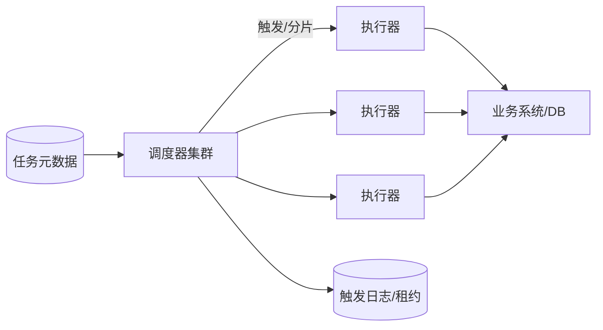

# 分布式任务调度怎么设计？

> 分布式调度难在“到点只执行一次、失败可重试、节点宕机可接管”，不是 cron 表达式本身。

## 单机 cron 为什么不够

业务早期一把 `@Scheduled` 或系统 crontab 就能干活。一旦多实例部署，问题立刻出现：

- 每个节点都到点执行，任务跑重
- 跑着重的节点挂了，没人接管
- 大任务单机跑不完，又无法水平拆
- 失败了只打日志，没有统一重试与死信

所以分布式调度要解决的是：**触发的一致性、执行的分片扩展、失败的可观测与可恢复**。cron 只是触发时间的 DSL。

## 角色拆分

把系统拆成三类角色，边界会清晰很多：

| 角色   | 职责                               | 不要做什么       |
| ------ | ---------------------------------- | ---------------- |
| 调度器 | 到点决策、分片、故障转移、记录触发 | 不跑重业务       |
| 执行器 | 拉取/接收任务，执行业务逻辑        | 不自己抢全局时钟 |
| 存储   | 任务定义、触发记录、锁/租约、进度  | 不只当日志库     |



调度器可多活：谁拿到某任务某触发点的租约，谁负责派发。执行器无状态扩容，按队列或 RPC 接收分片。

## 触发与租约

“到点执行”在分布式里必须变成“到点抢谁来触发”。

常见机制：

1. 调度器扫描 `next_fire_time <= now` 的任务
2. 对 `job_id + fire_time` 尝试占租约（DB 唯一键 / 分布式锁 / 主从租约）
3. 占成功则生成触发记录，派发给执行器
4. 租约需续约；超时未续约可被其他调度器接管
5. 触发记录带唯一键，防止重复派发

| 字段直觉     | 作用                          |
| ------------ | ----------------------------- |
| job_id       | 任务定义                      |
| fire_time    | 理论触发点                    |
| lease_owner  | 当前调度/执行持有者           |
| lease_expire | 租约过期时间                  |
| status       | 待派发 / 执行中 / 成功 / 失败 |

租约时间要大于一次正常调度决策 RTT，又不能太长，否则故障转移慢。执行中的长任务，租约续约和业务超时要分开看：续约只表示“还活着”，不表示“业务一定成功”。

## 分片：让大任务可水平扩展

很多任务不是“跑一个 SQL”，而是“扫全量用户发通知”“对账 2 亿行流水”。必须分片。

| 分片策略 | 例子                 | 特点             |
| -------- | -------------------- | ---------------- |
| 按取模   | `user_id % 64`       | 简单均匀         |
| 按号段   | `id between ? and ?` | 利于 DB 范围扫描 |
| 按分表   | 一张表一个分片       | 与中间件分表对齐 |
| 按业务桶 | 租户 / 机房          | 隔离故障域       |

每个分片维护独立进度：

```text
job_id | fire_time | shard_no | cursor | status | try_count
```

好处：

- 某分片失败可单独重试，不连坐全任务
- 执行器可按分片并行
- 重跑时从 cursor 续跑，而不是从头硬扫

注意分片数不是越大越好。分片过多会让调度元数据膨胀，过少又并行不起来。通常从几十到几百开始，结合下游承载调整。

## 投递语义：默认按至少一次设计

| 语义          | 含义               | 工程现实         |
| ------------- | ------------------ | ---------------- |
| at-most-once  | 最多一次，可能丢   | 关键任务基本不用 |
| at-least-once | 至少一次，可能重复 | 默认选择         |
| exactly-once  | 精确一次           | 调度层难单独保证 |

所谓“看起来 exactly-once”，通常是：

1. 调度侧 `job_id + fire_time (+ shard)` 去重，避免重复派发
2. 执行侧业务幂等，重复执行不出错
3. 必要时装等因子 / 唯一约束

例如“每天给用户发一张券”：执行前插入 `coupon_grant(user_id, day)` 唯一键，冲突则跳过。调度再可靠，也不要假设业务可以随便重入。幂等设计见 [接口幂等](/high-availability/high-availability-idempotency-design.html)。

## 失败处理与重试

失败分几类，处理不同：

| 失败类型         | 例子                | 策略             |
| ---------------- | ------------------- | ---------------- |
| 瞬时故障         | 网络抖、DB 短暂繁忙 | 有限次退避重试   |
| 毒丸数据         | 某条脏数据必 NPE    | 进死信，跳过继续 |
| 下游长时间不可用 | 依赖故障            | 熔断、延迟再调度 |
| 执行器进程被杀   | OOM、发布           | 租约过期后接管   |

重试建议：

- 明确 `max_try`
- 指数退避 + 抖动，避免雪崩
- 超过阈值进死信 / 人工区
- 超时要有杀手：不仅靠线程“自己觉得跑完”

长事务不要包住整个调度过程。正确边界是：调度记录状态变更用短事务；业务批次内部再按批提交。否则一个大事务锁行到天荒地老，失败回滚成本也高。

## 错过触发：misfire 怎么办

调度器停过、集群抖动、任务本身阻塞，都会导致错过理论触发点。策略要可配置：

| 策略           | 含义                 | 适用                 |
| -------------- | -------------------- | -------------------- |
| 忽略本次       | 只跑下一次           | 纯周期刷新           |
| 立即补跑一次   | 合并错过的多次为一次 | 对账、同步           |
| 逐个补跑       | 错过几次跑几次       | 必须按窗口生成的报表 |
| 滑动到下一周期 | 重新对齐时钟         | 固定节奏任务         |

没有 misfire 策略的调度器，恢复后要么漏跑，要么把积压瞬间打爆下游。

## 与业务系统的集成方式

常见两种：

1. **调度中心推**：调度器 RPC/HTTP 调执行器
2. **执行器拉**：执行器轮询自己的待执行队列

| 方式 | 优点               | 缺点                       |
| ---- | ------------------ | -------------------------- |
| 推   | 触发及时           | 要处理执行器地址与失败重推 |
| 拉   | 执行器自治、易扩容 | 有轮询延迟                 |

很多自研/中间件是混合：调度器把“分片任务”写入队列（推入队列），执行器消费队列（拉任务）。这样调度与执行解耦，积压也可观测。

## 观测指标

没有指标就等于黑盒 crontab。

| 指标                    | 说明                           |
| ----------------------- | ------------------------------ |
| 触发延迟                | `actual_fire - scheduled_fire` |
| 成功率 / 失败率         | 按任务、分片维度               |
| 执行耗时                | P50/P99，发现变慢              |
| 分片积压                | 未完成分片数                   |
| 租约超时接管次数        | 故障转移是否频繁               |
| 执行器心跳 / 线程池队列 | 容量是否不够                   |

告警建议盯“延迟”和“死信”，而不是只盯失败率。有的任务表面成功，其实是跳过了本该处理的数据。

## 安全与治理

- 管理台操作要鉴权：改 cron、手动触发、停止任务都是高危
- 手动触发必须写审计日志
- 生产禁止无确认的“全量重跑”
- 任务代码发布与调度配置变更解耦，避免配置一改全网一起炸

## 容易踩的坑

- **多实例直接挂 `@Scheduled`**：必重复执行
- **只加分布式锁，不记触发流水**：锁过期后仍可能重入且难审计
- **大任务不分片**：单分片跑数小时，失败从头来
- **假设 exactly-once**：一遇重试就重复发券/重复扣款
- **忽略 misfire**：宕机恢复后漏跑或洪峰补跑

## 小结

1. 调度系统要拆调度与执行，元数据与业务执行分离。
2. 租约和触发去重是分布式正确性的关键。
3. 分片让大体量任务可水平扩展，进度要可续跑。
4. 默认按至少一次设计，业务必须幂等。
5. 触发延迟、失败分片、misfire 与死信都要有指标和策略。

## 参考

综合自仓库内幂等、分布式锁与任务类场景的工程实践整理。
