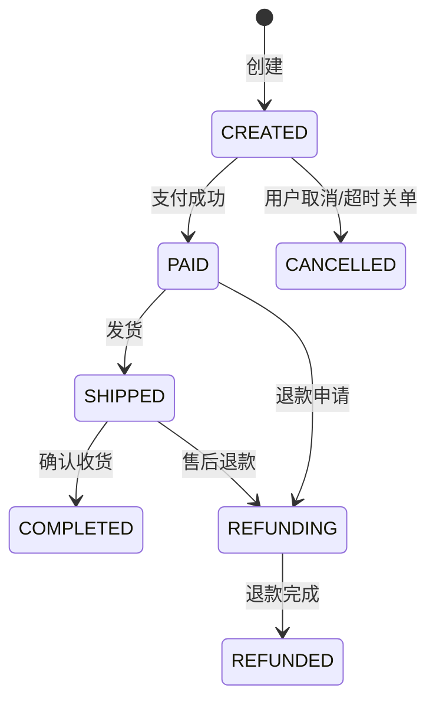
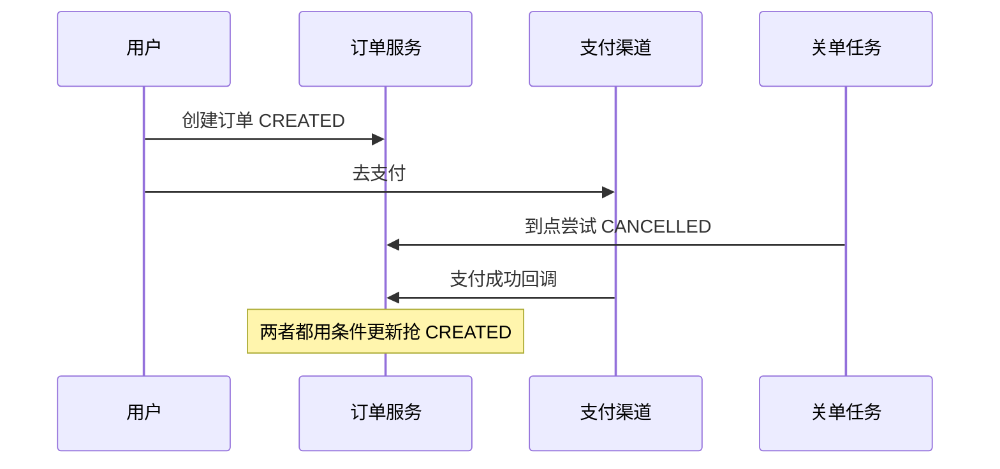

# 订单中心怎么设计状态机和一致性？

> 订单中心难在状态流转和跨服务一致性，不在“建一张订单表”。

## 为什么订单中心容易烂

订单串联了商品、库存、优惠、支付、履约、售后。每个下游都有自己的成功/失败/超时，任何一个回调乱序或重试，都可能把订单写成“不可解释状态”。线上最常见的事故不是表结构不够宽，而是：

- 支付成功回调和超时关单同时发生，状态互相覆盖
- 创建接口重试，生成两笔订单
- 库存扣了但订单没建，或订单建了库存没扣
- 列表查询把交易库拖慢，反过来影响下单

所以设计顺序应该是：**状态机 → 幂等 → 跨服务一致性 → 读写模型**，而不是先选 MQ 或先上分布式事务框架。

## 状态机先画清楚

先把主链路状态画出来，再谈边角：

规则要写成代码能执行的约束，而不是文档里的愿望：

1. **状态变更必须条件更新**：`update orders set status = #new where id = ? and status = #old`
2. **非法跳转直接拒绝**：`PAID -> CREATED`、`CANCELLED -> PAID` 一律失败
3. **每次变更记状态流水**：谁、何时、从哪到哪、业务凭证号
4. **终态尽量不可逆**：`COMPLETED` / `REFUNDED` / `CANCELLED` 进入后只允许售后支线，不允许“复活成待支付”

### 条件更新为什么是底线

假设订单处于 `CREATED`，同一时刻来了“支付成功”和“超时关单”：

| 线程 | SQL 意图       | 若无条件更新       | 有 `where status='CREATED'` |
| ---- | -------------- | ------------------ | --------------------------- |
| A    | 置为 PAID      | 成功               | 成功（先到者）              |
| B    | 置为 CANCELLED | 成功，覆盖掉已支付 | 影响 0 行，失败并告警       |

没有条件更新，就会出现“用户已扣款但订单显示取消”或反过来。流水表则用来事后审计和补偿，不靠人肉翻应用日志。

## 创建订单：同步链路尽量短

创建订单的同步路径只保留“用户必须立刻知道结果”的步骤：

1. 校验商品可售、价格快照、优惠可用性
2. 生成订单号（发号器，避免 DB 自增暴露体量）
3. 落订单主表 + 明细（价格、SKU、数量都要快照）
4. 驱动库存扣减（同库事务或下游协作）
5. 返回支付参数 / 收银台信息

价格一定要快照。下单时 99 元，支付时商品改成 109 元，订单仍应按下单快照成交，否则对账和对客都说不清。

跨库存、优惠、积分等多个服务时，不要默认全局 2PC 一把梭。更常见的工程选项：

| 方案                  | 适用                     | 代价                     |
| --------------------- | ------------------------ | ------------------------ |
| 本地消息表 / 事务消息 | 下单成功后异步驱动下游   | 最终一致，要补偿         |
| TCC                   | 强一致要求高且资源可改造 | 业务侵入大               |
| Saga                  | 长流程、可逐步补偿       | 编排复杂，回滚是业务回滚 |
| 同库本地事务          | 订单与库存暂时同库       | 扩展性差，但最简单       |

见 [分布式事务选型](/distributed-system/distributed-transaction-selection.html)。

一个务实默认值：**订单本地事务提交 + 事务消息通知库存/积分**；库存服务消费失败就重试，实在不行进补偿单，而不是让用户卡在下单接口里等分布式锁。

## 幂等：创建、支付、取消都要防重

订单域几乎每个写接口都会被重试。

| 场景      | 重复来源               | 幂等键                         |
| --------- | ---------------------- | ------------------------------ |
| 创建订单  | 客户端重试、网关重放   | `Idempotency-Key` / 业务下单号 |
| 支付回调  | 渠道重复通知           | 支付流水号                     |
| 取消/关单 | 定时任务与用户并发     | 订单号 + 期望状态              |
| 退款      | 客服重复提交、回调重试 | 退款单号                       |

落地方式通常是“**唯一索引 + 先插流水/令牌**”：

1. 客户端生成 `requestId`
2. 服务端以 `userId + requestId` 唯一写入
3. 冲突则返回首次创建的订单，而不是再插一笔

支付回调更要小心：先根据支付流水号查是否处理过，再推进状态机；推进失败要可重试，但不能重复入账。详见 [支付回调幂等](/high-availability/high-availability-idempotency-cases.html) 与 [接口幂等](/high-availability/high-availability-idempotency-design.html)。

## 超时关单与支付回调的竞态

这是订单中心最高频的并发题。流程是：

正确姿态：

1. 关单任务扫描 `CREATED 且 expire_at < now`
2. 执行 `update ... set status='CANCELLED' where status='CREATED'`
3. 若影响行数 = 1，发消息回补库存
4. 若影响行数 = 0，说明可能已支付，结束即可
5. 支付回调同样只允许 `CREATED -> PAID`

还要处理“渠道已扣款，但本地已关单”的对账：支付回调发现订单已是 `CANCELLED`，不能静默丢弃，应转人工或自动退款流程。这不是状态机能单独吞掉的，需要退款支线。

## 库存与订单的最终一致

以“下单扣库存”为例，一种常见时序：

1. 订单库本地事务：写订单 `CREATED` + 本地消息表
2. 消息投递到库存服务
3. 库存条件扣减成功，回写或发“扣减成功”事件
4. 若库存不足，订单转 `CANCELLED` 并通知用户

失败补偿表要能回答三个问题：

- 订单在、库存不在：补扣或取消订单
- 库存在、订单不在：回补库存
- 两边都在但数量不一致：对明细

对账任务按订单号/业务单号扫增量，比全表 join 更现实。消息可靠性参见 [消息不丢](/high-performance/high-performance-message-reliability.html)。

## 查询与写分离

交易库的职责是**正确变更状态**，不是扛复杂查询。

| 需求           | 建议                          |
| -------------- | ----------------------------- |
| 下单/支付/取消 | 打订单写模型，主键/订单号访问 |
| 用户订单列表   | 冗余列表字段，或同步到查询库  |
| 后台多条件筛选 | ES / 数仓，不走主交易库       |
| 报表           | 离线链路，严禁高峰扫生产大表  |

写模型保持瘦：状态、金额、关键外键。展示用的商品标题、主图、店铺名可以冗余在列表读模型，接受短暂延迟。这样支付回调不会和“按商品名模糊搜三个月订单”抢同一套连接池。

## 售后与逆向

逆向不是简单把状态倒回去：

- `PAID` 未发货退款：相对简单，退款成功后 `REFUNDED`，回补库存
- `SHIPPED` 后售后退款：可能部分退、仅退款、退货退款
- 一笔订单多商品时，售后单要落到明细行，不能只改订单头

因此很多系统会拆：

- 正向订单状态机
- 售后单状态机
- 两者通过订单号关联，而不是把所有箭头塞进一张图

## 观测与审计

至少具备：

| 信号           | 用途               |
| -------------- | ------------------ |
| 状态流转计数   | 发现异常跳转或卡住 |
| 条件更新冲突率 | 竞态是否过多       |
| 关单成功/失败  | 超时任务是否健康   |
| 支付回调延迟   | 渠道与本地差异     |
| 补偿单积压     | 最终一致是否收敛   |
| 状态流水       | 客服与对账依据     |

客服问“这单为什么取消”，靠状态流水 + 支付凭证就能回答；靠翻应用日志会很痛。

## 容易踩的坑

- **用枚举更新当状态机**：任何代码随手 `setStatus`，三个月后状态不可解释
- **把分布式事务当默认**：链路一长，TCC/2PC 把可用性打没
- **只幂等创建、不幂等回调**：支付渠道重试直接重复入账
- **关单与支付各写各的**：缺少条件更新和退款兜底
- **列表查询打主库**：大促时查比写先把库打挂

## 小结

1. 订单中心先有状态机，再谈中间件。
2. 跨服务优先最终一致 + 补偿，而不是默认强事务。
3. 幂等和条件更新是并发下的底线。
4. 超时关单必须处理与支付回调的竞态，并准备退款兜底。
5. 读写分离保护交易库，复杂查询走开查询模型。

## 参考

综合自仓库内分布式事务、幂等与消息可靠性笔记，结合订单域常见状态机实践整理。
