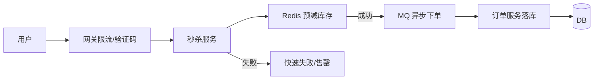

# 秒杀系统怎么设计？

> 秒杀不是“把下单接口加缓存”，而是用限流、预减库存、异步化和降级，把瞬时洪峰压成系统能消化的形状。

## 先定目标与约束

秒杀和日常电商下单看起来都是“扣库存 + 建订单”，但约束完全不同。日常链路可以接受几秒延迟，秒杀在开场几秒内就会涌入平时一天的流量；库存通常远小于请求数，绝大多数人注定买不到；业务上允许排队，却不允许明显超卖；活动页、推荐、评论这些“可砍”能力必须能在压力下被关掉。

动手前先做数量级估算，不必精确到个位：

| 维度 | 要估什么                 | 典型结论            |
| ---- | ------------------------ | ------------------- |
| 入口 | 活动页 QPS、下单接口 QPS | 入口远大于写库能力  |
| 库存 | 真实可售件数             | 决定 Redis 预减规模 |
| 写库 | 订单落库 TPS             | 必须异步削峰        |
| MQ   | 峰值吞吐、积压可接受时长 | 决定消费者扩容策略  |
| 体验 | 允许排队多久             | 决定轮询/推送方案   |

一个常见量级：入口 50 万 QPS、库存 1 万件、DB 写能力几千 TPS。结论立刻清晰——**不能让 50 万请求直接打到下单写库**，必须在入口、缓存、队列层层过滤。

## 主链路拆层

秒杀主链路可以看成一条漏斗：越往下，请求越少、代价越高。



| 层            | 作用                 | 失败时         |
| ------------- | -------------------- | -------------- |
| 网关          | 挡住绝大多数无效请求 | 直接 429       |
| 本地/集群限流 | 保护秒杀服务不被打满 | 排队或拒绝     |
| Redis 预减    | 原子扣减热点库存     | 返回售罄       |
| MQ            | 削峰写订单           | 积压可扩消费者 |
| DB            | 最终一致落单         | 对账补偿       |

直觉上很多人想“加机器扛住入口 QPS”，但库存只有 1 万件时，99% 以上请求注定失败。**正确目标不是扛住所有下单，而是尽快让失败请求廉价退出，只把极少数成功扣减的请求送进写路径。**

## 库存怎么扣

库存是秒杀的命门。直接 `select stock; if stock > 0; update stock = stock - 1` 在并发下一定超卖，因为“先查后改”不是原子操作。更稳妥的组合是：

1. 活动开始前把库存加载到 Redis
2. 用 `DECR` 或 Lua 脚本保证不减成负数
3. 扣减成功再发 MQ 异步创建订单
4. 订单服务落库，并用唯一键防重
5. 支付超时未支付再回补库存

Lua 预减的核心逻辑大致是：

```lua
-- KEYS[1] = stock key
local stock = tonumber(redis.call('GET', KEYS[1]))
if not stock or stock <= 0 then
  return 0
end
redis.call('DECR', KEYS[1])
return 1
```

Redis 成功只代表“抢到了扣减资格”，不代表订单一定生成成功。DB 层仍要兜底：

- 条件更新：`update stock set num = num - 1 where id = ? and num > 0`
- 订单唯一约束：用户 + 活动，或业务单号唯一
- 对账任务：定期扫“Redis 已扣、订单未建 / 订单已关、库存未回补”

详见 [缓存一致性](/database/redis/redis-cache-consistency.html)、[接口幂等](/high-availability/high-availability-idempotency-design.html)。

### 一个超卖例子

假设库存 1，两个请求同时进来：

| 时刻 | 请求 A     | 请求 B     | 结果           |
| ---- | ---------- | ---------- | -------------- |
| t1   | 读 stock=1 | 读 stock=1 | 都以为有货     |
| t2   | 写 stock=0 | 写 stock=0 | 各建一单，超卖 |

换成 Redis 原子预减后，只有一个请求拿到 1，另一个直接售罄。DB 条件更新再挡一层，即使 MQ 重投也不会多扣。

## 热点与限流

秒杀几乎一定伴随热点：同一个商品 ID、同一把库存 key、同一张活动页。治理要分层做：

- **入口限流**：按 IP / 用户 / 接口限流，见 [限流算法](/high-availability/high-availability-rate-limiting.html)
- **页面静态化 + CDN**：活动页、商品图、规则说明别打应用
- **验证码 / 答题 / 排队页**：把机器流量和人类流量拆开
- **分桶库存**：大库存拆成 `stock:{id}:{0..N}` 多 key，降低单点争用
- **本地缓存售罄标记**：卖完后进程内直接失败，不再问 Redis

分桶有代价：扣减成功后要汇总真实剩余，回补时也要写回对应桶。库存不大时单 key 足够；库存大、QPS 极高时再考虑分桶。

本地售罄标记要注意失效：若只是预减成功但后续回补，标记必须能被清掉，否则会出现“明明补回库存，页面仍显示售罄”。

## 异步下单的代价

异步之后，用户拿到的是“排队成功”，不是“下单一定成功”。产品文案和接口语义都要跟着改：

| 同步语义         | 异步语义                |
| ---------------- | ----------------------- |
| 立即返回订单号   | 返回排队 token / 预单号 |
| 失败立刻可知     | 可能稍后才失败          |
| 前端一次请求结束 | 需要轮询或推送结果      |

配套能力至少四块：

1. **结果查询**：按 token 查排队中 / 成功 / 失败
2. **失败回补**：落单失败、风控拒绝、支付超时，都要把 Redis 库存加回去
3. **对账任务**：扫不一致数据，修漏补、漏建、重复建
4. **MQ 可靠性与幂等**：生产确认、消费重试、业务唯一键，见 [消息不丢](/high-performance/high-performance-message-reliability.html)

常见坑是只做了“扣减成功发消息”，却没设计“消息丢了怎么办、消费两次怎么办”。至少一次投递是常态，订单表必须靠唯一约束把重复消费吞掉。

## 资格校验放哪

秒杀还常带资格：会员等级、新客、地区、黑名单、每人限购一件。这些校验不要一股脑塞进最热路径：

| 校验类型                | 建议位置         | 原因       |
| ----------------------- | ---------------- | ---------- |
| 登录态 / 基础风控       | 网关或边缘       | 尽早拒绝   |
| 活动是否开始 / 是否售罄 | 本地缓存 + Redis | 极高频     |
| 每人限购                | Redis Set / 位图 | 要原子判断 |
| 复杂营销资格            | 异步或弱化       | 高峰可降级 |

限购示例：预减成功后 `SADD bought:{activityId} {userId}`，若返回 0 说明已买过，立即回补库存并失败。这样比先查 DB 订单表便宜得多。

## 降级清单

流量超预期时，按优先级砍，而不是临时拍脑袋：

1. 关掉非核心推荐、评论、个性化
2. 弱化详细校验，只保留资格 + 库存 + 下单
3. 活动页全部静态化，详情只出简版
4. 读全部走缓存，写只保核心下单
5. 必要时只保留“预约/提醒”，暂停真实扣减

降级开关要提前埋好，并在演练里真的拨过。很多事故不是不会降级，是开关在配置中心，但运行时路径根本没读这个开关。

## 观测指标

没有指标的秒杀等于盲开。至少盯这些：

| 指标                    | 看什么           |
| ----------------------- | ---------------- |
| 入口 QPS / 拒绝率       | 限流是否生效     |
| Redis 扣减成功率 / 耗时 | 热点与库存状态   |
| MQ 堆积深度 / 消费延迟  | 异步是否跟得上   |
| 下单落库成功率          | 写路径健康度     |
| 超卖工单数              | 应为 0           |
| 回补次数 / 对账修复数   | 最终一致是否收敛 |

告警别只看 CPU。MQ 堆积飙升但 CPU 不高，往往是消费者阻塞或下游 DB 慢；Redis 扣减耗时升高，可能是大 key 或单分片打满。

## 和普通下单的边界

秒杀链路收敛后，不要反过来污染日常下单：

| 维度 | 秒杀                   | 日常下单             |
| ---- | ---------------------- | -------------------- |
| 目标 | 公平抢、防超卖、保系统 | 完整交易体验         |
| 库存 | Redis 预减为主         | 常直接打库存服务     |
| 下单 | 异步排队常见           | 同步返回订单更常见   |
| 校验 | 高峰可降级             | 优惠/地址/发票要完整 |
| 页面 | 静态化 + 售罄短路      | 个性化、推荐可保留   |

两套接口、两套限流阈值、两套降级开关，比“一个下单接口加 if 秒杀”更干净。活动结束要把秒杀库存与日常库存对账合并，避免两边各记各的。

## 容易踩的坑

- **只缓存商品详情，不处理写路径**：读扛住了，下单一打还是垮。
- **信任 Redis 预减、DB 不再校验**：脚本 bug、回补错误、人工改库存时会穿仓。
- **售罄后仍回源 DB**：要把售罄做成廉价短路。
- **异步成功当成支付成功**：没支付的单要超时关单并回补。
- **没有演练**：限流阈值、库存分桶、降级开关都要在预发用真实流量形状压过。
- **秒杀与日常共用一条写路径**：日常的重校验会拖垮秒杀，秒杀的降级也会误伤日常。

## 小结

1. 秒杀核心是削峰和保护库存，不是单纯加机器。
2. Redis 预减 + MQ 异步 + DB 条件更新 / 唯一键，是常见稳妥组合。
3. 热点 key、入口限流、售罄短路必须一起做。
4. 异步换来最终一致，要补查询、回补与对账。
5. 先写清降级顺序和观测指标，再谈边角优化。

## 参考

综合自仓库内限流、缓存、MQ 可靠性与幂等相关笔记，并结合秒杀场景的常见工程拆解整理。
