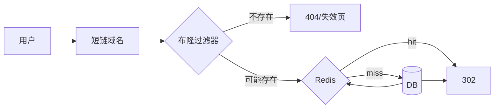

# 短链系统怎么设计？

> 短链系统的本质是高性能的 KV 映射：长链写入一次，读取千万次。

## 业务要解决什么

短链看起来只是“把长 URL 变短”，真正要同时满足的是：

- 生成的 code 尽量短、可分享
- 跳转延迟极低，通常要在几毫秒到几十毫秒
- 读写比极端悬殊，读远大于写
- 可过期、可封禁、可统计点击
- 防止被拿去挂钓鱼站

如果忽略后几条，系统很容易做成“能跳转的玩具”，上线后在安全、热点、容量上返工。

## 核心 API

| API       | 输入                      | 输出                  | 说明               |
| --------- | ------------------------- | --------------------- | ------------------ |
| 创建      | longUrl、过期时间、创建者 | shortCode / 完整短链  | 写路径，要鉴权限流 |
| 跳转      | shortCode                 | 302 Location: longUrl | 读路径，极致性能   |
| 查询详情  | shortCode                 | 元数据、状态、统计    | 运营后台用         |
| 封禁/失效 | shortCode                 | 状态变更              | 安全治理           |

创建侧是写，跳转侧是读。架构上要把两边分开优化：写要正确和可控，读要命中缓存并挡住乱扫。

## 发号与编码

短码怎么来，是第一个分叉点。

| 方案            | 做法                           | 优点                 | 风险                       |
| --------------- | ------------------------------ | -------------------- | -------------------------- |
| 发号器 + Base62 | 雪花 / 号段得到 ID，转 62 进制 | 短、可控、几乎不冲突 | 要管发号与时钟             |
| 哈希截断        | `hash(longUrl)` 取前 N 位      | 实现简单             | 冲突、长度难控、难预测容量 |
| 随机串          | 生成随机 Base62，写库撞车重试  | 无中心发号           | 重试与扫描风险             |

生产更常见的是 **发号 + Base62**。字符集一般是 `0-9a-zA-Z`，共 62 个符号。

容量先算清楚再定长度：

| 长度 | 空间大约        | 体感               |
| ---- | --------------- | ------------------ |
| 6 位 | 62^6 ≈ 568 亿   | 中小型业务通常够用 |
| 7 位 | 62^7 ≈ 3.5 万亿 | 更大余量           |
| 8 位 | 62^8 ≈ 218 万亿 | 偏保守             |

发号器可选号段模式：每个生成服务一次取一段 ID（如 1000 个），本地递增，用完再取。这样既减少对中心依赖，又避免每次远程发号。雪花算法也能用，但要处理时钟回拨，且生成的 ID 直接 Base62 后长度可能不如号段紧凑。

哈希截断看起来省事，冲突时要再哈希或加盐，短码长度和可运维性都会变差；同一长链是否生成相同短码，也变成产品问题。除非有“相同长链必须映射同一短码”的强需求，否则发号更干净。

## 存储模型

一张最小可用表：

```text
short_code (PK) | long_url | expire_at | created_at | creator | status | visit_cnt
```

| 字段       | 作用                           |
| ---------- | ------------------------------ |
| short_code | 主键，跳转查询键               |
| long_url   | 原始地址，注意长度与编码       |
| expire_at  | 过期时间，空表示永久           |
| status     | 正常 / 封禁 / 删除             |
| visit_cnt  | 可选，粗统计；精细统计可走日志 |

优化方向：

- **读多写少**：Redis 缓存 `code -> url + status + expire`
- **分库分表**：按 `short_code` 哈希拆分，避免单表过大
- **布隆过滤器**：挡明显不存在的 code，减少穿透
- **冷热分离**：极老且低频的映射可归档，热点常驻缓存

缓存值建议带状态和过期时间，避免只缓存 URL 导致封禁后仍跳转。过期策略可以是：

1. Redis TTL 与业务过期对齐
2. 回源时发现 `expire_at < now`，返回失效并缓存短空值

## 跳转链路



### 301 还是 302

| 状态码 | 浏览器行为                 | 适合                   |
| ------ | -------------------------- | ---------------------- |
| 301    | 永久重定向，易被长期缓存   | 短码永不改绑           |
| 302    | 临时重定向，每次还可能回源 | 可改绑、要统计、要封禁 |

多数业务短链用 **302**。原因很现实：运营会改落地页、安全会封禁、产品要点击统计。若用 301，浏览器和中间代理可能把映射缓存很久，服务端改了绑定用户仍跳到旧地址。

若确定“生成后永不变更、也不在意服务端统计”，301 能省回源；这是产品决策，不是性能迷信。

### 跳转时要做的最小检查

1. code 格式是否合法（字符集、长度）
2. 布隆 / 缓存 / DB 是否存在
3. status 是否正常
4. 是否过期
5. 写访问日志（异步），再 302

访问统计不要同步写主库。把 `code、ua、ip、ts` 丢到 MQ 或日志链路，异步聚合，避免读路径被统计拖慢。

## 热点短链

爆款活动、热门分享会让单个 code 成为热 key。表现通常是：

- Redis 单分片 CPU 打满
- 该 key 带宽占比异常
- 本地到 Redis 的网络被打爆

治理组合：

| 手段         | 做法                          | 效果               |
| ------------ | ----------------------------- | ------------------ |
| 本地缓存     | 进程内 Caffeine 缓存热点 code | 挡住绝大多数重复读 |
| 多级缓存     | 本地 + Redis                  | 降级和命中率更好   |
| singleflight | 同一 code 并发只回源一次      | 防缓存击穿         |
| key 打散     | `url:{code}:{shard}` 多副本   | 分散 Redis 热点    |
| CDN          | 对落地页静态资源加速          | 不替代短链服务本身 |

注意：CDN 很适合活动落地页，但短链服务是 302 动态跳转，本身仍要抗 QPS。把短链域名整个甩给只会缓存静态文件的 CDN，往往不够。

本地缓存要设较短 TTL，并在封禁 / 改绑时通过版本号或主动失效尽量尽快生效；接受“极短窗口内旧跳转”通常比强一致广播更划算。

## 创建路径设计

创建接口比跳转更容易被刷：

1. 鉴权：仅登录用户或服务账号
2. 限流：按用户 / IP / 应用维度，见 [限流算法](/high-availability/high-availability-rate-limiting.html)
3. 长链校验：协议仅 http/https、域名白名单或黑名单
4. 规范化：去掉无意义 fragment、统一 host 小写（按产品要求）
5. 发号编码，写 DB，写缓存
6. 返回短链

是否对相同 longUrl 返回同一个 shortCode，取决于产品：

- **去重映射**：省空间，适合官方活动链
- **每次新建**：便于分组统计和权限隔离，实现更简单

不要默认“相同长链必须同一短码”。很多业务其实需要“不同活动各自一条短链，方便统计和失效”。

## 安全与治理

短链天然适合被滥用：生成海量跳板、挂钓鱼站、做隐蔽跳转。

| 风险         | 手段                                     |
| ------------ | ---------------------------------------- |
| 钓鱼跳转     | 域名白名单、人工/异步审核、危险域名库    |
| 接口被刷     | 创建鉴权 + 限流 + 验证码                 |
| 短码扫描     | 码空间要大、不连续可猜测性低、布隆挡穿透 |
| 开放预览滥用 | 谨慎提供“未登录任意创建”                 |
| 合规下架     | 支持即时封禁，缓存同步失效               |

发号器如果是单调递增，短码会可枚举。Base62 后虽然不像数字那么直观，但仍可遍历。缓解办法包括：对 ID 做一次可逆打散（如有限域混洗）、加大码空间、对异常扫描限流。

## 过期、删除与数据生命周期

- **逻辑过期**：读时判断 `expire_at`
- **物理清理**：定时任务分批删冷数据
- **封禁优先于删除**：保留审计痕迹
- **缓存与 DB 一致**：封禁后删缓存或写“封禁占位”

删除不要只 `DELETE` 一行了事。若统计、风控、审计还要追溯，更常见是改 status，并异步清缓存。

## 观测指标

| 指标                | 含义           |
| ------------------- | -------------- |
| 跳转 QPS / P99      | 读路径性能     |
| 缓存命中率          | 是否真的抗住读 |
| 回源 DB QPS         | 穿透/击穿信号  |
| 创建成功率 / 拒绝率 | 写路径与防刷   |
| 404 / 封禁比例      | 扫描与治理效果 |
| 热点 key TopN       | 提前扩容或打散 |

## 小结

1. 短链是 KV：发号编码、存储、缓存三条主线。
2. Base62 + 发号通常比哈希截断更好控长度和冲突。
3. 读路径要防穿透、击穿和热点，本地缓存很关键。
4. 302 / 301 是产品与运营决策，不是随意选的状态码。
5. 创建侧安全治理和跳转侧性能，必须分开设计。

## 参考

综合自仓库内分布式 ID、缓存与限流相关实践，结合短链系统常见架构整理。
