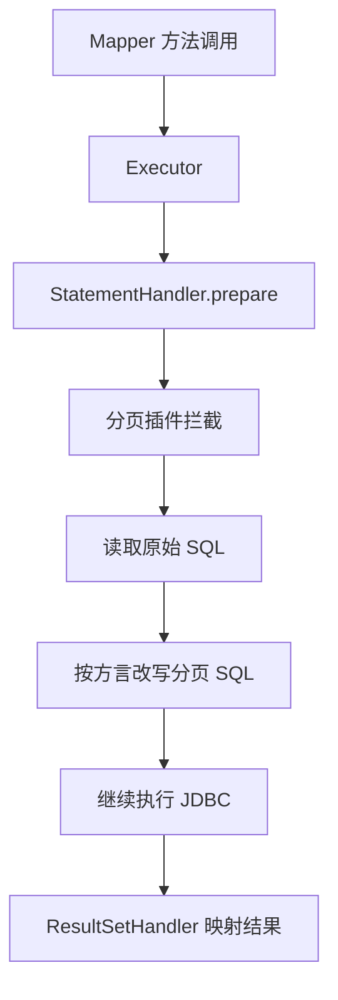

# MyBatis 插件机制和分页插件怎么工作？

> MyBatis 插件机制的核心，不是“可以随便拦任何地方”，而是它只允许你代理 4 类内部组件。分页插件之所以能工作，本质上就是在这些拦截点里改写 SQL 或执行路径。

先看一个大家最常见的需求：

- 前端要查第 3 页，每页 20 条
- 还想拿总条数
- 数据量又不小，不能把所有结果查出来再截

很多人会本能想到：

- 用 `RowBounds`
- 或者上一个分页插件

但面试真正往下追时，想听的通常不是“我会用 PageHelper”，而是：

1. MyBatis 插件到底能拦哪些对象？
2. 分页插件是怎么把普通 SQL 改成物理分页 SQL 的？
3. `RowBounds` 为什么经常不是最佳答案？
4. 为什么插件写不好，很容易把 MyBatis 核心流程搞坏？

## 先抓总线：MyBatis 插件不是 AOP 万能钩子

MyBatis 官方文档说得很直接：

默认只允许插件拦截下面 4 类接口的方法：

1. `Executor`
2. `ParameterHandler`
3. `ResultSetHandler`
4. `StatementHandler`

也就是说，MyBatis 插件机制不是“任意切点增强”，而是：

**围绕 SQL 执行链上几个关键内部组件做代理。**

这点如果不先讲清，后面很容易把插件理解成“像 Spring AOP 一样哪都能切”。

## 这 4 类接口各自负责什么？

先把角色分开：

| 接口               | 大致职责                                     |
| ------------------ | -------------------------------------------- |
| `Executor`         | 调度执行增删改查、事务提交回滚、一级缓存等   |
| `StatementHandler` | 处理 JDBC Statement，准备 SQL、执行查询/更新 |
| `ParameterHandler` | 给 SQL 参数占位符真正设值                    |
| `ResultSetHandler` | 把 JDBC 结果集映射成对象                     |

可以把它理解成：

```text
Mapper 方法
 -> Executor
 -> StatementHandler
 -> ParameterHandler
 -> JDBC execute
 -> ResultSetHandler
 -> Java 对象
```

所以如果你想改分页 SQL，最常落手的地方通常就是：

- `StatementHandler`
- 或者某些实现里更上游的 `Executor`

## MyBatis 插件本质上怎么生效？

官方文档给出的关键点是：

- 你实现 `Interceptor`
- 用 `@Intercepts` + `@Signature` 声明拦截点
- MyBatis 给目标接口创建代理
- 调用被拦方法时，进入你的 `intercept()`

一个最小结构大概是：

```java
@Intercepts({
 @Signature(
 type = StatementHandler.class,
 method = "prepare",
 args = {Connection.class, Integer.class}
 )
})
public class ExamplePlugin implements Interceptor {

 @Override
 public Object intercept(Invocation invocation) throws Throwable {
 // 前置逻辑
 Object result = invocation.proceed();
 // 后置逻辑
 return result;
 }
}
```

这个结构里最关键的一句不是“实现接口”，而是：

**真正继续执行原始逻辑，要靠 `invocation.proceed()`。**

如果你把这里搞错，插件就不是“增强”，而是在截断 MyBatis 的原始执行路径。

## 插件为什么本质上也是代理链？

因为 MyBatis 内部还是走代理包装。

可以先把节奏记成：

1. 创建目标内部对象
2. 判断有没有插件命中它
3. 如果命中，就一层层用代理包起来
4. 调用方法时，先进入插件链，再回到原始实现

所以它和 Spring AOP 在思路上有相似性，但边界更死：

- Spring AOP 面向业务 Bean
- MyBatis 插件面向框架内部 4 类组件

## 为什么官方文档反复提醒“谨慎使用插件”？

MyBatis 官方文档对插件的态度非常克制，大意就是：

**这些都是底层内部类和方法，如果你真的改行为，很容易把 MyBatis 核心搞坏。**

原因不复杂：

- 你拦的是执行核心链路
- 一个参数改错，整个 SQL 都可能跑偏
- 一个对象 unwrap 错，分页、缓存、映射都可能异常

所以插件特别适合做：

- 监控埋点
- 物理分页
- SQL 改写
- 轻量审计

但不适合把复杂业务编排硬塞进去。

## `RowBounds` 为什么经常不是最佳分页方案？

这是非常高频的追问点。

MyBatis 官方 Java API 文档给了 `RowBounds`：

```java
selectList(String statement, Object parameter, RowBounds rowBounds)
```

它的语义是：

- `offset`
- `limit`

但官方文档同时提醒了一个关键现实：

- 这是通过结果集范围控制来限制返回行数
- 真正效率如何，取决于 JDBC driver / ResultSet 能力

本质上它更像：

**在 MyBatis/JDBC 结果处理阶段做范围裁剪。**

这就意味着：

- 它不是天然等价于数据库层 `limit offset`
- 很多场景下未必是你想要的“真正物理分页”

所以在大多数真实项目里，大家更常用的是：

1. SQL 直接写物理分页
2. 或者用分页插件改写 SQL

## 分页插件为什么能做“物理分页”？

因为它不是在结果出来后再截，而是在 SQL 真发给数据库之前就改写。

比如原始 SQL：

```sql
select * from student order by id
```

分页插件拦下来以后，可能改成：

```sql
select * from student order by id limit 40, 20
```

或者 Oracle、SQL Server 方言下的别的写法。

所以分页插件的核心价值是：

**在数据库执行前，把通用查询改成目标数据库能高效执行的物理分页 SQL。**

## 分页插件通常拦在哪？

最常见的是拦 `StatementHandler.prepare()`。

为什么？

因为这个阶段：

- SQL 基本已经成型
- 还没真正交给数据库执行
- 比较适合读取并改写 `BoundSql`

一个典型流程可以理解成：



这也是为什么很多分页插件实现里，最重要的工作其实不是“分页计算”，而是：

- 找到真实 SQL
- 找到分页参数
- 按数据库方言改写

## 分页插件除了改查询 SQL，通常还会做什么？

真实项目里，前端分页一般不只要当前页数据，还要总条数。

所以分页插件经常会做两件事：

1. 把原始查询改成分页查询
2. 再派生一条 `count` SQL 去查总数

比如：

```sql
select * from orders where status = 'PAID' order by created_at desc
```

分页插件可能会拆成：

```sql
select count(*) from orders where status = 'PAID'
```

和

```sql
select * from orders where status = 'PAID' order by created_at desc limit ?, ?
```

所以分页插件真正难的地方往往不在 `limit`，而在：

- 怎么生成可靠的 count SQL
- 遇到复杂 SQL（group by、union、子查询）时怎么不出错

## 为什么复杂 SQL 下分页插件容易翻车？

因为它本质上是在改写 SQL 字符串或中间表示。

如果你的 SQL 很简单，改起来问题不大。
但一旦遇到：

- `group by`
- `distinct`
- `union`
- 深层子查询
- 数据库专有语法

count SQL 或分页 SQL 的改写就可能变得不可靠。

这也是为什么很多团队最后的经验会是：

- 简单查询用分页插件很省事
- 复杂报表 SQL 更稳的是自己手写分页和 count

## 插件顺序为什么也会影响结果？

如果项目里不止一个 MyBatis 插件，比如：

- 分页插件
- SQL 审计插件
- 多租户改写插件
- 加解密插件

那顺序就会直接影响最终 SQL 长什么样。

因为每个插件看到的，可能已经是前一个插件改写后的对象。

这意味着：

- 先分页再多租户，和先多租户再分页，结果可能不一样
- 先审计原始 SQL，和先审计改写后 SQL，日志含义也不一样

所以插件链排障时一定要先问：

**我看到的这条 SQL，是原始 SQL，还是前面插件已经改过的 SQL？**

## 一个最容易误解的点：插件不是只能做分页

分页是最常见场景，但插件机制本身远不止分页。

只要场景适合在这 4 类接口上做增强，都可以用插件，比如：

- 慢 SQL 统计
- SQL 重写
- 审计字段注入
- 多租户条件拼装
- 脱敏/加解密

但要记住官方文档那句潜台词：

**能做不代表该做，越接近框架底层，越要收着写。**

## 一个更稳的排障顺序

如果线上怀疑“分页插件有问题”，我会按这个顺序排：

```text
1. 这次到底有没有命中插件？
2. 拦截的是哪个接口、哪个方法？
3. 改写前 SQL 是什么？
4. 改写后 SQL 是什么？
5. count SQL 是否被额外改坏了？
6. 插件链上还有没有别的插件也在改 SQL？
7. 当前数据库方言是不是和插件配置一致？
```

大多数问题不会卡在“插件机制本身”，而是卡在 SQL 改写边界或插件顺序上。

## 工程上更稳的用法

如果你问“那分页插件应该怎么用才稳”，我的建议会比较保守：

### 1. 简单 CRUD 列表页优先用分页插件

这类 SQL 结构简单，收益最大，心智负担最小。

### 2. 复杂报表 SQL 别迷信自动 count

一旦有 `group by`、`union`、复杂子查询，最好自己控制分页 SQL 和总数 SQL。

### 3. 插件逻辑尽量做“框架增强”，别做“业务编排”

插件更适合改执行链，不适合塞核心业务条件判断。

### 4. 插件顺序要显式约束

多个插件一起上时，不把顺序说清，后面排障会很痛苦。

## 容易踩的坑

### “RowBounds 就是物理分页”

这句话不稳。
更准确地说：

**RowBounds 是结果范围控制，最终效率很依赖驱动和执行方式。**

### “分页插件只是拼个 limit”

这也太浅了。
真实插件通常至少还要处理：

- 方言差异
- 分页参数绑定
- 总数查询
- 复杂 SQL 兼容性

### “插件可以随便拦任何 MyBatis 对象”

不对。
官方文档明确限定了就那 4 类核心接口。

## 小结

- MyBatis 插件机制本质上是对 `Executor`、`StatementHandler`、`ParameterHandler`、`ResultSetHandler` 这 4 类内部组件做代理增强。
- 分页插件之所以能工作，本质上是在 SQL 真正执行前改写成数据库方言下的物理分页语句。
- `RowBounds` 能做范围限制，但很多场景下不等于你真正想要的数据库物理分页。
- 分页插件真正难的地方不只是 `limit`，还包括 count SQL、复杂语句兼容和多插件顺序。
- 插件越接近 MyBatis 执行底层，越要谨慎；简单列表页适合插件，复杂报表场景往往更适合手写分页和总数 SQL。

## 参考

综合自 MyBatis 常见问题整理，并结合 MyBatis 官方文档中关于 plugins、`Interceptor`、四大可拦截接口、`RowBounds` 和结果处理限制的说明，重写了插件机制、分页插件主线和常见踩坑点。
