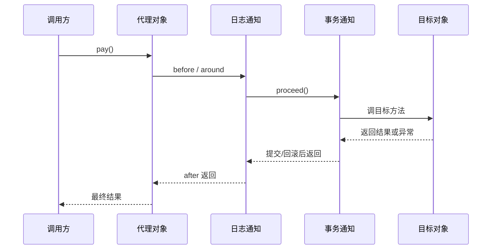

# AOP 动态代理是怎么织入的？

> Spring AOP 的“织入”本质上不是改你的源码，而是在运行时给目标 Bean 外面包一层代理。真正被调用的，很多时候已经不是原始对象，而是一个带通知链的代理对象。

先看一个最常见的场景：

- 你想给 Service 方法统一加日志
- 你想在方法前后做权限校验
- 你想让 `@Transactional` 自动开启和提交事务

如果每个方法都手写这些逻辑，代码会很快变成这样：

```java
public void createOrder() {
 checkPermission();
 logStart();
 try {
 txBegin();
 // 业务逻辑
 txCommit();
 } catch (Exception e) {
 txRollback();
 throw e;
 } finally {
 logEnd();
 }
}
```

AOP 想解决的，就是把这些**横切逻辑**从业务代码里剥出来。

但面试继续往下追时，真正想听的是：

1. Spring AOP 为什么能“无侵入”地织进去？
2. JDK 动态代理和 CGLIB 到底怎么选？
3. 为什么自调用会失效？
4. Spring AOP 和 AspectJ 究竟差在哪？

## 先抓一句话：Spring AOP 是代理，不是改源码

Spring AOP 最核心的事实是：

**它是基于代理的运行时增强。**

也就是说，Spring 不会直接改你的业务类源码，也不是默认去改字节码文件，而是：

1. 先拿到目标对象
2. 判断它需不需要增强
3. 如果需要，就生成代理对象
4. 以后外部代码调到的是代理，不是原始对象

可以先把这条线记成：

```text
目标对象
 ↓
匹配切点
 ↓
创建代理
 ↓
方法调用进入通知链
 ↓
最后再调目标方法
```

## 什么叫“织入”？

很多文章一上来就解释一堆术语，结果越看越乱。这里先把“织入”翻成人话：

**织入，就是把切面逻辑真正挂到目标方法调用路径上。**

比如一个订单服务：

```java
public class OrderService {
 public void pay() {
 // 核心业务
 }
}
```

如果你给它挂了日志切面和事务切面，那外部调用时，实际发生的已经更像是：

```text
日志 before
 -> 事务开启
 -> 调用目标方法 pay()
 -> 提交/回滚事务
日志 after
```

这个调用路径不是你手写在 `pay()` 里的，而是代理对象在外面帮你串起来的。

## Spring AOP 里的几个术语，真正要记什么

术语本身不用背得太花，面试里够用的是这几个：

| 术语       | 实际要表达的意思           |
| ---------- | -------------------------- |
| `Target`   | 原始业务对象               |
| `Proxy`    | Spring 生成的代理对象      |
| `Advice`   | 在方法前后插进去的增强逻辑 |
| `Pointcut` | 哪些方法需要增强           |
| `Aspect`   | 切点 + 通知逻辑的组合      |

最关键的不是名词定义，而是这句话：

**切点决定“拦谁”，通知决定“拦下来后做什么”，代理负责“把这些东西真的串到调用链里”。**

## JDK 动态代理和 CGLIB，到底怎么选？

这是高频细节题。

Spring 官方文档给的规则很直接：

### 1. 目标类实现了接口

如果目标对象实现了至少一个接口，Spring 默认优先用 **JDK 动态代理**。

此时代理的是接口视角的方法。

### 2. 目标类没实现接口

如果目标对象没有实现接口，Spring 会用 **CGLIB** 创建一个运行时子类做代理。

所以可以先记成：

```text
有接口 -> JDK Proxy
没接口 -> CGLIB
```

但只记这句还不够，因为它会被继续追问。

## CGLIB 为什么有一些天然限制？

因为 CGLIB 的做法不是“实现接口”，而是：

**继承目标类，再重写可增强的方法。**

这就直接带出几个边界：

- `final` 类不能代理，因为不能继承
- `final` 方法不能增强，因为不能重写
- `private` 方法不能增强，因为子类看不见也重写不了

所以如果有人问你“为什么 `final` 方法上的事务不生效”，本质原因就和这里是一条线。

## 动态代理真正拦截方法时，会发生什么？

可以把一次调用理解成“进入一条责任链”。

假设你有一个日志切面和一个事务切面，调用 `orderService.pay()` 的流程更像这样：



这里最值得你主动点出来的一句是：

**代理对象自己不处理业务，它的工作是把多个 advice 串成一条调用链，然后在合适的时候再调用目标方法。**

## 为什么 `@Around` 往往最强？

因为它能完整包住一次方法调用。

别的通知类型通常只能做局部动作：

- `@Before`：方法前
- `@AfterReturning`：正常返回后
- `@AfterThrowing`：抛异常后
- `@After`：类似 finally

而 `@Around` 可以：

1. 方法前做点事
2. 决定要不要调用目标方法
3. 调用后再处理结果
4. 甚至改参数、改返回值

所以很多通用框架型逻辑，最后都会落到环绕通知这类模型里。

## 多个切面同时命中时，顺序怎么定？

这也是面试里常见补刀题。

不同切面之间，Spring 走的还是统一排序规则：

- 可以通过 `@Order`
- 或实现 `Ordered`

数值越小，优先级越高。

官方文档还有一个很容易被忽略的点：

- 进入方法时，优先级高的先执行
- 退出方法时，优先级高的后执行

所以它有点像“栈”：

```text
进入：高 -> 低
退出：低 -> 高
```

这点如果你能讲出来，说明不是只会说“用 `@Order` 控制顺序”。

## 为什么自调用会失效？

这几乎是 Spring AOP 里最经典的坑。

看这个例子：

```java
public class UserService {
 public void outer() {
 this.inner();
 }

 @Transactional
 public void inner() {
 // ...
 }
}
```

很多人以为 `outer()` 调了 `inner()`，事务就会生效。
但 Spring 官方文档明确说明：

**Spring AOP 是代理模型，自调用走的是 `this`，不会再经过代理。**

外部调用时是：

```text
client -> proxy -> target
```

但对象内部 `this.inner()` 是：

```text
target -> target
```

中间没有代理，自然也没有 advice。

这就是为什么：

- `@Transactional` 自调用失效
- 某些日志切面自调用失效
- 某些权限切面自调用失效

本质上都不是“事务有问题”，而是**调用路径没经过代理**。

## 自调用问题怎么处理？

Spring 官方文档给了几种方向，工程上最稳的还是第一种。

### 1. 拆出去，避免自调用

这是最推荐的做法。

把需要增强的方法拆到另一个 Bean，由外部调用这个 Bean。
这样调用路径天然会经过代理。

### 2. 注入自己代理后的引用

也就是所谓 self injection。

但这会让代码结构变得比较别扭，而且很容易让业务类知道太多 AOP 细节。

### 3. `AopContext.currentProxy()`

Spring 官方文档明确不鼓励把这个当常规方案。

因为这等于把你的业务类直接耦合到 Spring AOP 运行时环境里。

所以如果你回答这个问题，最好把态度讲清楚：

**能拆 Bean 就拆 Bean，`AopContext.currentProxy()` 只是最后兜底。**

## Spring AOP 和 AspectJ 到底差在哪？

这个问题很多人会答成“一个简单，一个强大”，但这样太虚。

更稳的对比是：

| 维度                    | Spring AOP                    | AspectJ              |
| ----------------------- | ----------------------------- | -------------------- |
| 增强方式                | 运行时代理                    | 编译期或类加载期织入 |
| 作用范围                | 主要针对 Spring Bean 方法调用 | 可以增强更广的连接点 |
| `final`/构造器/字段访问 | 受限较多                      | 能力更强             |
| 自调用问题              | 有                            | 没有这个代理层限制   |

最关键的一句是：

**Spring AOP 是 proxy-based，AspectJ 是 bytecode weaving。**

这直接决定了两者的能力边界。

所以：

- 普通业务系统里，Spring AOP 通常够用
- 如果你要增强构造器、字段访问、`final` 方法，或者想绕过自调用问题，AspectJ 才是那条线

## Spring Boot 下默认一定是 CGLIB 吗？

这个问题以前经常被问，很多资料也爱背 Boot 1.x / 2.x 的默认差异。

但这里最稳的答法，不是死记某个旧版本默认值，而是讲原则：

1. Spring Framework 核心层面默认是“有接口优先 JDK 代理，没接口用 CGLIB”
2. Boot 可以通过配置影响默认代理策略
3. 真正写业务时，更该关心的是代理语义边界，而不是死背版本默认值

如果面试官真的继续追版本细节，再按当时版本补充就行。

## AOP 是在生命周期哪个阶段挂进去的？

这可以顺手和上一篇生命周期文章接起来。

Spring AOP 常见是在 `BeanPostProcessor` 这层完成自动代理创建的。
也就是说：

1. 目标 Bean 先创建
2. 完成依赖注入和初始化
3. 后处理器判断这个 Bean 需不需要代理
4. 如果需要，就返回代理对象

这也解释了为什么循环依赖那篇里，三级缓存要考虑“提前代理引用”的问题。
因为别的 Bean 最终拿到的，可能从一开始就应该是代理，而不是原始对象。

## 容易踩的坑

### “AOP 就是动态代理”这句话不完整

更准确地说：

- Spring AOP 在常见场景下是基于动态代理
- 但 AOP 这个概念本身不等于动态代理
- AspectJ 就不是走这条路

### `private` / `final` / 自调用 失效，本质都是代理边界

不要把这些零散记成三条死规则。
把它们统一理解成一句话更稳：

**Spring AOP 能增强的，是代理看得见、也拦得住的调用路径。**

### 不要把 AOP 当业务兜底逻辑的垃圾桶

日志、事务、审计、权限、限流，这些很适合 AOP。
但如果是强业务分支、复杂流程编排，硬塞进切面只会让调用路径更难读、更难排障。

## 小结

- Spring AOP 的本质是运行时代理，织入发生在代理对象这一层，不是改源码。
- 有接口通常走 JDK 动态代理，没接口通常走 CGLIB；`final` 类、`final` 方法、`private` 方法都有边界。
- 方法调用会进入一条 advice 链，代理负责把多个通知串起来后再调用目标方法。
- 自调用失效的根因是调用路径没有经过代理，这也是 `@Transactional` 常见失效原因之一。
- Spring AOP 和 AspectJ 的根本差异，是一个基于 proxy，一个基于字节码织入。

## 参考

基于 Spring Framework Reference Documentation 中 IoC Container、Bean Lifecycle、AOP Proxies、Transaction Management、Spring MVC DispatcherServlet 与 Handler Methods 等相关章节整理。
