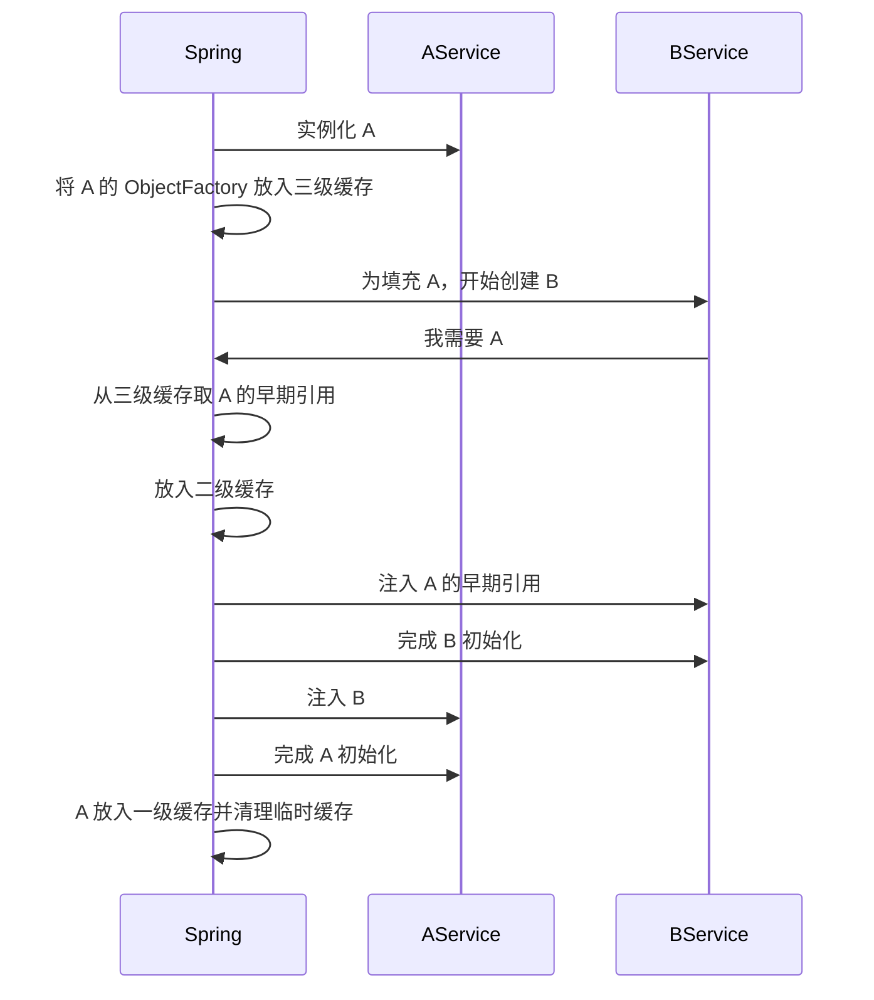

# Spring 如何解决循环依赖？为什么构造器注入不行？

> Spring 解决循环依赖的核心，不是“万能三级缓存”这几个字，而是对**单例 Bean 的提前暴露**。构造器注入不行，本质上是因为对象都还没实例化出来，根本没机会提前暴露。

先看一个最典型的场景：

```java
@Service
public class AService {
 @Autowired
 private BService bService;
}

@Service
public class BService {
 @Autowired
 private AService aService;
}
```

很多人会说：

- Spring 用三级缓存解决循环依赖。
- 所以循环依赖没什么问题。

第一句只说了一半，第二句基本是错的。

更稳的答法应该是：

1. Spring 只能解决**一部分**循环依赖。
2. 主要是**单例 + setter/字段注入**这类场景。
3. 构造器注入、原型 Bean、某些代理场景，不一定能解。
4. 能解不等于应该写，这本质上还是设计味道有问题。

## 先分清：什么叫循环依赖？

循环依赖就是两个或多个 Bean 互相等着对方。

最简单的是：

```text
A -> B
B -> A
```

也可能更长：

```text
A -> B -> C -> A
```

或者自己依赖自己：

```text
A -> A
```

面试里一般默认讨论前两种，也就是多个 Bean 互相引用。

## 为什么 setter/字段注入有机会解，构造器注入不行？

这个问题一定要先讲，不然后面的三级缓存很容易变成死记硬背。

### setter/字段注入的节奏

setter/字段注入是两段式：

1. 先实例化对象
2. 再填充依赖

也就是说，哪怕依赖还没注进去，Spring 手里已经先有了一个“半成品对象”。

这就给了 Spring 一个操作空间：

**先把这个半成品对象提前暴露出去，让别的 Bean 先引用它，后面再回来把属性填完。**

### 构造器注入的节奏

构造器注入不一样，它是一段式：

1. 要先拿到依赖
2. 才能调用构造器把对象造出来

比如：

```java
public class AService {
 public AService(BService bService) {}
}

public class BService {
 public BService(AService aService) {}
}
```

创建 A 之前必须先有 B，创建 B 之前又必须先有 A。

此时连“半成品 A”都不存在，Spring 根本没法提前暴露。

所以官方文档才会明确说：

**如果主要使用构造器注入，就有可能出现无法解析的循环依赖，并抛出 `BeanCurrentlyInCreationException`。**

## 先别急着背三级缓存，先抓住“提前暴露”

Spring 解决循环依赖的关键动作可以先压成一句话：

**A 刚实例化出来、但还没完成属性填充时，Spring 就先把 A 的早期引用留好。等 B 需要 A 时，先把这个早期引用给 B。**

注意这里有两个关键词：

1. 刚实例化出来
2. 早期引用

这就是为什么它主要能处理单例字段/Setter 注入，而处理不了构造器注入。

## 三级缓存到底分别放什么？

Spring 常说的三级缓存，本质上是 3 个 Map：

| 层级     | 变量名                  | 放的是什么                       |
| -------- | ----------------------- | -------------------------------- |
| 一级缓存 | `singletonObjects`      | 已完成初始化的单例 Bean          |
| 二级缓存 | `earlySingletonObjects` | 已提前暴露的早期 Bean 引用       |
| 三级缓存 | `singletonFactories`    | 能生成早期引用的 `ObjectFactory` |

可以先把它们理解成：

```text
一级：成品
二级：半成品的早期引用
三级：生成半成品早期引用的工厂
```

很多人一背就背成“一级成品、二级半成品、三级工厂”，但说不清为什么要三级。真正要讲明白的是：

- 为什么不能只要一级和二级？
- 为什么三级里放的是工厂，不是对象？

## 为什么三级里放的是工厂，而不是直接放对象？

因为 Spring 提前暴露出去的，不一定是原始对象。

如果这个 Bean 后面还要被 AOP 代理，比如加事务、日志、切面，那么别的 Bean 最终应该拿到的是**代理对象**，而不是原始对象。

这时三级缓存里放 `ObjectFactory` 就有意义了：

- 真正有人来要这个早期引用时，再调用工厂
- 工厂内部可以决定返回原始对象，还是返回早期代理对象

所以三级缓存的核心价值，不只是“多一层缓存”，而是：

**把“什么时候生成早期引用、生成什么形态的早期引用”延后到真正需要时再决定。**

## 为什么还要二级缓存？

这个点也很容易被追问。

如果只有一级缓存和三级缓存，理论上每次都去三级缓存调 `ObjectFactory#getObject()` 也能拿对象。

问题在于：
如果这个工厂每次都可能返回代理对象，就有机会出现“同一个 Bean 在循环依赖链里被拿出多个不一样的引用”的风险。

所以 Spring 的做法是：

1. 第一次从三级缓存拿到早期引用
2. 立刻把它转存到二级缓存
3. 后面再有人要，直接从二级缓存拿同一个对象

这样能保证：

**循环依赖链里提前暴露出去的，是同一个稳定引用。**

## 用一个具体流程走一遍

还是用 `A -> B -> A` 这个例子。

### 第一步：创建 A

Spring 开始创建 A：

1. 实例化 A
2. 发现 A 还要注入 B
3. 先把一个能返回 A 早期引用的 `ObjectFactory` 放进三级缓存

这时 A 还没初始化完成，但 Spring 至少已经有了“如果别人要 A，我能给出去什么”的准备。

### 第二步：创建 B

为了给 A 注入 B，Spring 开始创建 B：

1. 实例化 B
2. 发现 B 又依赖 A
3. 先查一级缓存，没有
4. 再查二级缓存，没有
5. 再查三级缓存，找到 A 对应的 `ObjectFactory`
6. 调用 `getObject()` 拿到 A 的早期引用
7. 把这个早期引用放进二级缓存
8. 用它注入 B

此时 B 就能继续初始化完成。

### 第三步：回头完成 A

等 B 创建完，Spring 再回头把 B 注入给 A，然后继续走 A 的初始化流程。

最后：

- A 完成初始化
- A 进入一级缓存
- 二级、三级缓存里关于 A 的临时内容清理掉

整个过程可以简化成：



## 哪些场景通常解决不了？

这里最好主动讲边界，不然很容易给人一种“Spring 什么循环依赖都能兜住”的错觉。

### 1. 构造器注入循环依赖

前面已经讲了，本质原因是：

- 对象都还没实例化出来
- 没有半成品
- 无法提前暴露

这是官方文档明确点名的典型失败场景。

### 2. 原型 Bean 的循环依赖

三级缓存主要是给**单例 Bean**准备的。

原型 Bean 每次都要新建，Spring 不会像单例那样长期缓存它们，也就没有同样的提前暴露和统一复用机制。

所以原型作用域遇到循环依赖，通常也解决不了。

### 3. 某些更复杂的代理场景

比如异步、事务、AOP 叠加得比较复杂时，早期引用和最终成品引用未必能完全一致。

这也是为什么很多资料虽然讲“三级缓存能解循环依赖”，但工程上仍然建议：

**不要把它当设计能力，而要把它当兼容机制。**

## `@Lazy` 为什么有时能绕开循环依赖？

`@Lazy` 的本质不是“让 Spring 更会解循环依赖”，而是：

**先别真的拿到目标 Bean，先注入一个延迟代理，等真正调用时再去取。**

比如 A 依赖 B，如果把 B 这个注入点改成懒加载：

```java
public AService(@Lazy BService bService) {}
```

那么构造 A 时，不需要马上真的创建出 B，只要先给一个代理引用就行。

这有机会打断依赖链。

但这里也要讲清边界：

- `@Lazy` 更像绕开问题
- 不是从设计上消灭问题
- 多级复杂依赖里不一定稳
- AOT 场景下，官方也更建议避免显式循环依赖

如果只是为了让项目先跑起来，`@Lazy` 可以是临时止血手段；如果是长期结构，还是该拆依赖。

## Spring Boot 现在默认允许循环依赖吗？

这点是时间敏感题，最好说具体版本。

更稳的表述是：

- 旧版本里很多项目默认能跑过去，所以大家容易误以为 Spring 天然支持循环依赖。
- 从 Spring Boot `2.6.0` 开始，`allowCircularReferences` 默认就是 `false`。
- 也就是说，Boot 层默认态度已经明显转向：**不鼓励你依赖这个机制。**

如果项目里确实有历史包袱，可以显式打开：

```properties
spring.main.allow-circular-references=true
```

但这更像兼容开关，不是推荐实践。

## 工程上怎么真正解决？

面试如果只讲三级缓存，回答还停留在“框架会怎么兜底”。
再往前走一步，才是工程判断。

更靠谱的办法通常是：

### 1. 拆职责

如果 A 和 B 强绑定到互相调用，往往说明职责边界已经糊了。

常见拆法是：

- 提一个第三方协调服务
- 下沉公共逻辑到更底层组件
- 用领域事件替代直接双向调用

### 2. 改成单向依赖

很多循环依赖其实不是业务必须，而是“我顺手在对方里也注进来了”。

把一条边改成参数传递、回调接口、事件通知，循环就能断掉。

### 3. 必要时再用延迟获取

如果短期实在拆不动，可以考虑：

- `@Lazy`
- `ObjectProvider`
- `Provider`

但这些更像过渡方案，不该成为默认架构风格。

## 容易踩的坑

### “Spring 能解决循环依赖”这句话不完整

更准确地说：

**Spring 能解决一部分单例字段/Setter 注入导致的循环依赖。**

把这句话说完整，面试官通常就知道你不是在背口号。

### 不要把三级缓存讲成“三个地方都放 Bean”

三级缓存最关键的差别，不是数量，而是形态：

- 一级是成品
- 二级是早期引用
- 三级是生成早期引用的工厂

### 构造器注入不是“Spring 不想支持”，而是“根本没法提前暴露”

这句一定要点出来。它能说明你真的理解了失败原因，而不是只记住了一个结论。

## 小结

- Spring 解决循环依赖的关键，是对单例 Bean 做提前暴露，而不是“缓存魔法”本身。
- 它主要能处理单例 Bean 的字段注入和 Setter 注入，构造器注入通常解不了。
- 三级缓存里，一级放成品，二级放早期引用，三级放能生成早期引用的 `ObjectFactory`。
- 第三级存在的重要原因，是要兼顾 AOP 代理场景下的早期引用生成和一致性。
- 循环依赖本质上还是设计问题，`@Lazy`、配置开关和三级缓存都只是兜底或过渡，不是最佳实践。

## 参考

综合自 Spring 循环依赖专题与 Spring Framework 官方参考文档中的循环依赖说明，并结合 Spring Boot API 对 `allowCircularReferences` 的默认行为说明，重写了三级缓存、构造器注入失败原因、`@Lazy` 边界和版本态度变化。
