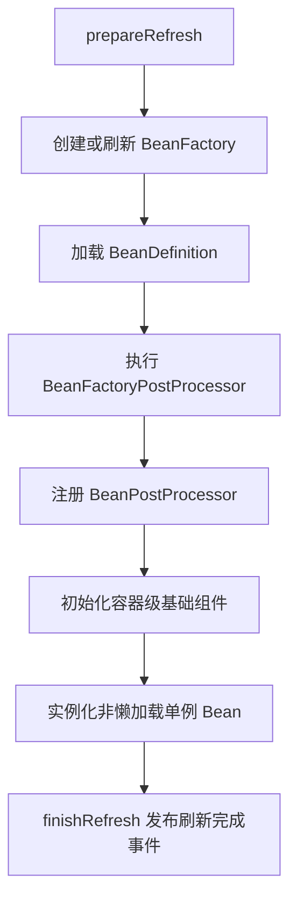

# Spring IoC 容器启动时做了什么？

> Spring 启动的核心不是“把 Bean 全 new 出来”，而是先把 BeanDefinition 准备好，再跑扩展点，最后初始化非懒加载单例并发布刷新完成事件。

先看一个最小例子：

```java
AnnotationConfigApplicationContext context =
 new AnnotationConfigApplicationContext(AppConfig.class);
```

很多面试回答会把这件事说成“Spring 扫描包，创建 Bean，完成注入”。这个说法不算错，但太扁了。真正值得讲清的是 3 件事：

1. Spring 启动时先处理的是 **BeanDefinition**，不是直接实例。
2. 各种扩展点是分阶段插进去的，顺序很重要。
3. 默认只会提前初始化 **非懒加载单例 Bean**，不是所有 Bean。

## 先分清：容器里到底装的是什么？

IoC 容器真正管理的是一组 BeanDefinition。可以把它理解成“Bean 的施工图”：

- 这个 Bean 的类型是什么
- 作用域是单例还是原型
- 依赖哪些 Bean
- 初始化、销毁方法是什么
- 是否懒加载

真正的对象实例，是后面按这张施工图造出来的。

这也是很多人一上来就把 `BeanFactory` 和 `ApplicationContext` 混着讲的原因。更稳的说法是：

- `BeanFactory` 更像底层 Bean 工厂，负责最基础的创建和装配。
- `ApplicationContext` 是更完整的容器，除了 Bean 管理，还补了事件、国际化、AOP 集成这些能力。

## 启动主线可以按 7 步讲

如果是 `ApplicationContext`，核心流程可以抓住 `refresh()` 这条主线。



下面按面试能说清的粒度拆开。

### 1. 准备刷新环境

这一阶段会做容器状态准备，比如：

- 标记容器进入 active 状态
- 初始化环境变量、属性源校验
- 为后续事件监听、早期应用事件做准备

这一步还没有开始创建业务 Bean，更像“开机自检”。

### 2. 创建 BeanFactory，并把 BeanDefinition 装进去

这一步才是“把配置读进来”。

如果你用的是注解配置，Spring 会把：

- `@Configuration`
- `@Bean`
- `@Component`
- `@ComponentScan`
- `@Import`

这些元数据转成 BeanDefinition，注册到 BeanFactory 里。

此时容器里已经知道“将来要管理哪些 Bean”，但绝大多数 Bean 还没真正实例化。

可以把这一步理解成：

```text
配置类 / 注解 / XML
 ↓
 BeanDefinition
 ↓
DefaultListableBeanFactory
```

## 3. 先跑 BeanFactoryPostProcessor，改的是“施工图”

这是 Spring 启动里最容易答混的一层。

`BeanFactoryPostProcessor` 处理的是 **BeanDefinition**，不是 Bean 实例。它介入时机非常早，重点是“Bean 还没创建出来之前，我先改一遍定义”。

典型事情包括：

- 解析 `@Configuration`
- 处理 `@ComponentScan`
- 解析 `@Import`
- 替换 `${...}` 占位符
- 调整某些 BeanDefinition 的属性

如果你想用一句话区分两个后处理器，这样最稳：

- `BeanFactoryPostProcessor`：改定义。
- `BeanPostProcessor`：改实例。

很多人把 `@Autowired` 也说成这一步做完，这就不严谨了。依赖注入主要发生在后面真正创建 Bean 的阶段。

## 4. 注册 BeanPostProcessor，后面创建 Bean 时会用到

这一阶段会把所有 `BeanPostProcessor` 先准备好，后面每个 Bean 创建时都会经过它们。

它们负责的就是“Bean 造出来以后，再做一层加工”，典型包括：

- 处理 `@Autowired`
- 处理 `@Resource`
- 处理 `@PostConstruct`
- 给 AOP 目标对象创建代理

所以它和上一步的关系是：

```text
BeanFactoryPostProcessor -> 先改施工图
BeanPostProcessor -> 再改成品或半成品
```

## 5. 初始化容器级基础组件

在正式创建业务单例之前，Spring 还会先把一些基础设施准备好，比如：

- `MessageSource`
- 事件广播器 `ApplicationEventMulticaster`
- 生命周期处理器 `LifecycleProcessor`

这一层更偏容器自身能力，不是业务 Bean 的重点，但它能解释为什么 Spring 后面能发布 `ContextRefreshedEvent`、支持监听器和生命周期回调。

## 6. 实例化非懒加载单例 Bean

这一步才是大多数人脑子里“Spring 开始创建 Bean 了”的阶段。

注意这里有一个常见误区要纠正：

**默认会在容器刷新阶段提前创建的是非懒加载单例 Bean。**

下面这些不一定会在启动时创建：

- `prototype` Bean
- `@Lazy` Bean
- 某些按需获取的对象

真正创建一个单例 Bean 时，常见链路可以简化成：

1. 实例化对象
2. 属性填充
3. 执行 Aware 回调
4. 执行 `BeanPostProcessor` 前置逻辑
5. 执行初始化方法，比如 `@PostConstruct`
6. 执行 `BeanPostProcessor` 后置逻辑
7. 必要时返回代理对象而不是原始对象

如果 Bean 之间有依赖，Spring 会按依赖关系递归创建。

## 7. 刷新完成，发布事件

当剩余非懒加载单例都初始化完成后，Spring 会进入收尾阶段：

- 清理早期缓存
- 启动实现了 `Lifecycle` / `SmartLifecycle` 的组件
- 发布 `ContextRefreshedEvent`

到这一步，容器才算真正“启动完毕”。

## 用一个例子把整个过程串起来

假设你有 3 个 Bean：

- `OrderController`
- `OrderService`
- `OrderRepository`

其中 `OrderService` 上有事务注解，配置类上有 `@ComponentScan`。

启动时大致会这样走：

1. `@ComponentScan` 被解析成 3 个 BeanDefinition。
2. `BeanFactoryPostProcessor` 先把配置类和扫描结果处理完。
3. `BeanPostProcessor` 注册完成，AOP 和自动注入能力准备好。
4. Spring 开始创建 `OrderController`，发现它依赖 `OrderService`。
5. 创建 `OrderService` 时又发现依赖 `OrderRepository`。
6. `OrderRepository` 创建完成后回填到 `OrderService`。
7. `OrderService` 初始化完成后，AOP 可能为它返回一个事务代理对象。
8. 代理后的 `OrderService` 再注入 `OrderController`。
9. 所有非懒加载单例准备好，发布刷新完成事件。

这个例子里最关键的一句是：

**注入到别的 Bean 里的，很多时候已经不是原始对象，而是 Spring 处理后的结果，比如代理对象。**

## 容易踩的坑

### `BeanFactoryPostProcessor` 和 `BeanPostProcessor` 别说反

这是 Spring 面试里很高频的扣分点：

- 前者处理 BeanDefinition。
- 后者处理 Bean 实例。

如果把这两个角色说反，后面的 `@Autowired`、AOP、占位符解析都会讲乱。

### `@PostConstruct` 不是“代理之后再执行”

很多人以为事务、日志切面已经完全织入后，才会执行初始化方法。这个理解不稳。

更准确地说，初始化回调是在 Bean 创建流程中执行的，AOP 代理通常是在后置处理阶段包上去。也就是说，在初始化方法里去依赖事务增强、异步增强，往往不是你以为的效果。

## Spring 启动不等于“所有 Bean 都造完”

这也是常见误区。

如果你把这句话答清楚，面试官一般会觉得你真的理解了容器行为：

- 单例、非懒加载：通常在 `refresh()` 阶段提前创建。
- 原型：每次 `getBean()` 时再创建。
- 懒加载 Bean：第一次真正用到时再创建。

## 小结

- Spring 容器启动的主线是 `refresh()`，核心阶段是载入 BeanDefinition、执行扩展点、初始化非懒加载单例。
- `BeanFactoryPostProcessor` 处理的是 BeanDefinition，`BeanPostProcessor` 处理的是 Bean 实例。
- IoC 容器启动时先准备“施工图”，再按依赖关系逐步创建对象。
- 启动阶段默认不会实例化所有 Bean，重点是非懒加载单例。
- 初始化回调和 AOP 代理不是一回事，不能想当然地认为 `@PostConstruct` 里已经拿到了完整增强能力。

## 参考

综合自 IoC、Spring 核心问题整理，以及 Spring 官方文档对 `ApplicationContext`、`refresh()`、Bean 生命周期回调与初始化阶段代理边界的说明，做了交叉核对和重写。
