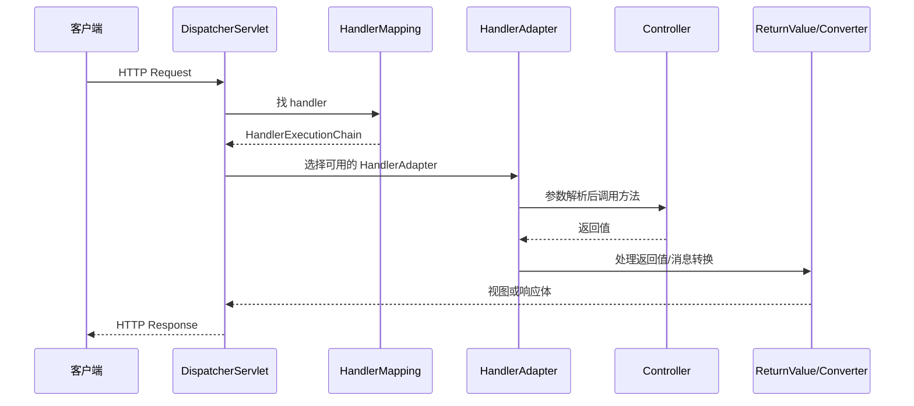

# Spring MVC 请求处理流程是怎样的？

> Spring MVC 的主线不是“请求进来找到 Controller 再返回结果”这么简单，它真正的核心是 `DispatcherServlet` 把请求分发给一组可替换的策略组件，再由参数解析器、返回值处理器、消息转换器和异常解析器把一次请求走完整。

先看一个最普通的控制器：

```java
@RestController
@RequestMapping("/users")
public class UserController {

 @GetMapping("/{id}")
 public UserVO detail(@PathVariable Long id) {
 return userService.detail(id);
 }
}
```

很多人能说出：

- 请求先进 `DispatcherServlet`
- 再找到 `Controller`
- 最后返回 JSON

这不算错，但还停留在“看过图”的阶段。
真正想把这道题答透，至少要说明 4 件事：

1. Spring MVC 为什么需要 `HandlerMapping` 和 `HandlerAdapter` 两层
2. `@PathVariable`、`@RequestBody` 这些参数是怎么塞进方法里的
3. 返回 JSON 和返回视图，流程为什么不一样
4. 异常、拦截器、消息转换器分别挂在哪一层

## 先抓一句话：Spring MVC 是前置控制器模式

Spring 官方文档对 `DispatcherServlet` 的定义很明确：

**它是一个 front controller，也就是前置控制器。**

翻成人话就是：

- 所有请求先统一打到它这里
- 它自己不处理业务
- 它只负责走一套公共调度算法
- 具体工作交给一组可配置的委托组件

所以可以先把节奏记成：

```text
request
 -> DispatcherServlet
 -> 找 handler
 -> 调 handler
 -> 处理返回值
 -> 渲染响应
```

这里要补一个边界：不是所有网络请求都“一定先进入 `DispatcherServlet`”。

更准确的说法是：**命中 Spring MVC servlet mapping 的请求，会在经过 Servlet 容器、Filter、Spring Security 这类更前置的链路后，再进入 `DispatcherServlet`。**

所以 Spring MVC 是 Web 层调度核心，但它不是整个 HTTP 链路里的第一站。

## 为什么 Spring MVC 不直接让 `DispatcherServlet` 调 Controller？

因为 Controller 的形态并不总是统一的。
Spring MVC 不想把请求分发逻辑写死在一个巨大 `if else` 里，而是拆成了两层：

1. `HandlerMapping`
2. `HandlerAdapter`

### `HandlerMapping` 干什么

它的工作是：

- 根据请求 URL、HTTP 方法、条件等
- 找到“谁来处理这个请求”

也就是把请求和某个 handler 对上。

### `HandlerAdapter` 干什么

它的工作是：

- 知道怎么真正调用这个 handler

所以这两层不要混着讲。最稳的说法是：

- `HandlerMapping` 负责“找谁”
- `HandlerAdapter` 负责“怎么调”

## Spring MVC 的核心组件，可以先收成 6 个

如果面试官问“核心组件有哪些”，我会建议你先答这 8 个：

| 组件                              | 作用                               |
| --------------------------------- | ---------------------------------- |
| `DispatcherServlet`               | 中央调度入口                       |
| `HandlerMapping`                  | 根据请求找到 handler               |
| `HandlerAdapter`                  | 负责调用 handler                   |
| `HandlerMethodArgumentResolver`   | 负责解析 Controller 方法参数       |
| `HandlerMethodReturnValueHandler` | 负责处理 Controller 方法返回值     |
| `HandlerExceptionResolver`        | 统一处理异常                       |
| `ViewResolver`                    | 传统 MVC 场景下解析视图            |
| `HttpMessageConverter`            | 前后端分离场景下负责对象和报文互转 |

这里有个常见误区要纠正：

**现代前后端分离项目里，`ViewResolver` 已经不是最核心的一层；很多时候更关键的是 `HttpMessageConverter`。**

## 请求进来以后，完整流程怎么走？

Spring 官方文档在 `DispatcherServlet` 的 processing 页面把核心过程说得很清楚。
我把它收成更适合面试的版本：



## 第一步：`DispatcherServlet` 先做请求级准备

真正找 handler 前，它会先把一些请求处理要用到的上下文准备好，比如：

- `WebApplicationContext`
- locale resolver
- multipart resolver（如果配置了文件上传）

这一步的意义是：
后面不管是参数绑定、视图渲染还是异常处理，都能从同一套请求上下文里拿到需要的东西。

## 第二步：`HandlerMapping` 找到真正的处理器

比如请求：

```http
GET /users/1
```

`HandlerMapping` 会根据：

- 路径
- HTTP 方法
- 请求条件

去匹配对应的 handler。

这一步返回的通常不是裸 handler，而是一个 **`HandlerExecutionChain`**，也就是：

- handler 本身
- 以及跟它绑定的拦截器链

所以拦截器不是后来才附加上的，它是一开始就和 handler 一起被找出来的。

## 第三步：`HandlerAdapter` 决定怎么调用 Controller

你不能只说“适配器执行 handler”，最好补一句它真正解决的问题：

**同样是 handler，不同类型的调用方式可能不一样，所以 Spring 用 adapter 把调用细节隔离开。**

到了现代注解控制器模式，这一层最重要的工作通常有 3 个：

1. 解析方法参数
2. 真正调用方法
3. 处理返回值

所以它已经不只是“反射调用”这么简单。

## 第四步：方法参数是怎么塞进去的？

Spring 官方文档在 handler method arguments 章节里列得非常细，核心意思是：

**Controller 方法参数不是一把梭反射塞进去的，而是由一组参数解析规则逐个决定怎么取值。**

常见例子：

| 参数写法                       | 值从哪里来                     |
| ------------------------------ | ------------------------------ |
| `@PathVariable Long id`        | URL 路径变量                   |
| `@RequestParam String keyword` | 查询参数 / 表单参数            |
| `@RequestHeader String token`  | 请求头                         |
| `@CookieValue String sid`      | Cookie                         |
| `@RequestBody UserDTO dto`     | 请求体，通过消息转换器反序列化 |
| `HttpServletRequest req`       | 原生 Servlet API 对象          |

所以更稳的说法是：

**Spring MVC 有一套成熟的参数解析器模型，能按注解和参数类型决定如何绑定数据。**

如果参数上还有 `@Valid`、`@Validated`，参数解析之后还会进入校验逻辑。校验失败时，常见会抛出参数绑定或校验相关异常，再交给 MVC 异常解析链处理。

## 第五步：`@RequestBody` 为什么和 `@RequestParam` 不是一回事？

核心差别就在数据来源和转换方式：

- `@RequestParam` 主要看请求参数
- `@RequestBody` 主要看请求体

而且 `@RequestBody` 不是简单读字符串，它背后会走：

```text
HttpMessageConverter
```

转换器不是随便挑一个用，而是会结合：

- 请求的 `Content-Type`
- 客户端期望的 `Accept`
- Controller 参数类型或返回值类型

来决定谁能读、谁能写。

这就是为什么：

- JSON 能变成 Java 对象
- 返回对象时又能反过来序列化成 JSON

所以前后端分离项目里，`HttpMessageConverter` 的地位往往比 `ViewResolver` 更核心。

排障时也要顺着这条线看：`Content-Type` 不匹配可能是 415，`Accept` 协商不出来可能是 406，JSON 字段类型不对则可能卡在反序列化或参数校验阶段。

## 第六步：Controller 返回值为什么有两条路？

这里最好主动把“传统 MVC”和“前后端分离”拆开说。

### 1. 传统视图渲染模式

如果 Controller 返回：

- 逻辑视图名
- `ModelAndView`

那后面就会走：

```text
ViewResolver -> 真正视图 -> 渲染页面
```

这时 `ViewResolver` 很关键。

### 2. 前后端分离模式

如果 Controller 是：

```java
@RestController
```

或者方法上有：

```java
@ResponseBody
```

那返回值就不会再走视图解析，而是交给消息转换器写回响应体。

所以更现代的说法应该是：

- 服务端渲染项目，重点在 `ViewResolver`
- 前后端分离项目，重点在 `HttpMessageConverter`

## 第七步：异常是在哪一层被统一收口的？

请求处理过程中抛出的异常，会交给：

```text
HandlerExceptionResolver
```

这层统一处理。

所以如果你项目里用了：

- `@ExceptionHandler`
- `@ControllerAdvice`
- 全局异常处理器

它们背后本质上都还是在这套异常解析机制里收口。

但它也有边界：这套机制主要处理已经进入 MVC handler 调用链的异常。Filter 层、网关层、容器启动阶段、请求还没映射到 handler 前的异常，不要默认都归到 `@ControllerAdvice` 里兜底。

## 第八步：拦截器挂在哪？

很多人会把拦截器讲成“类似过滤器的东西”，这太粗了。

更准确地说：

- 过滤器是 Servlet 层
- 拦截器是 Spring MVC handler 层

而且它不是后来才附加上的，而是在 `HandlerMapping` 找 handler 的时候，就一起打包进 `HandlerExecutionChain` 里的。

所以它更接近：

**只对命中的 MVC handler 生效的请求前后增强。**

执行顺序可以压成：

```text
preHandle
 -> Controller
 -> postHandle
 -> afterCompletion
```

如果某个拦截器的 `preHandle` 返回 `false`，后面的 handler 就不会继续执行。排查“接口没进 Controller”时，拦截器就是必须看的点。

## 为什么 Spring MVC 要搞 `HandlerAdapter`，不用直接反射调？

核心原因是：

**Spring MVC 不想把“怎么调用不同类型 handler”的复杂度堆到 `DispatcherServlet` 里。**

这样做的好处有两个：

1. `DispatcherServlet` 本身更稳定，只做调度
2. 不同 handler 风格可以各自扩展，而不把中央控制器搞炸

这正是适配器模式在 Spring MVC 里的价值。

## 一个更贴近现代后端项目的回答方式

如果你现在做的是前后端分离项目，可以把整条流程翻译成更工程化的话：

1. 请求先进入 `DispatcherServlet`
2. 根据 URL 和方法找到对应 Controller
3. 通过适配器完成参数解析和方法调用
4. 返回对象后交给 `HttpMessageConverter` 序列化
5. 如果中间抛异常，由全局异常处理链接管

所以现代项目里你最该盯的通常不是 JSP 渲染，而是：

- 参数绑定
- JSON 转换
- 全局异常
- 拦截器链

## 一个更稳的排障顺序

如果线上遇到“接口没按预期工作”，我建议先按这个顺序收敛：

```text
1. 请求有没有进 DispatcherServlet？
2. HandlerMapping 有没有匹配到正确方法？
3. 参数绑定有没有失败？
4. 参数校验是不是提前抛了异常？
5. 拦截器有没有提前拦截？
6. 返回值有没有被正确转换？
7. 异常是不是被 HandlerExceptionResolver 接住了？
8. 如果用了异步返回，超时和线程池配置是否正常？
```

很多问题看起来像“业务错了”，其实是在第 3 步或第 5 步就已经偏了。

## 容易踩的坑

### 把 `HandlerMapping` 和 `HandlerAdapter` 说成一回事

不对。
一个负责“找谁”，一个负责“怎么调”。

### 把 `ViewResolver` 当成现代项目的核心

在前后端分离项目里，更关键的往往是 `HttpMessageConverter`。

### 把拦截器和过滤器混成一类

过滤器在 Servlet 层，拦截器在 Spring MVC handler 层。
两者位置不同，能力边界也不同。

## 小结

- Spring MVC 的核心是 `DispatcherServlet` 作为前置控制器，统一调度请求处理流程。
- `HandlerMapping` 负责找到 handler，`HandlerAdapter` 负责真正调用 handler，两层不要混。
- 参数绑定依赖方法参数解析器，返回值处理依赖返回值处理器，`@RequestBody` / `@ResponseBody` 会走 `HttpMessageConverter`。
- 传统服务端渲染和前后端分离在返回值处理上走的是两条不同路径：前者偏 `ViewResolver`，后者偏消息转换。
- 异常处理、拦截器、视图解析、消息转换都不是 Controller 自己硬编码处理的，而是调度链上的策略组件共同完成的。
- 排查 MVC 问题要先分清 Servlet/Filter/MVC handler 的边界，再看参数绑定、校验、转换和异常收口。

## 参考

基于 Spring Framework Reference Documentation 中 IoC Container、Bean Lifecycle、AOP Proxies、Transaction Management、Spring MVC DispatcherServlet 与 Handler Methods 等相关章节整理。
