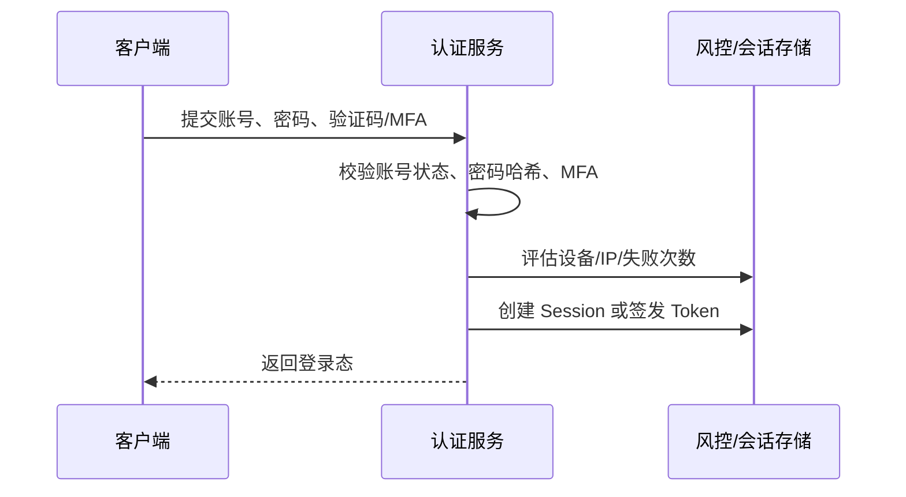

# 认证和授权有什么区别？

> 认证回答“你是谁”，授权回答“你能做什么”。很多安全设计混乱，都是因为把这两件事揉成了一步。

## 先用一个请求看清边界

假设用户访问后台删除订单接口：

```http
DELETE /api/orders/9001
Cookie: SID=...
```

服务端至少要做两层判断：

```text
请求进入
  ↓
认证：SID 能不能证明这是 userId=1001？
  ↓
授权：userId=1001 能不能 delete orderId=9001？
  ↓
业务执行：订单是否满足可删除状态？是否需要审批/审计？
```

如果没有认证，系统不知道是谁在访问；如果没有授权，任何已登录用户都可能越权访问；如果没有业务规则，哪怕有权限也可能删掉不该删的订单。

所以这三个问题要分开：

| 问题     | 回答什么                     | 常见落点                   |
| -------- | ---------------------------- | -------------------------- |
| 认证     | 你是谁                       | 登录、MFA、Session、Token  |
| 授权     | 你能做什么、能访问哪些资源   | RBAC、权限点、数据范围     |
| 业务约束 | 当前状态下能不能执行这个动作 | 订单状态、金额阈值、审批流 |

面试里如果只说“登录了就是有权限”，基本就是把认证和授权混了。

从接口返回上也能看出边界：没有登录态或登录态无效，通常返回 `401 Unauthorized`；用户已经登录，但没有访问该资源或执行该动作的权限，通常返回 `403 Forbidden`。前者提示“先证明你是谁”，后者提示“我知道你是谁，但你不能这么做”。

## 认证通常怎么做？

认证的输入是凭据，输出是可信身份。系统要确认“这个请求背后是谁”，常见凭据包括：

| 凭据/认证器            | 说明                               | 主要风险                         |
| ---------------------- | ---------------------------------- | -------------------------------- |
| 用户名 + 密码          | 最常见，依赖密码存储和校验         | 弱密码、撞库、明文传输、钓鱼     |
| 短信/邮箱验证码        | 短期动态凭据                       | 短信轰炸、邮箱被接管、验证码泄露 |
| TOTP/Authenticator App | 常见 MFA 方式                      | 设备丢失、恢复码管理             |
| WebAuthn/硬件密钥      | 抗钓鱼能力更强                     | 兼容性和设备管理成本             |
| 第三方登录             | 由外部身份提供方确认身份           | 回调校验、账号绑定、状态参数校验 |
| 客户端证书             | 强身份校验，常用于内部或高安全系统 | 证书签发、吊销和运维成本         |

这条链路可以压缩成一句话：

```text
凭据 -> 认证 -> 主体 -> 登录态
```

凭据不是身份本身，只是用来证明身份的材料；登录态也不是权限本身，只是把“已经认证过”的结果带到后续请求里。

认证不等于“只要密码对就行”。一个稍完整的登录链路通常是：



这里要做几类保护：

1. 密码必须用密码哈希/KDF 存储，不能明文或可逆加密保存；
2. 登录失败要限流，但错误提示要避免暴露“账号是否存在”；
3. 高风险操作或异常登录要触发 MFA 或二次确认；
4. 认证成功后要创建可管理的登录态，比如 Session、随机 Token 或短期 JWT；
5. 登录、失败、改密、MFA 变更都要记录审计事件。

认证的结果最好抽象成“主体”：

```text
subject = {
  userId,
  tenantId,
  deviceId,
  authLevel,
  sessionId/tokenId,
  issuedAt
}
```

后续授权只信任认证组件输出的主体，不要让业务接口自己解析一堆不可信参数。

## 登录态和身份信息是什么关系？

认证通常不是每个请求都重新输入密码，而是登录一次后拿到登录态。

常见方式：

| 登录态             | 怎么工作                            | 适合场景                           |
| ------------------ | ----------------------------------- | ---------------------------------- |
| Session-Cookie     | Cookie 带 `sessionId`，服务端查状态 | 浏览器后台、强控制系统             |
| 随机 Token + Redis | 客户端带随机 Token，服务端查状态    | App、开放 API、需要主动吊销        |
| JWT                | 客户端带自包含令牌，服务端验签      | 短期访问凭证、网关验签、服务间传递 |

登录态只是在后续请求里证明“我之前认证过”。它不应该无限期有效，也不应该直接等价于全部权限。

比如用户已登录，只能说明：

```text
这个请求可以关联到 userId=1001
```

还不能说明：

```text
userId=1001 可以删除 orderId=9001
```

这就是下一步授权要做的事。

## 授权通常怎么做？

授权的输入是主体、资源、动作和上下文，输出是允许或拒绝。

```text
主体：userId=1001, tenantId=t1
资源：orderId=9001
动作：delete
上下文：请求来源、时间、设备、订单状态、数据归属
结果：allow / deny
```

更通用的判断公式是：

```text
subject + action + resource + context -> allow / deny
```

`subject` 来自认证组件，`action` 来自接口或业务动作，`resource` 来自具体数据或对象，`context` 则包含租户、时间、IP、设备风险、审批状态等运行时信息。

一个稳定的授权判断通常分两层：

```text
功能权限：有没有 order:delete？
  ↓
数据权限：能不能删除这笔 orderId=9001？
```

功能权限回答“能做什么”，数据权限回答“能对哪些数据做”。比如：

- 普通用户有 `order:read`，但只能看自己的订单；
- 客服有 `order:read`，但只能看负责租户下的订单；
- 财务有 `invoice:audit`，但只能审核本部门或指定业务线；
- 管理员有 `user:disable`，但禁用高权限用户可能还要二次审批。

工程上常见模型是：

| 模型      | 适合什么                   | 例子                                   |
| --------- | -------------------------- | -------------------------------------- |
| RBAC      | 稳定岗位职责               | 用户 -> 角色 -> 权限点                 |
| 数据权限  | 资源归属、租户、部门、区域 | 本人、本部门、本租户、指定门店         |
| ABAC/策略 | 动态条件、风险上下文       | 非工作时间禁止导出，高风险 IP 禁止操作 |
| ACL       | 单个资源逐一授权           | 某个文档授权给指定用户                 |

RBAC 里的关系通常是多对多：一个用户可以有多个角色，一个角色也可以挂多个权限点。权限点建议按 `资源:动作` 建模，比如 `order:delete`、`invoice:export`、`user:disable`，不要只写成“管理员”“普通用户”这类模糊标签。

大多数业务系统先用 RBAC 管住“资源 + 动作”，再用数据权限和业务规则补边界。ABAC/策略模型适合时间、IP、设备风险、数据等级、租户、审批状态这类动态条件，但复杂度高、排查成本也高，不应该拿它替代基础 RBAC。

## 授权必须放在后端吗？

必须。前端权限只能改善体验，不能作为安全边界。

常见分层：

```text
前端：隐藏菜单、按钮、入口
  ↓
网关/拦截器：校验登录态和粗粒度权限
  ↓
业务接口：校验具体权限点和数据范围
  ↓
领域规则：校验状态、金额、审批、幂等
```

前端隐藏“删除按钮”只能减少误点，攻击者仍然可以直接调用接口。后端每个受保护接口都要有授权检查。

一个常见写法是让接口显式声明权限点：

```java
@RequirePermission("mall:order:delete")
public void deleteOrder(Long orderId) {
    // 还要校验 orderId 是否属于当前租户/部门/用户可操作范围
}
```

这类注解解决的是功能权限；数据范围通常要在查询条件或领域服务里处理：

```sql
select *
from orders
where id = ?
  and tenant_id = ?
  and owner_id in (...)
```

如果只在查出订单后判断，容易出现批量接口、导出接口、列表接口漏校验的问题。更稳的做法是把数据范围变成查询条件的一部分。

## 常见的授权原则有哪些？

授权设计里有几条原则很实用：

| 原则     | 白话解释                       | 落地方式                        |
| -------- | ------------------------------ | ------------------------------- |
| 默认拒绝 | 没明确允许就拒绝               | 权限缺省为 deny，不用空配置放行 |
| 最小权限 | 只给完成工作所需的最小权限     | 角色拆分、临时授权、定期回收    |
| 职责分离 | 高风险流程不要一个人全权完成   | 申请/审批/执行分离              |
| 显式授权 | 权限来源要说得清楚             | 角色、工单、审批记录可追溯      |
| 持续校验 | 权限变化后要及时生效           | 缓存失效、版本号、短期登录态    |
| 可审计   | 关键操作能追溯谁在何时做了什么 | 操作日志、授权日志、导出日志    |

“默认拒绝”尤其重要。权限系统异常、权限配置为空、角色不存在时，默认允许会直接变成越权漏洞。

审计也不要只记一句“操作成功”。关键授权链路最好记录操作账号、认证主体、资源 ID、动作、授权来源、决策结果、时间、IP/设备、请求链路 ID。出了越权问题时，这些字段能帮你还原“谁基于什么权限访问了什么资源”。

## 容易混淆的几个场景

### 第三方登录是不是授权？

第三方登录通常先解决认证：外部身份提供方告诉你的系统“这个用户是谁”。但你的系统仍然要做本地授权。

比如用户用外部账号登录成功，只说明他通过了身份确认，不代表他可以访问管理后台、导出报表或删除订单。

### OAuth 2.0 是认证还是授权？

OAuth 2.0 的核心是授权第三方应用访问资源，不是专门用来证明用户身份的登录协议。很多“第三方登录”是在 OAuth 2.0 之上再读取用户信息完成本地登录。

面试里可以这样说：OAuth 2.0 主要解决“第三方应用被授权访问哪些资源”，而不是“用户身份怎么被标准化表达”。如果要做标准化身份层，通常还会引入 OpenID Connect 这类身份协议。

### 有管理员角色就一定能绕过所有限制吗？

不应该。管理员也要受租户边界、数据等级、审批流程和审计约束。

例如平台管理员可以禁用普通账号，但删除租户、导出全量用户、查看密钥、重置高权限账号，都应该有更高等级的权限和二次确认。

## 容易踩的坑

1. **登录了就放行**：认证成功只说明知道是谁，不说明能访问所有资源。
2. **只在前端隐藏按钮**：攻击者可以直接调后端接口。
3. **只校验角色，不校验数据归属**：有 `order:read` 不代表能看别人的订单。
4. **信任客户端传来的 userId/role**：身份和权限必须来自服务端可信登录态或权限系统。
5. **权限缓存不失效**：角色收回、账号禁用、租户状态变化后，Session、JWT、权限缓存都要有失效或版本校验策略。
6. **默认允许**：权限配置缺失、系统异常时应该默认拒绝。
7. **高危操作没有二次确认**：删除、导出、转账、授权、改密等要更严格。
8. **没有审计日志**：出问题后无法追踪谁授权、谁访问、谁导出。

## 面试怎么答？

可以按这个结构回答：

1. 认证解决“你是谁”，授权解决“你能做什么、能访问哪些资源”。
2. 认证输入是凭据，输出是可信主体；后续通过 Session/Token/JWT 维持登录态。
3. 授权要看主体、资源、动作和上下文，不能只看“是否登录”。
4. 工程上要后端校验权限点和数据范围，前端权限只是体验控制。
5. 安全原则是默认拒绝、最小权限、权限变更及时生效、高危操作可审计。

## 小结

1. 认证回答“你是谁”，授权回答“你能做什么、能对哪些资源做”。
2. 认证成功后通常生成 Session、Token 或 JWT，但登录态不等于全部权限。
3. 授权要同时考虑权限点、数据范围、业务状态和风险上下文。
4. 前端权限只是体验控制，后端接口和数据查询必须做最终校验。
5. 权限系统要默认拒绝、最小权限、可回收、可审计，避免越权后无法追溯。

## 参考

综合自仓库内认证授权与权限系统参考资料、NIST SP 800-63B、OWASP Authentication Cheat Sheet、OWASP Authorization Cheat Sheet、OWASP Session Management Cheat Sheet，并对认证因子、登录态、默认拒绝、最小权限、数据权限和越权风险边界做了交叉验证。
