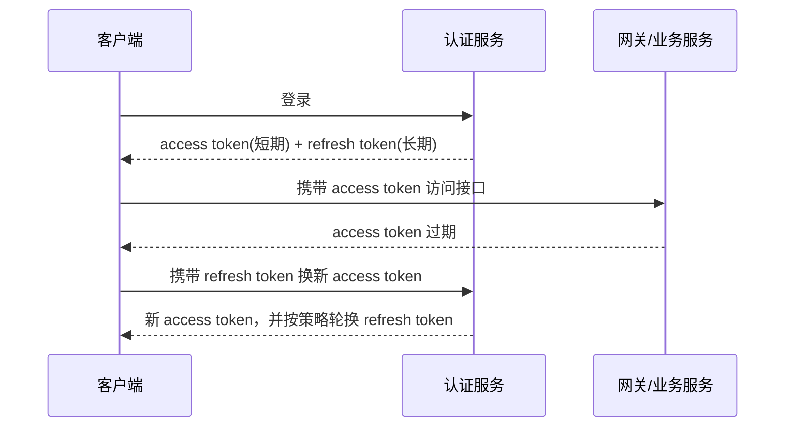

# JWT 为什么不能无脑替代 Session？

> JWT 的优势是无状态和易扩展，弱点也来自无状态：签出去以后，服务端很难在过期前自然收回。

## 先看一个真实场景

假设一个后台系统支持这些操作：

- 用户改密码后，所有旧登录态要立刻失效；
- 管理员收回某个用户的财务权限，要马上生效；
- 风控发现账号异常，要把这个用户从所有设备踢下线；
- 网关希望先验身份，业务服务不想每次都查认证中心。

这时如果只说“JWT 无状态，比 Session 更适合分布式”，就只答了一半。

JWT 确实让服务端少存状态，但登录系统不只是在问“能不能验签”，还在问“能不能控制已经发出去的凭证”。Session 的强项是可控，JWT 的强项是自包含和跨服务传递。两个东西解决的问题不完全一样。

## JWT 到底好在哪里？

JWT 通常由三段组成：

```text
header.payload.signature
```

Header 和 Payload 只是 Base64Url 编码，不是可信输入。Header 里的 `alg`、`kid` 也来自客户端提交的 Token，服务端不能照单全收；更稳的做法是固定允许算法，并只从服务端可信密钥集合里按版本取 key。常见 JWT 实际是 JWS，保证完整性，不保证机密性，payload 默认可以被看到。

服务端拿到 JWT 后，通常会做这些校验：

- 签名是否正确，确认 Token 没被篡改；
- `exp` 是否过期，控制最晚可用时间；
- `nbf` 是否已经生效，控制最早可用时间；
- `iat` 是否在合理范围，避免异常签发时间；
- `iss` 是否来自可信签发方；
- `aud` 是否面向当前系统，避免被错误服务接收；
- 算法、密钥版本、`kid` 是否命中服务端可信配置；
- 权限、租户、用户标识等声明是否满足当前接口要求。

实际系统还会给服务器时钟偏差留一个很短的 leeway，但不能把这个窗口放得太大。

这带来几个收益：

| 优势           | 解释                                                 |
| -------------- | ---------------------------------------------------- |
| 服务端少查状态 | 多实例服务不一定每次都查 Redis 或认证中心            |
| 网关可先验权   | 网关能先读取用户、租户、过期时间等声明，拦掉非法请求 |
| 跨端友好       | 移动端、开放 API、微服务调用链里，Header 携带更自然  |
| 跨语言友好     | JWT 是标准格式，不强绑定某个服务端 Session 实现      |

所以 JWT 不是没价值。它适合“短期访问凭证”和“跨服务身份声明”。真正的问题是：**很多系统把 JWT 当成完整会话管理方案，却没有补齐吊销、续期、权限变更和泄露后的控制手段**。

## Session 强在哪里？

Session 的核心是服务端保存状态。

典型流程是：

```text
浏览器 Cookie 里只有 sessionId
        ↓
服务端用 sessionId 查 Redis / 内存
        ↓
拿到用户登录态、权限版本、过期时间等服务端状态
```

它的强项很直接：

- 用户退出登录：删除 Session；
- 用户改密码：删除该用户所有 Session；
- 管理员封号：标记账号不可用或清 Session；
- 权限变化：下次请求查到新权限或新版本；
- 踢下线：删除指定设备的 Session。

这就是 Session 的“重”：服务端要存、要查、要扩容、要处理 Redis 高可用。但这个“重”换来的是控制权。

## JWT 真正的短板：签出去以后不好收回

JWT 最大的问题是主动控制弱。

假设用户改了密码、管理员收回权限、账号被封禁，但之前签发的 JWT 还有 30 分钟才过期。如果服务端只验签和过期时间，这个 Token 在 30 分钟内仍然有效。

这个问题在这些场景里很敏感：

| 场景       | 如果只验 JWT 会怎样                           |
| ---------- | --------------------------------------------- |
| 退出登录   | 客户端删了 Token，但被偷走的 Token 仍可能可用 |
| 修改密码   | 旧 Token 在过期前仍可能访问系统               |
| 权限被收回 | Token 里旧权限还在，直到过期才自然消失        |
| 账号封禁   | 如果不查账号状态，封禁不会马上阻止旧 Token    |
| Token 泄露 | 攻击者可以在有效期内重放请求                  |

常见补救方案如下：

| 方案                     | 做法                                      | 代价与边界                            |
| ------------------------ | ----------------------------------------- | ------------------------------------- |
| 缩短 Access Token 有效期 | 例如 5-15 分钟                            | 泄露窗口变短，但续期更频繁            |
| Refresh Token            | 用长期刷新令牌换短期访问令牌              | 刷新链路必须更严格保护                |
| 黑名单                   | 吊销 Token 后按 `jti` 记录到 Redis        | 又引入服务端状态，黑名单 TTL 要管好   |
| 用户版本号               | Token 带 `tokenVersion`，变更时递增       | 每次请求要查用户版本或在网关做缓存    |
| 权限实时查询             | JWT 只放用户 ID，权限每次查服务端         | JWT 退化成身份凭证，减少无状态收益    |
| 按设备维护会话           | 每个设备有独立 refresh token / session id | 能踢指定设备，但实现接近 Session 管理 |

黑名单通常只保存 `jti` 或 Token 摘要，不建议长期保存完整 Token；TTL 设置成 Token 剩余有效期即可。如果网关为了性能做本地缓存，就要接受秒级延迟，并把这个延迟写进权限变更和踢下线的预期里。

所以 JWT 不是不能用，而是不能只用“无状态”这一个优点做选型。只要你引入黑名单、版本号、刷新令牌存储，它就已经不再是纯无状态方案了。

## Access Token 和 Refresh Token 怎么配合？

工程里更常见的折中是“双令牌”：



这套方案的关键不是“有两个 Token”这么简单，而是控制面放在哪里：

- Access Token 生命周期短，尽量降低泄露后的可用窗口；
- Refresh Token 生命周期长，但只发给认证服务，不应该到处传；
- Refresh Token 通常要落库或进 Redis，服务端最好只存摘要或哈希，支持吊销、轮换、设备维度管理；
- 每次刷新可以轮换 refresh token，旧的刷新令牌作废，降低重放风险；
- 如果旧 refresh token 被重复使用，要按泄露处理，吊销同一设备或同一令牌族；
- 退出登录、改密码、风控封禁时，优先吊销 refresh token，再配合 access token 的短过期。

这样做之后，业务服务仍然可以用 JWT 自校验 access token，但真正的长期会话控制回到了认证服务手里。

## 放 localStorage 还是 HttpOnly Cookie？

很多资料会把“JWT 放 localStorage 可以避免 CSRF”讲成绝对优势，这个说法要补边界。

更准确的说法是：

- 如果 JWT 放在 `Authorization` Header，浏览器不会像 Cookie 那样自动给跨站请求带上它，CSRF 风险会下降；
- 但 `localStorage` 能被同源脚本读取，一旦页面发生 XSS，Token 很容易被脚本拿走；
- 如果 JWT 放进 `HttpOnly Cookie`，脚本读不到，XSS 直接窃取难度变高；
- 但 Cookie 会被浏览器自动携带，此时要配合 `SameSite`、CSRF Token、Origin/Referer 校验等手段处理 CSRF。

可以这样选：

| 存储方式          | 优点                             | 风险与补救                                |
| ----------------- | -------------------------------- | ----------------------------------------- |
| localStorage      | 前端读取方便，Header 携带自然    | 怕 XSS，必须做好输入输出过滤和 CSP 等防护 |
| 内存变量          | 刷新页面就丢，泄露窗口相对短     | 用户体验差，刷新后要靠 refresh token 恢复 |
| HttpOnly Cookie   | JS 读不到，降低 Token 被脚本窃取 | 要处理 CSRF，配置 Secure、SameSite 等属性 |
| 原生 App 安全存储 | Keychain / Keystore 更适合移动端 | 仍要考虑设备丢失、越狱、Root 和抓包风险   |

安全设计里没有免费午餐，关键是知道自己优先防什么攻击：XSS、CSRF、重放、设备丢失，还是服务端状态泄露。

## JWT 里到底该放什么？

JWT 的 payload 默认只是 Base64Url 编码，不等于加密。签名能防篡改，但不能防别人看到内容。

建议只放这些低敏信息：

- 用户 ID 或 subject；
- 租户 ID；
- 签发方 `iss`；
- 接收方 `aud`；
- 过期时间 `exp`；
- 签发时间 `iat`；
- 唯一 ID `jti`；
- 权限版本或较粗粒度 scope。

JWT 里适合放粗粒度 `scope` 或权限版本，不适合放完整菜单、按钮权限和复杂数据范围。高风险接口仍应查服务端最新账号状态、权限版本或风险状态，不能把“验签通过”当成授权完成。

不要放：

- 密码、手机号、身份证号；
- 详细权限列表和敏感业务字段；
- 可被前端篡改后诱导后端信任的业务状态；
- 过大的用户画像、菜单树、组织架构。

JWT 太大还有一个工程问题：每次请求都会带上它。权限、菜单、组织架构越塞越多，不仅泄露面变大，网络和网关解析成本也会上去。

Bearer Token 的另一个特点是“谁拿到谁能用”。它不应该出现在 URL、日志、Referer、埋点字段和错误堆栈里。HTTPS 是底线，但日志脱敏、链路追踪脱敏和设备维度追踪同样重要。

## 什么时候 Session 更合适？

下面这些场景，Session 或“普通随机 Token + Redis”通常更稳：

1. **管理后台**：权限变化、强制下线、封禁账号都要实时生效。
2. **强风控系统**：登录态必须能按用户、设备、地区快速吊销。
3. **服务端渲染站点**：Cookie + Session 简单直接，配合 `HttpOnly`、`Secure`、`SameSite` 更成熟。
4. **权限复杂且经常变**：每次请求都要看最新权限时，JWT 自包含权限反而容易过期。
5. **团队没有完善安全治理能力**：JWT 的续期、吊销、泄露处理都需要配套设计。

“普通随机 Token + Redis”有时比 JWT 更合适：客户端只拿一个随机不可猜的 token，服务端查 Redis 得到用户状态。它没有 JWT 的自包含能力，但吊销、续期、设备管理都更好做。

## 什么时候 JWT 更合适？

JWT 更适合这些场景：

1. **短期访问凭证**：Access Token 很短，泄露窗口可控。
2. **网关统一鉴权**：网关先验签，业务服务只接收可信身份上下文。
3. **移动端和开放 API**：Header 携带自然，不依赖浏览器 Cookie。
4. **跨服务身份传递**：内部服务只需要知道调用方身份和少量 scope。
5. **权限不要求秒级收回**：或者已经有版本号、黑名单、刷新令牌等补偿机制。

如果面试官问“JWT 是否能替代 Session”，一个稳妥答案是：

> JWT 可以替代一部分“短期访问凭证”的能力，但不能天然替代完整 Session 管理。只要系统需要主动失效、踢设备、权限实时变更和泄露后快速止血，就必须补服务端状态或使用 Session/Redis Token 这类可控方案。

## 项目里怎么落地更稳？

一个比较稳的后端方案可以这样设计：

```text
access token：JWT，5-15 分钟过期
refresh token：随机字符串，只给认证服务使用，落 Redis/DB
用户状态：账号状态、权限版本、风控状态由服务端维护
网关：验签 + exp + aud + iss + tokenVersion
退出/改密/封禁：吊销 refresh token，递增 tokenVersion
```

关键点：

- `access token` 不要长期有效；
- `refresh token` 要支持轮换和吊销；
- 重要权限变更要有版本号或实时查询；
- 高风险操作不要只看登录态，还要二次校验；
- 服务端要记录 `jti`、设备 ID、签发时间，方便追踪和吊销；
- 所有 Token 都必须走 HTTPS；
- 密钥要有轮换机制，不能散落在配置文件和代码仓库里。

密钥轮换最好有明确版本：新 Token 用新密钥签发，旧密钥保留到最长 Token TTL 后下线；如果密钥紧急泄露，还要配合短过期、黑名单或用户版本号快速止血。

## 容易踩的坑

1. **把 JWT 当加密**：JWT 常见的 JWS 只是签名防篡改，payload 默认可读。
2. **过期时间设太长**：长有效期会放大泄露和权限变更窗口。
3. **只在前端删除 Token 就当退出登录**：服务端不吊销，泄露的 Token 仍可能继续用。
4. **把完整权限塞进 JWT**：权限变更不及时，Token 也会变大。
5. **忽略算法和密钥管理**：必须固定允许的算法，密钥泄露等于签名可信基础崩掉。
6. **把 localStorage 当安全容器**：它只是存储位置，不是安全边界。

## 小结

1. JWT 的优势是自包含、易传递、便于网关验签；Session 的优势是服务端可控。
2. JWT 最大短板是主动失效弱，退出、改密、封禁、权限变更都要额外机制。
3. 短期 Access Token + 可吊销 Refresh Token 是常见折中，但它已经引入服务端状态。
4. Token 存储位置没有银弹：localStorage 怕 XSS，Cookie 要防 CSRF。
5. JWT 适合做短期访问凭证，不要无脑替代完整会话管理。

## 参考

综合自仓库内会话管理与认证授权参考资料、IETF RFC 7519、OWASP JSON Web Token for Java Cheat Sheet、OWASP Session Management Cheat Sheet，并对 JWT 主动吊销、Token 存储位置、CSRF/XSS 边界和 Session 可控性做了交叉验证。
