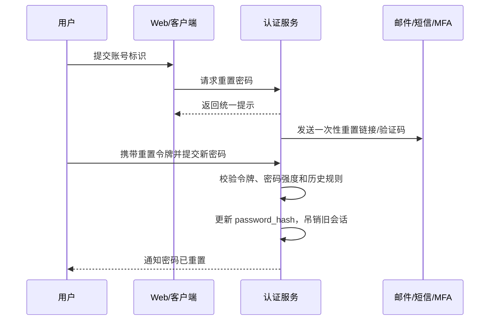

# 密码为什么只能重置不能找回？

> 合格系统不应该知道用户明文密码。服务端只能验证密码是否匹配，不能把原密码“找回来”。

## 密码应该怎么存？

密码入库前不能明文保存，也不应该用可逆加密保存，而是要用**专门的密码哈希/KDF**处理。

```text
password + salt + cost -> password_hash
```

登录时，服务端重新用用户输入的密码计算一遍哈希，再和数据库里的 `password_hash` 比较。服务端判断“这次输入对不对”，但不需要、也不应该知道原密码是什么。

这里最容易混淆三件事：

| 做法                   | 能否还原明文 | 适不适合存密码 | 问题                                   |
| ---------------------- | ------------ | -------------- | -------------------------------------- |
| 明文存储               | 能           | 不适合         | 数据库或内部权限泄露时直接暴露所有密码 |
| AES/RSA 这类可逆加密   | 能           | 不适合         | 密钥一旦泄露，所有密码都能被解出来     |
| MD5/SHA-256 普通摘要   | 不能         | 不推荐         | 算得太快，离线爆破成本低               |
| Argon2id/bcrypt/scrypt | 不能         | 更适合         | 专门提高单次猜测成本，拖慢离线爆破     |

面试里不要说“用 MD5 加密密码”。严格说，MD5 不是加密，而且也不适合做密码存储。

## salt、pepper 和 cost 分别解决什么？

密码存储不是“哈希一下”这么简单。真正要对抗的是数据库泄露后的离线爆破。

| 概念   | 作用                                         | 常见落点                                   |
| ------ | -------------------------------------------- | ------------------------------------------ |
| salt   | 每个密码独立随机值，避免相同密码得到相同哈希 | 通常和密码哈希一起保存                     |
| cost   | 控制计算成本，让攻击者每猜一次都更贵         | bcrypt work factor、Argon2 内存/时间参数等 |
| pepper | 系统级秘密值，即使数据库泄露也不在同一处暴露 | 放 KMS/HSM/密钥管理系统，不进数据库        |

salt 的重点不是保密，而是**唯一**。两个用户都用 `123456`，只要 salt 不同，最终哈希也不同，攻击者就不能拿一张预计算表批量撞库。

pepper 则是额外防线。它要和数据库分离保存，否则数据库一泄露就一起泄露，意义会大幅下降。pepper 的代价是轮换复杂：一旦要换，可能需要用户下次登录时重新计算，或者做分批迁移。

cost 不能拍脑袋。设置太低，抗爆破弱；设置太高，登录接口会被拖慢，甚至被攻击者用大量登录请求打成 CPU 型 DoS。工程上要压测一个目标：单次密码校验足够慢到能拖高攻击成本，但不会让正常登录体验和峰值容量失控。

## 为什么是重置，不是找回？

“找回密码”如果意味着系统把原密码发给用户，那就说明系统能拿到明文密码。这通常只有两种可能：

1. 数据库里直接存了明文；
2. 数据库里存了可逆密文，并且服务端有解密密钥。

这两种都不该出现在合格系统里。

合格系统的能力应该是：

```text
用户输入密码
  ↓
服务端按相同算法重新计算哈希
  ↓
和数据库中的 password_hash 做常量时间比较
  ↓
只知道“匹配/不匹配”，不知道原密码
```

所以用户忘记密码时，系统只能在确认身份后让他设置新密码。它无法、也不应该把旧密码“找出来”。

## 重置链路应该怎么设计？

一个稳妥的密码重置流程通常是这样：



这里有几个关键点：

1. **第一步返回统一提示**：不管账号是否存在，都返回“如果账号存在，将发送重置方式”。否则攻击者可以枚举手机号/邮箱是否注册。
2. **重置令牌要随机、足够长、短期有效**：不要用可预测 ID、手机号、时间戳拼出来。
3. **令牌只能用一次**：成功重置或过期后立即失效。
4. **令牌不要明文入库**：数据库里存 `token_hash`，用户带来的原始 token 只出现一次。
5. **重置入口要限流**：按账号、IP、设备、验证码失败次数做限制，防止撞库和短信轰炸。
6. **重置成功要通知用户**：但通知里不要带新密码。

对外提示还要尽量保持一致：错误码、页面跳转、响应耗时都不要明显区分“账号不存在”“邮件已发送”“令牌已过期”。邮件和短信发送可以异步处理，接口响应不暴露真实发送结果。

重置令牌可以这样处理：

```text
生成随机 token
  ↓
把 token 原文发给用户
  ↓
数据库只保存 hash(token)、用户 ID、过期时间、使用状态
  ↓
用户提交 token 时重新计算 hash 后匹配
```

令牌记录还应绑定 `user_id`、用途、过期时间、使用状态、签发渠道和风险上下文。成功使用时要用原子更新消费，例如只更新 `used_at is null and expires_at > now()` 的记录，避免两个并发请求重复使用同一个 token。

校验失败时不要区分“token 不存在、已过期、已使用”，统一提示重置链接无效即可。如果 token 放在 URL 里，要防 Referer、访问日志、埋点、截图泄露；落地页拿到 token 后，尽快换成服务端临时状态，再清理 URL。

这样即使重置令牌表泄露，攻击者也不能直接拿数据库里的值去重置密码。

## 新密码要做哪些校验？

密码策略别只停留在“必须包含大小写、数字、特殊字符”。这类规则经常逼用户写出 `Password@123`，看起来复杂，实际很常见。

更实用的规则是：

- 设置最小长度，鼓励更长的密码短语；
- 拒绝常见弱密码、泄露密码、键盘连续字符和明显用户信息；
- 支持密码管理器粘贴，不要禁止复制粘贴；
- 不做无意义的定期强制更换，除非怀疑泄露；
- 对高风险操作启用 MFA 或二次校验；
- 对多次失败做渐进式限流，而不是只靠验证码。

如果系统要防止“新密码和旧密码相同”，服务端并不需要知道旧密码。它只要用新密码按旧 salt/参数重新算一次，再和旧 `password_hash` 比较即可。

密码哈希参数也要能升级。比如旧账号还在用较低 cost 或旧算法时，可以在用户下次登录、改密或重置密码时重新计算成新参数；如果使用 pepper，要设计版本号和 KMS/HSM 中的轮换策略。

## 重置链路怎么做风控和审计？

密码重置是账号接管风险最高的链路之一，不能只看“链接能不能用”。

建议记录这些事件：

| 事件             | 要记录什么                                 |
| ---------------- | ------------------------------------------ |
| 重置申请         | 用户标识、渠道、IP、设备、风险评分、结果   |
| 令牌签发         | 用户 ID、用途、过期时间、发送渠道          |
| 令牌校验失败     | 失败原因分类、IP、设备、次数               |
| 重置成功         | 用户 ID、认证方式、会话吊销结果            |
| 登录态批量失效   | 失效范围、设备数、触发原因                 |
| 安全通知发送结果 | 邮件/短信/站内信状态，但不记录完整敏感内容 |

日志里不要记录密码、验证码、完整 token、完整重置链接。高风险场景要触发 MFA 或二次校验，例如新设备、异地、短时间多次申请、邮箱/手机号刚变更、账号异常登录后立刻重置。

异常行为要进入告警或风控队列：同一 IP 批量请求多个账号、同一设备请求多个账号、同一账号频繁失败、非本人常用地区发起重置，都不应该只靠验证码硬扛。

## 重置成功后旧登录态怎么处理？

这一步很容易被漏掉。

密码重置成功后，至少要考虑：

| 登录态                 | 建议处理                                         |
| ---------------------- | ------------------------------------------------ |
| 当前设备               | 可以让用户选择是否保持登录，但高风险场景建议重登 |
| 其他设备 Session       | 统一清理或递增会话版本号                         |
| JWT access token       | 等短期过期，或配合 token version/黑名单          |
| refresh token          | 全部吊销并重新签发                               |
| API key / 长期访问令牌 | 高风险系统应提示用户重新生成                     |

还要按风险决定是否处理 remember-me token、移动端设备 token、第三方授权 token 和开放平台长期凭证。高风险系统更适合默认全设备下线，再让用户重新登录。

为什么要清旧登录态？因为攻击者如果已经拿到旧密码，可能早就登录成功并持有 Session/Token。你只改数据库里的密码哈希，不清旧登录态，攻击者仍然可以继续访问。

常见做法是给用户维护一个 `credential_version` 或 `session_version`：

```text
用户重置密码
  ↓
credential_version + 1
  ↓
Session/JWT/Refresh Token 中的旧版本全部失效
```

这比逐个找 Token 更容易做全局失效，但业务服务需要在鉴权时校验版本。

## 密码传输要不要前端再加密？

HTTPS 是底线。没有 HTTPS，任何“前端 RSA 加密密码”都站不稳，因为攻击者可以替换页面里的公钥或脚本。

在 HTTPS 之上，前端再加一层非对称加密是否有价值，要看威胁模型：

- 如果只是担心链路被窃听，HTTPS 已经解决主问题；
- 如果担心服务端日志、网关、埋点误打明文，加密传输可以减少暴露面；
- 如果公钥和加密脚本也是从同一个站点下发，不能把它当成替代 HTTPS 的安全边界；
- 无论前端是否加密，服务端最终都必须用密码哈希/KDF 存储。

所以更稳的表达是：**传输靠 HTTPS，存储靠密码哈希/KDF，前端加密最多是额外降低暴露面，不是核心安全机制。**

## 容易踩的坑

1. **明文或可逆加密存密码**：只要能“找回原密码”，就说明设计有严重问题。
2. **用 MD5/SHA-256 直接存密码**：普通摘要太快，不适合对抗离线爆破。
3. **所有用户共用固定 salt**：这不能解决相同密码同哈希的问题。
4. **重置令牌明文入库**：令牌表泄露时，攻击者可以直接重置账号。
5. **重置接口暴露账号是否存在**：会变成账号枚举接口。
6. **改完密码不清旧登录态**：攻击者已有的 Session/Token 可能继续有效。
7. **在日志里打印密码或重置链接**：日志系统、链路追踪、告警平台都会变成泄露面。

## 小结

1. 合格系统不保存明文密码，也不保存可逆密文，所以只能重置，不能找回。
2. 密码存储要使用 Argon2id、bcrypt、scrypt 这类密码哈希/KDF，并配合 salt 和合理 cost。
3. 重置令牌要随机、短期、一次性，数据库里应存令牌哈希而不是明文令牌。
4. 重置流程要防账号枚举、暴力尝试、短信轰炸和日志泄露。
5. 密码重置成功后要清理旧 Session、refresh token 或递增会话版本，避免旧登录态继续可用。

## 参考

综合自仓库内密码存储与认证授权参考资料、NIST SP 800-63B、OWASP Password Storage Cheat Sheet、OWASP Forgot Password Cheat Sheet、OWASP Authentication Cheat Sheet，并对密码哈希/KDF、重置令牌存储、账号枚举防护和旧登录态失效边界做了交叉验证。
