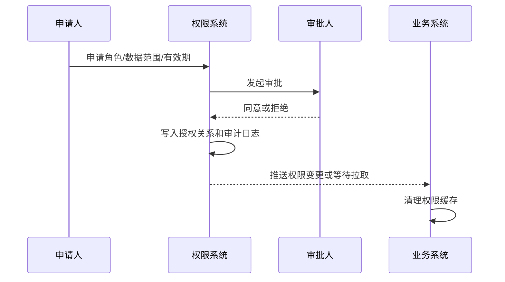

# RBAC 权限模型怎么设计？

> RBAC 的关键是不要把权限直接塞给用户，而是用“用户 -> 角色 -> 权限 -> 资源动作”把授权关系解耦。

## RBAC 先解决什么问题？

权限系统最怕两种失控：

1. 每个用户单独配权限，时间久了没人知道谁为什么有这些权限；
2. 每个业务系统自己写一套权限逻辑，授权、回收、审计都无法统一。

RBAC 的核心思路是把“人”和“权限点”之间加一层角色：

```text
用户 user
  ↓ 分配角色
角色 role
  ↓ 绑定权限
权限 permission
  ↓ 对应资源动作
资源 resource + 动作 action
```

比如财务审核员不是直接拥有一堆零散权限，而是拥有 `finance_auditor` 角色；这个角色绑定 `invoice:read`、`invoice:audit`、`payment:read` 等权限点。以后岗位职责变化，改角色即可，不必逐个用户改。

## 最小模型怎么落表？

最小 RBAC 通常需要 5 张核心表：

| 表              | 作用           |
| --------------- | -------------- |
| user            | 用户           |
| role            | 角色           |
| permission      | 权限点         |
| user_role       | 用户与角色关系 |
| role_permission | 角色与权限关系 |

可以再补一些工程字段：

```text
user(id, username, status, tenant_id)
role(id, code, name, scope, tenant_id, status)
permission(id, code, name, type, resource, action)
user_role(user_id, role_id, tenant_id, source, expire_at, granted_by, granted_reason)
role_permission(role_id, permission_id, tenant_id)
```

几个字段很关键：

- `code`：稳定编码，不能随展示名称变来变去；
- `status`：禁用角色或权限点时要能快速生效；
- `tenant_id`：多租户系统必须把租户边界放进模型；
- `expire_at`：临时授权必须有过期时间；
- `granted_by`：后续审计要知道是谁授权的。

权限表也不要只保存一个展示名称。`permission` 通常还需要 `system_code`、`parent_id`、`path`、`type`、`status` 等字段，用来区分系统、组织菜单树、标记菜单/按钮/API 类型，以及支持禁用权限点。

关系表要有唯一约束，避免重复授权。比如 `user_role` 可以用 `(user_id, role_id, tenant_id)` 作为唯一约束，`role_permission` 可以用 `(role_id, permission_id, tenant_id)`。审批单和审计日志最好单独落表，不要只依赖应用日志；否则授权来源、撤销原因和变更前后差异很难追。

如果系统还支持用户直接绑定权限，可以加 `user_permission` 表。但它应该作为少量例外，而不是主路径。直接给用户塞权限越多，RBAC 的可维护性越差。

## 权限点应该怎么设计？

权限点不要只写成“订单管理”“用户管理”这种展示文案。它应该能被接口、按钮、菜单和审计稳定引用。

推荐格式是：

```text
<系统>:<资源>:<动作>

mall:order:read
mall:order:update
mall:order:refund
iam:user:disable
report:sales:export
```

这样设计有几个好处：

1. **全局唯一**：多系统接入时不容易撞名；
2. **可读**：看到编码能知道大概含义；
3. **可审计**：日志里记录权限点后，能反查谁做了什么；
4. **可扩展**：后续能按系统、资源、动作做批量授权和查询。

权限点通常分三类：

| 类型     | 解决什么                     | 例子                       |
| -------- | ---------------------------- | -------------------------- |
| 菜单权限 | 能不能看到某个菜单或页面入口 | `mall:order:menu`          |
| 操作权限 | 能不能点击按钮或调用某类操作 | `mall:order:refund`        |
| API 权限 | 后端接口真正校验的资源动作   | `mall:order:update_status` |

前端菜单和按钮权限只负责体验，不能作为最终安全边界。真正的授权结果必须在后端接口校验。

## 角色是不是越细越好？

不是。角色太粗会越权，角色太细会爆炸。

比如后台系统里常见三类角色：

| 角色       | 能做什么                       | 风险点                       |
| ---------- | ------------------------------ | ---------------------------- |
| 超级管理员 | 管理系统配置、角色、权限和用户 | 必须强审计，最好双人审批     |
| 系统管理员 | 管理某个业务系统的权限配置     | 不能跨系统越权               |
| 授权管理员 | 给别人授予自己范围内的权限     | 授权范围不能超过自身已有权限 |
| 业务操作员 | 做具体业务操作                 | 需要绑定数据范围和过期时间   |

角色设计可以按岗位、职责和风险等级拆，而不是按每个页面、每个按钮拆。一个实用判断是：如果某个角色只会被一两个人临时使用，可能应该用临时授权或审批流；如果一类岗位长期反复出现，就适合沉淀成角色。

## 只靠角色为什么还不够？

RBAC 解决“能做什么”，但很多业务还要回答“能对哪些数据做”。

同样有 `order:read` 权限：

- 普通销售只能看自己的订单；
- 销售主管可以看团队订单；
- 租户管理员只能看本租户订单；
- 平台运营可能可以跨租户看汇总，但不能看敏感明细。

这就是数据权限。常见数据范围包括：

| 数据范围 | 例子                       | 常见实现方式               |
| -------- | -------------------------- | -------------------------- |
| 本人     | 只能看自己创建或负责的数据 | `owner_id = current_user`  |
| 本部门   | 看本部门及下级部门数据     | 部门树、组织路径、闭包表   |
| 本租户   | SaaS 租户内隔离            | 所有查询强制带 `tenant_id` |
| 指定区域 | 门店、城市、项目、仓库     | 用户绑定资源集合           |
| 动态条件 | 工作日、IP、设备、风险等级 | 策略引擎或业务规则         |

数据权限通常不要完全塞进 RBAC 的 `permission` 表，否则权限点会膨胀成：

```text
order:read:self
order:read:department
order:read:tenant
order:read:region:hangzhou
```

更稳的做法是：RBAC 判断“有没有这个动作权限”，数据范围组件判断“这个动作能作用到哪些数据”。

落地时要把数据范围下沉到查询和写入条件里，而不是只在列表页过滤。比如查询构造器、Specification、MyBatis 插件或领域仓储层都可以统一追加 `tenant_id`、`owner_id`、`dept_path`、`region_id` 等条件：

```sql
update orders
set status = ?
where id = ?
  and tenant_id = ?
  and owner_id in (...)
```

删除、更新、导出同样要带数据范围。只在查询详情后用 Java 判断，容易在批量接口、异步任务和导出接口上漏掉边界。

## RBAC 和 ABAC 怎么配合？

RBAC 适合稳定、可枚举的职责；ABAC 更适合基于属性和上下文的动态判断。

可以这样分工：

| 场景                     | 更适合的方式           |
| ------------------------ | ---------------------- |
| 财务能否审核发票         | RBAC：角色绑定审核权限 |
| 只能审核本部门发票       | RBAC + 数据范围        |
| 草稿状态才允许编辑       | 业务状态规则           |
| 非工作时间禁止导出       | ABAC：环境属性参与判断 |
| 高风险 IP 禁止管理员操作 | ABAC：风险属性参与判断 |

项目里没必要一上来就做复杂策略引擎。通常先用 RBAC 把“资源 + 动作”管住，再把租户、组织、数据归属、状态、时间、风险等级这类条件放到数据权限或策略层。

## 鉴权链路应该放在哪里？

一个稳定的后端鉴权链路可以拆成四步：

```text
请求进入
  ↓
认证：解析登录态，得到 userId / tenantId / deviceId
  ↓
功能授权：判断是否拥有 resource:action
  ↓
数据授权：追加 tenant / owner / department / region 条件
  ↓
业务执行：写审计日志，返回结果
```

不同层负责不同事情：

| 层次        | 负责什么                               |
| ----------- | -------------------------------------- |
| 网关/拦截器 | 校验登录态、解析身份、做粗粒度拦截     |
| 权限组件    | 判断用户是否拥有接口需要的权限点       |
| 业务查询层  | 追加数据范围条件，防止查到不该看的数据 |
| 审计组件    | 记录关键授权、导出、删除、审批行为     |

不要只在 Controller 里写一堆 `if (role == admin)`。这种写法后期很难统一审计，也很难知道接口到底依赖哪些权限点。

可以让接口显式声明权限点：

```java
@RequirePermission("mall:order:refund")
public void refundOrder(RefundCommand command) {
    // 业务逻辑里仍然要校验订单归属、状态和金额上限
}
```

注意：注解只能解决功能权限，数据范围仍要进查询条件或领域规则。否则用户有 `order:read`，但可能读到了别人的订单。

## 权限缓存怎么做才不会越权？

权限校验通常是高频操作，不可能每次都查多张权限表。常见做法是缓存用户权限快照：

```text
userId + tenantId + systemCode
  ↓
roles + permissions + dataScopes + version
  ↓
Redis / 本地缓存
```

缓存 key 一定要带上租户和系统范围，否则 A 系统或 A 租户的权限可能污染 B 系统、B 租户。本地缓存和 Redis 缓存并存时，权限变更要靠事件、消息或版本号同步；不能只删 Redis，却让本地缓存继续放行。

缓存要重点处理失效：

1. 用户角色变更：清理该用户权限缓存；
2. 角色权限变更：清理拥有该角色的用户缓存，或递增角色版本；
3. 用户离职/禁用：登录态和权限缓存都要失效；
4. 数据范围变更：清理数据权限缓存；
5. 多端在线：必要时让旧 Token 或旧 Session 感知权限版本变化。

更稳的设计是给权限快照带版本号：

```text
token.permissionVersion = 12
server.currentPermissionVersion = 13
```

如果版本不一致，就重新加载权限或要求重新登录。这样能减少“权限已收回，但缓存还在放行”的窗口。

如果 JWT 完全无状态，并且把权限点长期塞进 Token，角色回收和账号禁用就很难及时生效。强实时权限系统通常要配合服务端权限版本、黑名单或短有效期。

## 授权流程要有审批和审计

权限系统不只是运行时鉴权，还包括权限的申请、审批、授予、回收和追溯。

关键流程可以这样设计：



审批单至少要记录：

- 申请人、审批人、授权对象；
- 申请角色、权限点、数据范围；
- 授权原因、有效期；
- 操作前后的差异；
- 来源系统和工单编号。

审批状态也要可追踪，至少包括申请中、通过、拒绝、撤销、过期、已回收。审计日志建议记录操作账号、目标用户、变更前后、原因、工单号、IP、设备和请求 ID。高危权限可以要求双人审批、二次认证和到期自动回收。

高危权限不要永久授权，比如用户管理、资金操作、批量导出、密钥查看、权限分配。能临时授权就临时授权，到期自动回收。

## 多系统和多租户要注意什么？

统一权限系统通常会服务多个业务系统，这时要避免三个问题：

1. **权限编码冲突**：不同系统都叫 `order:read`，含义可能不同；
2. **租户边界穿透**：A 租户管理员不应该管理 B 租户用户；
3. **超级管理员泛滥**：平台级管理员和租户级管理员必须区分。

建议：

- 权限编码加系统前缀：`mall:order:read`；
- 所有授权关系都带 `tenant_id` 或系统范围；
- 平台级角色、系统级角色、租户级角色分层管理；
- 跨租户操作必须单独权限点和审计；
- 默认拒绝，缺权限时不要因为空配置放行。

`tenant_id` 不是一个可有可无的字段，而是授权关系、唯一索引、缓存 key、查询条件和审计日志的隔离维度。平台级角色和租户级角色要显式区分，不要用空 `tenant_id` 暗示“全局权限”，这种隐式语义后期很容易被误用。

多租户系统尤其不能只在前端菜单层隐藏入口。后端所有查询和写操作都要带租户边界。

## 容易踩的坑

1. **只做菜单权限，不做接口权限**：用户直接调接口仍可能越权。
2. **只看角色名，不看权限点**：`admin` 在不同系统里含义不同，权限点才是稳定边界。
3. **数据权限后补**：上线后再补租户、部门、区域条件，通常会牵动大量 SQL。
4. **缓存不失效**：权限被收回后，缓存或 Token 仍然放行。
5. **用户直接权限太多**：绕开角色会导致权限不可解释、不可审计。
6. **授权人可以授出自己没有的权限**：授权管理员必须受自身权限范围约束。
7. **超级管理员没有审计**：越高权限越要记录操作，必要时还要二次确认。
8. **默认放行**：权限系统异常时默认允许，往往会变成严重越权。

## 面试怎么答？

可以按这个顺序组织：

1. 先说 RBAC 的核心是用户、角色、权限三层解耦。
2. 再说权限点要设计成系统 + 资源 + 动作，而不是只靠角色名。
3. 然后补数据权限：角色决定能做什么，数据范围决定能对哪些数据做。
4. 最后落到工程：接口注解或权限组件、查询追加范围、缓存版本、审批审计、默认拒绝。

## 小结

1. RBAC 用角色承接用户和权限，降低授权维护成本，但不要让用户直连权限成为主路径。
2. 权限点建议设计成“系统 + 资源 + 动作”，菜单、按钮和 API 权限要区分，后端接口必须最终校验。
3. 角色只解决“能做什么”，数据权限还要解决“能对哪些数据做”。
4. 权限缓存必须有失效和版本机制，否则权限回收可能不生效。
5. 权限系统要覆盖申请、审批、授权、回收和审计，高危权限要临时化、可追溯。

## 参考

综合自仓库内认证授权与权限系统参考资料、RBAC 模型相关公开标准、OWASP Authorization Cheat Sheet，并对角色层级、数据权限、授权边界、权限缓存失效和操作审计做了交叉验证。
