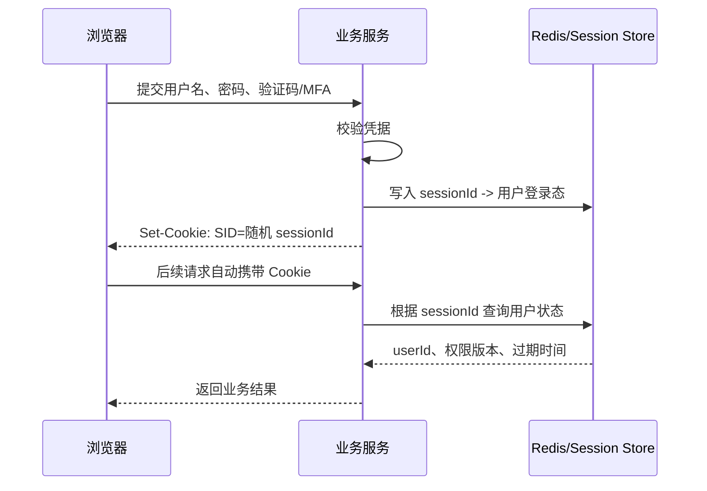

# Session、Cookie、Token、JWT 怎么选？

> Cookie 是浏览器存储和自动携带机制，Session 是服务端会话状态，Token 是令牌思想，JWT 是一种自包含 Token 格式。

## 先把四个词放到不同层

这四个词经常被混在一起问，但它们不是同一层概念：

| 名词    | 所在层次        | 核心作用                           | 常见位置                       |
| ------- | --------------- | ---------------------------------- | ------------------------------ |
| Cookie  | 浏览器存储/传输 | 保存少量数据，并按域名规则自动携带 | 浏览器                         |
| Session | 服务端会话状态  | 保存用户登录态、权限版本、过期时间 | 服务端内存、Redis、数据库      |
| Token   | 访问凭证思想    | 客户端每次请求携带，服务端据此识别 | Header、Cookie、移动端安全存储 |
| JWT     | 一种 Token 格式 | 自包含声明，并用签名防篡改         | 客户端保存，网关或服务端验签   |

Cookie 和 Session 不是同一层概念。典型 Session 登录里，Cookie 只保存 `sessionId`，真正的用户状态在服务端。

也不要把 Token 和 JWT 画等号。Token 可以只是一个随机不可猜的字符串，服务端拿它去 Redis 查状态；JWT 则把一部分声明放进令牌自身，服务端可以验签后直接读取。

## Session-Cookie 登录是怎么走的？

一个典型的浏览器后台登录流程是：



这里的关键点是：

- Cookie 里不应该放完整用户资料，通常只放随机 `sessionId`；
- Session 里保存用户身份、设备、过期时间、权限版本、风控状态；
- 用户退出、改密码、封禁、踢下线时，服务端可以删除或标记 Session；
- 多实例部署时，Session 通常放 Redis 这类共享存储。

还有一个容易被忽略的点：登录成功后要重新生成 `sessionId`，不要沿用登录前的匿名会话 ID。否则攻击者如果提前诱导用户使用某个已知会话，用户登录后这个会话就可能被绑定到真实身份，这就是 Session 固定攻击。

Session 的优势是**服务端可控**。缺点也很明显：服务端要存状态、查状态、做过期清理和容量治理。

## Cookie 安全属性怎么配？

如果 Cookie 用来承载登录态标识，至少要关心这些属性：

| 属性                | 作用                            | 常见建议                                  |
| ------------------- | ------------------------------- | ----------------------------------------- |
| `HttpOnly`          | 禁止浏览器脚本读取 Cookie       | 登录态 Cookie 建议开启                    |
| `Secure`            | 只允许 HTTPS 发送               | 生产环境必须开启                          |
| `SameSite`          | 限制跨站请求是否自动携带 Cookie | 普通站点可用 `Lax`，强敏场景评估 `Strict` |
| `Path`              | 限制 Cookie 发送路径            | 尽量收窄到业务需要的路径                  |
| `Domain`            | 限制 Cookie 作用域              | 不要随意放大到顶级域                      |
| `Max-Age`/`Expires` | 控制有效期                      | 登录态不要无限期有效                      |

一个常见响应类似：

```http
Set-Cookie: SID=随机值; HttpOnly; Secure; SameSite=Lax; Path=/; Max-Age=1800
```

注意两点：

1. `HttpOnly` 只能降低脚本直接读取 Cookie 的风险，不能阻止浏览器自动携带 Cookie 发请求；
2. `SameSite` 能降低 CSRF 风险，但复杂登录跳转、第三方回调、跨子域场景要单独验证。

`Domain` 也要谨慎。没有设置 `Domain` 时，通常是 host-only Cookie，只会发给当前主机；设置成 `.example.com` 后，多个子域都可能带上它，适合统一登录，但也放大了子域被攻破后的影响面。高敏登录态可以考虑 `__Host-` 前缀，它要求 `Secure`、不能设置 `Domain`，并且 `Path=/`。

还要区分“跨站”和“跨域”。CSRF 主要看浏览器是否自动带凭证发请求，CORS 主要管前端脚本能不能读取响应；两者不是同一个控制面，不能用“配了 CORS”替代 CSRF 防护。

登录态不要放进 URL。URL 会进入浏览器历史、代理日志、Referer、监控系统，泄露面比 Cookie/Header 更大。

## 分布式 Session 怎么处理？

单机 Session 很简单，多实例后会遇到“用户第一次请求到 A 机器，第二次请求到 B 机器”的问题。

常见方案：

| 方案             | 做法                           | 问题                             |
| ---------------- | ------------------------------ | -------------------------------- |
| 粘性会话         | 负载均衡让同一用户落到同一实例 | 实例挂掉会丢会话，扩缩容不灵活   |
| Session 复制     | 多个实例互相同步会话           | 节点越多同步成本越高             |
| 共享存储         | Session 放 Redis/数据库        | 多一次远程访问，要保证存储高可用 |
| 客户端自包含令牌 | 登录态信息放进 Token/JWT       | 主动失效和权限变更更难           |

大多数 Java 后端系统更常见的是共享存储：应用实例无状态，Session 放 Redis。这样扩容简单，踢下线也好做，但要处理：

- Redis 高可用和故障降级；
- Session TTL 和续期策略；
- 热点用户或批量请求带来的读写压力；
- Session 数据不要无限膨胀；
- 退出、改密、禁用账号时要能批量删除相关 Session。

TTL 策略也要分清：绝对过期时间限制一次登录最长能活多久，滑动过期时间会在用户活跃时续期。滑动续期体验更好，但会延长被盗会话的可用窗口；高敏系统通常还要加最大会话时长、闲置超时和设备维度会话。

## 普通 Token 和 JWT 有什么区别？

普通 Token 可以只是一个随机字符串：

```text
Authorization: Bearer 7f3b...random...
```

服务端拿到后去 Redis 或数据库查询：

```text
token -> userId、tenantId、scope、过期时间、设备
```

这种随机字符串通常也叫不透明令牌。客户端不需要理解里面是什么，服务端通过 Redis、数据库或 introspection 接口查询状态。它牺牲了本地自校验能力，但换来了吊销、权限变更、审计追踪上的可控性。

JWT 则通常长这样：

```text
header.payload.signature
```

服务端验签后可以直接读取 `sub`、`iss`、`aud`、`exp`、`iat`、`jti` 等声明。

JWT 校验不能只看签名。最小校验清单还应包括 `exp`、`nbf`、`iss`、`aud`、允许的算法、密钥版本等。尤其不要盲目信任 Token header 里的 `alg`，服务端应该固定允许算法，并从可信密钥集合里取 key。

对比如下：

| 维度       | 普通随机 Token + 服务端状态 | JWT                        |
| ---------- | --------------------------- | -------------------------- |
| 服务端状态 | 需要 Redis/DB 查 Token      | 可本地验签读取声明         |
| 主动吊销   | 删除 Token 即可             | 需要黑名单、版本号或短过期 |
| 权限变更   | 下次查状态可立即生效        | Token 内旧声明可能继续有效 |
| 体积       | 通常较短                    | 通常更长，每次请求都会携带 |
| 网关鉴权   | 可能要查中心状态            | 网关验签更方便             |
| 泄露止血   | 服务端删除即可              | 要看过期时间和补偿机制     |

所以 JWT 适合做“短期访问凭证”或“跨服务身份声明”，不适合无脑承载完整登录会话。这个边界在下一篇 [JWT 为什么不能无脑替代 Session？](./security-jwt-vs-session.html) 会展开。

## Token 放哪里更稳？

不同客户端的存储条件不一样：

| 存储位置        | 适合场景                   | 风险                           | 常见补救                            |
| --------------- | -------------------------- | ------------------------------ | ----------------------------------- |
| HttpOnly Cookie | 浏览器站点、服务端渲染后台 | 浏览器会自动携带，存在 CSRF 面 | `SameSite`、CSRF Token、Origin 校验 |
| localStorage    | 前端 Header 携带方便       | XSS 后脚本可直接读取           | CSP、输入输出过滤、缩短有效期       |
| 内存变量        | 高敏单页应用               | 刷新即丢，体验差               | 配合 Refresh Token 静默恢复         |
| 移动端安全存储  | App 登录态                 | 设备丢失、Root/越狱、抓包      | Keychain/Keystore、设备绑定         |
| 服务端 Redis    | 普通随机 Token、Session    | 服务端存储成本                 | TTL、分片、高可用、容量治理         |

一个常见误区是：**JWT 放 localStorage 就绝对安全，因为没有 CSRF**。这只说对了一半。Header 携带确实降低了 Cookie 自动携带导致的 CSRF 风险，但 localStorage 在 XSS 面前很脆弱。

反过来，HttpOnly Cookie 降低了脚本直接偷 Token 的风险，但要认真处理 CSRF。

Refresh Token 比 Access Token 更需要保护。它最好只发给认证服务，服务端只保存摘要或哈希，按设备维护，刷新时轮换；如果发现旧 refresh token 被重复使用，通常要认为可能泄露，并吊销整条令牌族。

## CSRF 和 XSS 怎么影响选型？

两类攻击关注点不同：

| 攻击 | 攻击者想做什么                     | Cookie 登录态的风险           | Header Token 的风险                 |
| ---- | ---------------------------------- | ----------------------------- | ----------------------------------- |
| CSRF | 借用户浏览器自动带凭证发起跨站请求 | Cookie 可能被自动带上         | 默认不会自动带 Authorization Header |
| XSS  | 在页面里执行恶意脚本               | 非 HttpOnly Cookie 可能被读走 | localStorage Token 可能被读走       |

所以选型时不要只问“Cookie 安全还是 Token 安全”，而要问：

1. 主要客户端是浏览器、移动端，还是服务间调用？
2. 登录态是自动随请求发送，还是由代码手动放 Header？
3. 系统更担心 CSRF、XSS、Token 泄露、设备丢失，还是权限实时回收？
4. 团队是否能做好 CSP、输入输出过滤、CSRF Token、Origin/Referer 校验？

浏览器后台常见稳妥方案是 `HttpOnly + Secure + SameSite` Cookie 承载 Session ID，再配合 CSRF 防护。开放 API 和移动端更常见的是 `Authorization: Bearer <token>`。

## 几类系统怎么选？

可以按场景快速判断：

| 场景                | 更推荐的方案                     | 理由                             |
| ------------------- | -------------------------------- | -------------------------------- |
| 企业管理后台        | Cookie + Session / Redis Token   | 主动踢下线、权限变更、审计更可控 |
| 服务端渲染 Web      | Cookie + Session                 | 浏览器原生支持，开发和运维成熟   |
| 单页应用 + 自家 API | Cookie Session 或短期 Token 都可 | 取决于 CSRF/XSS 防护能力和架构   |
| 移动端 App          | Bearer Token + 安全存储          | 不依赖浏览器 Cookie              |
| 开放平台 API        | Bearer Token / OAuth 风格令牌    | 第三方调用、权限范围和过期更清晰 |
| 微服务内部身份传递  | 短期 JWT 或内部签名 Token        | 网关/服务间验签方便              |
| 权限强实时系统      | Session / Redis Token            | 服务端删除或版本变更能快速生效   |

浏览器 SPA 还有一种折中：BFF/服务端代理。浏览器只拿 `HttpOnly` Cookie，真正的 Token 留在服务端代理层，由 BFF 调后端 API。这样能降低 XSS 直接读走 Token 的风险，但会增加一层服务和会话治理成本。

如果项目里同时有 Web、App、开放 API，很可能不是一套方案打天下，而是：

```text
Web 后台：Cookie + Session
移动端：Access Token + Refresh Token
开放 API：OAuth 风格 Bearer Token
微服务内部：网关签发短期身份上下文
```

统一的是认证中心和账号体系，不一定是所有客户端都用同一种登录态载体。

## 选型时问哪几个问题？

可以按这组问题收敛方案：

1. **是否必须随时踢下线？** 必须的话，优先 Session 或服务端可吊销 Token。
2. **权限是否要求秒级生效？** 要求很高时，不要把完整权限长期塞进 JWT。
3. **主要客户端是不是浏览器？** 是的话 Cookie + Session 仍然简单可靠。
4. **是否有移动端和开放 API？** 有的话 Bearer Token 更自然。
5. **是否需要网关自校验？** 需要时 JWT 或内部签名 Token 可以减少中心调用。
6. **能否接受令牌泄露窗口？** 不能就缩短 access token，增加 refresh token 轮换和吊销。
7. **团队能否维护服务端状态？** Redis 高可用、容量、TTL、批量失效都要有人管。

## 容易踩的坑

1. **把 Cookie 当 Session**：Cookie 是浏览器机制，Session 是服务端状态。
2. **把 Token 当 JWT**：Token 可以是随机字符串，JWT 只是其中一种自包含格式。
3. **把 JWT 当加密**：JWS 签名只能防篡改，payload 默认可读。
4. **把登录态放 URL**：URL 会进日志、历史、Referer，泄露面很大。
5. **Session 只存在单机内存**：多实例部署后容易登录态丢失。
6. **Cookie 不配安全属性**：登录态 Cookie 至少要考虑 `HttpOnly`、`Secure`、`SameSite`。
7. **Token 永不过期**：泄露后无法止血，尤其是移动端和开放 API。
8. **只在前端判断登录**：后端每个受保护接口都必须校验登录态。

## 面试怎么答？

可以这样组织：

1. 先分层：Cookie 是浏览器存储和自动携带机制，Session 是服务端状态，Token 是访问凭证，JWT 是一种 Token 格式。
2. 再讲流程：Session-Cookie 方案里 Cookie 只放随机 sessionId，服务端查 Redis 拿登录态。
3. 然后讲取舍：Session 可控但要存状态；JWT 易传递、网关可验签，但主动失效弱。
4. 最后按场景选：浏览器后台偏 Session，移动端/开放 API 偏 Token，短期跨服务身份声明可用 JWT。

## 小结

1. Cookie、Session、Token、JWT 不是同一层概念，先分清层次再谈选型。
2. Session-Cookie 方案的核心是 Cookie 保存随机 ID，服务端保存登录态，强项是可控。
3. 普通 Token 依赖服务端状态，JWT 自包含可验签；前者好吊销，后者好分发。
4. 浏览器场景要同时考虑 CSRF 和 XSS，Cookie 与 localStorage 都不是绝对安全容器。
5. 选型要看客户端类型、主动失效、权限实时性、服务端状态成本和泄露止血能力。

## 参考

综合自仓库内会话管理、Token 与 JWT 参考资料、IETF RFC 6265 / RFC 7519、OWASP Session Management Cheat Sheet、OWASP JSON Web Token for Java Cheat Sheet、OWASP Cross-Site Request Forgery Prevention Cheat Sheet，并对 Cookie 安全属性、Session-Cookie 流程、Token 存储位置、CSRF/XSS 边界和 JWT 主动失效问题做了交叉验证。
