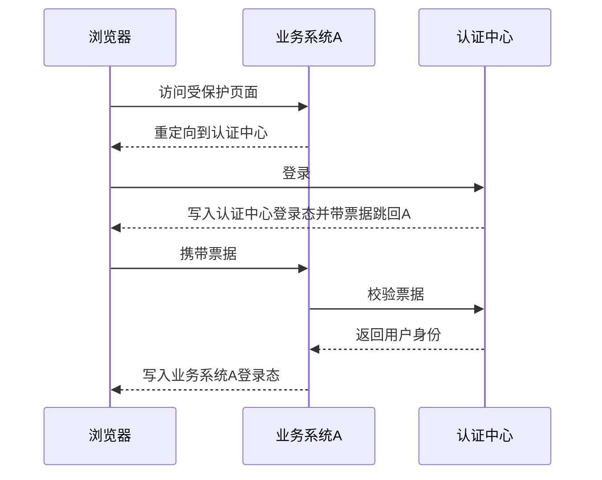

# 单点登录 SSO 是怎么工作的？

> SSO 的目标是让多个业务系统信任同一个认证中心：用户只登录一次，后续访问其他系统时通过票据换取本系统登录态。

## 核心角色有哪些？

```text
浏览器
  ├── 业务系统 A
  ├── 业务系统 B
  └── 统一认证中心
```

业务系统不直接处理密码，而是把未登录用户重定向到认证中心。认证中心完成登录后，给业务系统一个短期票据，业务系统再向认证中心校验票据。

## 登录主流程



票据通常要短期、一次性、绑定回调地址，避免被截获后重复使用。

## 单点登出为什么更难？

登录只要让业务系统建立自己的登录态；登出则要让多个业务系统都清理登录态。

常见方式：

- 前端重定向通知多个系统登出。
- 后端由认证中心通知业务系统清理 Session。
- 业务系统每次请求都检查中心态或令牌版本。

实际工程里，单点登出经常做不到绝对实时，需要结合过期时间、刷新机制和风险等级设计。

## 小结

1. SSO 依赖统一认证中心，业务系统信任认证中心签发或校验的票据。
2. 业务系统拿票据换本地登录态，后续请求不必每次回认证中心。
3. 票据必须短期、一次性，并绑定回调目标。
4. 单点登出比登录更难，通常需要通知、轮询或短期令牌配合。

## 参考

基于 IETF RFC 6265、RFC 7519、RFC 6749、RFC 8018、OWASP Cheat Sheet Series 与 NIST SP 800-63B 中认证、授权、会话、JWT、密码存储、加密和数据保护相关内容整理。
